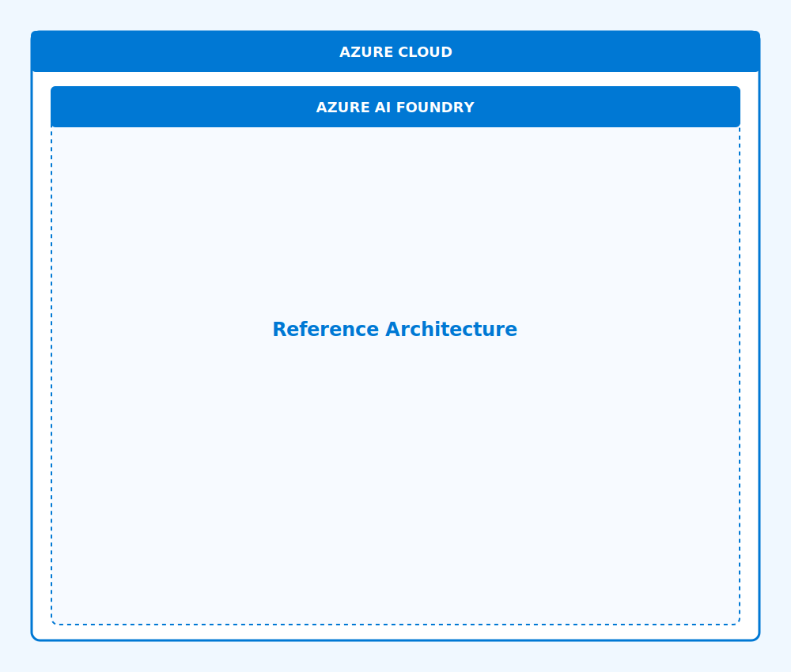

# 🏗️ Architecture Overview: Mainframe Modernization with Azure AI Foundry

This technical architecture document provides a comprehensive overview of the Azure AI Foundry architecture for mainframe modernization across multiple platforms (IBM z/OS, Unisys ClearPath, Bull GCOS, NEC ACOS).

## 📋 Introduction

The Azure AI Foundry architecture is designed to facilitate the modernization of mainframe applications across different platforms while leveraging advanced AI capabilities. This multi-platform approach addresses the diverse needs of organizations with heterogeneous mainframe environments, providing a flexible and comprehensive modernization framework.

Key architectural goals include:

| Architectural Goal | Description |
|-------------------|-------------|
| Platform Flexibility | Support for multiple mainframe platforms with platform-specific adapters |
| AI-Powered Analysis | Deep understanding of mainframe code, data structures, and business rules |
| Secure Integration | Secure connectivity between mainframe environments and Azure services |
| Hybrid Operations | Support for hybrid operational models during the transition period |
| DevOps Integration | Seamless integration with modern CI/CD tools and processes |
| Scalability | Ability to handle large-scale modernization initiatives |

## 🏗️ Reference Architecture

The following diagram illustrates the comprehensive reference architecture for Azure AI Foundry integration with mainframe systems:

## Component Details

### Azure AI Foundry Core Components

#### 1. Code Intelligence

The Code Intelligence component provides deep analysis of mainframe code across platforms:

| Feature | Technical Capabilities |
|---------|------------------------|
| COBOL Analysis | - COBOL syntax parsing for multiple dialects - Variable and data structure tracking - Control flow analysis - Procedure division mapping - Copybook resolution and linking |
| PL/I Analysis | - PL/I syntax parsing - Structure and procedure mapping - Include file resolution - External call tracking |
| Assembler Analysis | - Mainframe assembler support - Macro expansion tracking - Register usage analysis - System services mapping |
| JCL & WFL Analysis | - Job control language parsing - Step dependencies tracking - Dataset and file usage mapping - Symbolic parameter resolution |
| Transaction Processing Analysis | - Transaction monitor command identification - Program flow analysis - Database access mapping - Screen/interface mapping |

Implementation technologies:
- Custom language parsers built on ANTLR
- Azure OpenAI large language models
- Neural program understanding models
- Graph-based dependency tracking

#### 2. Translation Services

The Translation Services component assists in code conversion and API transformation:

| Feature | Technical Capabilities |
|---------|------------------------|
| COBOL to Java | - Syntax-directed translation - Data structure mapping - Procedural to OO transformation - Built-in runtime libraries |
| COBOL to C# | - .NET-optimized translation - Paragraphs to methods mapping - PERFORM to function call translation - Compatibility libraries |
| CICS to REST | - CICS program to API conversion - BMS map to JSON transformation - Stateful session management - Security context propagation |
| IMS to Microservices | - IMS transaction conversion - PCB to service interface mapping - Hierarchical to relational data mapping |
| JCL to Pipelines | - JCL to workflow conversion - Condition code handling - Step dependencies preservation - Resource allocation translation |

Implementation technologies:
- Abstract syntax tree transformations
- AI-guided translation models
- Compatibility runtime libraries
- Azure Logic Apps workflow generation

#### 3. Risk Intelligence

The Risk Intelligence component provides risk assessment and mitigation strategies:

| Feature | Technical Capabilities |
|---------|------------------------|
| Change Impact Analysis | - Inter-program dependency analysis - Data flow impact tracking - Integration point risk assessment - Business function impact mapping |
| Deployment Risk Scoring | - Complexity-based risk scoring - Change scope assessment - Critical path analysis - Historical deployment correlation |
| Test Coverage Analysis | - Code path coverage analysis - Test case sufficiency evaluation - Critical condition identification - Data variation test recommendations |
| Rollback Planning | - Point-in-time recovery planning - Database consistency assurance - Transaction integrity verification - Operational procedure generation |

Implementation technologies:
- Graph-based impact analysis
- Machine learning risk models
- Pattern recognition from historical data
- Azure DevOps/GitHub pipeline integration

#### 4. Operational Intelligence

The Operational Intelligence component provides monitoring and optimization for hybrid environments:

| Feature | Technical Capabilities |
|---------|------------------------|
| Performance Monitoring | - Mainframe performance data integration - Cross-platform transaction tracking - Response time breakdown analysis - Resource utilization correlation |
| Anomaly Detection | - Baseline deviation detection - Pattern-based anomaly identification - Multi-dimensional analysis - Auto-correlation of related metrics |
| Capacity Planning | - Workload growth prediction - Resource requirement forecasting - Batch window optimization - Cost optimization recommendations |
| Incident Management | - Root cause analysis assistance - Problem pattern recognition - Resolution recommendation - Knowledge base integration |

Implementation technologies:
- Azure Monitor custom metrics integration
- Azure Log Analytics with mainframe log ingestion
- Azure Application Insights for transaction tracking
- Machine learning for anomaly detection

### Integration Layer Components

#### 1. Host Integration Server

Host Integration Server (HIS) provides connectivity between Azure and various mainframe platforms:

| Feature | Technical Implementation |
|---------|--------------------------|
| Terminal Integration | - Terminal emulation (TN3270, TN5250, etc.) - Screen scraping with pattern recognition - Session management and pooling - SSL/TLS encryption support |
| Data Integration | - Direct database access - Record retrieval and update - Transaction coordination - Schema mapping and transformation |
| Transaction Integration | - Transaction invocation for various platforms - Transaction processing - Security credential mapping - Transaction integrity management |

#### 2. Azure Logic Apps and Functions

These serverless components enable workflow automation and event processing:

| Feature | Technical Implementation |
|---------|--------------------------|
| Mainframe Process Orchestration | - Workflow orchestration - Conditional processing support - Parallel step execution - Error handling and recovery |
| Event-Driven Processing | - Mainframe event detection - Real-time processing triggers - Custom connector integration - Stateful process execution |
| Integration Automation | - File transfer automation - Format conversion processing - Validation and verification - Notification and alerting |

#### 3. Azure API Management

API Management provides a modern API façade for mainframe services:

| Feature | Technical Implementation |
|---------|--------------------------|
| Mainframe API Façade | - REST API for legacy transactions - JSON transformation of legacy data formats - OpenAPI (Swagger) definition generation - API versioning and lifecycle management |
| API Security | - OAuth/OIDC integration - JWT validation and claims mapping - Rate limiting and quota enforcement - IP filtering and network isolation |
| API Gateway | - Request/response transformation - Protocol conversion - Caching for performance optimization - Logging and monitoring integration |

### Platform-Specific Integration Components

Each mainframe platform has specific integration components that connect with Azure services:

#### 1. File Transfer Components

These components enable secure, reliable file transfer between mainframe systems and Azure:

| Platform | Components |
|----------|------------|
| IBM z/OS | Connect:Direct, FTPS, NJE over IP |
| Unisys ClearPath | File Transfer, Data Exchange |
| Bull GCOS | File Transfer Facility |
| NEC ACOS | ACOS-specific transfer utilities |

Key capabilities across platforms include:
- Checkpoint/restart capability
- Compression and encryption
- Secure protocol support
- Transfer validation and verification
- Scheduled transfers
- Format and encoding conversion

#### 2. Terminal Access and Modernization

These components help modernize terminal-based applications:

| Platform | Components |
|----------|------------|
| IBM z/OS | Host Access Transformation Services (HATS) |
| Unisys ClearPath | ClearPath ePortal |
| Bull GCOS | Web Access Server |
| NEC ACOS | iPackage |

Common capabilities include:
- Terminal screen to web/mobile conversion
- Screen pattern recognition
- Macro recording and playback
- Screen customization and styling
- Web service creation

#### 3. Messaging and Integration

Messaging systems provide asynchronous communication between mainframes and Azure:

| Platform | Components |
|----------|------------|
| IBM z/OS | MQ Series, CICS Events |
| Unisys ClearPath | MQSeries Bridge, JMS |
| Bull GCOS | Message Queue Manager |
| NEC ACOS | AIM Message Queue |

Key features include:
- Queue management
- Message persistence
- Transaction coordination
- Channel security
- Dead letter handling

## Security Architecture

### Network Security

The network security architecture follows defense-in-depth principles:

1. **Physical Connectivity**
   - ExpressRoute premium circuit for dedicated connectivity
   - Redundant connections for high availability
   - BGP routing for dynamic path selection

2. **Network Controls**
   - Network Security Groups with deny-by-default rules
   - Application Security Groups for service isolation
   - Service Tags for Azure service access control
   - Azure DDoS Protection Standard

3. **Service Endpoints and Private Link**
   - Azure Private Link for PaaS services access
   - Service Endpoints for Azure services
   - Private endpoints for secure resource access
   - DNS integration for private resolution

### Identity and Access Management

Identity and access management integrates Azure AD with mainframe security:

1. **Azure Active Directory**
   - Azure AD as primary identity provider
   - Multi-factor authentication enforcement
   - Conditional access policies
   - Privileged Identity Management

2. **Mainframe Security Integration**
   - Security service integration (RACF/ACF2/Top Secret/others)
   - Security credential propagation
   - Enterprise certificate management
   - Secure password vaulting

3. **Application Authentication**
   - Service principal authentication
   - Managed identities for Azure services
   - Application registration and API permissions
   - JWT token-based authentication

### Data Protection

Data protection covers both at-rest and in-transit scenarios:

1. **Encryption at Rest**
   - Azure Storage encryption
   - Azure SQL/Cosmos DB encryption
   - Disk encryption for VMs
   - Customer-managed keys option

2. **Encryption in Transit**
   - TLS 1.2+ for all communications
   - IPsec for ExpressRoute connections
   - Secure protocol enforcement
   - Certificate-based authentication

3. **Key Management**
   - Azure Key Vault for key storage
   - HSM-backed protection
   - Key rotation automation
   - Access control with RBAC

## Deployment Architecture

Azure AI Foundry deployment follows a hub-and-spoke model:

1. **Hub Virtual Network**
   - Central connectivity and security services
   - ExpressRoute/VPN gateways
   - Shared services (DNS, monitoring)
   - Network Virtual Appliances

2. **Spoke Virtual Networks**
   - Workload-specific virtual networks
   - Peered to hub for connectivity
   - Isolated security boundaries
   - Purpose-specific NSGs

3. **Cross-Premises Connectivity**
   - ExpressRoute for mainframe connectivity
   - VPN backup options
   - BGP route exchange
   - Traffic filtering

## Scaling and Performance

1. **Compute Scaling**
   - Virtual Machine Scale Sets for HIS
   - Azure App Service scaling for web front-ends
   - Azure Functions consumption plan
   - Container instances for processing nodes

2. **Storage Performance**
   - Premium SSD for high I/O workloads
   - Ultra Disk for highest performance
   - Azure NetApp Files for shared file storage
   - Storage account partitioning

3. **Network Performance**
   - ExpressRoute circuit sizing (1-10 Gbps)
   - ExpressRoute Global Reach
   - Accelerated networking for VMs
   - Azure Front Door for global distribution

## Disaster Recovery

1. **Regional Pairs**
   - Primary and secondary region deployment
   - Geo-redundant storage for state data
   - Cross-region replication

2. **Recovery Options**
   - Azure Site Recovery for VM workloads
   - Database geo-replication
   - Traffic Manager for failover routing
   - Recovery point and time objectives

## Next Steps

For detailed implementation steps, continue to:
- [Installation Prerequisites](03-prerequisites.md)
- [Mainframe Integration Setup](04-platform-integration.md)
- [GitHub & Azure DevOps Integration](05-devops-integration.md) 

### Platform-Specific Integration Components

Each mainframe platform has specific integration components that connect with Azure services:

#### 1. File Transfer Components

These components enable secure, reliable file transfer between mainframe systems and Azure:

| Platform | Components |
|----------|------------|
| IBM z/OS | Connect:Direct, FTPS, NJE over IP |
| Unisys ClearPath | File Transfer, Data Exchange |
| Bull GCOS | File Transfer Facility |
| NEC ACOS | ACOS-specific transfer utilities |

Key capabilities across platforms include:
- Checkpoint/restart capability
- Compression and encryption
- Secure protocol support
- Transfer validation and verification
- Scheduled transfers
- Format and encoding conversion

#### 2. Terminal Access and Modernization

These components help modernize terminal-based applications:

| Platform | Components |
|----------|------------|
| IBM z/OS | Host Access Transformation Services (HATS) |
| Unisys ClearPath | ClearPath ePortal |
| Bull GCOS | Web Access Server |
| NEC ACOS | iPackage |

Common capabilities include:
- Terminal screen to web/mobile conversion
- Screen pattern recognition
- Macro recording and playback
- Screen customization and styling
- Web service creation

#### 3. Messaging and Integration

Messaging systems provide asynchronous communication between mainframes and Azure:

| Platform | Components |
|----------|------------|
| IBM z/OS | MQ Series, CICS Events |
| Unisys ClearPath | MQSeries Bridge, JMS |
| Bull GCOS | Message Queue Manager |
| NEC ACOS | AIM Message Queue |

Key features include:
- Queue management
- Message persistence
- Transaction coordination
- Channel security
- Dead letter handling 