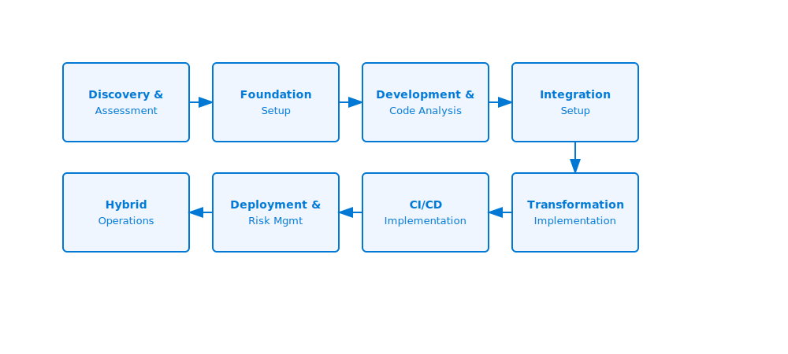

# 🛤️ Implementation Roadmap

This document provides a comprehensive implementation roadmap for Azure AI Foundry with various mainframe environments (IBM z/OS, Unisys ClearPath, Bull GCOS, NEC ACOS). It outlines the step-by-step process, technical considerations, and best practices for a successful implementation.

For a detailed comparison of traditional mainframe environments versus modern Azure environments, see the [Modernization Comparison](modernization-comparison.md) document.

## Implementation Phases

The implementation of Azure AI Foundry follows a structured approach with defined phases:

### Phase 1: Discovery and Assessment

**Duration:** 2-4 weeks

**Objectives:**
- Inventory existing mainframe applications and data
- Assess application complexity and dependencies
- Define modernization goals and success criteria
- Build initial mainframe knowledge graph

**Technical Activities:**
1. Deploy discovery tools on mainframe environment
2. Extract program information using platform-specific techniques
   - z/OS: Catalog exploration and SMF records
   - Unisys ClearPath: MCP Explorer or OS 2200 toolsets
   - Bull GCOS: GCOS Administration Tools
   - NEC ACOS: ACOS System Manager
3. Analyze system usage patterns and application workloads
4. Perform initial code scans (COBOL, PL/I, Assembler, Natural, etc.)
5. Document database schemas and access patterns
6. Map application transaction flows
7. Identify integration points with other systems

**Key Deliverables:**
- Mainframe application inventory
- Application dependency map
- Complexity assessment report
- Initial modernization strategy
- Resource requirements projection
- Platform-specific migration considerations

### Phase 2: Foundation Setup

**Duration:** 2-3 weeks

**Objectives:**
- Establish secure connectivity between Azure and mainframe systems
- Deploy core Azure AI Foundry components
- Configure authentication and authorization
- Set up monitoring and logging infrastructure

**Technical Activities:**
1. Set up ExpressRoute or VPN connectivity
2. Deploy Azure Private Link for PaaS services
3. Configure Azure KeyVault for secret management
4. Deploy core Azure AI services
5. Set up Host Integration Server
6. Configure access control and identity mapping
7. Establish monitoring and alerting baselines

**Key Deliverables:**
- Network connectivity architecture
- Security configuration documentation
- Azure AI Foundry core deployment
- Monitoring dashboard
- Integration test confirmation

### Phase 3: Development and Code Analysis

**Duration:** 3-6 weeks

**Objectives:**
- Set up hybrid development environments
- Perform deep code analysis of mainframe applications
- Extract business rules and domain knowledge
- Identify modernization patterns and anti-patterns
- Create detailed modernization roadmap

**Technical Activities:**
1. Deploy developer workstation configuration
2. Install mainframe connectivity tools
3. Configure mainframe code repositories
4. Perform deep code analysis using AI Foundry
5. Map business rules to code components
6. Identify data access patterns
7. Document transaction flows
8. Assess code quality and complexity
9. Generate modernization recommendations

**Key Deliverables:**
- Detailed code analysis reports
- Business rule documentation
- Modernization pattern recommendations
- Technical debt assessment
- Data flow diagrams

### Phase 4: Integration Setup

**Duration:** 2-4 weeks

**Objectives:**
- Configure GitHub or Azure DevOps integration
- Set up CI/CD foundation
- Establish mainframe-to-cloud deployment pipelines
- Configure test environments

**Technical Activities:**
1. Set up GitHub or Azure DevOps repositories
2. Configure branch policies and security
3. Establish mainframe code synchronization
4. Set up build agents with mainframe connectivity
5. Configure build definitions for mainframe code
6. Establish test environments
7. Set up deployment pipelines

**Key Deliverables:**
- GitHub/Azure DevOps configuration
- Mainframe code repository
- Initial CI pipeline configuration
- Test environment documentation
- Security and access control documentation

### Phase 5: Transformation Implementation

**Duration:** 4-12 weeks (varies by application complexity)

**Objectives:**
- Implement modernization patterns
- Transform selected applications or components
- Create API facades for mainframe services
- Test transformed components

**Technical Activities:**
1. Apply transformation patterns to selected code
2. Deploy Azure API Management for mainframe APIs
3. Implement service facades for critical transactions
4. Create data access layers for mainframe data
5. Test functional equivalence
6. Performance test and optimization
7. Document transformation patterns

**Key Deliverables:**
- Transformed application components
- API facades for mainframe services
- Functional equivalence test results
- Performance test results
- Transformation pattern documentation

### Phase 6: CI/CD Implementation

**Duration:** 2-4 weeks

**Objectives:**
- Implement continuous integration for mainframe code
- Set up automated testing
- Configure continuous deployment pipelines
- Establish quality gates

**Technical Activities:**
1. Configure mainframe build processes
2. Set up automated unit testing
3. Implement integration testing
4. Configure deployment automation
5. Establish quality gates and metrics
6. Implement approval workflows
7. Set up deployment monitoring

**Key Deliverables:**
- CI/CD pipeline documentation
- Automated test suite
- Deployment automation scripts
- Quality metrics dashboard
- Release management process

### Phase 7: Deployment and Risk Management

**Duration:** 2-3 weeks

**Objectives:**
- Implement deployment strategies
- Configure risk assessment tools
- Establish rollback procedures
- Set up production monitoring

**Technical Activities:**
1. Configure production deployment pipelines
2. Set up risk assessment automation
3. Implement blue/green deployment capability
4. Configure canary releases
5. Establish rollback procedures
6. Set up production monitoring
7. Configure alerts and notifications

**Key Deliverables:**
- Deployment strategy documentation
- Risk assessment reports
- Rollback procedure documentation
- Production monitoring dashboard
- Incident response playbook

### Phase 8: Hybrid Operations

**Duration:** Ongoing

**Objectives:**
- Establish hybrid operations procedures
- Implement AI-powered monitoring
- Configure automated incident management
- Set up continuous optimization

**Technical Activities:**
1. Deploy operational intelligence components
2. Configure cross-platform monitoring
3. Set up anomaly detection
4. Implement automated incident correlation
5. Configure capacity planning tools
6. Establish operational dashboards
7. Train operations team on hybrid management

**Key Deliverables:**
- Hybrid operations runbook
- Monitoring and alerting documentation
- Incident management procedures
- Capacity planning reports
- Operational dashboard

## Implementation Options

Azure AI Foundry can be implemented with different approaches based on organizational needs:

### Option 1: Full-Scale Implementation

- Implements all phases sequentially
- Covers entire mainframe application portfolio
- Provides comprehensive modernization
- Typical duration: 6-12 months

### Option 2: Phased Implementation

- Selects specific applications for initial implementation
- Implements all phases for selected applications
- Expands to additional applications incrementally
- Typical duration per phase: 3-6 months

### Option 3: Component-Based Implementation

- Implements specific capabilities (e.g., only code analysis)
- Focuses on immediate value delivery
- Can be expanded incrementally
- Typical duration: 2-3 months per component

### Option 4: Agent-Based Implementation

- Leverages specialized AI agent teams for complex modernization scenarios
- Ideal for highly regulated industries with data sovereignty requirements
- Enables secure, controlled modernization with institutional knowledge preservation
- Provides enhanced specialization and context management
- Typical duration: 4-8 months, with accelerated results for complex systems
- See [Chapter 12: Agent-Based Modernization](../12-agent-based-modernization/README.md) for detailed implementation

## Implementation Considerations

### Technical Prerequisites

Before beginning implementation, ensure the following prerequisites are met:

1. **Network Connectivity**
   - ExpressRoute or VPN with sufficient bandwidth
   - Network security group configuration
   - DNS resolution between Azure and on-premises

2. **Access Permissions**
   - Administrative access to Azure subscription
   - Access to mainframe systems for tool installation
   - Source code repository access
   - Database schema access

3. **Skill Requirements**
   - Mainframe administration
   - Knowledge of mainframe languages (COBOL, PL/I, Assembler, etc.)
   - Azure cloud architecture
   - DevOps practices
   - API design and implementation

### Risk Mitigation

Implementation risks can be mitigated through:

1. **Phased Approach**
   - Start with non-critical applications
   - Implement in stages with clear milestones
   - Validate each phase before proceeding

2. **Testing Strategy**
   - Comprehensive functional testing
   - Performance benchmarking
   - Security validation
   - Disaster recovery testing

3. **Rollback Planning**
   - Maintain parallel environments
   - Document rollback procedures
   - Test rollback capabilities

## Success Metrics

Measure implementation success using these metrics:

1. **Technical Metrics**
   - Code analysis coverage percentage
   - Test automation coverage
   - Deployment frequency
   - Mean time to recover
   - Performance comparison to baseline

2. **Operational Metrics**
   - Incident reduction
   - Time to resolve issues
   - Resource utilization efficiency
   - Cost comparison to baseline

3. **Business Metrics**
   - Time-to-market for new features
   - Development capacity increase
   - Business capability expansion
   - Technical debt reduction

## Next Steps

To begin your implementation journey, proceed to:

- [Discovery and Assessment](../02-discovery/README.md)
- [Foundation Setup](../03-foundation/README.md)
- [Development Environment Configuration](../04-development-environment/README.md) 