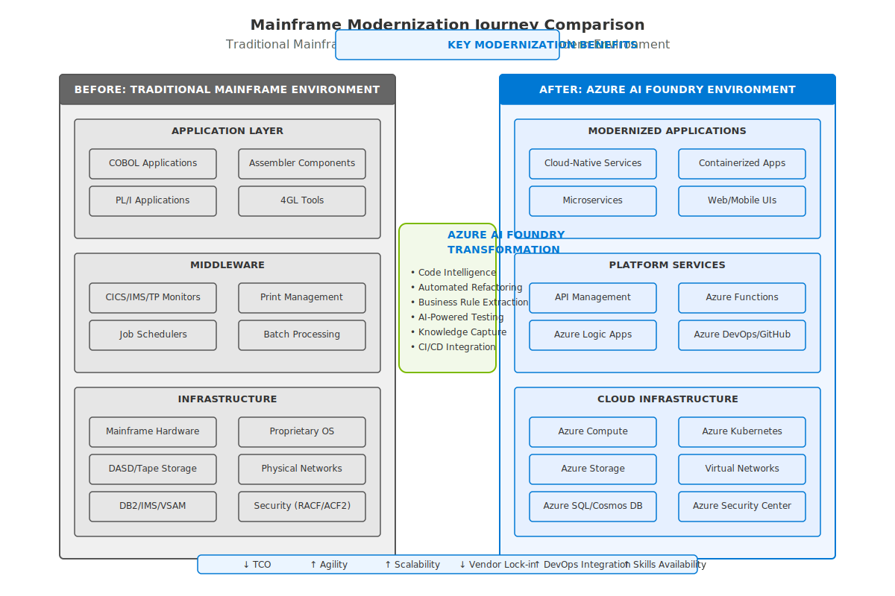

# 🔄 Mainframe Modernization: Before and After

This document provides a detailed comparison between traditional mainframe environments and modern cloud-based environments powered by Azure AI Foundry, highlighting the transformation journey and benefits.

## Traditional Mainframe Environment

### Application Layer Characteristics

Traditional mainframe environments typically rely on monolithic applications built with legacy programming languages:

- **COBOL Applications**: Large, monolithic programs often developed over decades with millions of lines of code
- **PL/I Applications**: Complex business logic embedded in procedural code with limited modularity
- **Assembler Components**: Low-level system components optimized for specific hardware
- **4GL Tools**: Proprietary development environments with vendor-specific features

### Middleware Constraints

The middleware layer in traditional mainframe environments introduces several operational challenges:

- **Transaction Monitors**: Proprietary systems like CICS, IMS, TP8, and AIM/DC with complex configurations
- **Job Schedulers**: Complex batch dependencies with rigid scheduling constraints
- **Print Management**: Specialized print subsystems with proprietary formatting
- **Batch Processing**: Sequential processing with limited parallelization options

### Infrastructure Limitations

Traditional mainframe infrastructure presents significant constraints:

- **Mainframe Hardware**: Expensive proprietary hardware with long refresh cycles
- **Storage Systems**: DASD and tape storage systems with specialized management
- **Database Systems**: Hierarchical and legacy relational databases (DB2, IMS, DMSII, AIM)
- **Proprietary Operating Systems**: z/OS, MCP, GCOS, ACOS with specialized skills requirements
- **Physical Networks**: Limited integration capabilities with modern networks
- **Security Systems**: RACF, ACF2, Top Secret with complex configuration requirements

## Azure AI Foundry Transformed Environment

### Modernized Application Layer

The transformed application layer offers significant advantages:

- **Cloud-Native Services**: Decomposed applications leveraging managed services
- **Microservices Architecture**: Modular components with clear boundaries and independent scalability
- **Containerized Applications**: Portable, consistent deployment across environments
- **Modern Web/Mobile UIs**: Intuitive interfaces accessible from any device

### Advanced Platform Services

The platform services layer provides sophisticated capabilities:

- **API Management**: Centralized governance of APIs with security and monitoring
- **Azure Logic Apps**: Visual workflow orchestration for complex business processes
- **Azure Functions**: Serverless compute for event-driven microservices
- **Azure DevOps/GitHub**: Modern CI/CD pipelines with automated testing and deployment

### Optimized Cloud Infrastructure

Cloud infrastructure delivers flexibility and cost optimization:

- **Azure Compute**: Scalable compute resources with pay-as-you-go pricing
- **Azure Storage**: Durable, highly available storage with multiple tiers
- **Azure SQL/Cosmos DB**: Managed relational and NoSQL database options
- **Azure Kubernetes**: Orchestrated container management for complex applications
- **Virtual Networks**: Software-defined networking with advanced security
- **Azure Security Center**: Comprehensive security management and monitoring

## Transformation Process with Azure AI Foundry

Azure AI Foundry bridges the gap between traditional mainframe environments and modern cloud platforms through:

1. **Code Intelligence**: AI-powered analysis of legacy code to understand structure and behavior
2. **Automated Refactoring**: Intelligent conversion of legacy code to modern languages and architectures
3. **Business Rule Extraction**: Identification and isolation of business logic for preservation
4. **AI-Powered Testing**: Automated test generation based on legacy application behavior
5. **Knowledge Capture**: Documentation generation from legacy systems and code
6. **CI/CD Integration**: Seamless integration with modern DevOps pipelines

## Key Modernization Benefits

The modernization journey delivers measurable benefits across multiple dimensions:

- **Reduced Total Cost of Ownership**: Lower infrastructure costs, operational efficiency, and maintenance
- **Increased Business Agility**: Faster feature delivery and response to market changes
- **Improved Scalability**: Elastic resources that scale with demand
- **Reduced Vendor Lock-in**: Open standards and portable solutions
- **Enhanced DevOps Integration**: Automated deployment and operational management
- **Greater Skills Availability**: Modern technologies with larger talent pools

## Transformation Strategies

Organizations can choose from multiple modernization strategies based on their specific requirements:

1. **Rehost (Lift and Shift)**: Move applications with minimal changes to emulated environments
2. **Refactor (Code Transformation)**: Convert applications to modern languages while preserving functionality
3. **Rearchitect (Microservices)**: Decompose monolithic applications into cloud-native microservices
4. **Replace**: Implement new solutions to replace legacy functionality
5. **Hybrid**: Combine multiple strategies in a phased approach

## Implementation Considerations

When planning your modernization journey, consider these key factors:

- **Application Criticality**: Prioritize based on business impact and risk
- **Technical Complexity**: Assess complexity and dependencies
- **Organizational Readiness**: Evaluate skills and change management requirements
- **Integration Requirements**: Identify integration points with other systems
- **Regulatory Compliance**: Address security and compliance requirements

## Getting Started

To begin your modernization journey:

1. Review the [Multi-Vendor Inventory Process](../02-discovery/01-inventory.md) to catalog your current assets
2. Explore the [Platform Comparison](../02-discovery/platform-comparison.md) to understand platform-specific considerations
3. Study the [Modernization Strategy](../03-foundation/modernization-strategy.md) options for your applications
4. Develop your [Hybrid Strategy](../03-foundation/hybrid-strategy.md) for phased implementation
5. Implement the [Reference Architecture](../03-foundation/reference-architecture.md) for your target environment

## Next Steps

- Continue to [Discovery and Assessment Phase](../02-discovery/README.md) to begin your modernization journey
- Learn about [Implementation Roadmap](04-implementation-roadmap.md) for planning your transformation 