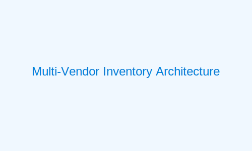
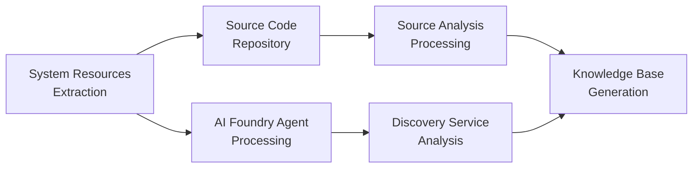

# 📦 Mainframe Inventory Process



This document outlines the technical process for creating a comprehensive inventory of mainframe applications and components across multiple platforms (IBM z/OS, Unisys ClearPath, Bull GCOS, and NEC ACOS) using Azure AI Foundry.

## Inventory Objectives

The inventory process has these technical objectives:
- Document all production and development mainframe applications across platforms
- Catalog all programming language components (COBOL, PL/I, Assembler, Algol, and platform-specific languages)
- Identify and document all datasets, databases, and file systems
- Map transaction processing components for each platform (CICS, IMS, COMS, TP8, AIM/DC)
- Document batch processing schedules and dependencies
- Identify interfaces and integration points

## Technical Implementation

### Deployment Architecture

The inventory process uses a secure agent-based architecture:

1. **Azure AI Foundry Platform-Specific Agents**
   - Lightweight agents deployed on each mainframe platform
   - Secure, read-only access to system resources
   - Data compression and encryption for transfer
   - Platform-specific extraction capabilities

2. **Azure Inventory Service**
   - Secure ingestion pipeline for mainframe metadata
   - AI-powered analysis and classification
   - Version-controlled inventory repository
   - RESTful API for integration with other tools
   - Multi-platform correlation engine

### Data Collection Process

The inventory process follows this technical workflow:



#### Platform Resource Analysis

The system resource extraction includes:

| Platform | Information Extracted |
|--------------|----------------------|
| **IBM z/OS** | Master Catalog, Program Libraries, Procedure Libraries, CICS Resources, DB2 Catalog, IMS Catalog |
| **Unisys ClearPath** | MCP/OS 2200 Catalogs, Program Libraries, WFL Procedures, COMS Resources, DMSII/DMS Database Catalog |
| **Bull GCOS** | GCOS Catalogs, Program Libraries, JCL Procedures, TP8 Resources, IDS/II Database Catalog |
| **NEC ACOS** | ACOS Catalogs, Program Libraries, NCL Procedures, AIM/DC Resources, AIM Database Catalog |

#### Source Code Analysis

Source code extraction includes:

| Platform | Source Types Analyzed |
|-------------|-------------------|
| **IBM z/OS** | COBOL Programs, PL/I Programs, Assembler Programs, JCL Procedures, CICS Components, IMS Components |
| **Unisys ClearPath** | COBOL Programs, Algol Programs, WFL Procedures, COMS Components, DMSII Database Definitions |
| **Bull GCOS** | GCOS COBOL Programs, JCL Procedures, TP8 Components, IDS/II Database Definitions |
| **NEC ACOS** | ACOS COBOL Programs, NCL Procedures, AIM/DC Components, AIM Database Definitions |

### Implementation Steps

1. **Prepare the Environment for Each Platform**

   **For IBM z/OS:**
   ```bash
   # Install AI Foundry z/OS Agents
   EXEC 'SYS2.AIFOUNDRY.CNTL(INSTALL)'
   
   # Configure Agent Security
   EXEC 'SYS2.AIFOUNDRY.CNTL(SECURITY)'
   
   # Validate Agent Installation
   EXEC 'SYS2.AIFOUNDRY.CNTL(VERIFY)'
   ```

   **For Unisys ClearPath:**
   ```bash
   # Install AI Foundry ClearPath Agents for MCP
   @ADD AIFOUNDRY/INSTALLER ON DISK
   @START AIFOUNDRY/INSTALLER
   
   # Configure Security
   @START AIFOUNDRY/SECURITY
   
   # Verify Installation
   @START AIFOUNDRY/VERIFY
   ```

   **For Bull GCOS:**
   ```bash
   # Install AI Foundry GCOS Agents
   BATCH AIFOUNDRY/INSTALL
   
   # Configure Security Settings
   BATCH AIFOUNDRY/SECURITY
   
   # Verify Installation
   BATCH AIFOUNDRY/VERIFY
   ```

   **For NEC ACOS:**
   ```bash
   # Install AI Foundry ACOS Agents
   RUN AIFOUNDRY/INSTALL
   
   # Configure Security Settings
   RUN AIFOUNDRY/SECURITY
   
   # Verify Installation
   RUN AIFOUNDRY/VERIFY
   ```

2. **Execute System Resource Extraction**

   **For IBM z/OS:**
   ```bash
   # Run Catalog Extraction Job
   EXEC 'SYS2.AIFOUNDRY.CNTL(CATALOG)'
   
   # Extract Program Information
   EXEC 'SYS2.AIFOUNDRY.CNTL(PROGRAMS)'
   
   # Extract Database Definitions
   EXEC 'SYS2.AIFOUNDRY.CNTL(DBEXTRACT)'
   ```

   **For Unisys ClearPath:**
   ```bash
   # Run Catalog Extraction
   @START AIFOUNDRY/EXTRACT/CATALOG
   
   # Extract Program Information
   @START AIFOUNDRY/EXTRACT/PROGRAMS
   
   # Extract Database Definitions
   @START AIFOUNDRY/EXTRACT/DATABASE
   ```

   **For Bull GCOS:**
   ```bash
   # Run Catalog Extraction
   BATCH AIFOUNDRY/EXTRACT/CATALOG
   
   # Extract Program Information
   BATCH AIFOUNDRY/EXTRACT/PROGRAMS
   
   # Extract Database Definitions
   BATCH AIFOUNDRY/EXTRACT/DATABASE
   ```

   **For NEC ACOS:**
   ```bash
   # Run Catalog Extraction
   RUN AIFOUNDRY/EXTRACT/CATALOG
   
   # Extract Program Information
   RUN AIFOUNDRY/EXTRACT/PROGRAMS
   
   # Extract Database Definitions
   RUN AIFOUNDRY/EXTRACT/DATABASE
   ```

3. **Execute Source Code Extraction**

   **For IBM z/OS:**
   ```bash
   # Extract COBOL Source Code
   EXEC 'SYS2.AIFOUNDRY.CNTL(COBOLSRC)'
   
   # Extract PL/I Source Code
   EXEC 'SYS2.AIFOUNDRY.CNTL(PLISRC)'
   
   # Extract JCL Procedures
   EXEC 'SYS2.AIFOUNDRY.CNTL(JCLSRC)'
   ```

   **For Unisys ClearPath:**
   ```bash
   # Extract COBOL Source Code
   @START AIFOUNDRY/EXTRACT/COBOLSRC
   
   # Extract Algol Source Code
   @START AIFOUNDRY/EXTRACT/ALGOLSRC
   
   # Extract WFL Procedures
   @START AIFOUNDRY/EXTRACT/WFLSRC
   ```

   **For Bull GCOS:**
   ```bash
   # Extract COBOL Source Code
   BATCH AIFOUNDRY/EXTRACT/COBOLSRC
   
   # Extract JCL Procedures
   BATCH AIFOUNDRY/EXTRACT/JCLSRC
   
   # Extract TP8 Definitions
   BATCH AIFOUNDRY/EXTRACT/TP8SRC
   ```

   **For NEC ACOS:**
   ```bash
   # Extract COBOL Source Code
   RUN AIFOUNDRY/EXTRACT/COBOLSRC
   
   # Extract NCL Procedures
   RUN AIFOUNDRY/EXTRACT/NCLSRC
   
   # Extract AIM/DC Definitions
   RUN AIFOUNDRY/EXTRACT/AIMSRC
   ```

4. **Process Extracted Data**
   ```bash
   # Azure CLI Commands for Multi-Platform Processing
   az ai-foundry inventory process --platform z/OS --agent-output /path/to/zos/data
   az ai-foundry inventory process --platform clearpath --agent-output /path/to/clearpath/data
   az ai-foundry inventory process --platform gcos --agent-output /path/to/gcos/data
   az ai-foundry inventory process --platform acos --agent-output /path/to/acos/data
   
   # Validate Inventory
   az ai-foundry inventory validate --validation-level comprehensive
   
   # Generate Consolidated Report
   az ai-foundry inventory generate-report --format html --include-all-platforms
   ```

## Inventory Deliverables

The inventory process produces these technical deliverables:

1. **Multi-Platform Application Catalog**
   - Hierarchical representation of applications across platforms
   - Component relationships and dependencies, including cross-platform integration points
   - Technical specifications and metadata with platform context

2. **Component Repository**
   - Source code repository in version control with platform-specific organization
   - Metadata mapping for components across platforms
   - Cross-reference indexes with platform attributes

3. **Dataset/Database Inventory**
   - Dataset specifications and layouts for each platform
   - Usage patterns and access methods
   - Retention specifications with platform context

4. **System Interface Map**
   - External system integration points across platforms
   - Communication protocols and formats
   - Interface specifications with platform considerations

## Verification Process

To verify inventory completeness across platforms:

```bash
# Run Verification Process for All Platforms
az ai-foundry inventory verify --verification-type coverage --all-platforms
az ai-foundry inventory verify --verification-type accuracy --all-platforms
az ai-foundry inventory verify --verification-type completeness --all-platforms

# Run Verification Process for Specific Platform
az ai-foundry inventory verify --verification-type coverage --platform z/OS
az ai-foundry inventory verify --verification-type coverage --platform clearpath
az ai-foundry inventory verify --verification-type coverage --platform gcos
az ai-foundry inventory verify --verification-type coverage --platform acos
```

The verification process produces a detailed report highlighting:
- Missing components or metadata per platform
- Inconsistencies in collected data
- Recommended remediation steps with platform-specific guidance
- Cross-platform integration analysis

## Next Steps

After completing the inventory process:
- Proceed to [Dependency Mapping](02-dependency-mapping.md) to analyze relationships within and across platforms
- Analyze complexity using [Assessment Criteria](03-assessment-criteria.md)
- Begin planning your [Modernization Strategy](../03-foundation/modernization-strategy.md) with consideration for platform-specific requirements 