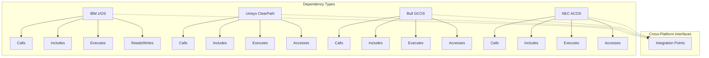

# 🔗 Dependency Mapping with AI Foundry

This guide explains how to use the dependency mapping tool to analyze mainframe applications across multiple platforms (IBM z/OS, Unisys ClearPath, Bull GCOS, and NEC ACOS) and identify relationships between components for modernization planning.

## Overview

Dependency mapping is a critical step in the mainframe modernization process. It helps identify relationships between various components such as programs, job control, copybooks, databases, and transaction processing across different mainframe platforms. Understanding these dependencies is essential for:

- Impact analysis during code changes
- Phased modernization planning
- Risk assessment and mitigation
- Test planning and prioritization
- Deployment strategies
- Cross-platform integration analysis

The Azure AI Foundry enhanced dependency mapping tool uses advanced analysis techniques to identify both explicit and implicit dependencies in mainframe code across platforms, creating a comprehensive dependency graph that includes cross-platform relationships.

## Prerequisites

- Access to mainframe source code from each platform:
  - **IBM z/OS**: COBOL, JCL, PL/I, Assembler, Copybooks, etc.
  - **Unisys ClearPath**: COBOL, Algol, WFL, etc.
  - **Bull GCOS**: GCOS COBOL, JCL, etc.
  - **NEC ACOS**: ACOS COBOL, NCL, etc.
- Python 3.8 or higher installed
- Required Python packages (see requirements.txt)
- Basic understanding of mainframe components and their relationships

## How to Run Dependency Mapping

### Installation

1. Navigate to the dependency mapping tool directory:

```bash
cd code/dependency-mapping
```

2. Install required dependencies:

```bash
pip install -r requirements.txt
```

### Basic Usage

Run the dependency mapping tool on your mainframe source code for a specific platform:

```bash
python map_dependencies.py --source-dir /path/to/mainframe/code --platform zos --output dependency-map-zos.json
```

For other platforms:

```bash
python map_dependencies.py --source-dir /path/to/mainframe/code --platform clearpath --output dependency-map-clearpath.json
python map_dependencies.py --source-dir /path/to/mainframe/code --platform gcos --output dependency-map-gcos.json
python map_dependencies.py --source-dir /path/to/mainframe/code --platform acos --output dependency-map-acos.json
```

For multi-platform analysis:

```bash
python map_dependencies.py --source-dir /path/to/all/mainframe/code --platform all --output dependency-map-all.json
```

### Advanced Options

The tool provides several options for customizing the dependency analysis:

```bash
python map_dependencies.py \
  --source-dir /path/to/mainframe/code \
  --platform zos \
  --output dependency-map.json \
  --format json \
  --exclude "test/*" \
  --exclude "archive/*" \
  --cross-platform-analysis \
  --report \
  --verbose
```

### Platform-Specific Options

Each mainframe platform has specific analysis options:

#### IBM z/OS Options

```bash
python map_dependencies.py \
  --source-dir /path/to/zos/code \
  --platform zos \
  --include-cics \
  --include-db2 \
  --include-ims \
  --include-vsam \
  --mq-analysis \
  --output zos-dependency-map.json
```

#### Unisys ClearPath Options

```bash
python map_dependencies.py \
  --source-dir /path/to/clearpath/code \
  --platform clearpath \
  --include-coms \
  --include-dmsii \
  --include-tps \
  --output clearpath-dependency-map.json
```

#### Bull GCOS Options

```bash
python map_dependencies.py \
  --source-dir /path/to/gcos/code \
  --platform gcos \
  --include-tp8 \
  --include-ids2 \
  --output gcos-dependency-map.json
```

#### NEC ACOS Options

```bash
python map_dependencies.py \
  --source-dir /path/to/acos/code \
  --platform acos \
  --include-aim \
  --include-dc \
  --output acos-dependency-map.json
```

### CI/CD Integration

For automated dependency analysis in CI/CD pipelines, use the provided integration script:

```bash
./ci_integration.sh \
  --source-dir /path/to/mainframe/code \
  --platform all \
  --output-dir /path/to/output \
  --integration github \
  --changes-only
```

## Analyzing Dependency Results

### Understanding the Dependency Graph

The dependency graph represents relationships between mainframe components:

- **Nodes**: Individual components (programs, copybooks, job control language, etc.)
- **Edges**: Dependencies between components (calls, includes, executes, etc.)
- **Direction**: Source component depends on target component
- **Cross-Platform Edges**: Dependencies between components on different platforms



### Dependency Types

The tool identifies various types of dependencies across platforms:

| Platform | Dependency Type | Description | Example |
|---------|----------------|-------------|---------|
| **IBM z/OS** | Calls | Program calls another program | `CALL 'SUBPGM'` |
| **IBM z/OS** | Includes | Program includes a copybook | `COPY CUSTCPY` |
| **IBM z/OS** | Executes | JCL job executes a program | `//STEP1 EXEC PGM=MAINPGM` |
| **IBM z/OS** | Reads | Program reads from a data source | `SELECT * FROM CUSTTBL` |
| **IBM z/OS** | Writes | Program writes to a data source | `INSERT INTO ORDERTBL` |
| **Unisys ClearPath** | Calls | Program calls another program | `CALL SUBPGM` |
| **Unisys ClearPath** | Includes | Program includes a file | `INCLUDE "CUSTDATA"` |
| **Unisys ClearPath** | Executes | WFL executes a program | `RUN MAINPGM` |
| **Unisys ClearPath** | Accesses | Access to DMSII database | `ACCESS CUSTOMERDB` |
| **Bull GCOS** | Calls | Program calls another program | `CALL 'SUBPGM'` |
| **Bull GCOS** | Includes | Program includes a file | `COPY CUSTCPY` |
| **Bull GCOS** | Executes | JCL executes a program | `EXEC MAINPGM` |
| **Bull GCOS** | Accesses | Access to IDS/II database | `DATABASE CUSTOMERDB` |
| **NEC ACOS** | Calls | Program calls another program | `CALL 'SUBPGM'` |
| **NEC ACOS** | Includes | Program includes a file | `COPY CUSTCPY` |
| **NEC ACOS** | Executes | NCL executes a program | `EXEC MAINPGM` |
| **NEC ACOS** | Accesses | Access to AIM database | `OPEN CUSTOMERDB` |
| **Cross-Platform** | Interfaces | Communication between platforms | Various integration methods |

### Critical Path Analysis

Identify the most critical components in your application based on dependency centrality measures:

```bash
python map_dependencies.py -s /path/to/mainframe/code --platform all --report
```

The report will identify components with high dependency counts, high centrality, or other risk factors, including cross-platform critical paths.

### Impact Analysis

To analyze the impact of changes to a specific component across platforms:

```bash
python map_dependencies.py -s /path/to/mainframe/code --platform all -c CUSTMGMT
```

This will show:
- Components that would be impacted by changes to the specified component
- Components that the specified component depends on
- Cross-platform impacts

### Cross-Platform Analysis

To analyze dependencies between components on different platforms:

```bash
python map_dependencies.py -s /path/to/mainframe/code --platform all --cross-platform-analysis --output cross-platform.json
```

This will identify:
- Integration points between platforms
- Critical cross-platform dependencies
- Potential modernization breakpoints between systems

## Integration with AI-Powered Risk Assessment

The dependency mapping results can be integrated with the AI-powered risk assessment tool:

```bash
python ../risk-assessment/assess_risk.py \
  --source-dir /path/to/mainframe/code \
  --dependency-map dependency-map.json \
  --platform all \
  --profile financial-core \
  --output risk-assessment.json
```

This integration enables:
- Risk assessment based on dependency complexity
- Identification of critical components in the dependency chain
- Impact-based risk scoring
- Cross-platform risk assessment
- More accurate deployment strategy recommendations

## Visualization Options

The tool can generate visual dependency graphs in various formats:

```bash
python map_dependencies.py -s /path/to/mainframe/code -p all -o dependency-graph.png -f png
```

Supported formats include:
- PNG, PDF, SVG for visual representations
- JSON, CSV for data analysis
- GraphML for import into specialized graph visualization tools

### Platform-Specific Visualizations

Generate visualizations for specific platforms:

```bash
python map_dependencies.py -s /path/to/mainframe/code -p zos -o zos-graph.svg -f svg
python map_dependencies.py -s /path/to/mainframe/code -p clearpath -o clearpath-graph.svg -f svg
python map_dependencies.py -s /path/to/mainframe/code -p gcos -o gcos-graph.svg -f svg
python map_dependencies.py -s /path/to/mainframe/code -p acos -o acos-graph.svg -f svg
```

### Cross-Platform Visualization

Generate a visualization highlighting cross-platform dependencies:

```bash
python map_dependencies.py -s /path/to/mainframe/code -p all --cross-platform-only -o cross-platform.svg -f svg
```

## Best Practices

1. **Start Small**: Begin with a manageable subset of your mainframe application
2. **Focus on High-Value Areas**: Prioritize business-critical components
3. **Validate Results**: Verify dependencies with domain experts for each platform
4. **Iterative Analysis**: Run multiple analyses as you refine your understanding
5. **Integrate with Modernization Planning**: Use dependency insights to guide modernization phases
6. **Track Changes Over Time**: Run dependency analysis regularly to monitor evolution
7. **Cross-Platform Awareness**: Pay special attention to cross-platform dependencies

## Troubleshooting

| Issue | Resolution |
|-------|------------|
| Missing dependencies | Ensure all code artifacts are available in the source directory |
| Unexpected dependencies | Review code for dynamic calls or conditional execution paths |
| Cross-platform linkage issues | Verify integration points between platforms manually |
| Memory errors | For large codebases, run on a more powerful machine or analyze in smaller parts |
| Visualization issues | For complex graphs, use filtering or export to specialized graph tools |
| Platform-specific parsing errors | Ensure the correct platform flag is set and check for dialect-specific code |

## Next Steps

After completing dependency mapping:

1. Review the dependency graph and critical component analysis
2. Pay special attention to cross-platform dependencies
3. Incorporate findings into your modernization strategy
4. Develop a phased approach based on dependency clusters
5. Implement appropriate risk mitigation strategies
6. Set up continuous dependency analysis in your CI/CD pipeline

## References

- [Mainframe Dependency Mapping Tool README](../code/dependency-mapping/README.md)
- [Risk Assessment Integration](../10-risk-management/README.md)
- [Modernization Planning Guide](../03-foundation/modernization-strategy.md)
- [Cross-Platform Integration Guide](../11-hybrid-operations/README.md) 