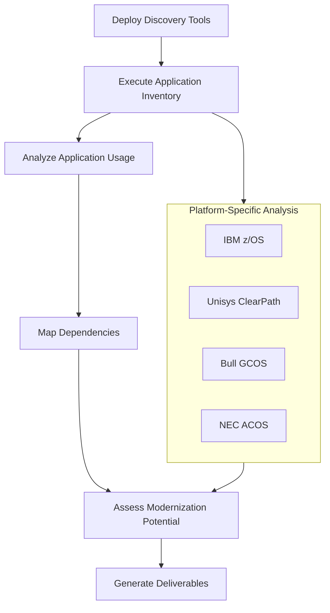

# 🔍 Discovery and Assessment Phase

This chapter covers the discovery and assessment phase for multiple mainframe platforms (IBM z/OS, Unisys ClearPath, Bull GCOS, and NEC ACOS) using Azure AI Foundry.

## 📋 Overview

The discovery and assessment phase is the crucial first step in your mainframe modernization journey. Using Azure AI Foundry's intelligence capabilities, this phase establishes a comprehensive understanding of your existing mainframe environments, identifies dependencies, and creates an actionable modernization strategy that addresses the unique characteristics of each platform.

## 🎯 Objectives

| Objective | Description |
|-----------|-------------|
| Inventory | Create a detailed inventory of all mainframe applications and components across platforms |
| Dependency Mapping | Map dependencies between applications, programs, and data assets in each environment |
| Assessment | Assess application complexity and identify modernization candidates for each platform |
| Knowledge Extraction | Extract business rules and application knowledge from diverse mainframe platforms |
| Strategy Development | Develop a comprehensive modernization strategy that accommodates platform differences |

## 📝 Technical Steps

| Step | Description |
|------|-------------|
| [Mainframe Inventory Process](01-inventory.md) | Systematic inventory of your mainframe environments |
| [Dependency Mapping with AI Foundry](02-dependency-mapping.md) | AI-assisted mapping of application dependencies across platforms |
| [AI-Powered Assessment Criteria](03-assessment-criteria.md) | Using AI to assess modernization complexity and priority for different platforms |

## Discovery Process Workflow

## ✅ Technical Prerequisites

Before beginning this phase, ensure you have platform-specific access and information:

### IBM z/OS Prerequisites

| Requirement | Details |
|-------------|---------|
| z/OS Access | Access to the IBM z/OS environment with appropriate permissions |
| System Catalogs | Access to system catalogs for program and dataset information |
| SMF Records | Access to System Management Facility (SMF) records for usage analysis |
| Source Code Access | Access to COBOL, PL/I, JCL, and Assembler code repositories |
| Database Schemas | Access to DB2, IMS, and VSAM file structures |
| Transaction Logs | Access to CICS and IMS transaction logs (if applicable) |

### Unisys ClearPath Prerequisites

| Requirement | Details |
|-------------|---------|
| ClearPath Access | Access to the Unisys ClearPath environment with appropriate permissions |
| MCP/OS 2200 System Information | Access to system information and configuration |
| ClearPath Logs | Access to system and application logs |
| Source Code Access | Access to COBOL, Algol, and WFL code repositories |
| Database Information | Access to DMSII/DMS database structures |
| Transaction Information | Access to COMS transaction logs (if applicable) |

### Bull GCOS Prerequisites

| Requirement | Details |
|-------------|---------|
| GCOS Access | Access to the Bull GCOS environment with appropriate permissions |
| System Information | Access to system configuration and information |
| System Logs | Access to system and application logs |
| Source Code Access | Access to GCOS COBOL and JCL code repositories |
| Database Information | Access to IDS/II and other database structures |
| Transaction Information | Access to TP8 transaction logs (if applicable) |

### NEC ACOS Prerequisites

| Requirement | Details |
|-------------|---------|
| ACOS Access | Access to the NEC ACOS environment with appropriate permissions |
| System Information | Access to system configuration and information |
| System Logs | Access to system and application logs |
| Source Code Access | Access to ACOS COBOL and NCL code repositories |
| Database Information | Access to AIM database structures |
| Transaction Information | Access to AIM/DC transaction logs (if applicable) |

## 🛠️ Implementation Steps

1. **Deploy Discovery Tools**
   - Install Azure AI Foundry discovery agents on each mainframe platform
   - Configure secure connectivity between mainframe systems and Azure
   - Validate access permissions and connectivity for each platform

2. **Execute Application Inventory**
   - Scan system catalogs and information repositories across platforms
   - Analyze job control languages for each platform (JCL, WFL, NCL)
   - Extract programming language information (COBOL, PL/I, Assembler, Algol)
   - Document database schemas and file structures across platforms

3. **Analyze Application Usage**
   - Process performance records from each platform to identify usage patterns
   - Map transaction volumes and frequencies across environments
   - Identify peak processing periods for each system
   - Document batch window requirements and processing schedules

4. **Map Dependencies**
   - Use AI-powered analysis to identify program calls in each environment
   - Map data access patterns and dependencies for each platform
   - Document external interfaces and integration points
   - Create platform-specific and cross-platform application dependency graphs

5. **Assess Modernization Potential**
   - Apply AI analysis to determine modernization complexity for each platform
   - Categorize applications by modernization approach
   - Identify technical debt and risks in each environment
   - Prioritize applications for modernization with consideration for platform differences

## 📦 Key Deliverables

| Deliverable | Description |
|-------------|-------------|
| Multi-Platform Application Inventory | Comprehensive catalog of applications and components across all mainframe environments |
| Cross-Platform Dependency Map | Visual and data representation of application interdependencies, including cross-platform integrations |
| Platform-Specific Complexity Assessment | Analysis of application complexity and modernization effort for each platform |
| Business Rule Documentation | Extracted business rules and application logic from diverse mainframe languages |
| Platform-Aware Modernization Strategy | Recommended approach for each application component with platform considerations |
| Integrated Implementation Plan | Prioritized roadmap for modernization implementation across all platforms |

## 🧰 Tools and Techniques

| Tool/Technique | Purpose |
|----------------|---------|
| Multi-Platform AI Code Analyzer | Deep analysis of source code across mainframe languages to extract patterns and dependencies |
| System Information Extractor | Extraction of program information from system repositories across platforms |
| Performance Analyzer | Processing of performance and usage data from various mainframe systems |
| Cross-Platform Dependency Grapher | Visual representation of application dependencies within and across platforms |
| Multi-Language Business Rule Extractor | Identification of business rules in diverse mainframe programming languages |
| Platform-Specific Complexity Calculator | Assessment of application complexity for modernization considering platform characteristics |

## 💡 Practical Example

See the [Code Examples](../../code/ai-foundry/analysis/) directory for practical examples of:
- System information extraction for different platforms
- Performance record processing for various mainframes
- Multi-platform code analysis implementation
- Cross-platform dependency mapping visualization
- Platform-specific assessment report generation

## ➡️ Next Steps

After completing this phase, continue to the [🏗️ Foundation Setup](../03-foundation/README.md) phase to establish the core infrastructure for your modernization initiative.

## 📚 Additional Resources

| Resource | Description |
|----------|-------------|
| [Azure AI Foundry Analysis Documentation](https://learn.microsoft.com/en-us/azure/ai-foundry/analysis/) | Official documentation for analysis features |
| [Business Rule Extraction Guide](https://learn.microsoft.com/en-us/azure/ai-foundry/business-rules/) | Guide for extracting business rules |
| [Dependency Mapping Tools](https://learn.microsoft.com/en-us/azure/ai-foundry/dependency-mapping/) | Tools for mapping dependencies |
| [Sample Analysis Reports](../../code/ai-foundry/code-analysis/sample-reports/) | Example reports for reference | 
| [Platform-Specific Analysis Guides](https://learn.microsoft.com/en-us/azure/ai-foundry/platform-guides/) | Guides for analyzing specific mainframe platforms | 