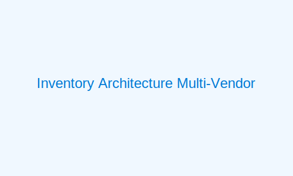

# 🔍 Multi-Vendor Mainframe Platform Comparison

This document provides a detailed comparison of the different mainframe platforms supported by Azure AI Foundry for modernization initiatives.

## Platform Characteristics and Components

### IBM z/OS

**Architecture Overview:**
- Based on the System/360 architecture with backward compatibility
- 64-bit addressing capabilities with 31-bit compatibility mode
- Hardware-level cryptography and security features
- Parallel Sysplex clustering technology for high availability

**Programming Languages:**
- COBOL (various versions from COBOL/370 to Enterprise COBOL)
- PL/I (PL/I for MVS & VM, Enterprise PL/I)
- Assembler (HLASM - High Level Assembler)
- REXX, C/C++, Java, and Metal C

**Transaction Processing:**
- CICS (Customer Information Control System) - Terminal-oriented transaction processing
- IMS/TM (Information Management System/Transaction Manager) - Hierarchical transaction processing
- z/OS Connect - RESTful API integration

**Data Management:**
- DB2 for z/OS - Relational database management
- IMS/DB - Hierarchical database system
- VSAM (Virtual Storage Access Method) - Indexed or sequential file system
- Physical Sequential and Partitioned Data Sets
- zFS (z/OS File System) - UNIX-compatible file system

**Job Processing:**
- JCL (Job Control Language) - Batch job definition and control
- JES2/JES3 (Job Entry Subsystem) - Job scheduling and management
- TWS (Tivoli Workload Scheduler) - Automated job scheduling

**System Services:**
- TSO/ISPF (Time Sharing Option/Interactive System Productivity Facility) - Interactive terminal interface
- RACF (Resource Access Control Facility) - Security system
- SMF (System Management Facility) - System activity recording
- RMF (Resource Measurement Facility) - Performance monitoring

### Unisys ClearPath

**Architecture Overview:**
- Dual architecture supporting both MCP and OS 2200 environments
- Object-based systems with capability-based security
- Tagged architecture for improved memory protection
- Virtual memory architecture with hardware support

**Programming Languages:**
- COBOL-74, COBOL-85 (with specific extensions)
- Algol (core language of MCP)
- C/C++, Java, and NEWP (for OS 2200)
- MBOL, COOL:Gen (application generation tools)

**Transaction Processing:**
- COMS (Communications Management System) for MCP
- TIP (Transaction Interface Package) for OS 2200
- ePortal - Web-based transaction integration

**Data Management:**
- DMSII - Proprietary database for MCP
- DMS - Database management for OS 2200
- RDMS - Relational database system for OS 2200
- SQL ENTERPRISE - SQL database interface

**Job Processing:**
- WFL (Work Flow Language) - MCP job control
- ECL (Executive Control Language) - OS 2200 job control
- Operations Sentinel - Automated operations and scheduling

**System Services:**
- MARC (Menu-Assisted Resource Control) - Interactive interface for MCP
- DEMAND - Interactive session control for OS 2200
- Security Center - Unified security management
- Operations Sentinel - System monitoring and management

### Bull GCOS

**Architecture Overview:**
- 36-bit word architecture with extended addressing
- Hardware-level security ring protection
- Virtualization support with multi-domain architecture
- Fault-tolerant systems with hot-swappable components

**Programming Languages:**
- COBOL-74, COBOL-85 (with Bull extensions)
- PL/I (with Bull extensions)
- C/C++, Pascal, and BAL (Bull Assembly Language)
- JCL Shell scripting

**Transaction Processing:**
- TP8 - Transaction processing monitor
- WebAccess - Web interface to GCOS applications
- TDS - Transaction Data Server

**Data Management:**
- IDS/II - Network database system
- DBSP - Relational database
- UFAS (Universal File Access System) - Indexed file system
- GCOS File System - Hierarchical file system

**Job Processing:**
- JCL (Job Control Language, Bull variant) - Batch job control
- IOF (Interactive Operating Facilities) - Batch job management
- GCL (GCOS Command Language) - System command language

**System Services:**
- IOF - Interactive command interface
- TACL - Terminal access language
- GCOS Security - Access control and security management
- SMS - System Management Services

### NEC ACOS

**Architecture Overview:**
- Vector-processor architecture with super-scalar capabilities
- Hardware-based fault detection and recovery
- Multi-processing architecture with global shared memory
- Integrated I/O subsystem with dedicated processors

**Programming Languages:**
- COBOL (NEC COBOL85, COBOL90, COBOL97)
- C/C++, Fortran
- APL, ACOS Assembler
- NCL (NEC Command Language)

**Transaction Processing:**
- AIM/DC - Online transaction processing monitor
- NDMII - Distributed transaction processing
- XMAP3 - Screen mapping and form system

**Data Management:**
- AIM Database - Hierarchical database system
- RDB - Relational database system
- VSP (Virtual Storage and Protection) - File system
- ISAM - Indexed sequential file access

**Job Processing:**
- NCL (NEC Command Language) - Job control language
- JOBQ - Job queue management
- Job Scheduler - Automated job scheduling

**System Services:**
- IWS - Interactive workstation
- SAM - System activity monitor
- ASW - Advanced system watcher
- ESS - Enterprise security system

## Key Differences in Inventory Collection

The multi-vendor inventory process must account for significant differences between platforms:

| Area | IBM z/OS | Unisys ClearPath | Bull GCOS | NEC ACOS |
|------|----------|------------------|-----------|----------|
| **Catalog Structure** | Hierarchical catalog with ICF structure | Flat catalog with object-based structure | Network directory service | Hierarchical system catalog |
| **System API Access** | z/OSMF REST APIs, REXX interfaces | MCP API, ClearPath ePortal | Bull IOF API, GCOS CLI | ACOS Management API, NDMII |
| **Security Mechanisms** | RACF, ACF2, or Top Secret | ClearPath Security, capability-based access | GCOS Security, ring protection | ESS, tiered access control |
| **Code Storage** | PDS, PDSE, source management systems | Program files, libraries | Source libraries, modules | Program libraries, segments |
| **Transaction Definitions** | CICS CSD, IMS SYSGEN | COMS UTIL, TIP configuration | TP8 definitions | AIM/DC configurations |
| **Job Structure** | JCL with PROC libraries | WFL procedures, ECL scripts | JCL with specific syntax | NCL job structures |
| **Database Catalog** | DB2 catalog, IMS DBDLIB/PSBLIB | DMSII DASDL, DMS schemas | IDS/II schema, DBSP catalog | AIM DB catalog, RDB system tables |

## Platform-Specific Inventory Challenges

### IBM z/OS Challenges
- Extensive dataset security requiring special permissions
- Complex application ecosystems with multiple subsystems
- Legacy catalog structures with historical artifacts
- Numerous customization points in system software

### Unisys ClearPath Challenges
- Dual architecture (MCP and OS 2200) with different paradigms
- Object-based file system with unique attributes
- Proprietary database structures with complex layouts
- Specialized security model based on capability architecture

### Bull GCOS Challenges
- Limited modern API access to system resources
- Specialized transaction processing environment
- Complex network database structures
- Unique batch processing models with dependencies

### NEC ACOS Challenges
- Limited documentation in non-Japanese languages
- Unique vector processing optimizations in code
- Specialized hierarchical database structure
- Proprietary terminal and screen handling

## Cross-Platform Inventory Strategy

Azure AI Foundry provides specialized agents for each mainframe platform while maintaining a consistent inventory structure:

1. **Platform-Specific Extraction**:
   - Custom extraction modules for each platform's unique catalogs
   - Platform-appropriate authentication and security handling
   - Specialized parsing for platform-specific languages and constructs
   - Targeted analysis of platform dependencies

2. **Unified Inventory Repository**:
   - Common metadata structure across all platforms
   - Normalized component relationships
   - Standardized technical artifacts
   - Cross-platform dependency mapping

3. **AI-Assisted Correlation**:
   - Intelligent identification of similar components across platforms
   - Automatic recognition of equivalent business functions
   - Pattern matching for similar data structures
   - Functional similarity detection regardless of implementation

## Next Steps

After completing the multi-vendor inventory:
- Review [Platform Migration Patterns](../03-foundation/patterns/migration-patterns.md) for each mainframe type
- Understand [Cross-Platform Integration](../11-hybrid-operations/cross-platform-integration.md) approaches
- Implement the appropriate [Multi-Vendor Testing Strategy](../09-cicd-implementation/multi-vendor-testing.md) 