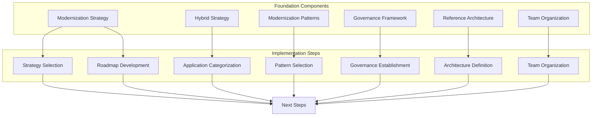

# 🏗️ Foundation Setup

This chapter provides the essential foundation components for your mainframe modernization journey across multiple platforms (IBM z/OS, Unisys ClearPath, Bull GCOS, and NEC ACOS) using Azure AI Foundry with GitHub and Azure DevOps integration.

## 📋 Overview

Before implementing technical components, a solid foundation must be established. This includes defining your multi-platform modernization strategy, establishing governance frameworks that accommodate different mainframe environments, and preparing your technical infrastructure for the transformation journey. The foundation phase sets the guardrails for your modernization initiative and helps ensure consistent implementation across teams while recognizing the unique characteristics of each mainframe platform.

## 🧩 Key Components

This chapter covers the following foundational components:

| Component | Description |
|-----------|-------------|
| [Modernization Strategy](modernization-strategy.md) | Comprehensive approaches for mainframe modernization (rehost, refactor, rearchitect, replace, and hybrid) across different platforms |
| [Hybrid Strategy](hybrid-strategy.md) | Portfolio approach for applying different modernization strategies based on business value, complexity, and platform considerations |
| [Modernization Patterns](patterns/README.md) | Detailed implementation patterns for mainframe modernization adaptable to different platforms |
| [Governance Framework](governance-framework.md) | Establishing controls, processes, and decision structures for multi-platform modernization |
| [Reference Architecture](reference-architecture.md) | Technical architecture patterns for modernization across mainframe platforms |
| [Team Organization](team-organization.md) | Structuring teams and roles for modernization success with platform-specific expertise |

## 🎯 Objectives

| Objective | Description |
|-----------|-------------|
| Strategy | Establish a clear modernization strategy aligned with business goals across all mainframe platforms |
| Governance | Define governance processes for the modernization initiative that address platform-specific requirements |
| Architecture | Create a reference architecture for implementation teams to follow with platform-specific components |
| Organization | Organize teams effectively for modernization activities with appropriate platform expertise |
| Decision-making | Enable consistent decision-making throughout the modernization journey while accommodating platform differences |
| Cross-Platform Integration | Establish patterns for integration between different mainframe platforms during modernization |

## ✅ Prerequisites

Before implementing the foundation components:

| Prerequisite | Description |
|--------------|-------------|
| Discovery | Complete the [🔍 Discovery and Assessment](../02-discovery/README.md) phase across all platforms |
| Stakeholder Alignment | Obtain business stakeholder alignment on modernization goals for each platform |
| Team Identification | Identify key team members with expertise in each mainframe platform for modernization leadership |
| Documentation | Gather existing architectural documentation for all mainframe systems (IBM z/OS, Unisys ClearPath, Bull GCOS, NEC ACOS) |
| Platform Inventory | Complete inventory of applications, interfaces, and data flows across all platforms |
| Budget Planning | Establish initial budget and timeline expectations with platform-specific considerations |

## 🛠️ Implementation Steps

1. Review the [Modernization Strategy Guide](modernization-strategy.md) and select appropriate approaches for your applications across different platforms
2. Apply the [Hybrid Strategy](hybrid-strategy.md) to categorize applications in your portfolio with consideration for platform characteristics
3. Select appropriate [Modernization Patterns](patterns/README.md) for each application or component based on platform requirements
4. Develop a phased implementation roadmap based on application dependencies and cross-platform integration needs
5. Establish your [governance framework](governance-framework.md) with clear decision-making structures that address platform-specific concerns
6. Define your [reference architecture](reference-architecture.md) patterns for implementation across all platforms
7. Organize your [teams](team-organization.md) according to the modernization approach selected, ensuring appropriate expertise for each platform
8. Develop cross-platform integration strategies for applications that span multiple mainframe environments

## ➡️ Next Steps

After establishing your modernization foundation:

1. Set up your [💻 Development Environment](../04-development-environment/README.md) with tools for all relevant platforms
2. Implement [🧠 AI-Powered Code Analysis](../05-code-analysis/README.md) across your multi-platform codebase
3. Select and configure your integration approach ([🐙 GitHub](../06-github-integration/README.md) or [🔄 Azure DevOps](../07-azure-devops-integration/README.md)) with appropriate configurations for each platform
4. Begin your [🤖 AI-Powered Transformation](../08-ai-transformation/README.md) journey with platform-specific transformation pipelines 