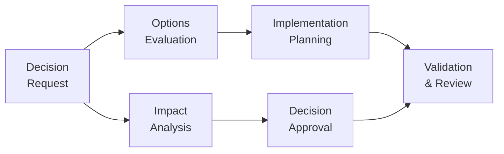

# Governance Framework

This document outlines the technical governance framework for mainframe modernization initiatives across multiple platforms (IBM z/OS, Unisys ClearPath, Bull GCOS, and NEC ACOS) using Azure AI Foundry.

```mermaid
flowchart TD
    subgraph "Technical Steering Committee"
        EA["Enterprise Architect"]
        PTL["Platform Technical Leads"]
        CPA["Cloud Platform Architect"]
        DL["DevOps Lead"]
        SL["Security Lead"]
        BDE["Business Domain Expert"]
    end
    
    subgraph "Working Groups"
        AWG["Architecture Working Group"]
        DWG["DevOps Working Group"] 
        SWG["Security Working Group"]
        AIWG["AI and Analytics Working Group"]
    end
    
    subgraph "Decision Framework"
        DR["Decision Request"] --> IA["Impact Analysis"]
        IA --> DA["Decision Approval"]
        DR --> OE["Options Evaluation"]
        OE --> IP["Implementation Planning"]
        IP --> VR["Validation & Review"]
        DA --> VR
    end
    
    Technical Steering Committee --> Working Groups
    Working Groups --> Decision Framework
```

## Governance Overview

The governance framework establishes the structure, processes, and controls needed to manage the multi-platform mainframe modernization journey efficiently. It defines the decision-making processes, roles and responsibilities, risk management approaches, and compliance considerations specific to Azure AI Foundry implementation across different mainframe environments.

## Governance Structure

### Technical Steering Committee

The Technical Steering Committee (TSC) provides overall technical governance:

| Role | Responsibility |
|------|----------------|
| Enterprise Architect | Ensures architectural standards and alignment with enterprise strategy |
| Platform Technical Leads | Represent platform-specific technical considerations (IBM z/OS, Unisys ClearPath, Bull GCOS, NEC ACOS) |
| Cloud Platform Architect | Ensures cloud platform compatibility and integration |
| DevOps Lead | Oversees CI/CD and automation processes |
| Security Lead | Ensures security and compliance requirements are met |
| Business Domain Expert | Represents business priorities and requirements |

The TSC meets bi-weekly to:
- Review modernization progress against technical milestones across all platforms
- Address technical blocking issues and platform-specific risks
- Approve architectural decisions and changes with cross-platform considerations
- Resolve cross-team dependencies and conflicts
- Coordinate integration approaches between platforms

### Technical Working Groups

Specialized working groups focus on specific aspects of the modernization:

1. **Architecture Working Group**
   - Platform architecture decisions for each mainframe environment
   - Cross-platform integration patterns and standards
   - Technical debt management
   - Performance and scalability standards
   - Platform-specific considerations and adaptations

2. **DevOps Working Group**
   - Multi-platform CI/CD pipeline implementation
   - Automation standards and practices for each mainframe platform
   - Environment management
   - Platform-specific deployment strategies
   - Cross-platform build and release orchestration

3. **Security Working Group**
   - Security architecture and controls for each platform
   - Platform-specific compliance validation
   - Cross-platform access management
   - Data protection standards across environments
   - Security integration between legacy and modern systems

4. **AI and Analytics Working Group**
   - AI implementation standards for diverse mainframe codebases
   - Analytics framework and practices
   - Platform-specific knowledge extraction methodologies
   - ML model management for different language and platform contexts
   - Cross-platform data correlation and analysis

## Decision-Making Framework

The governance framework implements a structured decision-making process:



### Decision Levels

Decisions are categorized into three levels:

| Decision Level | Description | Approval Authority | Examples |
|----------------|-------------|-------------------|----------|
| Strategic | Affects overall modernization approach | TSC | Platform modernization prioritization, cross-platform integration approach |
| Tactical | Affects specific implementation areas | Working Group + TSC review | Platform-specific tool selection, integration patterns |
| Operational | Day-to-day implementation decisions | Implementation Team | Specific implementation techniques for each platform |

### Platform-Specific Considerations

Each platform requires specific governance considerations:

| Platform | Governance Considerations |
|----------|--------------------------|
| IBM z/OS | IBM software licensing, RACF security integration, CICS/IMS transaction governance |
| Unisys ClearPath | ClearPath Forward licensing, DMSII data governance, MCP/OS 2200 security integration |
| Bull GCOS | GCOS licensing, TPR governance, Bull security integration |
| NEC ACOS | ACOS-4 licensing, AIM data governance, ACOS security frameworks |

### Decision Documentation

All significant decisions are documented using the Architecture Decision Record (ADR) format:

```markdown
# Architecture Decision Record: [Title]

## Status
[Proposed | Approved | Deprecated | Superseded]

## Context
[Technical context and problem statement]

## Platform Scope
[IBM z/OS | Unisys ClearPath | Bull GCOS | NEC ACOS | Cross-Platform]

## Decision
[Decision description and justification]

## Platform-Specific Implications
[How this decision affects each relevant platform]

## Consequences
[Positive and negative consequences of this decision]

## Alternatives Considered
[Alternative options evaluated]

## Related Decisions
[References to related decisions]

## References
[Reference materials]
```

## Risk Management Framework

The governance framework includes a comprehensive risk management process:

### Risk Categories

| Risk Category | Description | Examples |
|--------------|-------------|----------|
| Technical | Risks related to technology implementation | Integration failures, performance issues, platform compatibility |
| Process | Risks related to process changes | Deployment disruptions, testing inadequacies |
| People | Risks related to skills and organization | Platform-specific knowledge gaps, resistance to change |
| Security | Risks related to security and compliance | Platform-specific security integration, compliance gaps |
| Business | Risks related to business impact | Service disruptions, functionality gaps |
| Cross-Platform | Risks related to interactions between platforms | Integration failures, data synchronization issues |

### Platform-Specific Risk Factors

Each mainframe platform introduces specific risk factors:

| Platform | Key Risk Factors |
|----------|-----------------|
| IBM z/OS | COBOL/PL1 transformation accuracy, CICS/IMS compatibility, DB2 data migration |
| Unisys ClearPath | COBOL/Algol translation, DMSII to relational mapping, COMS transaction integrity |
| Bull GCOS | GCOS COBOL dialect translation, IDS/II data migration, TP8 compatibility |
| NEC ACOS | ACOS COBOL compatibility, AIM database migration, ACOS transaction processing |

### Risk Assessment Process

1. **Risk Identification**
   - Regular risk assessment workshops for each platform
   - Automated risk detection through AI Foundry
   - Platform-specific risk registry maintenance
   - Cross-platform risk analysis

2. **Risk Analysis**
   - Impact and probability assessment
   - Platform-specific risk scoring and prioritization
   - Dependency analysis across platforms
   - Cross-platform risk correlation

3. **Risk Mitigation**
   - Platform-appropriate mitigation strategy development
   - Implementation planning
   - Residual risk acceptance
   - Cross-platform mitigation coordination

4. **Risk Monitoring**
   - Regular review of risk status across all platforms
   - Trigger-based reassessment
   - Risk trend analysis by platform and cross-platform

## Policy Framework

The governance framework establishes these core policies:

### Code Management Policies

- Platform-specific source control management standards
- Branching and merging strategies for each mainframe codebase
- Code review requirements with platform expertise
- Platform-specific quality gate criteria
- Cross-platform change coordination

### Deployment Policies

- Platform-specific deployment approval processes
- Environment promotion criteria for each environment
- Platform-appropriate rollback procedures
- Production deployment windows coordinated across platforms
- Cross-platform deployment orchestration

### Security Policies

- Platform-specific security testing requirements
- Credential management across environments
- Access control standards for each platform
- Data protection requirements with platform context

### Compliance Policies

- Platform-specific audit logging requirements
- Regulatory compliance validation for each environment
- Documentation standards with platform context
- Evidence collection and retention

## Metrics and Reporting

The governance framework defines key metrics to track modernization progress:

### Technical Metrics

| Metric | Description | Target |
|--------|-------------|--------|
| Code Coverage | Percentage of code covered by automated tests (by platform) | >80% |
| Deployment Frequency | Number of successful deployments per week (by platform) | >3 |
| Mean Time to Recovery | Average time to recover from failures (by platform) | <30 minutes |
| Technical Debt Ratio | Ratio of technical debt to total effort (by platform) | <15% |
| Cross-Platform Integration | Success rate of cross-platform integrations | >95% |

### Process Metrics

| Metric | Description | Target |
|--------|-------------|--------|
| Cycle Time | Time from code commit to production deployment | <1 day |
| First-time Success Rate | Percentage of deployments successful on first attempt | >90% |
| Automated Test Success Rate | Percentage of automated tests passing | >95% |
| Issue Resolution Time | Average time to resolve production issues | <4 hours |

### Reporting Cadence

| Report | Audience | Frequency | Content |
|--------|----------|-----------|---------|
| Technical Status | Implementation Teams | Weekly | Technical progress, issues, metrics |
| Governance Status | TSC | Bi-weekly | Decision status, risk status, policy compliance |
| Executive Summary | Executive Sponsors | Monthly | High-level progress, key achievements, risks |

## Implementation Steps

To implement the governance framework:

1. **Establish Governance Structure**
   ```bash
   # Create Governance Repository
   az devops repo create --name mainframe-modernization-governance --org https://dev.azure.com/contoso
   
   # Set Up Decision Registry
   az devops wiki create --name decision-registry --org https://dev.azure.com/contoso
   
   # Configure Risk Registry
   az devops work create-process --name mainframe-modernization --parent Agile --org https://dev.azure.com/contoso
   ```

2. **Implement Decision Process**
   ```bash
   # Create Decision Request Template
   az boards work-item create --title "Decision Request Template" --type "Template" --org https://dev.azure.com/contoso
   
   # Configure Approval Workflow
   az pipelines create --name decision-approval-workflow --org https://dev.azure.com/contoso
   ```

3. **Set Up Risk Management**
   ```bash
   # Create Risk Registry
   az boards work-item create --title "Risk Registry" --type "Registry" --org https://dev.azure.com/contoso
   
   # Configure Risk Dashboard
   az boards dashboard create --name risk-dashboard --org https://dev.azure.com/contoso
   ```

4. **Implement Metrics Collection**
   ```bash
   # Configure Azure Monitor
   az monitor metrics alert create --name mainframe-modernization-metrics --org https://dev.azure.com/contoso
   
   # Set Up Reporting Dashboards
   az boards dashboard create --name governance-dashboard --org https://dev.azure.com/contoso
   ```

## Next Steps

After establishing the governance framework:
- Review [Modernization Strategy](modernization-strategy.md) to align with governance
- Proceed to [Reference Architecture](reference-architecture.md) implementation
- Develop your [Team Organization](team-organization.md) model
- Begin implementing the [Development Environment](../04-development-environment/README.md) 