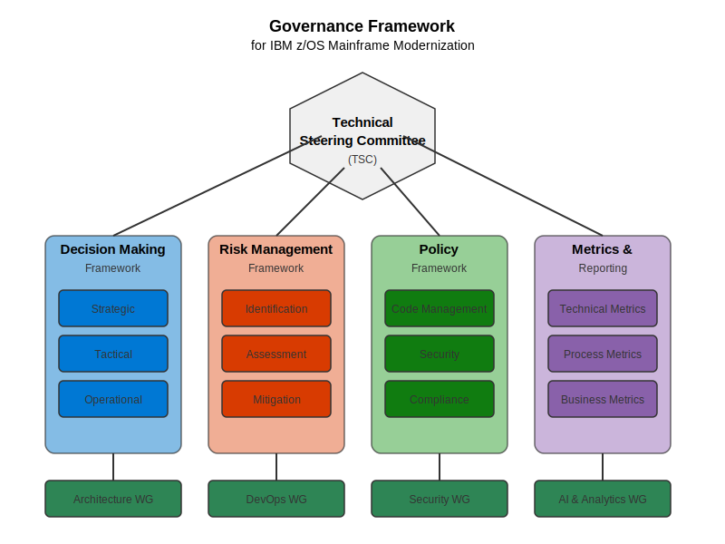

# Governance Framework

This document outlines the technical governance framework for IBM z/OS mainframe modernization initiatives using Azure AI Foundry.



## Governance Overview

The governance framework establishes the structure, processes, and controls needed to manage the mainframe modernization journey efficiently. It defines the decision-making processes, roles and responsibilities, risk management approaches, and compliance considerations specific to Azure AI Foundry implementation.


## Governance Structure

### Technical Steering Committee

The Technical Steering Committee (TSC) provides overall technical governance:

| Role | Responsibility |
|------|----------------|
| Enterprise Architect | Ensures architectural standards and alignment with enterprise strategy |
| Mainframe Technical Lead | Represents mainframe technical considerations and constraints |
| Cloud Platform Architect | Ensures cloud platform compatibility and integration |
| DevOps Lead | Oversees CI/CD and automation processes |
| Security Lead | Ensures security and compliance requirements are met |
| Business Domain Expert | Represents business priorities and requirements |

The TSC meets bi-weekly to:
- Review modernization progress against technical milestones
- Address technical blocking issues and risks
- Approve architectural decisions and changes
- Resolve cross-team dependencies and conflicts

### Technical Working Groups

Specialized working groups focus on specific aspects of the modernization:

1. **Architecture Working Group**
   - Platform architecture decisions
   - Integration patterns and standards
   - Technical debt management
   - Performance and scalability standards

2. **DevOps Working Group**
   - CI/CD pipeline implementation
   - Automation standards and practices
   - Environment management
   - Deployment strategies

3. **Security Working Group**
   - Security architecture and controls
   - Compliance validation
   - Access management
   - Data protection standards

4. **AI and Analytics Working Group**
   - AI implementation standards
   - Analytics framework and practices
   - Knowledge extraction methodologies
   - ML model management

## Decision-Making Framework

The governance framework implements a structured decision-making process:

```
┌────────────────┐     ┌─────────────────┐     ┌──────────────────┐
│ Decision       │────▶│ Impact          │────▶│ Decision         │
│ Request        │     │ Analysis        │     │ Approval         │
└────────────────┘     └─────────────────┘     └──────────────────┘
        │                                               │
        ▼                                               ▼
┌────────────────┐     ┌─────────────────┐     ┌──────────────────┐
│   Options      │────▶│ Implementation  │────▶│   Validation     │
│   Evaluation   │     │  Planning       │     │    & Review      │
└────────────────┘     └─────────────────┘     └──────────────────┘
```

### Decision Levels

Decisions are categorized into three levels:

| Decision Level | Description | Approval Authority | Examples |
|----------------|-------------|-------------------|----------|
| Strategic | Affects overall modernization approach | TSC | Platform selection, modernization approach |
| Tactical | Affects specific implementation areas | Working Group + TSC review | Tool selection, integration patterns |
| Operational | Day-to-day implementation decisions | Implementation Team | Specific implementation techniques |

### Decision Documentation

All significant decisions are documented using the Architecture Decision Record (ADR) format:

```markdown
# Architecture Decision Record: [Title]

## Status
[Proposed | Approved | Deprecated | Superseded]

## Context
[Technical context and problem statement]

## Decision
[Decision description and justification]

## Consequences
[Positive and negative consequences of this decision]

## Alternatives Considered
[Alternative options evaluated]

## Related Decisions
[References to related decisions]

## References
[Reference materials]
```

## Risk Management Framework

The governance framework includes a comprehensive risk management process:

### Risk Categories

| Risk Category | Description | Examples |
|--------------|-------------|----------|
| Technical | Risks related to technology implementation | Integration failures, performance issues |
| Process | Risks related to process changes | Deployment disruptions, testing inadequacies |
| People | Risks related to skills and organization | Knowledge gaps, resistance to change |
| Security | Risks related to security and compliance | Data protection issues, compliance gaps |
| Business | Risks related to business impact | Service disruptions, functionality gaps |

### Risk Assessment Process

1. **Risk Identification**
   - Regular risk assessment workshops
   - Automated risk detection through AI Foundry
   - Risk registry maintenance

2. **Risk Analysis**
   - Impact and probability assessment
   - Risk scoring and prioritization
   - Dependency analysis

3. **Risk Mitigation**
   - Mitigation strategy development
   - Implementation planning
   - Residual risk acceptance

4. **Risk Monitoring**
   - Regular review of risk status
   - Trigger-based reassessment
   - Risk trend analysis

## Policy Framework

The governance framework establishes these core policies:

### Code Management Policies

- Source control management standards
- Branching and merging strategies
- Code review requirements
- Quality gate criteria

### Deployment Policies

- Deployment approval process
- Environment promotion criteria
- Rollback procedures
- Production deployment windows

### Security Policies

- Security testing requirements
- Credential management
- Access control standards
- Data protection requirements

### Compliance Policies

- Audit logging requirements
- Regulatory compliance validation
- Documentation standards
- Evidence collection and retention

## Metrics and Reporting

The governance framework defines key metrics to track modernization progress:

### Technical Metrics

| Metric | Description | Target |
|--------|-------------|--------|
| Code Coverage | Percentage of code covered by automated tests | >80% |
| Deployment Frequency | Number of successful deployments per week | >3 |
| Mean Time to Recovery | Average time to recover from failures | <30 minutes |
| Technical Debt Ratio | Ratio of technical debt to total effort | <15% |

### Process Metrics

| Metric | Description | Target |
|--------|-------------|--------|
| Cycle Time | Time from code commit to production deployment | <1 day |
| First-time Success Rate | Percentage of deployments successful on first attempt | >90% |
| Automated Test Success Rate | Percentage of automated tests passing | >95% |
| Issue Resolution Time | Average time to resolve production issues | <4 hours |

### Reporting Cadence

| Report | Audience | Frequency | Content |
|--------|----------|-----------|---------|
| Technical Status | Implementation Teams | Weekly | Technical progress, issues, metrics |
| Governance Status | TSC | Bi-weekly | Decision status, risk status, policy compliance |
| Executive Summary | Executive Sponsors | Monthly | High-level progress, key achievements, risks |

## Implementation Steps

To implement the governance framework:

1. **Establish Governance Structure**
   ```bash
   # Create Governance Repository
   az devops repo create --name mainframe-modernization-governance --org https://dev.azure.com/contoso
   
   # Set Up Decision Registry
   az devops wiki create --name decision-registry --org https://dev.azure.com/contoso
   
   # Configure Risk Registry
   az devops work create-process --name mainframe-modernization --parent Agile --org https://dev.azure.com/contoso
   ```

2. **Implement Decision Process**
   ```bash
   # Create Decision Request Template
   az boards work-item create --title "Decision Request Template" --type "Template" --org https://dev.azure.com/contoso
   
   # Configure Approval Workflow
   az pipelines create --name decision-approval-workflow --org https://dev.azure.com/contoso
   ```

3. **Set Up Risk Management**
   ```bash
   # Create Risk Registry
   az boards work-item create --title "Risk Registry" --type "Registry" --org https://dev.azure.com/contoso
   
   # Configure Risk Dashboard
   az boards dashboard create --name risk-dashboard --org https://dev.azure.com/contoso
   ```

4. **Implement Metrics Collection**
   ```bash
   # Configure Azure Monitor
   az monitor metrics alert create --name mainframe-modernization-metrics --org https://dev.azure.com/contoso
   
   # Set Up Reporting Dashboards
   az boards dashboard create --name governance-dashboard --org https://dev.azure.com/contoso
   ```

## Next Steps

After establishing the governance framework:
- Review [Modernization Strategy](modernization-strategy.md) to align with governance
- Proceed to [Reference Architecture](reference-architecture.md) implementation
- Develop your [Team Organization](team-organization.md) model
- Begin implementing the [Development Environment](../04-development-environment/README.md) 