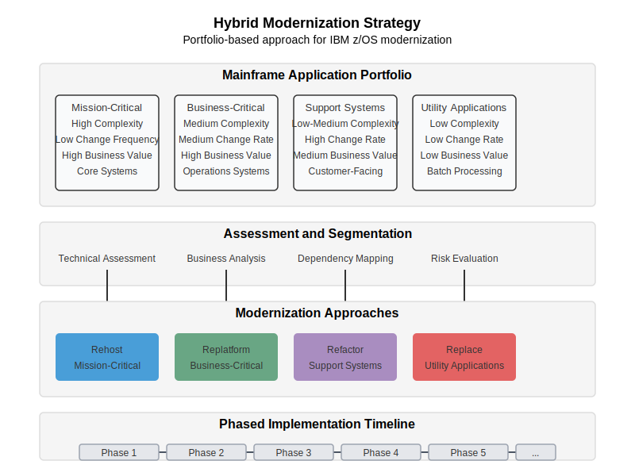

# Hybrid Strategy Portfolio Approach

This document outlines the hybrid strategy portfolio approach for mainframe modernization, which allows organizations to apply different modernization strategies to different applications based on their business value and technical complexity.

## Overview

The hybrid strategy portfolio approach recognizes that not all mainframe applications are the same. Some are high-value business-critical applications, while others might be supporting systems or legacy reporting tools. Similarly, some applications have low technical complexity, while others are highly complex with numerous interdependencies.

Azure AI Foundry helps determine the optimal modernization strategy for each application in your portfolio based on:

- **Business value**: Criticality, strategic importance, and potential future business impact
- **Technical complexity**: Code complexity, interdependencies, size, and maintainability
- **Risk profile**: Operational risk, business risk, and implementation risk
- **Modernization cost**: Estimated effort, time, and resources required

## Portfolio Matrix

The hybrid strategy portfolio matrix divides applications across two dimensions:
1. **Business value** (low to high)
2. **Technical complexity** (low to high)

These dimensions create four quadrants that suggest different modernization approaches:

### High Business Value, Low-Medium Complexity
- **Recommended approach**: Rehost or Refactor
- **Example applications**: Core banking, payment processing
- **Rationale**: These applications deliver significant business value but are relatively straightforward to modernize. Rehosting (lift and shift) or refactoring provides quick modernization with minimal risk.

### High Business Value, High Complexity
- **Recommended approach**: Rearchitect
- **Example applications**: Customer portals, integrated service platforms
- **Rationale**: These applications are business-critical with complex architectures. Rearchitecting allows for significant modernization while carefully managing complexity and risk.

### Low-Medium Business Value, Low-Medium Complexity
- **Recommended approach**: Refactor
- **Example applications**: Account management, loan processing
- **Rationale**: These applications provide moderate business value and have manageable complexity. Refactoring allows for modernization with reasonable effort.

### Low Business Value, High Complexity
- **Recommended approach**: Replace or Retire
- **Example applications**: Legacy reports, internal tools
- **Rationale**: These applications provide minimal business value but would require significant effort to modernize. Replacing with COTS solutions or retiring them may be more efficient.

## Azure AI Foundry Integration

Azure AI Foundry supports the hybrid strategy portfolio approach by providing:

- **Code Analysis**: Automated assessment of application complexity and technical debt
- **Business Rule Extraction**: Identification of business functionality and value
- **Transformation Services**: Tailored modernization approaches for each application
- **DevOps Integration**: Streamlined implementation regardless of chosen strategy

## Implementation Approach

1. **Discovery and Assessment**: 
   - Inventory all mainframe applications
   - Evaluate business value through stakeholder interviews
   - Assess technical complexity through AI-powered code analysis
   - Plot applications on the portfolio matrix

2. **Strategy Selection**:
   - For each application, determine the appropriate modernization approach
   - Create application-specific modernization roadmaps
   - Establish integration plans for cross-application dependencies

3. **Implementation Planning**:
   - Sequence modernization efforts for optimal business impact
   - Group similar applications for efficiency
   - Plan for hybrid operations during transition

4. **Execution and Feedback**:
   - Begin implementation with pilot applications
   - Incorporate lessons learned into subsequent phases
   - Continuously reassess approach as applications evolve

## Benefits of the Hybrid Strategy

- **Optimized investment**: Concentrates resources on high-value applications
- **Risk management**: Tailors approach based on complexity and value
- **Faster time to value**: Delivers business benefits through phased implementation
- **Flexibility**: Adapts to changing business and technology requirements
- **Comprehensive coverage**: Addresses the entire application portfolio

## Key Success Factors

- Executive sponsorship and clear governance
- Accurate assessment of business value and technical complexity
- Effective communication and stakeholder alignment
- Skilled teams with appropriate expertise for each approach
- Robust integration architecture for hybrid environments

## Next Steps

- Conduct an initial application portfolio assessment
- Align stakeholders on value criteria and assessment methodology
- Develop a decision framework for modernization approach selection
- Create a phased implementation roadmap 