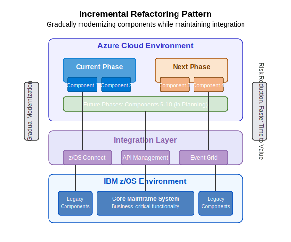

# Mainframe Modernization Patterns

This section provides detailed documentation on proven patterns for mainframe modernization using Azure AI Foundry. Each pattern addresses specific modernization scenarios and can be combined as part of your overall modernization strategy.

## Available Patterns

### [API-Enabled Pattern](api-enabled-pattern.md)

The API-Enabled Pattern exposes mainframe functionality through modern APIs, creating a bridge between legacy systems and modern applications.

### [Hybrid Data Pattern](hybrid-data-pattern.md)

The Hybrid Data Pattern replicates mainframe data to cloud platforms for modern processing while maintaining the mainframe as the system of record.

### [Incremental Refactoring Pattern](incremental-refactoring-pattern.md)

The Incremental Refactoring Pattern enables gradual modernization of application components while maintaining integration with the core mainframe system.

### [Containerized Rehosting Pattern](containerized-rehosting-pattern.md)

The Containerized Rehosting Pattern runs mainframe applications in cloud containers with minimal code changes, providing cloud benefits while preserving existing application logic.

## Pattern Selection Guide

When selecting patterns for your modernization initiative, consider these factors:

- **Business objectives**: Cost reduction, agility, innovation
- **Risk tolerance**: Minimal disruption vs. transformational change
- **Timeline**: Immediate benefits vs. long-term modernization
- **Technical complexity**: Application size, interdependencies, complexity
- **Skills availability**: Mainframe and cloud expertise

Many organizations benefit from applying multiple patterns to different applications or even different components of the same application based on their specific characteristics.

## Implementing Patterns with Azure AI Foundry

Azure AI Foundry enhances pattern implementation through:

- **Intelligent Assessment**: Analyzing which patterns are most suitable
- **Automated Implementation**: Accelerating implementation of each pattern
- **Risk Management**: Identifying and mitigating risks during implementation
- **Knowledge Generation**: Creating documentation and implementation guides
- **Optimization Recommendations**: Improving implementation quality and performance

## Related Resources

- [Modernization Strategy](../modernization-strategy.md)
- [Hybrid Strategy Portfolio Approach](../hybrid-strategy.md)
- [Reference Architecture](../reference-architecture.md) 