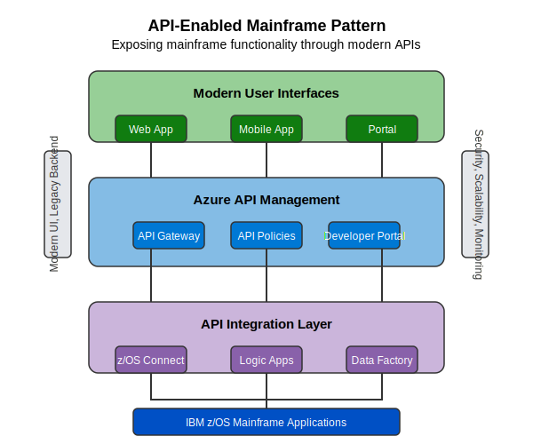

# API-Enabled Mainframe Pattern

This pattern enables organizations to expose mainframe functionality through modern APIs, creating a bridge between legacy systems and modern applications.

## Overview

The API-Enabled Mainframe Pattern creates a layered architecture that allows mainframe applications and data to be accessed through modern API interfaces. This approach preserves the existing mainframe investment while enabling new digital experiences and integration capabilities.

## Key Components

### Modern User Interfaces
- **Web Applications**: Browser-based experiences that consume mainframe functionality
- **Mobile Applications**: iOS and Android apps that integrate with mainframe systems
- **Portals**: Unified user experiences that consolidate multiple mainframe functions

### Azure API Management
- **API Gateway**: Centralized point of entry for all API requests
- **API Policies**: Security, throttling, caching, and transformation rules
- **Developer Portal**: Self-service documentation and API exploration

### API Integration Layer
- **z/OS Connect**: IBM technology that exposes mainframe assets as RESTful APIs
- **Logic Apps**: Microsoft workflow service for orchestrating complex integrations
- **Data Factory**: Data integration service for ETL processes from mainframe data sources

### IBM z/OS Mainframe Applications
- Existing COBOL, PL/I, Assembler, and other legacy applications
- Core business logic and transaction processing
- System of record databases and files

## Implementation Steps

1. **Assessment and Planning**
   - Identify suitable mainframe functionality for API exposure
   - Define API contracts and standards
   - Establish security and governance requirements

2. **Mainframe Preparation**
   - Install and configure z/OS Connect EE or equivalent
   - Create service interfaces for targeted mainframe programs
   - Implement necessary data transformations

3. **Azure API Management Setup**
   - Provision API Management instance
   - Configure environments (dev, test, prod)
   - Implement security policies (OAuth, API keys)

4. **API Development**
   - Design RESTful API interfaces
   - Implement request/response transformation
   - Add caching and performance optimization

5. **Modern UI Development**
   - Create responsive web applications
   - Develop mobile applications
   - Implement unified portals

6. **Testing and Deployment**
   - Validate API functionality and performance
   - Test end-to-end scenarios
   - Deploy to production with proper monitoring

## Benefits

- **Modern UI, Legacy Backend**: Enables modern user experiences while preserving mainframe investments
- **Security**: Centralized authentication, authorization, and monitoring
- **Scalability**: API tier can scale independently from mainframe systems
- **Monitoring**: End-to-end visibility of API performance and usage
- **Agility**: New applications can be developed without mainframe changes
- **Controlled Exposure**: Granular control over which functionality is exposed

## Considerations

### Performance
- Latency considerations for real-time applications
- Caching strategies to reduce mainframe load
- Batch vs. real-time processing requirements

### Security
- Authentication and authorization across tiers
- Data protection and privacy requirements
- Audit and compliance capabilities

### Integration
- Error handling and recovery processes
- State management between frontend and backend
- Data consistency and transaction boundaries

## Azure AI Foundry Support

Azure AI Foundry assists implementation of this pattern by:

- **API Identification**: Analyzing mainframe code to identify suitable API candidates
- **Interface Generation**: Generating OpenAPI specifications based on mainframe programs
- **Risk Assessment**: Evaluating security and performance implications of API exposure
- **Test Data Generation**: Creating realistic test data for API validation
- **Documentation**: Producing comprehensive API documentation

## Real-World Example

A large financial institution had critical loan processing functionality in their mainframe systems but needed to provide a modern customer experience. They implemented the API-Enabled Pattern to:

1. Expose loan application processing as REST APIs
2. Create a responsive web portal for customer self-service
3. Build an internal mobile app for loan officers
4. Integrate with third-party credit verification services

The solution preserved their mainframe investment while enabling new digital channels, resulting in 40% faster loan processing and improved customer satisfaction.

## When to Use This Pattern

This pattern is ideal when:

- Core business functionality must remain on the mainframe
- New digital channels or experiences are needed
- Integration with external systems is required
- A phased modernization approach is preferred
- Immediate business value needs to be demonstrated

## When to Consider Alternatives

Alternative patterns may be more suitable when:

- Mainframe systems are nearing end-of-life
- Complete application rewrite is feasible and desirable
- Performance requirements cannot be met with an API layer
- Real-time access to mainframe data is not required

## Implementation Resources

- [z/OS Connect EE Documentation](https://www.ibm.com/docs/en/zosconnect/zosconnect/3.0)
- [Azure API Management Documentation](https://docs.microsoft.com/en-us/azure/api-management/)
- [OpenAPI Specification](https://swagger.io/specification/)
- [API Security Best Practices](https://azure.microsoft.com/en-us/blog/api-management-security-best-practices/) 