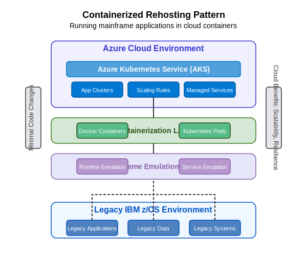

# Containerized Rehosting Pattern

This pattern enables organizations to run mainframe applications in cloud containers with minimal code changes, providing cloud benefits while preserving existing application logic.

## Overview

The Containerized Rehosting Pattern leverages mainframe emulation technology deployed in containers to migrate mainframe applications to the cloud with minimal modifications. This approach provides the benefits of cloud infrastructure (scalability, resilience, cost optimization) while preserving the original application logic and behavior.

## Key Components

### Legacy IBM z/OS Environment
- **Legacy Applications**: COBOL, PL/I, and other mainframe applications
- **Legacy Data**: DB2, VSAM, IMS, and other data stores
- **Legacy Systems**: CICS, IMS TM, Batch systems

### Mainframe Emulation Layer
- **Runtime Emulation**: Emulation of mainframe runtime environments (CICS, IMS, JES)
- **Service Emulation**: Emulation of mainframe services (VSAM, database access)

### Containerization Layer
- **Docker Containers**: Packaged applications with dependencies
- **Kubernetes Pods**: Orchestrated containers with scaling and resilience

### Azure Cloud Environment
- **Azure Kubernetes Service (AKS)**: Managed Kubernetes orchestration
- **App Clusters**: Application groupings for logical separation
- **Scaling Rules**: Auto-scaling configurations for demand management
- **Managed Services**: Azure services for monitoring, logging, and security

## Implementation Steps

1. **Assessment and Planning**
   - Inventory mainframe applications and components
   - Identify dependencies and integration points
   - Select appropriate emulation technology
   - Define container architecture and orchestration approach

2. **Environment Setup**
   - Provision Azure Kubernetes Service (AKS)
   - Configure networking, security, and access controls
   - Establish monitoring and logging infrastructure
   - Set up CI/CD pipelines for containerized deployments

3. **Emulation Layer Configuration**
   - Install and configure mainframe emulation software
   - Set up emulated services matching mainframe environment
   - Configure data access and persistence
   - Test environment for compatibility

4. **Application Migration**
   - Prepare application source code for containerization
   - Resolve any compatibility issues
   - Create container images with applications
   - Set up appropriate volume mappings for state management

5. **Data Migration**
   - Extract data from mainframe systems
   - Transform data for target environment if necessary
   - Load data into containerized data stores
   - Validate data integrity and consistency

6. **Integration and Testing**
   - Establish connections to external systems
   - Verify end-to-end functionality
   - Perform performance testing and tuning
   - Validate business processes across the containerized environment

7. **Deployment and Cutover**
   - Deploy containers to production environment
   - Implement high availability and disaster recovery
   - Perform cutover from mainframe to containerized environment
   - Monitor system health and performance

## Benefits

- **Minimal Code Changes**: Preserves application logic with few or no code modifications
- **Cloud Benefits**: Gains scalability, resilience, and cost optimization of cloud infrastructure
- **Simplified Operations**: Reduces hardware management and physical infrastructure
- **Platform Independence**: Runs on any cloud or on-premises environment supporting containers
- **DevOps Enablement**: Integrates with modern CI/CD and automation practices
- **Cost Optimization**: Reduces or eliminates mainframe MIPS costs

## Considerations

### Performance
- Emulation overhead impacts compared to native performance
- Container sizing and resource allocation
- Network latency for external integrations
- Data access patterns and optimization

### Security
- Container security and image scanning
- Network security between containers
- Access control and authentication
- Data protection and encryption

### Operations
- Monitoring and logging strategies
- Container orchestration management
- State management and persistence
- Disaster recovery and high availability

## Azure AI Foundry Support

Azure AI Foundry enhances implementation of this pattern by:

- **Environment Analysis**: Assessing mainframe environment settings for emulation
- **Compatibility Checking**: Identifying potential compatibility issues
- **Configuration Generation**: Creating container configurations for optimal performance
- **Test Scenario Generation**: Developing test cases for validation
- **Performance Optimization**: Recommendations for tuning containerized applications

## When to Use This Pattern

This pattern is ideal when:

- Rapid migration from mainframe is required
- Code modification risk needs to be minimized
- Applications are relatively stable with few planned enhancements
- Operational cost reduction is a primary driver
- The mainframe skills shortage is impacting operations
- A transitional approach is preferred before deeper modernization

## When to Consider Alternatives

Alternative patterns may be more suitable when:

- Applications require significant enhancement or redesign
- Long-term strategy calls for complete application modernization
- Performance requirements exceed what emulation can provide
- Integration with modern systems is extensive and complex

## Implementation Resources

- [Azure Kubernetes Service Documentation](https://docs.microsoft.com/en-us/azure/aks/)
- [Container Security Best Practices](https://docs.microsoft.com/en-us/azure/container-security/)
- [Mainframe Emulation Options](https://azure.microsoft.com/en-us/solutions/mainframe-rehosting/)
- [Azure Monitor for Containers](https://docs.microsoft.com/en-us/azure/azure-monitor/containers/) 