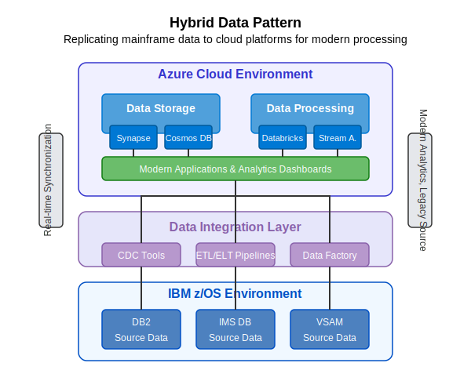

# Hybrid Data Pattern

This pattern enables organizations to replicate mainframe data to cloud platforms for modern processing while maintaining the mainframe as the system of record.

## Overview

The Hybrid Data Pattern establishes a data synchronization framework between mainframe data sources and cloud data platforms. This approach allows organizations to leverage modern analytics, reporting, and processing capabilities in the cloud while preserving the mainframe as the authoritative system of record.

## Key Components

### IBM z/OS Environment
- **DB2 Source Data**: Relational database data from mainframe DB2 systems
- **IMS DB Source Data**: Hierarchical database data from IMS systems
- **VSAM Source Data**: File-based data from VSAM datasets

### Data Integration Layer
- **Change Data Capture (CDC) Tools**: Track and capture data changes in real-time
- **ETL/ELT Pipelines**: Extract, transform, and load data between platforms
- **Azure Data Factory**: Orchestrate and automate data movement and transformation

### Azure Cloud Environment
- **Data Storage**
  - **Azure Synapse**: Enterprise data warehouse for large-scale analytics
  - **Cosmos DB**: NoSQL database for globally distributed applications
- **Data Processing**
  - **Databricks**: Apache Spark-based analytics platform
  - **Stream Analytics**: Real-time stream processing service

### Modern Applications
- Web applications, dashboards, and analytics tools that consume cloud-hosted data
- Modern reporting and visualization tools
- Machine learning and AI applications

## Implementation Steps

1. **Assessment and Planning**
   - Identify mainframe data sources for synchronization
   - Define data mapping and transformation requirements
   - Establish data synchronization frequency requirements
   - Address data governance and compliance considerations

2. **Mainframe Preparation**
   - Configure database logging for change data capture
   - Create appropriate access methods and permissions
   - Optimize database configurations for extraction operations

3. **Integration Layer Setup**
   - Install and configure CDC tools (IBM InfoSphere CDC, Precisely, etc.)
   - Develop ETL/ELT processes for initial data load
   - Configure real-time or batch synchronization processes

4. **Cloud Environment Setup**
   - Provision appropriate Azure data services
   - Create target data schema and structures
   - Implement data quality and validation rules
   - Configure monitoring and alerting

5. **Data Synchronization Implementation**
   - Execute initial load of historical data
   - Establish ongoing synchronization (real-time or scheduled)
   - Implement error handling and recovery processes

6. **Modern Application Development**
   - Create data access layers for cloud data sources
   - Develop reporting and analytics capabilities
   - Implement data visualization dashboards

## Benefits

- **Real-time Synchronization**: Near real-time data availability in modern platforms
- **Modern Analytics**: Advanced analytics capabilities without modifying mainframe systems
- **Reduced Mainframe Workload**: Offloading queries and reporting from mainframe
- **Cost Efficiency**: Lower MIPS usage and reduced mainframe operational costs
- **Data Democratization**: Broader access to organizational data
- **Innovation Enablement**: Foundation for AI, ML, and advanced analytics

## Considerations

### Performance
- Impact of data extraction on mainframe performance
- Network bandwidth for data transmission
- Real-time vs. batch synchronization trade-offs

### Data Governance
- Data lineage and traceability
- Master data management
- Privacy and compliance requirements
- Data ownership and stewardship

### Operations
- Synchronization monitoring and alerting
- Error handling and recovery procedures
- Disaster recovery and business continuity

## Azure AI Foundry Support

Azure AI Foundry enhances implementation of this pattern by:

- **Data Mapping**: Automated mapping between mainframe and cloud data structures
- **Schema Analysis**: Deep understanding of complex mainframe data schemas
- **Compliance Checking**: Identifying sensitive data requiring special handling
- **Optimization Recommendations**: Suggestions for improving data synchronization efficiency
- **Schema Evolution**: Managing data model changes over time

## Real-World Example

A global insurance company maintained their policy and claims data in mainframe DB2 and VSAM files but needed modern analytics capabilities. They implemented the Hybrid Data Pattern to:

1. Replicate policy and claims data to Azure Synapse in near real-time
2. Create a 360-degree customer view by joining mainframe data with CRM data
3. Develop predictive claims analytics using Azure Databricks
4. Build executive dashboards with Power BI connecting to cloud data

The solution delivered new analytical capabilities while maintaining the mainframe as the system of record, resulting in 60% faster reporting and $2M annual savings in mainframe costs.

## When to Use This Pattern

This pattern is ideal when:

- Mainframe data is valuable for analytics and reporting
- Mainframe resources are constrained or expensive
- Modern data processing capabilities are required
- Integration with other data sources is needed
- Real-time data access is important
- Legacy systems must remain the system of record

## When to Consider Alternatives

Alternative patterns may be more suitable when:

- Data volumes are extremely small or static
- Mainframe data structures are changing rapidly
- Real-time synchronization is not technically feasible
- Complete mainframe decommissioning is imminent

## Implementation Resources

- [Azure Synapse Analytics](https://docs.microsoft.com/en-us/azure/synapse-analytics/)
- [Azure Data Factory Documentation](https://docs.microsoft.com/en-us/azure/data-factory/)
- [IBM InfoSphere CDC](https://www.ibm.com/products/infosphere-data-replication)
- [Precisely Data Integration](https://www.precisely.com/product/precisely-connect/connect) 