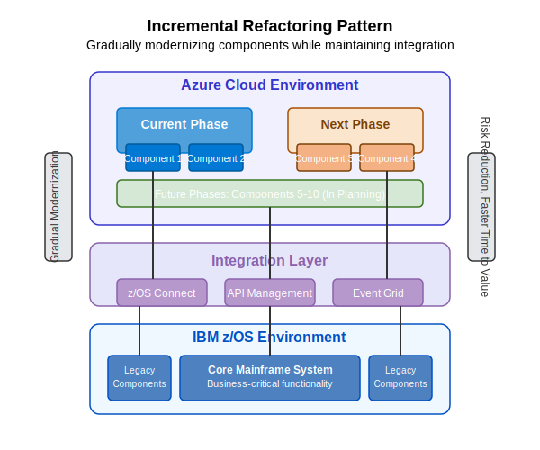

# 🧩 Incremental Refactoring Pattern

This pattern enables organizations to gradually modernize application components while maintaining integration with the core mainframe system.

## Overview

The Incremental Refactoring Pattern allows for phased modernization of mainframe applications by systematically replacing individual components with modern equivalents. This approach minimizes risk by limiting the scope of each modernization effort while ensuring continuous business operations. The pattern creates a managed hybrid environment where modernized components coexist and interact with legacy components.

## Key Components

### IBM z/OS Environment
- **Core Mainframe System**: Business-critical functionality that remains on the mainframe
- **Legacy Components**: Components identified for future modernization phases

### Integration Layer
- **z/OS Connect**: Provides RESTful API access to mainframe programs
- **API Management**: Central control point for API governance and security
- **Event Grid**: Event routing service for pub/sub messaging between components

### Azure Cloud Environment
- **Current Phase Components**: Recently modernized components in current deployment
- **Next Phase Components**: Components planned for upcoming modernization efforts
- **Future Phases**: Components identified for later modernization work

## Implementation Steps

1. **Application Analysis and Component Mapping**
   - Decompose the application into distinct functional components
   - Identify dependencies between components
   - Assess business value and technical complexity of each component
   - Create a prioritized modernization roadmap

2. **Integration Framework Development**
   - Establish API contracts and standards
   - Implement common data models
   - Create integration architecture with fault tolerance
   - Deploy monitoring and observability solutions

3. **Phased Modernization Execution**
   - Select initial component(s) for modernization
   - Create modern implementation in Azure
   - Establish connections to remaining mainframe components
   - Test thoroughly in integration environment

4. **Deployment and Verification**
   - Deploy modernized components to production
   - Monitor performance and behavior
   - Validate business outcomes
   - Gather feedback for next phase

5. **Iterative Progression**
   - Apply lessons learned to subsequent phases
   - Continuously refine integration architecture
   - Validate component health across hybrid environment
   - Maintain overall system integrity

## Benefits

- **Gradual Modernization**: Reduces risk through incremental approach
- **Risk Reduction**: Limits scope of each modernization effort
- **Faster Time to Value**: Delivers benefits as each component is modernized
- **Business Continuity**: Maintains core functionality throughout modernization
- **Operational Flexibility**: Allows for adjustments as business needs evolve
- **Knowledge Transfer**: Facilitates gradual learning and capability building

## Considerations

### Technical Considerations
- API design for backward compatibility
- Synchronous vs. asynchronous communication patterns
- Data consistency across hybrid components
- Performance monitoring across environments
- Error handling and recovery procedures

### Organizational Considerations
- Component prioritization strategy
- Team structure and responsibilities
- Knowledge sharing between legacy and modern teams
- Governance processes for hybrid environment
- Operational support model during transition

### Planning Considerations
- Dependency management between components
- Modernization sequence optimization
- Release planning and coordination
- Testing strategy for hybrid environments
- Rollback procedures if issues arise

## Azure AI Foundry Support

Azure AI Foundry enhances the implementation of this pattern by:

- **Component Analysis**: Identifying logical boundaries for componentization
- **Dependency Mapping**: Discovering hidden dependencies between components
- **Code Conversion**: Automating transformation of legacy code to modern languages
- **Interface Generation**: Creating API specifications for component interactions
- **Test Case Generation**: Developing comprehensive test cases for validation
- **Risk Assessment**: Evaluating technical risks of each component modernization

## When to Use This Pattern

This pattern is ideal when:

- Complete system replacement is too risky or costly
- Business continuity is critical during modernization
- Applications can be logically decomposed into components
- Modernization funding is allocated incrementally
- Different components have varying modernization priorities
- Technical teams need time to build modern development skills

## When to Consider Alternatives

Alternative patterns may be more suitable when:

- The application is small and simple enough for complete replacement
- Components have extremely tight coupling that prevents separation
- The mainframe environment will be decommissioned on a fixed timeline
- The business case supports a complete rewrite approach

## Implementation Resources

- [Azure API Management Documentation](https://docs.microsoft.com/en-us/azure/api-management/)
- [Azure Event Grid Documentation](https://docs.microsoft.com/en-us/azure/event-grid/)
- [Microservices Architecture Guide](https://docs.microsoft.com/en-us/azure/architecture/microservices/)
- [API Design Best Practices](https://docs.microsoft.com/en-us/azure/architecture/best-practices/api-design) 