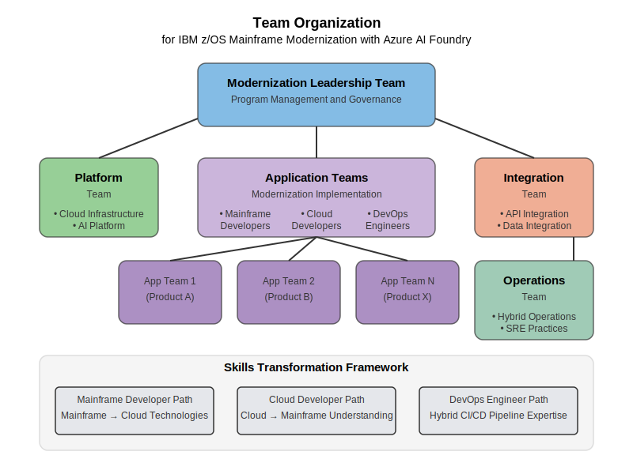

# Team Organization

This document outlines the recommended team organization and structure for implementing IBM z/OS mainframe modernization using Azure AI Foundry.

## Organizational Principles

Effective mainframe modernization requires a carefully designed team structure that balances mainframe expertise with cloud and modern development skills. The team organization should follow these principles:

1. **Cross-functional teams** - Combine mainframe and cloud skills in integrated teams
2. **Product-oriented structure** - Organize around business capabilities, not technologies
3. **DevOps culture** - Embed DevOps practices across all teams
4. **Skills transformation** - Continuously develop team capabilities
5. **Clear ownership** - Establish clear responsibilities and accountabilities

## Team Structure Overview



The recommended team structure includes:

```
┌──────────────────────────────────────────────────────────────┐
│                 Modernization Leadership Team                 │
└──────────────────────────────┬───────────────────────────────┘
                               │
    ┌───────────────┬──────────┴───────────┬───────────────┐
    │               │                      │               │
    ▼               ▼                      ▼               ▼
┌────────────┐ ┌────────────┐       ┌────────────┐  ┌────────────┐
│Platform    │ │Application │       │Integration │  │Operations  │
│Team        │ │Teams       │       │Team        │  │Team        │
└────────────┘ └────────────┘       └────────────┘  └────────────┘
                     │
     ┌───────────────┼───────────────┐
     │               │               │
     ▼               ▼               ▼
┌────────────┐ ┌────────────┐ ┌────────────┐
│App Team 1  │ │App Team 2  │ │App Team N  │
│(Product A) │ │(Product B) │ │(Product X) │
└────────────┘ └────────────┘ └────────────┘
```

## Team Roles and Responsibilities

### Modernization Leadership Team

The leadership team provides overall governance and direction:

| Role | Responsibilities |
|------|-----------------|
| Modernization Program Manager | Overall program leadership and stakeholder management |
| Enterprise Architect | Technical architecture governance and strategic direction |
| Product Owner | Business priorities and requirements management |
| Mainframe Transformation Lead | Mainframe expertise and transformation guidance |
| Cloud Platform Lead | Cloud platform and technology guidance |
| DevOps Lead | DevOps practices and cultural transformation |

The leadership team meets weekly to:
- Review program progress and address blockers
- Make key architectural and strategic decisions
- Align resources and priorities
- Manage stakeholder expectations

### Platform Team

The platform team establishes and maintains the core modernization platform:

| Role | Responsibilities | Skills Required |
|------|-----------------|----------------|
| Cloud Platform Architect | Platform architecture and standards | Azure architecture, infrastructure as code |
| Cloud Infrastructure Engineer | Infrastructure implementation and optimization | Azure networking, security, IaC |
| DevOps Engineer | CI/CD pipeline development and support | GitHub/Azure DevOps, automation, scripting |
| Security Engineer | Security controls and compliance | Security architecture, compliance frameworks |
| AI Platform Engineer | AI Foundry platform implementation | AI/ML, data engineering, Azure OpenAI |

The platform team is responsible for:
- Establishing the Azure landing zone
- Implementing core platform services
- Creating reusable templates and patterns
- Ensuring security and compliance
- Providing tooling and automation

### Application Teams

Application teams focus on modernizing specific application portfolios:

| Role | Responsibilities | Skills Required |
|------|-----------------|----------------|
| Application Architect | Application-specific architecture | Mainframe + cloud architecture patterns |
| Mainframe Developer | Mainframe application expertise | COBOL, JCL, CICS, DB2, etc. |
| Cloud Developer | Modern application development | Java/.NET, containers, microservices |
| DevOps Engineer | CI/CD implementation for applications | GitHub/Azure DevOps, testing automation |
| QA Engineer | Testing strategy and quality assurance | Test automation, performance testing |
| Business Analyst | Business requirements and validation | Domain knowledge, requirements engineering |

Each application team is organized around a business capability or product area, with typical team size of 5-9 members.

### Integration Team

The integration team focuses on cross-platform integration:

| Role | Responsibilities | Skills Required |
|------|-----------------|----------------|
| Integration Architect | Integration patterns and architecture | API design, messaging, hybrid architecture |
| API Developer | API development and management | REST/SOAP APIs, Azure API Management |
| Mainframe Integration Specialist | Mainframe connectivity and protocols | z/OS Connect, MQ, CICS integration |
| Data Integration Engineer | Data movement and synchronization | ETL/ELT, Azure Data Factory, CDC tools |
| Identity Engineer | Identity and access integration | Azure AD, RACF/ACF2/TopSecret integration |

The integration team is responsible for:
- Designing and implementing integration patterns
- Establishing API standards and guidelines
- Setting up data synchronization mechanisms
- Enabling secure cross-platform identity management
- Creating reusable integration components

### Operations Team

The operations team ensures operational excellence across platforms:

| Role | Responsibilities | Skills Required |
|------|-----------------|----------------|
| Operations Architect | Operational model and processes | Hybrid operations, SRE practices |
| Mainframe Operations Specialist | Mainframe operational expertise | z/OS operations, batch scheduling |
| Cloud Operations Engineer | Cloud platform operations | Azure operations, monitoring, alerting |
| Site Reliability Engineer (SRE) | Reliability and performance | SRE practices, performance optimization |
| Automation Engineer | Operational automation | PowerShell, Azure Automation, scripting |

The operations team is responsible for:
- Establishing operational processes across platforms
- Implementing monitoring and alerting solutions
- Creating runbooks and playbooks
- Optimizing performance and reliability
- Automating operational tasks

## Skills Transformation

Mainframe modernization requires ongoing skills development. The recommended approach includes:

### Skills Assessment

Conduct a skills assessment to identify gaps:

```bash
# Create Skills Assessment Template
az boards work-item create --title "Skills Assessment Template" --type "Template" --org https://dev.azure.com/contoso

# Configure Skills Dashboard
az boards dashboard create --name skills-transformation --org https://dev.azure.com/contoso
```

### Learning Paths

Establish learning paths for different roles:

| Role | Learning Path |
|------|--------------|
| Mainframe Developer | Cloud fundamentals → Modern development practices → Specific cloud technologies |
| Cloud Developer | Mainframe concepts → Legacy code understanding → Integration patterns |
| Operations | Hybrid operations → Cloud monitoring → SRE practices |

### Training Approaches

Implement a multi-faceted training approach:

1. **Formal Training**
   - Azure certification paths
   - Mainframe technology courses
   - AI/ML fundamentals

2. **Hands-on Learning**
   - Modernization labs and workshops
   - Paired programming (mainframe + cloud)
   - Proof-of-concept projects

3. **Knowledge Transfer**
   - Documentation of mainframe systems
   - Technical brown bags and demos
   - Communities of practice

## Team Collaboration Model

Implement a collaboration model that enables cross-team cooperation:

### Agile Ceremonies

| Ceremony | Frequency | Participants | Purpose |
|----------|-----------|--------------|---------|
| Daily Stand-up | Daily | Team members | Status updates, blockers |
| Sprint Planning | Bi-weekly | Team + Product Owner | Plan upcoming work |
| Sprint Review | Bi-weekly | Team + Stakeholders | Demo completed work |
| Sprint Retrospective | Bi-weekly | Team | Process improvement |
| Backlog Refinement | Weekly | Team + Product Owner | Refine and prioritize work |

### Cross-Team Coordination

Implement these cross-team coordination mechanisms:

1. **Scrum of Scrums**
   - Representatives from each team
   - Twice-weekly cadence
   - Focus on dependencies and integration

2. **Communities of Practice**
   - DevOps community
   - Architecture community
   - Mainframe modernization community
   - Regular knowledge sharing sessions

3. **Technical Working Groups**
   - Time-bounded for specific technical challenges
   - Cross-team participation
   - Clear deliverables and timeframes

## Operational Model

As applications are modernized, the operational model evolves:

### Phase 1: Parallel Operations

During initial modernization:
- Maintain existing mainframe operations
- Establish cloud operations capabilities
- Implement coordination mechanisms between teams

### Phase 2: Hybrid Operations

As applications span platforms:
- Integrated monitoring across platforms
- Unified incident management process
- Cross-trained operations teams

### Phase 3: Transformed Operations

As modernization progresses:
- Cloud-first operational model
- SRE practices across all applications
- Highly automated operations

## Implementation Steps

To implement this team organization:

1. **Assess Current Organization**
   ```bash
   # Create Organization Assessment Template
   az boards work-item create --title "Organization Assessment" --type "Assessment" --org https://dev.azure.com/contoso
   
   # Analyze Skills Gaps
   az boards work-item create --title "Skills Gap Analysis" --type "Analysis" --org https://dev.azure.com/contoso
   ```

2. **Define Team Structure**
   ```bash
   # Create Team Structure Definition
   az boards work-item create --title "Team Structure Definition" --type "Epic" --org https://dev.azure.com/contoso
   
   # Define Core Teams
   az boards work-item create --title "Platform Team Definition" --type "Feature" --org https://dev.azure.com/contoso
   az boards work-item create --title "Application Teams Definition" --type "Feature" --org https://dev.azure.com/contoso
   ```

3. **Implement Skills Transformation**
   ```bash
   # Create Learning Paths
   az boards work-item create --title "Learning Paths Definition" --type "Epic" --org https://dev.azure.com/contoso
   
   # Define Training Programs
   az boards work-item create --title "Mainframe to Cloud Training" --type "Feature" --org https://dev.azure.com/contoso
   az boards work-item create --title "Cloud to Mainframe Training" --type "Feature" --org https://dev.azure.com/contoso
   ```

4. **Establish Collaboration Framework**
   ```bash
   # Create Collaboration Framework
   az boards work-item create --title "Collaboration Framework" --type "Epic" --org https://dev.azure.com/contoso
   
   # Define Ceremonies
   az boards work-item create --title "Agile Ceremonies Definition" --type "Feature" --org https://dev.azure.com/contoso
   az boards work-item create --title "Communities of Practice" --type "Feature" --org https://dev.azure.com/contoso
   ```

## Next Steps

After establishing your team organization:
- Align with your [Governance Framework](governance-framework.md)
- Implement your [Reference Architecture](reference-architecture.md)
- Begin setting up your [Development Environment](../04-development-environment/README.md) 