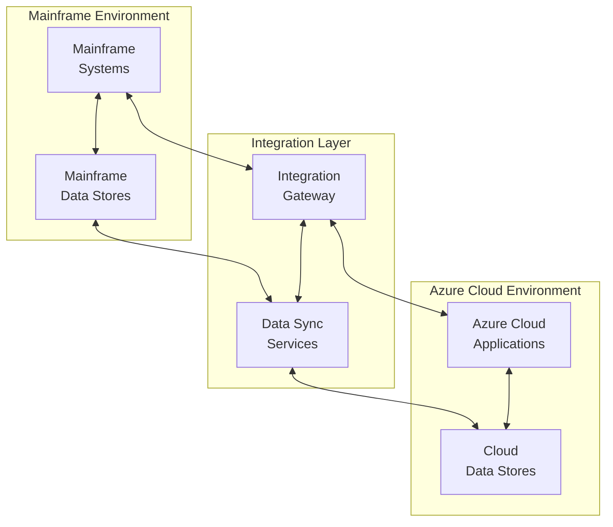
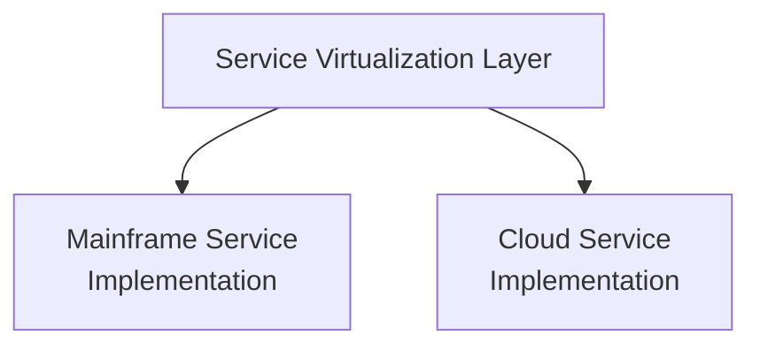
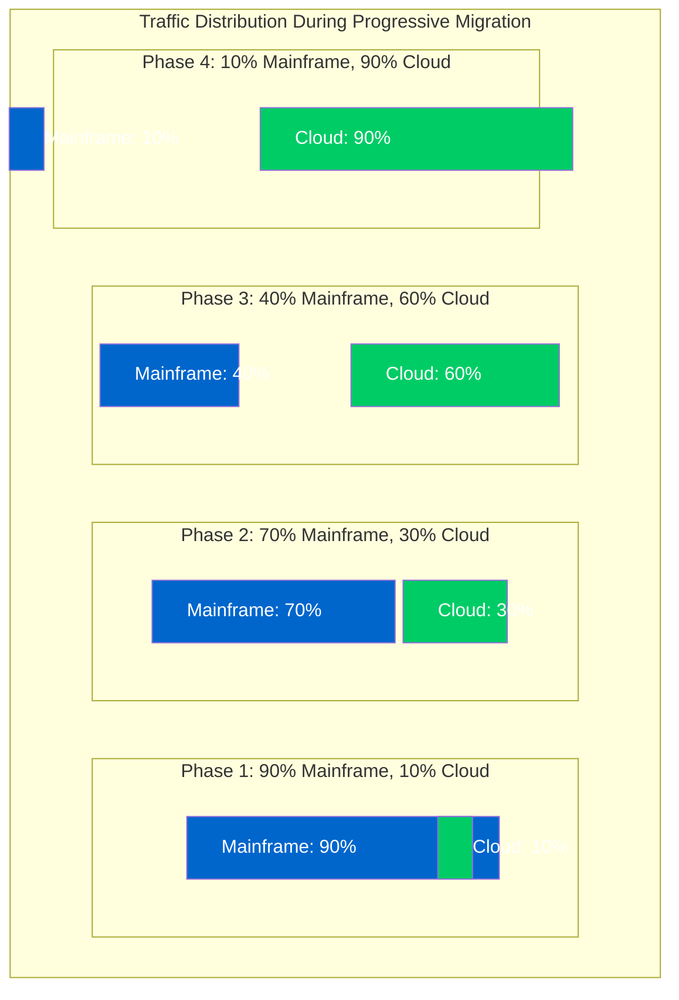

# 🔄 Hybrid Operations Management

This chapter provides technical guidance for implementing and managing hybrid operations during IBM z/OS mainframe modernization using Azure AI Foundry.

## 🌐 Overview

Hybrid operations refers to the concurrent management of both legacy mainframe systems and modernized cloud applications during the transition period of a modernization initiative. This approach enables organizations to gradually migrate workloads while maintaining business continuity, reducing risk, and validating modernized components in a production environment.

## 🎯 Objectives

| Objective | Description |
|-----------|-------------|
| Integration | Implement seamless integration between mainframe and cloud environments |
| Data Consistency | Ensure data consistency across systems during the transition period |
| Operational Procedures | Establish effective operational procedures for hybrid environments |
| Performance Management | Monitor and manage performance across platforms |
| Disaster Recovery | Implement robust disaster recovery and business continuity strategies |
| Decommissioning | Create a pathway for gradual decommissioning of mainframe components |

## 🏗️ Hybrid Architecture Patterns

### 1. Integration Gateway

**Description**: Centralized gateway that manages communication between mainframe and cloud systems

**Components**:

| Component | Description |
|-----------|-------------|
| API Gateway | Service exposure and management |
| Message Broker | Asynchronous communication |
| Data Transformation | Protocol conversion and format transformation |
| Security | Access control and security management |
| Monitoring | Logging and activity monitoring |

**Implementation Options**:
- Azure API Management with custom connectors
- Enterprise service bus with mainframe adapters
- Event Grid with mainframe integration

**Diagram**:



### 2. Service Virtualization

**Description**: Abstraction layer that presents consistent interfaces regardless of implementation

**Components**:

| Component | Description |
|-----------|-------------|
| Virtual Services | Service definitions and abstractions |
| Service Registry | Service discovery and registration |
| Routing | Request routing and orchestration |
| Version Management | API and service versioning |
| Contract Testing | Interface validation and testing |

**Implementation Options**:
- Azure App Configuration for feature flags
- Azure API Management for service virtualization
- Traffic Manager for request routing
- Custom service virtualization layer

**Diagram**:


### 3. Data Synchronization

**Description**: Mechanisms to maintain data consistency across environments

**Components**:

| Component | Description |
|-----------|-------------|
| Change Data Capture | Tracking data changes at source |
| Synchronization | Bidirectional data transfer |
| Conflict Resolution | Handling conflicting data changes |
| Data Validation | Quality assurance and validation |
| Monitoring | Synchronization status tracking |

**Implementation Options**:
- Azure Data Factory with mainframe connectors
- Custom ETL processes with mainframe integration
- Event-driven synchronization with Azure Event Hubs
- Database replication technologies

**Patterns**:
- **One-Way Sync**: Mainframe as source of truth with cloud as read-only
- **Bidirectional Sync**: Changes in either system propagate to the other
- **Master Data Management**: Central truth source with distribution
- **Event Sourcing**: Event-based state tracking and replay

### 4. Progressive Migration

**Description**: Phased approach to moving functionality from mainframe to cloud

**Components**:

| Component | Description |
|-----------|-------------|
| Feature Flags | Runtime toggles for functionality |
| Shadow Mode | Parallel execution for validation |
| A/B Testing | Comparative testing of implementations |
| Traffic Shifting | Gradual redirection of workloads |
| Fallback Procedures | Recovery mechanisms for issues |

**Implementation Options**:
- Azure App Configuration and Feature Management
- Traffic Manager for gradual traffic shifting
- Custom routing solutions
- Monitoring-driven automation

**Diagram**:


## 🛠️ Implementation Steps

### Step 1: Hybrid Architecture Design

1. **Assess Integration Requirements**:

   ```bash
   # Generate integration requirements report
   az ai-foundry analyze-integration \
     --mainframe-inventory ./mainframe-inventory.json \
     --modernization-plan ./modernization-plan.json \
     --output ./integration-requirements.json
   ```

2. **Define Data Synchronization Strategy**:

   ```json
   {
     "dataSyncStrategy": {
       "customerData": {
         "primarySource": "mainframe",
         "syncDirection": "bidirectional",
         "syncFrequency": "real-time",
         "conflictResolution": "latest-wins"
       },
       "transactionData": {
         "primarySource": "mainframe",
         "syncDirection": "mainframe-to-cloud",
         "syncFrequency": "near-real-time",
         "conflictResolution": "mainframe-wins"
       },
       "referenceData": {
         "primarySource": "cloud",
         "syncDirection": "cloud-to-mainframe",
         "syncFrequency": "scheduled",
         "conflictResolution": "manual-resolution"
       }
     }
   }
   ```

3. **Design Service Virtualization Layer**:

   ```yaml
   # Integration Gateway Configuration
   apiVersion: v1
   kind: ConfigMap
   metadata:
     name: integration-gateway-config
   data:
     config.yaml: |
       services:
         - name: customer-management
           virtualPath: /api/customers
           implementations:
             - type: mainframe
               priority: 100
               endpoint: ims://CUSTMGMT
               condition: "feature.useMainframe == true"
             - type: cloud
               priority: 90
               endpoint: https://customer-service/api/customers
               condition: "feature.useCloud == true"
           features:
             useMainframe: true
             useCloud: false
             shadowMode: true
         - name: account-management
           virtualPath: /api/accounts
           implementations:
             - type: mainframe
               priority: 100
               endpoint: cics://ACCTMGMT
               condition: "feature.useMainframe == true"
             - type: cloud
               priority: 90
               endpoint: https://account-service/api/accounts
               condition: "feature.useCloud == true"
           features:
             useMainframe: true
             useCloud: false
             shadowMode: true
   ```

### Step 2: Infrastructure Setup

1. **Deploy Integration Gateway**:

   ```bash
   # Deploy using Azure CLI
   az deployment group create \
     --resource-group mainframe-modernization \
     --template-file ./templates/integration-gateway.json \
     --parameters @./parameters/integration-gateway.parameters.json
   ```

2. **Configure Data Synchronization Services**:

   ```bash
   # Deploy data sync services
   az deployment group create \
     --resource-group mainframe-modernization \
     --template-file ./templates/data-sync.json \
     --parameters @./parameters/data-sync.parameters.json
   ```

3. **Implement Monitoring Infrastructure**:

   ```bash
   # Deploy cross-platform monitoring
   az monitor workspace create \
     --resource-group mainframe-modernization \
     --workspace-name hybrid-operations \
     --location eastus
   
   # Configure mainframe data collection
   az monitor data-collection rule create \
     --resource-group mainframe-modernization \
     --rule-name mainframe-metrics \
     --location eastus \
     --destinations workspaces=/subscriptions/{subId}/resourceGroups/mainframe-modernization/providers/Microsoft.Monitor/workspaces/hybrid-operations
   ```

### Step 3: Initial Integration Implementation

1. **Implement Mainframe Connectors**:

   ```java
   // Example connector code for mainframe IMS transactions
   @Service
   public class ImsConnectorService {
       private final String hostUrl;
       private final String port;
       private final String userName;
       private final String password;
       
       public ImsConnectorService(@Value("${mainframe.host}") String hostUrl,
                                 @Value("${mainframe.port}") String port,
                                 @Value("${mainframe.username}") String userName,
                                 @Value("${mainframe.password}") String password) {
           this.hostUrl = hostUrl;
           this.port = port;
           this.userName = userName;
           this.password = password;
       }
       
       public CustomerResponse getCustomer(String customerId) {
           // Create IMS request
           ImsRequest request = ImsRequest.builder()
               .transactionCode("CUSTINQ")
               .addData("CUSTID", customerId)
               .build();
           
           // Execute IMS transaction
           ImsResponse response = executeImsTransaction(request);
           
           // Map IMS response to domain object
           return mapToDomainObject(response);
       }
       
       private ImsResponse executeImsTransaction(ImsRequest request) {
           // Implementation of IMS transaction execution
           // ...
       }
       
       private CustomerResponse mapToDomainObject(ImsResponse response) {
           // Mapping logic from IMS response to domain object
           // ...
       }
   }
   ```

2. **Implement API Gateway Routes**:

   ```yaml
   # API Gateway configuration
   paths:
     /customers/{customerId}:
       get:
         operationId: getCustomer
         parameters:
           - name: customerId
             in: path
             required: true
             schema:
               type: string
         responses:
           200:
             description: Customer details
             content:
               application/json:
                 schema:
                   $ref: '#/components/schemas/Customer'
         x-implementation:
           mainframe:
             transaction: CUSTINQ
             mapping:
               request:
                 customerId: CUSTID
               response:
                 CUSTNAME: name
                 CUSTADDR: address
                 CUSTPHONE: phoneNumber
           cloud:
             service: customer-service
             operation: getCustomer
   ```

3. **Set Up Feature Flags**:

   ```json
   {
     "feature-management": {
       "use-mainframe-customer-service": {
         "enabled-for": [
           {
             "name": "percentage",
             "parameters": {
               "value": 90
             }
           }
         ]
       },
       "use-cloud-customer-service": {
         "enabled-for": [
           {
             "name": "percentage",
             "parameters": {
               "value": 10
             }
           }
         ]
       },
       "shadow-mode": true,
       "comparison-validation": true
     }
   }
   ```

### Step 4: Data Synchronization Implementation

1. **Configure Change Data Capture**:

   ```json
   {
     "source": {
       "type": "mainframe-db2",
       "connection": "connection-string",
       "table": "CUSTOMER",
       "captureMethod": "log-based"
     },
     "target": {
       "type": "azure-sql",
       "connection": "connection-string",
       "table": "Customers"
     },
     "mappings": [
       {"source": "CUST_ID", "target": "CustomerId"},
       {"source": "CUST_NAME", "target": "Name"},
       {"source": "CUST_ADDR", "target": "Address"},
       {"source": "CUST_PHONE", "target": "PhoneNumber"},
       {"source": "CUST_STATUS", "target": "Status"}
     ],
     "syncMode": "bidirectional",
     "conflictResolution": "latest-wins",
     "monitoring": {
       "alertThreshold": "5-minutes-delay",
       "dataValidation": true
     }
   }
   ```

2. **Implement Data Consistency Checks**:

   ```python
   #!/usr/bin/env python3
   
   import pandas as pd
   import pyodbc
   import json
   import logging
   from datetime import datetime
   
   # Configure logging
   logging.basicConfig(level=logging.INFO)
   logger = logging.getLogger("data-consistency")
   
   def check_data_consistency(config_file):
       """Check data consistency between mainframe and cloud databases."""
       
       # Load configuration
       with open(config_file, 'r') as f:
           config = json.load(f)
       
       # Connect to mainframe database
       mainframe_conn = pyodbc.connect(config['mainframe']['connection_string'])
       
       # Connect to cloud database
       cloud_conn = pyodbc.connect(config['cloud']['connection_string'])
       
       # Get data from mainframe
       mainframe_query = config['mainframe']['query']
       mainframe_df = pd.read_sql(mainframe_query, mainframe_conn)
       
       # Get data from cloud
       cloud_query = config['cloud']['query']
       cloud_df = pd.read_sql(cloud_query, cloud_conn)
       
       # Apply mappings
       for mapping in config['mappings']:
           mainframe_df.rename(columns={mapping['mainframe']: mapping['common']}, inplace=True)
           cloud_df.rename(columns={mapping['cloud']: mapping['common']}, inplace=True)
       
       # Set keys for comparison
       key_fields = config['key_fields']
       
       # Perform consistency check
       mainframe_keys = set(tuple(x) for x in mainframe_df[key_fields].values)
       cloud_keys = set(tuple(x) for x in cloud_df[key_fields].values)
       
       # Find missing records
       missing_in_cloud = mainframe_keys - cloud_keys
       missing_in_mainframe = cloud_keys - mainframe_keys
       
       # Find records with different values
       common_keys = mainframe_keys.intersection(cloud_keys)
       inconsistent_records = []
       
       for key in common_keys:
           key_dict = dict(zip(key_fields, key))
           
           # Filter records by key
           mf_record = mainframe_df.loc[(mainframe_df[key_fields] == pd.Series(key_dict)).all(axis=1)]
           cloud_record = cloud_df.loc[(cloud_df[key_fields] == pd.Series(key_dict)).all(axis=1)]
           
           # Compare all fields
           for field in config['compare_fields']:
               if mf_record[field].iloc[0] != cloud_record[field].iloc[0]:
                   inconsistent_records.append({
                       'key': key_dict,
                       'field': field,
                       'mainframe_value': mf_record[field].iloc[0],
                       'cloud_value': cloud_record[field].iloc[0]
                   })
       
       # Generate report
       report = {
           'timestamp': datetime.now().isoformat(),
           'missing_in_cloud': len(missing_in_cloud),
           'missing_in_mainframe': len(missing_in_mainframe),
           'inconsistent_records': len(inconsistent_records),
       }
       
       # Print report
       logger.info(f"Data Consistency Report: {report}")
       
       # Return inconsistencies
       return {
           'missing_in_cloud': list(missing_in_cloud),
           'missing_in_mainframe': list(missing_in_mainframe),
           'inconsistent_records': inconsistent_records
       }
   
   if __name__ == "__main__":
       import sys
       if len(sys.argv) != 2:
           print("Usage: ./data_consistency.py <config_file>")
           sys.exit(1)
       
       check_data_consistency(sys.argv[1])
   ```

3. **Implement Reconciliation Procedures**:

   ```bash
   #!/bin/bash
   # Data reconciliation script
   
   # Get latest consistency report
   REPORT=$(ls -t consistency_report_*.json | head -1)
   
   # Check threshold
   INCONSISTENCIES=$(jq '.inconsistent_records' $REPORT)
   THRESHOLD=100
   
   if [ $INCONSISTENCIES -gt $THRESHOLD ]; then
     echo "Inconsistency threshold exceeded. Starting reconciliation..."
     
     # Extract inconsistent records
     jq -r '.details.inconsistent_records[] | [.key.ID, .field, .mainframe_value, .cloud_value] | @csv' $REPORT > inconsistencies.csv
     
     # Run reconciliation process
     python3 reconcile_data.py --input inconsistencies.csv --config reconciliation_rules.json
     
     # Report results
     RECONCILED=$(wc -l < reconciliation_report.txt)
     echo "Reconciled $RECONCILED records"
   else
     echo "Inconsistencies below threshold. No reconciliation needed."
   fi
   ```

### Step 5: Operational Monitoring

1. **Set Up Cross-Platform Dashboards**:

   ```json
   {
     "dashboardName": "Hybrid Operations - Customer Services",
     "panels": [
       {
         "title": "Mainframe Customer Services",
         "metrics": [
           {
             "name": "IMS Transaction Rate - CUSTINQ",
             "source": "mainframe",
             "query": "IMSTransactions where TransCode='CUSTINQ' | summarize count() by bin(TimeGenerated, 5m)"
           },
           {
             "name": "Mainframe Response Time - CUSTINQ",
             "source": "mainframe",
             "query": "IMSTransactions where TransCode='CUSTINQ' | summarize avg(ResponseTime) by bin(TimeGenerated, 5m)"
           }
         ]
       },
       {
         "title": "Cloud Customer Services",
         "metrics": [
           {
             "name": "API Requests - Customer Service",
             "source": "azure-monitor",
             "query": "requests | where name startswith '/api/customers' | summarize count() by bin(timestamp, 5m)"
           },
           {
             "name": "Cloud Response Time - Customer API",
             "source": "azure-monitor",
             "query": "requests | where name startswith '/api/customers' | summarize avg(duration) by bin(timestamp, 5m)"
           }
         ]
       },
       {
         "title": "Integration Gateway",
         "metrics": [
           {
             "name": "Gateway Requests by Destination",
             "source": "azure-monitor",
             "query": "GatewayRequests | summarize count() by destination | render piechart"
           },
           {
             "name": "Gateway Error Rate",
             "source": "azure-monitor",
             "query": "GatewayRequests | summarize errorRate=countif(success == false) * 100.0 / count() by bin(timestamp, 5m)"
           }
         ]
       },
       {
         "title": "Data Consistency",
         "metrics": [
           {
             "name": "Inconsistent Records Trend",
             "source": "consistency-checks",
             "query": "ConsistencyReports | summarize inconsistentRecords=max(inconsistent_records) by bin(timestamp, 1h)"
           },
           {
             "name": "Synchronization Latency",
             "source": "data-sync",
             "query": "SyncEvents | summarize latencySeconds=avg(latency_seconds) by bin(timestamp, 5m)"
           }
         ]
       }
     ]
   }
   ```

2. **Configure Alerting Rules**:

   ```yaml
   # Alert configuration
   alertRules:
     - name: "High Gateway Error Rate"
       description: "Integration gateway showing high error rate"
       metric: "GatewayRequests | summarize errorRate=countif(success == false) * 100.0 / count() by bin(timestamp, 5m)"
       condition: "errorRate > 5"
       severity: "Critical"
       actionGroups:
         - "hybrid-operations-team"
         
     - name: "Data Sync Delay"
       description: "Data synchronization showing high latency"
       metric: "SyncEvents | summarize latencySeconds=max(latency_seconds) by bin(timestamp, 5m)"
       condition: "latencySeconds > 300"
       severity: "High"
       actionGroups:
         - "data-sync-team"
         
     - name: "Mainframe Transaction Failure"
       description: "Increased failure rate for mainframe transactions"
       metric: "IMSTransactions | summarize failRate=countif(Status != 'Success') * 100.0 / count() by bin(TimeGenerated, 5m)"
       condition: "failRate > 2"
       severity: "Critical"
       actionGroups:
         - "mainframe-team"
         - "hybrid-operations-team"
         
     - name: "Feature Flag Status Change"
       description: "Feature flag configuration has changed"
       metric: "FeatureFlagEvents | where EventType == 'ConfigurationChanged'"
       condition: "count > 0"
       severity: "Information"
       actionGroups:
         - "release-management-team"
   ```

3. **Implement Health Checks**:

   ```java
   @RestController
   @RequestMapping("/health")
   public class HybridHealthController {
       
       private final MainframeConnectionService mainframeService;
       private final CloudServicesHealthService cloudService;
       private final DataSyncHealthService dataSyncService;
       
       @GetMapping("/status")
       public ResponseEntity<HealthStatus> getHealthStatus() {
           HealthStatus status = new HealthStatus();
           
           // Check mainframe connectivity
           boolean mainframeHealth = mainframeService.checkConnectivity();
           status.setMainframeConnectivity(mainframeHealth);
           
           // Check cloud services
           Map<String, Boolean> cloudServicesHealth = cloudService.checkAllServices();
           status.setCloudServices(cloudServicesHealth);
           
           // Check data synchronization
           DataSyncHealth syncHealth = dataSyncService.checkSynchronization();
           status.setDataSync(syncHealth);
           
           // Calculate overall health
           boolean overallHealth = calculateOverallHealth(mainframeHealth, cloudServicesHealth, syncHealth);
           status.setHealthy(overallHealth);
           
           HttpStatus httpStatus = overallHealth ? HttpStatus.OK : HttpStatus.SERVICE_UNAVAILABLE;
           return new ResponseEntity<>(status, httpStatus);
       }
       
       private boolean calculateOverallHealth(boolean mainframeHealth, 
                                            Map<String, Boolean> cloudServicesHealth,
                                            DataSyncHealth syncHealth) {
           // Critical services must be operational
           if (!mainframeHealth) return false;
           
           // Check critical cloud services
           if (!cloudServicesHealth.getOrDefault("customer-service", false)) return false;
           if (!cloudServicesHealth.getOrDefault("account-service", false)) return false;
           
           // Check data sync health
           if (syncHealth.getLatencySeconds() > 600) return false; // 10 minutes max acceptable latency
           if (syncHealth.getInconsistencyRate() > 0.05) return false; // 5% max inconsistency
           
           return true;
       }
   }
   ```

### Step 6: Traffic Shifting Implementation

1. **Progressive Traffic Shifting Plan**:

   ```json
   {
     "serviceName": "CustomerManagement",
     "phases": [
       {
         "phase": 1,
         "description": "Initial testing",
         "mainframePercentage": 95,
         "cloudPercentage": 5,
         "duration": "2 weeks",
         "successCriteria": {
           "errorRate": "< 0.5%",
           "responseTime": "< 500ms",
           "functionalEquivalence": "100%"
         }
       },
       {
         "phase": 2,
         "description": "Limited production",
         "mainframePercentage": 80,
         "cloudPercentage": 20,
         "duration": "2 weeks",
         "successCriteria": {
           "errorRate": "< 0.5%",
           "responseTime": "< 400ms",
           "functionalEquivalence": "100%"
         }
       },
       {
         "phase": 3,
         "description": "Scaled production",
         "mainframePercentage": 50,
         "cloudPercentage": 50,
         "duration": "2 weeks",
         "successCriteria": {
           "errorRate": "< 0.5%",
           "responseTime": "< 300ms",
           "functionalEquivalence": "100%"
         }
       },
       {
         "phase": 4,
         "description": "Primary production",
         "mainframePercentage": 20,
         "cloudPercentage": 80,
         "duration": "2 weeks",
         "successCriteria": {
           "errorRate": "< 0.5%",
           "responseTime": "< 300ms",
           "functionalEquivalence": "100%"
         }
       },
       {
         "phase": 5,
         "description": "Full production",
         "mainframePercentage": 0,
         "cloudPercentage": 100,
         "duration": "Final",
         "successCriteria": {
           "errorRate": "< 0.5%",
           "responseTime": "< 300ms",
           "functionalEquivalence": "100%"
         }
       }
     ],
     "rollbackCriteria": {
       "errorRate": "> 1.0%",
       "responseTime": "> 800ms",
       "functionalEquivalence": "< 99.9%"
     }
   }
   ```

2. **Implement Feature Flag Updates**:

   ```powershell
   # PowerShell script to update feature flags
   param(
       [string]$ConfigName,
       [int]$MainframePercentage,
       [int]$CloudPercentage
   )
   
   # Get feature flag configuration
   $config = Get-AzAppConfigurationKeyValue -Name $ConfigName -Key "feature-management"
   
   # Parse configuration
   $featureConfig = $config | ConvertFrom-Json
   
   # Update percentages
   $featureConfig.'use-mainframe-customer-service'.'enabled-for'[0].parameters.value = $MainframePercentage
   $featureConfig.'use-cloud-customer-service'.'enabled-for'[0].parameters.value = $CloudPercentage
   
   # Convert back to JSON
   $updatedConfig = $featureConfig | ConvertTo-Json -Depth 10
   
   # Update configuration
   Set-AzAppConfigurationKeyValue -Name $ConfigName -Key "feature-management" -Value $updatedConfig -ContentType "application/json"
   
   Write-Host "Feature flags updated: Mainframe = $MainframePercentage%, Cloud = $CloudPercentage%"
   ```

3. **Implement Automated Validation**:

   ```java
   @Service
   public class FunctionalEquivalenceValidator {
       
       private final MainframeService mainframeService;
       private final CloudService cloudService;
       private final MetricsService metricsService;
       
       public ValidationResult validateEquivalence(String transactionType, int sampleSize) {
           ValidationResult result = new ValidationResult();
           List<TestCase> testCases = generateTestCases(transactionType, sampleSize);
           
           for (TestCase testCase : testCases) {
               try {
                   // Call mainframe implementation
                   long mainframeStart = System.currentTimeMillis();
                   Object mainframeResponse = mainframeService.executeTransaction(
                       testCase.getTransactionType(), testCase.getInputData());
                   long mainframeDuration = System.currentTimeMillis() - mainframeStart;
                   
                   // Call cloud implementation
                   long cloudStart = System.currentTimeMillis();
                   Object cloudResponse = cloudService.executeTransaction(
                       testCase.getTransactionType(), testCase.getInputData());
                   long cloudDuration = System.currentTimeMillis() - cloudStart;
                   
                   // Compare responses
                   boolean equivalent = compareResponses(mainframeResponse, cloudResponse);
                   
                   // Record result
                   TestResult testResult = new TestResult();
                   testResult.setTestCase(testCase);
                   testResult.setMainframeResponse(mainframeResponse);
                   testResult.setCloudResponse(cloudResponse);
                   testResult.setEquivalent(equivalent);
                   testResult.setMainframeDuration(mainframeDuration);
                   testResult.setCloudDuration(cloudDuration);
                   
                   result.addTestResult(testResult);
                   
                   // Report metrics
                   metricsService.recordEquivalenceTest(
                       testCase.getTransactionType(), 
                       equivalent, 
                       mainframeDuration, 
                       cloudDuration);
                   
               } catch (Exception e) {
                   // Record error
                   TestResult testResult = new TestResult();
                   testResult.setTestCase(testCase);
                   testResult.setError(e.getMessage());
                   result.addTestResult(testResult);
                   
                   // Report error metric
                   metricsService.recordEquivalenceError(
                       testCase.getTransactionType(), 
                       e.getClass().getSimpleName());
               }
           }
           
           return result;
       }
       
       private List<TestCase> generateTestCases(String transactionType, int sampleSize) {
           // Generate representative test cases
           // ...
       }
       
       private boolean compareResponses(Object mainframeResponse, Object cloudResponse) {
           // Compare responses for functional equivalence
           // ...
       }
   }
   ```

## 🔍 Validation Strategy

### 1. Testing Approaches

- **Shadow Testing**: Run workloads in both environments and compare results
- **Performance Benchmarking**: Compare performance metrics between platforms
- **Data Consistency Validation**: Verify data synchronization accuracy
- **Transaction Tracing**: Follow transactions through the hybrid environment
- **Latency Measurements**: Measure and optimize cross-platform communication

### 2. Monitoring Requirements

- **End-to-End Visibility**: Track operations across both environments
- **Cross-Platform Alerting**: Unified alerting for hybrid operations
- **Performance Dashboards**: Compare key metrics between platforms
- **Data Sync Monitoring**: Track synchronization status and latency
- **Transaction Insights**: Visualize transaction flows across platforms

### 3. Early Warning System

```java
@Component
public class HybridOperationMonitor {
    private final AlertService alertService;
    private final MetricsService metricsService;
    private final IncidentManager incidentManager;
    
    // Configuration properties
    private final int latencyThresholdMs;
    private final double errorRateThreshold;
    private final int dataSyncDelayThresholdSec;
    
    @Scheduled(fixedRate = 60000) // Run every minute
    public void monitorHybridOperations() {
        // Check integration latency
        int currentLatency = metricsService.getAverageIntegrationLatency();
        if (currentLatency > latencyThresholdMs) {
            alertService.sendAlert(
                AlertLevel.WARNING,
                "Integration Latency Threshold Exceeded",
                "Current latency: " + currentLatency + "ms, Threshold: " + latencyThresholdMs + "ms"
            );
        }
        
        // Check error rates
        double currentErrorRate = metricsService.getErrorRate();
        if (currentErrorRate > errorRateThreshold) {
            alertService.sendAlert(
                AlertLevel.ERROR,
                "Error Rate Threshold Exceeded",
                "Current error rate: " + currentErrorRate + ", Threshold: " + errorRateThreshold
            );
            
            // Auto-create incident for high error rates
            if (currentErrorRate > errorRateThreshold * 2) {
                incidentManager.createIncident(
                    IncidentSeverity.HIGH,
                    "High Error Rate in Hybrid Operations",
                    "Error rate has exceeded twice the threshold value"
                );
            }
        }
        
        // Check data synchronization delay
        int syncDelay = metricsService.getDataSyncDelay();
        if (syncDelay > dataSyncDelayThresholdSec) {
            alertService.sendAlert(
                AlertLevel.WARNING,
                "Data Synchronization Delay",
                "Current sync delay: " + syncDelay + "s, Threshold: " + dataSyncDelayThresholdSec + "s"
            );
        }
    }
}
```

## 🛣️ Migration Pathways

### 1. Phased Approach

- **Documentation and Planning**
  - Document current system functionality and dependencies
  - Prioritize components for migration
  - Create detailed migration roadmap

- **Proof of Concept**
  - Implement small, low-risk component
  - Establish integration patterns
  - Validate technical approach

- **Foundational Infrastructure**
  - Deploy core integration components
  - Implement data synchronization framework
  - Set up monitoring and operational tools

- **Incremental Migration**
  - Migrate components in order of priority
  - Validate each component in production
  - Gradually shift traffic from mainframe to cloud

- **Optimization and Scale**
  - Optimize performance and cost
  - Scale cloud resources as needed
  - Refine operational procedures

- **Decommissioning**
  - Reduce mainframe footprint
  - Archive historical data
  - Document lessons learned

### 2. Business Function Approach

Organize migration by business function rather than technical components:

1. **Step 1: Identify Business Functions**
   - Map business functions to technical components
   - Assess business impact and risk
   - Determine logical migration units

2. **Step 2: Create Business Function Roadmap**
   - Prioritize based on business value and technical complexity
   - Account for dependencies between functions
   - Align with business calendar and critical periods

3. **Step 3: Design Hybrid Operations for Each Function**
   - Determine integration patterns for each function
   - Design data synchronization strategy
   - Implement feature flags for progressive migration

4. **Step 4: Execute Function-by-Function Migration**
   - Migrate complete business functions
   - Validate with business users
   - Implement business-focused monitoring

### 3. Workload Analysis

Conduct detailed workload analysis to inform migration strategy:

```bash
# Example of workload analysis command
az ai-foundry analyze-workload \
  --resource-group mainframe-modernization \
  --log-source ./mainframe-transaction-logs.csv \
  --period-days 30 \
  --output workload-analysis.json
```

Analysis parameters:

- **Transaction Timing**: Peak periods and distribution
- **Volume Patterns**: Daily, weekly, and seasonal patterns
- **Growth Trends**: Historical growth and projections
- **Transaction Types**: Distribution of transaction types
- **Resource Utilization**: CPU, memory, and I/O utilization
- **Dependencies**: Transaction dependencies and flows

## 📝 Conclusion

Hybrid operations management is a critical success factor for mainframe modernization initiatives. By implementing the patterns, practices, and technologies outlined in this chapter, organizations can successfully navigate the complex transition from mainframe to cloud while maintaining business continuity and gradually delivering the benefits of modernization.

The key takeaways for successful hybrid operations include:

- **Integration is Critical**: Robust integration between mainframe and cloud is the foundation of hybrid operations
- **Data Consistency Matters**: Ensuring consistent data across platforms prevents business disruptions
- **Monitoring Drives Success**: Comprehensive monitoring across platforms enables proactive management
- **People and Process**: Technical solutions must be accompanied by organizational alignment
- **Progressive Approach**: Incremental migration with continuous validation reduces risk

By following the guidance in this chapter, organizations can implement a successful hybrid operations strategy that enables a smooth, controlled migration from mainframe to cloud.

## 🛣️ Next Steps

After implementing hybrid operations:

1. Continuously monitor and optimize your hybrid environment
2. Progressively shift more workloads to modernized systems
3. Refine your integration patterns based on operational feedback
4. Plan for eventual decommissioning of mainframe components
5. Document lessons learned for future modernization phases

## 📚 References

- [Modernization Strategy Guide](../03-foundation/modernization-strategy.md)
- [Dependency Mapping Guide](../02-discovery/dependency-mapping.md)
- [AI-Powered Transformation](../08-ai-transformation/README.md)
- [CI/CD Implementation](../09-cicd-implementation/README.md)
- [Risk Management](../10-risk-management/README.md) 