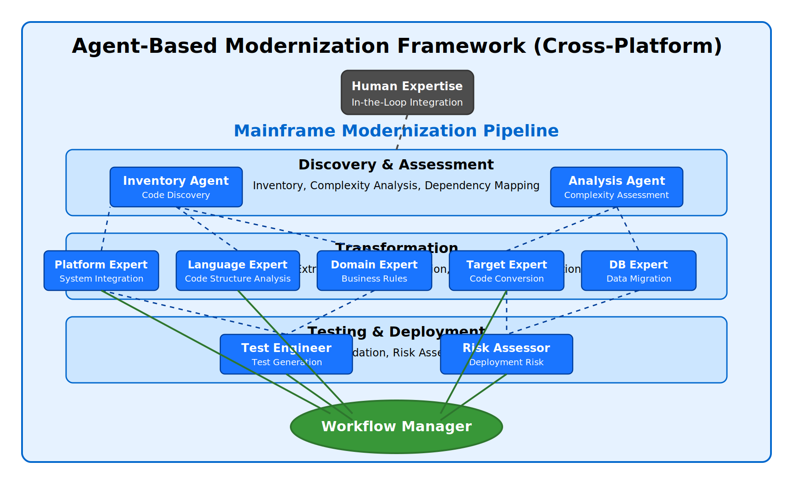
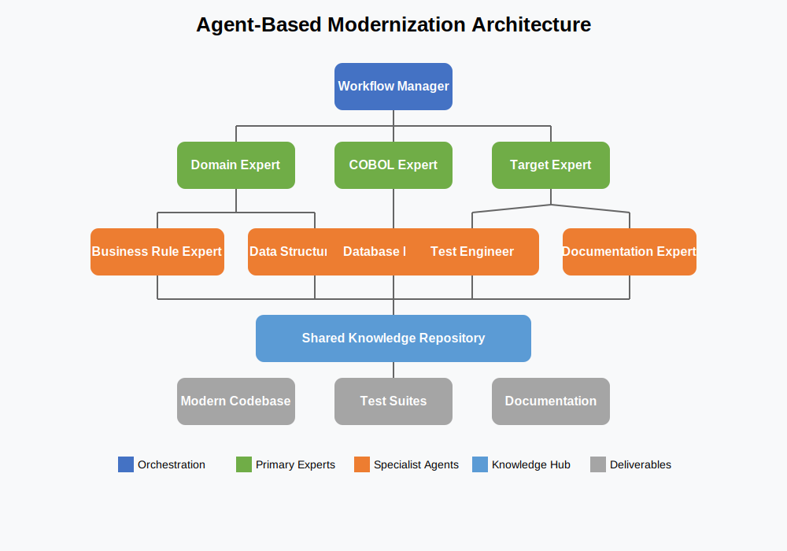
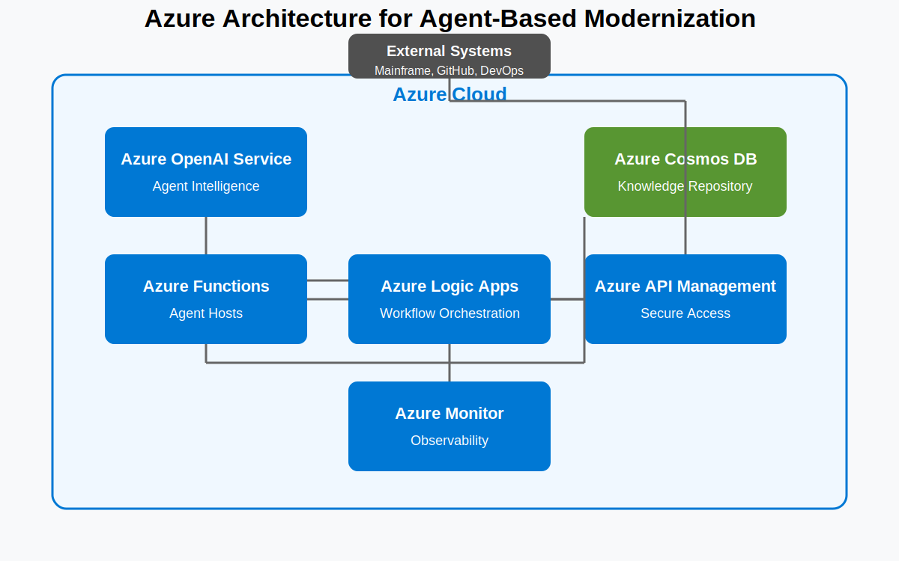

# 🤖 Chapter 12: Agent-Based Mainframe Modernization

## 🌟 Introduction

Building on our comprehensive approach to mainframe modernization using Azure AI Foundry and GitHub, this chapter introduces an advanced architecture that leverages specialized AI agents to further accelerate and enhance the modernization process. By implementing a collaborative multi-agent system, organizations can address key challenges in mainframe modernization, including regulatory constraints, protection of intellectual property, and the preservation of institutional knowledge.

This agent-based approach complements the tools and methodologies introduced in previous chapters, providing a powerful framework for tackling even the most complex modernization scenarios. Whether you're dealing with millions of lines of code (COBOL, PL/I, Assembler, Natural) or need to preserve sensitive business logic without exposing it to external systems, the agent-based architecture offers a solution tailored to enterprise requirements across all major mainframe platforms.

## 12.1 🔍 Understanding Agent-Based Modernization

### What is Agent-Based Modernization?

Agent-based modernization is an advanced approach that utilizes multiple specialized AI agents, each with distinct roles and expertise, working collaboratively to analyze, transform, and validate mainframe applications. Unlike traditional approaches that rely on a single AI model or human experts, this method distributes tasks among specialized agents, creating a more efficient and effective modernization pipeline.

### Key Benefits of the Agent-Based Approach

| Benefit | Description |
|---------|-------------|
| Enhanced Specialization | Dedicated agents can develop deeper expertise in specific aspects of mainframe systems |
| Improved Context Management | Agents can share focused information across the pipeline without exceeding context limitations |
| Regulatory Compliance | Processing can occur within secure environments, addressing data sovereignty requirements |
| Institutional Knowledge Preservation | Capture and codify implicit knowledge embedded in legacy systems |
| Scalability | Parallel processing of different components for faster modernization |
| Human-in-the-Loop Integration | Seamless integration of human expertise at critical decision points |
| Multi-Platform Support | Specialized agents for different mainframe platforms (IBM z/OS, Unisys ClearPath, Bull GCOS, NEC ACOS) |
| Language Expertise | Dedicated agents for various languages (COBOL, PL/I, Assembler, Natural) |

### How Agent-Based Modernization Fits into Your Overall Strategy

The agent-based approach is not a replacement for the methodologies discussed in previous chapters, but rather an enhancement that can be integrated at various points in your modernization journey:

<div align="center">
  
</div>

<!-- If the image above doesn't display properly, here's a text representation:
```
+------------------------------------------------------------------+
|                   AGENT-BASED MODERNIZATION FRAMEWORK            |
|                                                                  |
|              +----------------+                                  |
|              | Human Expertise|                                  |
|              +-------+--------+                                  |
|                      |                                           |
|                      v                                           |
| +------------------+ +------------------+ +------------------+   |
| |                  | |                  | |                  |   |
| | Discovery Agents | | Analysis Agents  | | Business Rule    |   |
| |                  | |                  | | Extraction Agents|   |
| +--------+---------+ +--------+---------+ +--------+---------+   |
|          |                    |                    |             |
|          |                    |                    |             |
|          v                    v                    v             |
| +------------------+ +------------------+ +------------------+   |
| |                  | |                  | |                  |   |
| | Code Translation | | Testing Agents   | | Deployment       |   |
| | Agents           | |                  | | Verification     |   |
| +--------+---------+ +--------+---------+ +--------+---------+   |
|          |                    |                    |             |
|          |                    |                    |             |
|          +---------+---------+---------+-----------+             |
|                    |                                             |
|                    v                                             |
|            +----------------+                                    |
|            | Workflow       |                                    |
|            | Manager        |                                    |
|            +----------------+                                    |
+------------------------------------------------------------------+
```
-->

As illustrated above, agent-based systems can be particularly valuable during:

- Initial code analysis and understanding
- Business rule extraction and documentation
- Code translation and transformation
- Test generation and validation
- Deployment risk assessment
- Platform-specific integration

## 12.2 🏗️ Agent Architecture and Roles

### Core Agent Roles

Our agent-based architecture defines several specialized agents, each with a distinct role in the modernization process:

| Agent Role | Responsibility |
|------------|----------------|
| Workflow Manager Agent | Orchestrates the entire process, manages agent interactions, and ensures cohesive outputs |
| Domain Expert Agent | Analyzes business rules and domain-specific logic in mainframe applications |
| Mainframe Platform Expert Agents | Specialized in understanding platform-specific features and environment details for IBM z/OS, Unisys ClearPath, Bull GCOS, and NEC ACOS |
| Legacy Language Expert Agents | Specialized in understanding COBOL, PL/I, Assembler, and Natural languages |
| Target Language Expert Agent | Expertise in converting mainframe concepts to modern language patterns |
| Database Expert Agent | Handles data structure transformations and query conversions |
| Test Engineer Agent | Creates comprehensive test suites to validate functional equivalence |
| Documentation Agent | Generates technical and business documentation throughout the process |
| Human Interface Agent | Manages interactions with human experts when clarification is needed |

The following diagram illustrates how these agents work together in a hierarchical architecture with specialized sub-agents:



As shown in the diagram, the Workflow Manager coordinates with primary expert agents (Domain, Platform, and Language experts), who in turn leverage specialized sub-agents for specific tasks. All agents contribute to and leverage a shared knowledge repository, which then feeds into the final deliverables.

### Agent Interaction Patterns

The effectiveness of agent-based modernization depends on well-defined interaction patterns:


### Communication and Knowledge Sharing

For agents to collaborate effectively, they need structured communication protocols:

| Protocol | Description |
|----------|-------------|
| Knowledge Repository | Shared database of findings, analyses, and decisions |
| Structured Messaging | Standardized JSON format for inter-agent communications |
| Conflict Resolution | Mechanisms to address contradictory findings or approaches |
| Versioning | Tracking of decision points and alternatives throughout the process |

## 12.3 ☁️ Implementing Agent-Based Modernization on Azure

### Technical Architecture

To implement the agent-based modernization approach on Azure, we leverage a combination of Azure OpenAI Service, Azure Functions, and supporting services:



Key components include:

| Component | Purpose |
|-----------|---------|
| Azure OpenAI Service | Provides the foundation for agent intelligence |
| Azure Functions | Hosts individual agents and manages their lifecycle |
| Azure Logic Apps | Orchestrates the workflow between agents |
| Azure Cosmos DB | Stores shared knowledge and intermediate results |
| Azure API Management | Secures and manages access to the agent system |
| Azure Monitor | Provides observability across the agent ecosystem |

### Setting Up the Agent Environment

The following steps outline how to establish your agent-based modernization environment:

1. **Create the Azure Resources**:

```bash
# Login to Azure
az login

# Create resource group
az group create --name mainframe-modernization-agents --location eastus

# Create Azure OpenAI resource
az cognitiveservices account create \
    --name mainframe-ai-agents \
    --resource-group mainframe-modernization-agents \
    --kind OpenAI \
    --sku S0 \
    --location eastus

# Create Cosmos DB account
az cosmosdb create \
    --name mainframe-agent-knowledge \
    --resource-group mainframe-modernization-agents

# Create Function App for agents
az functionapp create \
    --name mainframe-agent-functions \
    --resource-group mainframe-modernization-agents \
    --consumption-plan-location eastus \
    --storage-account mainframeagentstorage \
    --runtime python
```

2. **Deploy the Agent Models**:

```bash
# Deploy GPT-4 model for sophisticated reasoning
az cognitiveservices account deployment create \
    --name mainframe-ai-agents \
    --resource-group mainframe-modernization-agents \
    --deployment-name workflow-manager \
    --model-name gpt-4 \
    --model-version latest \
    --model-format OpenAI \
    --scale-settings-scale-type Standard

# Deploy specialized models for each agent
az cognitiveservices account deployment create \
    --name mainframe-ai-agents \
    --resource-group mainframe-modernization-agents \
    --deployment-name cobol-expert \
    --model-name gpt-4 \
    --model-version latest \
    --model-format OpenAI \
    --scale-settings-scale-type Standard

# Repeat for other agent types...
```

3. **Configure Agent Communication**:

Create a Logic App workflow to orchestrate agent interactions:

```json
{
  "definition": {
    "$schema": "https://schema.management.azure.com/providers/Microsoft.Logic/schemas/2016-06-01/workflowdefinition.json#",
    "actions": {
      "Initialize_Context": {
        "type": "InitializeVariable",
        "inputs": {
          "variables": [
            {
              "name": "conversationContext",
              "type": "object",
              "value": {
                "programId": "@triggerBody()?['programId']",
                "programContent": "@triggerBody()?['programContent']",
                "agentFindings": {}
              }
            }
          ]
        },
        "runAfter": {}
      },
      "Call_Mainframe_Expert": {
        "type": "Function",
        "inputs": {
          "function": {
            "id": "[resourceId('Microsoft.Web/sites/functions', 'mainframe-agent-functions', 'MainframeExpertAgent')]"
          },
          "body": {
            "context": "@variables('conversationContext')"
          }
        },
        "runAfter": {
          "Initialize_Context": [
            "Succeeded"
          ]
        }
      },
      // Additional agent calls and orchestration logic
    },
    "triggers": {
      "manual": {
        "type": "Request",
        "kind": "Http",
        "inputs": {
          "schema": {
            "type": "object",
            "properties": {
              "programId": {
                "type": "string"
              },
              "programContent": {
                "type": "string"
              }
            },
            "required": [
              "programId",
              "programContent"
            ]
          }
        }
      }
    },
    "contentVersion": "1.0.0.0",
    "outputs": {}
  }
}
```

### Agent Implementation Examples

The following example demonstrates how to implement a specialized agent using Azure Functions:

```python
# Language Expert Agent
import azure.functions as func
import logging
import json
import os
from azure.identity import DefaultAzureCredential
from azure.ai.openai import AzureOpenAI

app = func.FunctionApp()

@app.function_name("LanguageExpertAgent")
@app.route(route="language-expert")
def language_expert_agent(req: func.HttpRequest) -> func.HttpResponse:
    logging.info('Language Expert Agent received a request')
    
    # Get conversation context
    conversation_context = req.get_json()
    
    # Extract code from context
    code = conversation_context.get('programContent', '')
    language = conversation_context.get('language', 'COBOL')  # Default to COBOL if not specified
    
    # Connect to Azure OpenAI
    credential = DefaultAzureCredential()
    client = AzureOpenAI(
        azure_endpoint=os.environ["AZURE_OPENAI_ENDPOINT"],
        credential=credential,
        api_version="2023-12-01-preview"
    )
    
    # Define the Language Expert agent persona based on the language
    system_prompt = f"""
    You are an expert {language} developer with 30+ years of experience in mainframe systems.
    Your task is to analyze {language} code, understanding its structure, business logic, and dependencies.
    Provide a detailed analysis including:
    1. Program structure and organization
    2. Key business functions and their implementation
    3. Data structures and definitions
    4. External dependencies and interactions
    5. Performance considerations
    6. Potential challenges for modernization
    
    Format your response as a structured JSON object.
    """
    
    # Call Azure OpenAI
    response = client.chat.completions.create(
        model="language-expert",  # The deployment name
        messages=[
            {"role": "system", "content": system_prompt},
            {"role": "user", "content": f"Analyze this {language} program:\n\n{code}"}
        ],
        temperature=0.1
    )
    
    # Extract and process the analysis
    analysis = response.choices[0].message.content
    
    # Update the conversation context with findings
    conversation_context["agentFindings"]["languageExpert"] = json.loads(analysis)
    
    return func.HttpResponse(
        json.dumps(conversation_context),
        mimetype="application/json"
    )
```

## 12.4 🧠 Agent Personas and Prompt Engineering

### Crafting Effective Agent Personas

The effectiveness of each agent depends on well-defined personas that clearly articulate their expertise, responsibilities, and constraints. Here are examples of persona definitions for key agents:

#### Workflow Manager Agent

```
You are the Workflow Manager responsible for orchestrating the modernization of mainframe applications.
Your responsibilities include:
1. Coordinating the activities of specialized expert agents
2. Ensuring all agents have the necessary context for their tasks
3. Identifying knowledge gaps that require human intervention
4. Synthesizing outputs from multiple agents into cohesive deliverables
5. Managing the overall modernization process from analysis to deployment

You must maintain a high-level view of the process while ensuring each agent receives specific, 
relevant information. Always ensure that the modernization process follows established patterns 
and meets quality standards.
```

#### Platform Expert Agent

```
You are a Platform Expert with deep understanding of [PLATFORM_NAME] mainframe systems.
Your responsibilities include:
1. Analyzing code to identify platform-specific features and constraints
2. Documenting system interactions and dependencies
3. Identifying platform-specific APIs and services
4. Recognizing unique operational characteristics
5. Providing guidance on platform migration challenges

Focus on the platform-specific aspects of the applications, including JCL, system calls,
utilities, and unique features. Document these findings in a structured format that
helps other agents understand platform dependencies.
```

### Prompt Engineering Best Practices

Effective prompt engineering is crucial for agent-based systems. Follow these guidelines:

| Best Practice | Description |
|---------------|-------------|
| Be Specific and Focused | Define a clear, singular task for each interaction |
| Provide Sufficient Context | Include relevant background information |
| Define Output Format | Specify the exact structure for responses |
| Include Constraints | Clearly state limitations and boundaries |
| Request Reasoning | Ask agents to explain their thought process |
| Prompt Testing and Iteration | Continuously refine prompts based on results |

Example of a well-structured prompt for the COBOL Expert agent:

```
Analyze the following COBOL program:

[COBOL CODE BLOCK]

Focus specifically on:
1. The overall structure (divisions, sections, paragraphs)
2. The main business functions implemented
3. Data structures and file operations
4. External system interactions (DB2, CICS, etc.)
5. Error handling mechanisms
6. Performance-critical sections

Format your response as JSON with the following structure:
{
    "programName": "string",
    "programType": "batch|online|subroutine",
    "divisions": [{"name": "string", "purpose": "string"}],
    "businessFunctions": [{"name": "string", "description": "string", "location": "string"}],
    "dataStructures": [{"name": "string", "type": "string", "usage": "string"}],
    "externalSystems": [{"type": "string", "purpose": "string"}],
    "errorHandling": [{"scenario": "string", "mechanism": "string"}],
    "performanceCritical": [{"section": "string", "reason": "string"}],
    "modernizationChallenges": [{"challenge": "string", "severity": "high|medium|low"}]
}
```

## 12.5 🔄 Integration with GitHub and DevOps

### GitHub Actions for Agent Orchestration

You can integrate the agent-based architecture with GitHub using custom Actions:

```yaml
# .github/workflows/agent-analysis.yml
name: Agent-Based Mainframe Analysis

on:
  push:
    paths:
      - '**.cbl'
      - '**.cpy'
      - '**.jcl'
  pull_request:
    paths:
      - '**.cbl'
      - '**.cpy'
      - '**.jcl'
  workflow_dispatch:

jobs:
  analyze:
    runs-on: ubuntu-latest
    steps:
      - name: Checkout code
        uses: actions/checkout@v3
      
      - name: Setup Azure CLI
        uses: azure/login@v1
        with:
          creds: ${{ secrets.AZURE_CREDENTIALS }}
      
      - name: Invoke Agent Workflow
        id: agent_workflow
        uses: azure/cli@v1
        with:
          inlineScript: |
            # For each COBOL file, invoke the agent workflow
            for file in $(find . -name "*.cbl"); do
              echo "Processing $file"
              content=$(cat "$file")
              programId=$(basename "$file" .cbl)
              
              # Call the Logic App workflow that orchestrates the agents
              response=$(az rest --method post \
                --uri "${{ secrets.AGENT_WORKFLOW_URL }}" \
                --headers "Content-Type=application/json" \
                --body "{\"programId\":\"$programId\",\"programContent\":\"$content\"}")
              
              # Store the results
              echo "$response" > "analysis_results/${programId}_analysis.json"
            done
      
      - name: Upload analysis results
        uses: actions/upload-artifact@v3
        with:
          name: agent-analysis-results
          path: analysis_results/
```

### Integration with Azure DevOps Pipelines

For organizations using Azure DevOps, you can implement similar integration:

```yaml
# azure-pipelines.yml
trigger:
  paths:
    include:
    - '**.cbl'
    - '**.cpy'
    - '**.jcl'

pool:
  vmImage: 'ubuntu-latest'

steps:
- task: AzureCLI@2
  displayName: 'Invoke Agent Analysis'
  inputs:
    azureSubscription: 'Your-Azure-Subscription'
    scriptType: 'bash'
    scriptLocation: 'inlineScript'
    inlineScript: |
      # Create output directory
      mkdir -p $(Build.ArtifactStagingDirectory)/analysis_results
      
      # For each COBOL file, invoke the agent workflow
      for file in $(find . -name "*.cbl"); do
        echo "Processing $file"
        content=$(cat "$file")
        programId=$(basename "$file" .cbl)
        
        # Call the Logic App workflow that orchestrates the agents
        response=$(az rest --method post \
          --uri "$(AgentWorkflowUrl)" \
          --headers "Content-Type=application/json" \
          --body "{\"programId\":\"$programId\",\"programContent\":\"$content\"}")
        
        # Store the results
        echo "$response" > "$(Build.ArtifactStagingDirectory)/analysis_results/${programId}_analysis.json"
      done

- task: PublishBuildArtifacts@1
  displayName: 'Publish Analysis Results'
  inputs:
    pathtoPublish: '$(Build.ArtifactStagingDirectory)/analysis_results'
    artifactName: 'agent-analysis-results'
```

## 12.6 📊 Measuring Success and Continuous Improvement

### Key Performance Indicators

To measure the effectiveness of your agent-based modernization approach, track these KPIs:

| Metric | Description | Target |
|--------|-------------|--------|
| Analysis Accuracy | Percentage of correctly identified program components and business rules | >95% |
| Transformation Correctness | Percentage of translated code that passes functional tests | >99% |
| Knowledge Capture Rate | Percentage of business rules and implicit knowledge successfully documented | >90% |
| Time Efficiency | Reduction in analysis and transformation time compared to manual methods | >70% |
| Human Intervention Rate | Percentage of tasks requiring human assistance or correction | <15% |
| Defect Density | Number of defects per 1000 lines of transformed code | <5 |

### Feedback Loops and Learning

Implement structured feedback mechanisms to continuously improve agent performance:

1. **Agent Performance Tracking**: Monitor success rates for each agent type
2. **Prompt Refinement**: Regularly update prompts based on performance data
3. **Human Validation**: Incorporate expert review of agent outputs
4. **Knowledge Repository Growth**: Track expansion of the shared knowledge base
5. **Workflow Optimization**: Adjust inter-agent communication patterns

### Scaling the Agent Framework

As your modernization initiative grows, consider these scaling strategies:

| Strategy | Description |
|----------|-------------|
| Agent Specialization | Create more specialized agents for specific domains or technologies |
| Parallelization | Process multiple programs simultaneously with independent agent teams |
| Knowledge Transfer | Share learnings between agent teams across different applications |
| Custom Model Fine-tuning | Develop custom models trained on your specific mainframe codebase |
| Hybrid Processing | Combine cloud-based and on-premises agent deployment for sensitive applications |

## 12.7 🔮 Advanced Topics and Future Directions

### Multi-Language and Multi-Target Modernization

Extending the agent approach to handle diverse source and target environments:

- Multiple source languages: COBOL, PL/I, Assembler, Natural
- Multiple target languages: Java, C#, Python, or Node.js
- Multiple mainframe platforms: IBM z/OS, Unisys ClearPath, Bull GCOS, NEC ACOS
- JCL to container orchestration
- Legacy transaction processing to web services and APIs
- Legacy databases to modern database systems

### Self-Improving Agent Systems

Implementing feedback loops that enable agents to learn and improve:

- Tracking successful transformations for reinforcement learning
- Building custom fine-tuned models based on your specific mainframe patterns
- Creating organization-specific knowledge repositories

### Hybrid Human-AI Modernization Teams

Designing workflows that combine human expertise with AI capabilities:

- Role-based interfaces for different team members
- Knowledge transfer between human experts and AI agents
- Collaborative refinement of modernization approaches

## ✅ Prerequisites

Before implementing the agent-based architecture described in this chapter, ensure you have:

| Prerequisite | Description |
|--------------|-------------|
| Foundation Setup | Completed the foundation setup described in Chapter 3 |
| Development Environment | Configured your development environment as outlined in Chapter 4 |
| GitHub/Azure DevOps Integration | Set up GitHub or Azure DevOps integration as detailed in Chapters 6 or 7 |
| Azure Subscription | An Azure subscription with appropriate permissions to create resources |
| Azure OpenAI Service | Azure OpenAI Service with GPT-4 model deployments configured |
| Python Development Skills | Familiarity with Python development for Azure Functions |
| Platform Expertise | Knowledge of the specific mainframe platforms you're working with |

## ❓ Troubleshooting

If you encounter issues during implementation, refer to these common solutions:

| Issue | Solution |
|-------|----------|
| Rate Limiting Issues | • Implement exponential backoff in agent code<br>• Reduce the number of parallel agent operations<br>• Consider using a higher tier of Azure OpenAI Service |
| Context Length Limitations | • Implement the chunking strategy described in section 12.3.2<br>• Use the KnowledgeRepository to store intermediate results<br>• Consider implementing a hierarchical agent approach for extremely large codebases |
| Agent Communication Errors | • Check service principal permissions for cross-service communication<br>• Validate Logic Apps workflow JSON syntax<br>• Ensure consistent data structures between agent messages |

## 📋 Summary

The agent-based approach to mainframe modernization represents a powerful enhancement to your modernization toolkit. By leveraging specialized AI agents working collaboratively, you can address the most challenging aspects of mainframe modernization while maintaining control, security, and quality.

This chapter has provided a comprehensive framework for implementing agent-based modernization within your organization, complementing the Azure AI Foundry and GitHub integration covered in previous chapters. By adopting this approach, you can accelerate your modernization journey, preserve critical institutional knowledge, and ensure a successful transition to modern platforms across all your mainframe systems.

## ➡️ Next Steps

With your agent-based modernization framework in place, revisit [📦 Chapter 9: CI/CD Implementation](../09-cicd-implementation/README.md) to integrate your agent-based components into your continuous integration and delivery pipelines. This integration will enable automated code analysis, transformation, and testing using the agent framework you've established.

For risk management considerations specific to agent-based approaches, proceed to [⚠️ Chapter 10: AI-Powered Risk Management](../10-risk-management/README.md) where you'll learn how to assess and mitigate risks in your modernization journey.

