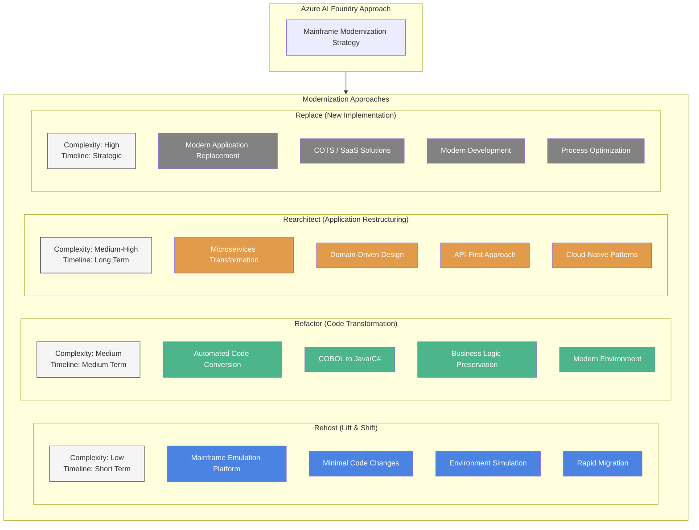

# 🌐 Comprehensive Mainframe Modernization with AI and GitHub

This chapter provides a detailed technical guide for implementing mainframe modernization across multiple platforms using artificial intelligence and GitHub integration.

## 📋 Overview

Digital transformation is compelling organizations to rethink their approach to legacy systems, particularly mainframes that support critical operations. This chapter presents a hybrid solution enabling gradual modernization through integration with modern CI/CD platforms powered by advanced AI capabilities.

The "AI Mainframe Modernization Bridge" approach allows organizations to:

| Capability | Description |
|------------|-------------|
| Maintenance | Maintain and evolve existing mainframe systems across multiple platforms |
| DevOps Adoption | Gradually adopt modern CI/CD and DevOps practices |
| AI Integration | Leverage advanced AI capabilities to accelerate development |
| Hybrid Operations | Operate in a hybrid model accommodating different team profiles |

## 🎯 Objectives

| Objective | Description |
|-----------|-------------|
| Hybrid Modernization | Implement hybrid modernization approaches for multiple mainframe platforms |
| Code Transformation | Apply AI-driven code transformation for legacy languages |
| Cloud Integration | Integrate mainframe systems with cloud platforms |
| Risk Reduction | Leverage AI for risk reduction and knowledge preservation |
| Implementation Strategy | Establish comprehensive implementation and operational strategies |

## 🖥️ Supported Mainframe Platforms

### 1. IBM z/OS

IBM z/OS mainframe modernization follows specific transformation paths:

| Approach | Description |
|----------|-------------|
| API Enablement | z/OS Connect creates RESTful APIs without changing core code |
| Containerization | z/OS Container Extensions runs Linux applications directly on z/OS |
| Hybrid Cloud Integration | IBM Z and Cloud Modernization Stack |
| AI-Assisted Refactoring | IBM watsonx Code Assistant for Z |

For detailed implementation steps, see the [IBM z/OS Implementation Guide](ibm-zos-implementation.md).

### 2. Unisys ClearPath

Unisys ClearPath modernization focuses on hardware independence and cloud readiness:

| Approach | Description |
|----------|-------------|
| Cloud Transition | ClearPath MCP Software Series for direct cloud operation |
| Hardware Modernization | ClearPath Forward systems |
| Application Extension | ClearPath ePortal for web and mobile interfaces |
| Fabric Architecture | Integrating multiple operating environments |

For detailed implementation steps, see the [Unisys ClearPath Implementation Guide](unisys-clearpath-implementation.md).

### 3. Bull GCOS

Bull GCOS modernization, led by Atos, focuses on hardware virtualization and incremental transformation:

| Approach | Description |
|----------|-------------|
| Hardware Virtualization | Transitions from proprietary hardware to standard servers |
| Emulation Layers | Replicate original mainframe behavior on x86 hardware |
| LiberFactory Suite | Enables application modernization |
| Migration+ Toolset | Provides automated code analysis capabilities |

For detailed implementation steps, see the [Bull GCOS Implementation Guide](bull-gcos-implementation.md).

### 4. NEC ACOS

NEC ACOS modernization follows a distinct path reflecting its Japanese market focus:

| Approach | Description |
|----------|-------------|
| Processor Evolution | From proprietary processors to Intel-based hardware |
| iPackage Integration | Connects ACOS applications to web environments |
| Parallel Processing | ACOS-4/XVP PX implementations |
| Development Environment | Modernization through CASEWORLD/PE tools |

For detailed implementation steps, see the [NEC ACOS Implementation Guide](nec-acos-implementation.md).

## 💻 Programming Language Modernization

### 1. COBOL Modernization

COBOL modernization approaches include:

| Approach | Description |
|----------|-------------|
| Automated Conversion | Tools transforming COBOL to Java or C# |
| AI-Powered Transformation | Specialized LLMs to understand context |
| Special Handling | For COMPUTATIONAL fields, REDEFINES clauses, and complex structures |
| Hybrid Approaches | Combining automated and manual refinement for complex codebases |

### 2. PL/I Modernization 

PL/I presents unique modernization challenges due to its extensive feature set:

| Challenge | Solution |
|-----------|----------|
| Pre-processor Statements | Specialized parsing |
| Complex Data Structures | Mapping to appropriate object models |
| PL/I Pointers | Translation to references or pointer types |

### 3. Assembler Modernization

Assembler modernization presents particular challenges due to its low-level nature:

| Challenge | Solution |
|-----------|----------|
| Register-based Operations | Mapping to higher-level constructs |
| Memory Manipulation | Careful handling in modern languages |
| Specialized Instructions | Custom implementations |

### 4. Natural Modernization

Natural, commonly used with Adabas databases, requires specialized approaches:

| Challenge | Solution |
|-----------|----------|
| Database Access | Conversion to modern database interfaces |
| Screen Layouts | Transformation to web or GUI interfaces |
| Business Logic | Extraction and preservation |

## ☁️ Cloud Integration Approaches

### 1. Azure Integration

Azure's approach to mainframe modernization leverages a partner ecosystem:

| Component | Description |
|-----------|-------------|
| Azure Mainframe Migration Center | Coordinates migration initiatives |
| Azure Logic Apps | Provides mainframe integration capabilities |
| Hybrid Connectivity | Azure ExpressRoute extends to hybrid environments |

### 2. AWS Integration

AWS offers a unified, managed approach to mainframe modernization:

| Component | Description |
|-----------|-------------|
| AWS Mainframe Modernization Service | Provides a managed platform |
| AWS Blu Age | Delivers automated refactoring to Java with Angular |
| Replatforming Runtime | Enables recompiling COBOL and PL/I for x86 |

### 3. Google Cloud Integration

Google Cloud Platform differentiates through AI-powered modernization tools:

| Component | Description |
|-----------|-------------|
| Google Cloud Mainframe Assessment Tool | Uses Gemini models for analysis |
| Mainframe Code Rewrite | Provides generative AI-powered conversion |
| Google Cloud Dual Run | Enables testing by comparing outputs |

## 🧠 Benefits of AI-Driven Modernization

### 1. Accelerated Development

AI-driven modernization reduces development time through:

| Capability | Description |
|------------|-------------|
| Automated Analysis | Analysis of complex codebases |
| Intelligent Code Conversion | Conversion between languages |
| Pattern Recognition | Identification of reusable components |
| Expert Knowledge Extraction | Preservation of business logic |

### 2. Risk Reduction

AI-powered tools minimize modernization risks through:

| Capability | Description |
|------------|-------------|
| Comprehensive Testing | Automated test case generation |
| Functional Equivalence | Validation between components |
| Impact Analysis | Identification of dependencies |
| Deployment Risk Assessment | Safer transitions |

### 3. Knowledge Preservation

Modern AI can extract and preserve institutional knowledge:

| Capability | Description |
|------------|-------------|
| Documentation Generation | From undocumented code |
| Business Rule Extraction | From complex logic |
| Process Mapping | Visualization of workflows |
| Domain Knowledge Capture | For specialized applications |

## 🛠️ Implementation Strategy

### 1. Assessment Phase

Begin with a comprehensive assessment:

| Step | Description |
|------|-------------|
| Application Portfolio Analysis | Catalog all mainframe applications |
| Technical Debt Evaluation | Identify modernization challenges |
| Business Criticality Assessment | Prioritize based on business value |
| Modernization Strategy Selection | Choose appropriate approaches |

### 2. Foundation Setup

Establish the technical foundation:

| Step | Description |
|------|-------------|
| Development Environment | Set up tooling |
| GitHub/DevOps Integration | Configure repositories and pipelines |
| AI Platform Setup | Implement analysis and transformation tools |
| Cloud Environment | Set up target infrastructure |

### 3. Incremental Implementation

Adopt an incremental approach:

| Step | Description |
|------|-------------|
| Pilot Project Selection | Choose a non-critical application first |
| Iterative Modernization | Transform components gradually |
| Progressive Integration | Maintain hybrid operations during transition |
| Knowledge Transfer | Train teams on both legacy and modern systems |

### 4. Hybrid Operations

Manage the hybrid environment:

| Step | Description |
|------|-------------|
| Service Virtualization | Abstract implementation details |
| Data Synchronization | Maintain consistency across platforms |
| Monitoring and Management | Implement cross-platform visibility |
| Gradual Decommissioning | Retire legacy components progressively |

## 📋 Conclusion

Mainframe modernization with AI and GitHub represents a transformative approach that balances innovation with stability. By leveraging artificial intelligence for analysis, transformation, and risk management, organizations can accelerate modernization while preserving valuable business logic and institutional knowledge.

The hybrid approach enables gradual evolution without disruption, allowing organizations to maintain existing investments while adopting modern practices and cloud capabilities. GitHub integration provides the collaborative foundation for modern DevOps practices, enabling faster delivery and better code quality.

## ➡️ Next Steps

- Explore [🧪 Code Analysis](../05-code-analysis/README.md) for AI-powered application assessment
- Learn about [🐙 GitHub Integration](../06-github-integration/README.md) for mainframe modernization
- Implement [🧠 AI-Powered Transformation](../08-ai-transformation/README.md) for your applications 

## 📊 Modernization Strategies

To effectively modernize your mainframe applications, we recommend a comprehensive strategy that combines multiple approaches based on application characteristics, business value, and technical complexity:

## Rehost (Lift & Shift) 