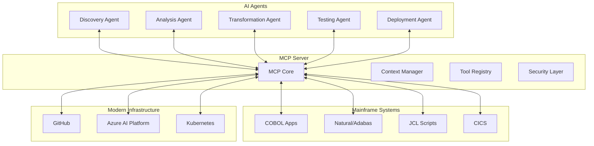

# Chapter 15: MCP-Enabled Agent Architecture

## Overview

This chapter explores the implementation of Model Context Protocol (MCP) for mainframe modernization, providing a standardized framework for AI agents to interact with mainframe systems, code, and development tools. MCP enables sophisticated multi-agent orchestration for complex modernization projects.

## Table of Contents

- [15.1 Introduction to Model Context Protocol](#151-introduction-to-model-context-protocol)
- [15.2 MCP Server Implementation](#152-mcp-server-implementation)
- [15.3 Multi-Agent Orchestration](#153-multi-agent-orchestration)
- [15.4 Production MCP Deployment](#154-production-mcp-deployment)
- [15.5 Integration with Azure AI Platform](#155-integration-with-azure-ai-platform)
- [15.6 Best Practices and Patterns](#156-best-practices-and-patterns)

## 15.1 Introduction to Model Context Protocol

### What is MCP?

Model Context Protocol (MCP) is an open protocol that enables seamless integration between AI models and external systems. For mainframe modernization, MCP provides:

- **Standardized Communication**: Unified interface for agents to interact with mainframe systems
- **Context Management**: Efficient handling of mainframe-specific contexts (COBOL, Natural, JCL)
- **Tool Integration**: Seamless connection with development tools and CI/CD pipelines
- **Security**: Built-in authentication and authorization mechanisms

### MCP vs Traditional Integration Approaches

| Aspect | Traditional Integration | MCP-Based Integration |
|--------|------------------------|----------------------|
| **Protocol** | Custom APIs, varied formats | Standardized protocol |
| **Context Handling** | Manual context management | Automatic context propagation |
| **Scalability** | Limited by custom implementations | Built for distributed systems |
| **Tool Integration** | Point-to-point integrations | Unified tool registry |
| **Security** | Varies by implementation | Standardized security model |

### Benefits for Mainframe Modernization

1. **Language-Specific Contexts**: Native support for COBOL, Natural, PL/I, and Assembler contexts
2. **Legacy System Integration**: Seamless connection with existing mainframe tools
3. **Parallel Processing**: Multi-agent orchestration for large-scale transformations
4. **Knowledge Preservation**: Capture and reuse mainframe expertise
5. **Incremental Modernization**: Support for phased migration approaches
6. **Compliance and Audit**: Built-in tracking and compliance features
7. **Performance Optimization**: Efficient resource utilization

### Architecture Overview



## 15.2 MCP Server Implementation

### 15.2.1 Basic MCP Server Setup

```python
# mcp_server/mainframe_mcp_server.py
import asyncio
from typing import Dict, List, Any, Optional
from dataclasses import dataclass
import json
import logging
from abc import ABC, abstractmethod

@dataclass
class MCPConfig:
    """Configuration for Mainframe MCP Server"""
    server_name: str
    port: int
    contexts: List[str]
    tools: List[str]
    security_enabled: bool = True
    max_concurrent_agents: int = 50
    timeout_seconds: int = 300

class MainframeMCPServer:
    """
    MCP Server implementation for mainframe modernization
    Handles agent connections and context management
    """
    
    def __init__(self, config: MCPConfig):
        self.config = config
        self.contexts: Dict[str, 'BaseContext'] = {}
        self.tools: Dict[str, 'BaseTool'] = {}
        self.agents: Dict[str, 'Agent'] = {}
        self.logger = logging.getLogger(__name__)
        
    async def start(self):
        """Start the MCP server"""
        self.logger.info(f"Starting MCP Server on port {self.config.port}")
        
        # Initialize contexts
        await self._initialize_contexts()
        
        # Register tools
        await self._register_tools()
        
        # Start server
        server = await asyncio.start_server(
            self._handle_client,
            '0.0.0.0',
            self.config.port
        )
        
        async with server:
            await server.serve_forever()
    
    async def _initialize_contexts(self):
        """Initialize language-specific contexts"""
        for context_name in self.config.contexts:
            if context_name == 'cobol':
                self.contexts['cobol'] = COBOLContext()
            elif context_name == 'natural':
                self.contexts['natural'] = NaturalContext()
            elif context_name == 'adabas':
                self.contexts['adabas'] = AdabasContext()
            elif context_name == 'jcl':
                self.contexts['jcl'] = JCLContext()
            elif context_name == 'pl1':
                self.contexts['pl1'] = PL1Context()
                
    async def _register_tools(self):
        """Register available tools"""
        self.tools = {
            'analyze_complexity': ComplexityAnalyzer(),
            'extract_business_logic': BusinessLogicExtractor(),
            'transform_code': CodeTransformer(),
            'generate_tests': TestGenerator(),
            'map_dependencies': DependencyMapper(),
            'validate_transformation': TransformationValidator()
        }
    
    async def _handle_client(self, reader, writer):
        """Handle client connections"""
        addr = writer.get_extra_info('peername')
        self.logger.info(f"New connection from {addr}")
        
        try:
            while True:
                data = await reader.read(8192)
                if not data:
                    break
                    
                message = json.loads(data.decode())
                response = await self._process_message(message)
                
                writer.write(json.dumps(response).encode())
                await writer.drain()
                
        except Exception as e:
            self.logger.error(f"Error handling client: {e}")
        finally:
            writer.close()
            await writer.wait_closed()
    
    async def _process_message(self, message: Dict[str, Any]) -> Dict[str, Any]:
        """Process incoming MCP messages"""
        msg_type = message.get('type')
        
        if msg_type == 'register_agent':
            return await self._register_agent(message)
        elif msg_type == 'execute_tool':
            return await self._execute_tool(message)
        elif msg_type == 'get_context':
            return await self._get_context(message)
        elif msg_type == 'update_context':
            return await self._update_context(message)
        else:
            return {'error': f'Unknown message type: {msg_type}'}
```

### 15.2.2 Language-Specific Contexts

```python
# mcp_server/contexts/base_context.py
class BaseContext(ABC):
    """Base class for language-specific contexts"""
    
    @abstractmethod
    async def analyze(self, code: str) -> Dict[str, Any]:
        """Analyze code in the specific language"""
        pass
    
    @abstractmethod
    async def get_patterns(self) -> List[Dict[str, Any]]:
        """Get language-specific patterns"""
        pass
    
    @abstractmethod
    async def validate(self, code: str) -> Dict[str, Any]:
        """Validate code syntax and structure"""
        pass

# mcp_server/contexts/cobol_context.py
import re
from typing import Dict, Any, List

class COBOLContext(BaseContext):
    """COBOL-specific context implementation"""
    
    def __init__(self):
        self.patterns = self._load_cobol_patterns()
        self.keywords = self._load_cobol_keywords()
        self.complexity_rules = self._load_complexity_rules()
        
    async def analyze(self, code: str) -> Dict[str, Any]:
        """Analyze COBOL code"""
        return {
            'language': 'COBOL',
            'divisions': self._extract_divisions(code),
            'procedures': self._extract_procedures(code),
            'data_structures': self._extract_data_structures(code),
            'complexity': self._calculate_complexity(code),
            'dependencies': self._extract_dependencies(code),
            'business_rules': self._extract_business_rules(code)
        }
    
    def _extract_divisions(self, code: str) -> List[Dict[str, Any]]:
        """Extract COBOL divisions"""
        divisions = []
        division_pattern = r'(\w+)\s+DIVISION\.'
        
        for match in re.finditer(division_pattern, code, re.IGNORECASE):
            divisions.append({
                'name': match.group(1),
                'start_line': code[:match.start()].count('\n') + 1,
                'type': match.group(1).upper()
            })
            
        return divisions
    
    def _extract_procedures(self, code: str) -> List[Dict[str, Any]]:
        """Extract COBOL procedures and paragraphs"""
        procedures = []
        
        # Extract sections
        section_pattern = r'^(\s*)([A-Z0-9\-]+)\s+SECTION\.'
        for match in re.finditer(section_pattern, code, re.MULTILINE):
            procedures.append({
                'name': match.group(2),
                'type': 'SECTION',
                'line': code[:match.start()].count('\n') + 1
            })
        
        # Extract paragraphs
        para_pattern = r'^(\s*)([A-Z0-9\-]+)\.\s*$'
        for match in re.finditer(para_pattern, code, re.MULTILINE):
            if not match.group(2).endswith('DIVISION'):
                procedures.append({
                    'name': match.group(2),
                    'type': 'PARAGRAPH',
                    'line': code[:match.start()].count('\n') + 1
                })
                
        return procedures
    
    def _calculate_complexity(self, code: str) -> Dict[str, Any]:
        """Calculate COBOL code complexity metrics"""
        lines = code.split('\n')
        
        # Count various complexity indicators
        perform_count = len(re.findall(r'\bPERFORM\b', code, re.IGNORECASE))
        if_count = len(re.findall(r'\bIF\b', code, re.IGNORECASE))
        evaluate_count = len(re.findall(r'\bEVALUATE\b', code, re.IGNORECASE))
        call_count = len(re.findall(r'\bCALL\b', code, re.IGNORECASE))
        
        # Calculate cyclomatic complexity
        cyclomatic = 1 + if_count + evaluate_count + perform_count
        
        return {
            'lines_of_code': len(lines),
            'cyclomatic_complexity': cyclomatic,
            'perform_statements': perform_count,
            'conditional_statements': if_count + evaluate_count,
            'external_calls': call_count,
            'complexity_score': self._calculate_score(cyclomatic, len(lines))
        }
    
    def _calculate_score(self, cyclomatic: int, loc: int) -> str:
        """Calculate complexity score"""
        if cyclomatic < 10:
            return 'LOW'
        elif cyclomatic < 20:
            return 'MEDIUM'
        elif cyclomatic < 50:
            return 'HIGH'
        else:
            return 'VERY_HIGH'
    
    async def get_patterns(self) -> List[Dict[str, Any]]:
        """Get COBOL-specific patterns for transformation"""
        return [
            {
                'pattern': 'PERFORM_UNTIL',
                'regex': r'PERFORM\s+(.+?)\s+UNTIL\s+(.+)',
                'description': 'COBOL PERFORM UNTIL loop',
                'java_equivalent': 'while (!{condition}) { {body} }'
            },
            {
                'pattern': 'EVALUATE',
                'regex': r'EVALUATE\s+(.+?)\s+WHEN\s+(.+?)\s+(.+?)\s+END-EVALUATE',
                'description': 'COBOL EVALUATE statement',
                'java_equivalent': 'switch ({expression}) { case {value}: {action} }'
            },
            {
                'pattern': 'FILE_IO',
                'regex': r'(READ|WRITE|REWRITE|DELETE)\s+(\w+)',
                'description': 'COBOL file I/O operations',
                'java_equivalent': 'fileService.{operation}({filename})'
            }
        ]
    
    async def validate(self, code: str) -> Dict[str, Any]:
        """Validate COBOL syntax"""
        errors = []
        warnings = []
        
        # Check for required divisions
        if 'IDENTIFICATION DIVISION' not in code.upper():
            errors.append({
                'type': 'MISSING_DIVISION',
                'message': 'IDENTIFICATION DIVISION is required',
                'severity': 'ERROR'
            })
        
        # Check for deprecated features
        if 'ALTER' in code.upper():
            warnings.append({
                'type': 'DEPRECATED_FEATURE',
                'message': 'ALTER statement is deprecated',
                'severity': 'WARNING'
            })
        
        return {
            'valid': len(errors) == 0,
            'errors': errors,
            'warnings': warnings
        }

# mcp_server/contexts/natural_context.py
class NaturalContext(BaseContext):
    """Natural/Adabas-specific context implementation"""
    
    def __init__(self):
        self.ddm_parser = DDMParser()
        self.map_analyzer = MapAnalyzer()
        
    async def analyze(self, code: str) -> Dict[str, Any]:
        """Analyze Natural code"""
        return {
            'language': 'Natural',
            'programs': self._extract_programs(code),
            'maps': self._extract_maps(code),
            'ddms': self._extract_ddms(code),
            'database_access': self._analyze_db_access(code),
            'mu_pe_fields': self._analyze_mu_pe(code),
            'complexity': self._calculate_natural_complexity(code)
        }
    
    def _extract_programs(self, code: str) -> List[Dict[str, Any]]:
        """Extract Natural programs"""
        programs = []
        
        # Find DEFINE DATA sections
        define_pattern = r'DEFINE\s+DATA\s+(LOCAL|PARAMETER|GLOBAL)'
        for match in re.finditer(define_pattern, code, re.IGNORECASE):
            programs.append({
                'type': match.group(1),
                'line': code[:match.start()].count('\n') + 1
            })
            
        return programs
    
    def _analyze_db_access(self, code: str) -> List[Dict[str, Any]]:
        """Analyze database access patterns"""
        db_operations = []
        
        # Find Natural database operations
        operations = ['READ', 'FIND', 'GET', 'STORE', 'UPDATE', 'DELETE']
        for op in operations:
            pattern = rf'\b{op}\b\s+(\w+)'
            for match in re.finditer(pattern, code, re.IGNORECASE):
                db_operations.append({
                    'operation': op,
                    'file': match.group(1),
                    'line': code[:match.start()].count('\n') + 1
                })
                
        return db_operations
    
    def _analyze_mu_pe(self, code: str) -> List[Dict[str, Any]]:
        """Analyze Multiple Value (MU) and Periodic Group (PE) fields"""
        mu_pe_fields = []
        
        # Pattern for MU/PE field definitions
        mu_pattern = r'(\w+)\s+\(\s*(\d+:\d+|\*)\s*\)'
        for match in re.finditer(mu_pattern, code):
            mu_pe_fields.append({
                'field': match.group(1),
                'dimensions': match.group(2),
                'type': 'MU' if ':' in match.group(2) else 'PE'
            })
            
        return mu_pe_fields

# mcp_server/contexts/adabas_context.py
class AdabasContext(BaseContext):
    """Adabas DDM-specific context"""
    
    async def analyze(self, ddm_content: str) -> Dict[str, Any]:
        """Analyze Adabas DDM"""
        return {
            'type': 'DDM',
            'fields': self._parse_ddm_fields(ddm_content),
            'descriptors': self._extract_descriptors(ddm_content),
            'mu_pe_structures': self._analyze_mu_pe_structures(ddm_content),
            'relationships': self._extract_relationships(ddm_content)
        }
    
    def _parse_ddm_fields(self, ddm: str) -> List[Dict[str, Any]]:
        """Parse DDM field definitions"""
        fields = []
        
        # DDM field pattern
        field_pattern = r'^\s*\d+\s+(\w+)\s+([A-Z])\s*(\d+(?:\.\d+)?)'
        for match in re.finditer(field_pattern, ddm, re.MULTILINE):
            fields.append({
                'name': match.group(1),
                'type': match.group(2),
                'length': match.group(3),
                'adabas_type': self._map_adabas_type(match.group(2))
            })
            
        return fields
    
    def _map_adabas_type(self, adabas_type: str) -> str:
        """Map Adabas types to modern equivalents"""
        type_mapping = {
            'A': 'String',
            'N': 'BigDecimal',
            'P': 'BigDecimal',
            'B': 'byte[]',
            'F': 'Float',
            'I': 'Integer',
            'L': 'Boolean'
        }
        return type_mapping.get(adabas_type, 'String')
```

### 15.2.3 Tool Registration and Management

```python
# mcp_server/tools/base_tool.py
class BaseTool(ABC):
    """Base class for MCP tools"""
    
    @abstractmethod
    async def execute(self, params: Dict[str, Any]) -> Dict[str, Any]:
        """Execute the tool with given parameters"""
        pass
    
    @abstractmethod
    def get_schema(self) -> Dict[str, Any]:
        """Get tool parameter schema"""
        pass

# mcp_server/tools/complexity_analyzer.py
class ComplexityAnalyzer(BaseTool):
    """Analyze code complexity across languages"""
    
    async def execute(self, params: Dict[str, Any]) -> Dict[str, Any]:
        code = params.get('code')
        language = params.get('language')
        
        if language == 'COBOL':
            analyzer = COBOLComplexityAnalyzer()
        elif language == 'Natural':
            analyzer = NaturalComplexityAnalyzer()
        else:
            return {'error': f'Unsupported language: {language}'}
            
        return await analyzer.analyze(code)
    
    def get_schema(self) -> Dict[str, Any]:
        return {
            'type': 'object',
            'properties': {
                'code': {'type': 'string', 'description': 'Source code to analyze'},
                'language': {'type': 'string', 'enum': ['COBOL', 'Natural', 'PL/I']},
                'options': {
                    'type': 'object',
                    'properties': {
                        'include_metrics': {'type': 'boolean'},
                        'include_suggestions': {'type': 'boolean'}
                    }
                }
            },
            'required': ['code', 'language']
        }

# mcp_server/tools/business_logic_extractor.py
class BusinessLogicExtractor(BaseTool):
    """Extract business logic from mainframe code"""
    
    def __init__(self):
        self.ai_client = AzureAIClient()
        
    async def execute(self, params: Dict[str, Any]) -> Dict[str, Any]:
        code = params.get('code')
        language = params.get('language')
        context = params.get('context', {})
        
        # Use AI to extract business logic
        prompt = self._build_extraction_prompt(code, language, context)
        
        result = await self.ai_client.analyze(prompt)
        
        return {
            'business_rules': result.get('rules', []),
            'calculations': result.get('calculations', []),
            'validations': result.get('validations', []),
            'workflows': result.get('workflows', []),
            'data_transformations': result.get('transformations', [])
        }
    
    def _build_extraction_prompt(self, code: str, language: str, context: Dict) -> str:
        return f"""
        Analyze this {language} code and extract business logic:
        
        Context: {json.dumps(context)}
        
        Code:
        {code}
        
        Extract:
        1. Business rules and conditions
        2. Calculations and formulas
        3. Data validations
        4. Process workflows
        5. Data transformations
        """

# mcp_server/tools/code_transformer.py
class CodeTransformer(BaseTool):
    """Transform mainframe code to modern languages"""
    
    async def execute(self, params: Dict[str, Any]) -> Dict[str, Any]:
        source_code = params.get('source_code')
        source_language = params.get('source_language')
        target_language = params.get('target_language')
        options = params.get('options', {})
        
        # Select appropriate transformer
        transformer = self._get_transformer(source_language, target_language)
        
        # Apply transformation
        result = await transformer.transform(
            source_code,
            preserve_comments=options.get('preserve_comments', True),
            optimize=options.get('optimize', True),
            generate_tests=options.get('generate_tests', False)
        )
        
        return result
    
    def _get_transformer(self, source: str, target: str) -> 'BaseTransformer':
        transformers = {
            ('COBOL', 'Java'): COBOLToJavaTransformer(),
            ('COBOL', 'C#'): COBOLToCSharpTransformer(),
            ('Natural', 'Java'): NaturalToJavaTransformer(),
            ('PL/I', 'Java'): PL1ToJavaTransformer()
        }
        
        key = (source, target)
        if key not in transformers:
            raise ValueError(f"No transformer for {source} to {target}")
            
        return transformers[key]
```

## 15.3 Multi-Agent Orchestration

### Agent Discovery and Registration

```python
# mcp_server/orchestration/agent_registry.py
import asyncio
from typing import Dict, List, Optional
from datetime import datetime
import uuid

class AgentRegistry:
    """Registry for managing agents in the MCP ecosystem"""
    
    def __init__(self):
        self.agents: Dict[str, 'RegisteredAgent'] = {}
        self.capabilities: Dict[str, List[str]] = {}
        self._lock = asyncio.Lock()
        
    async def register_agent(self, agent_info: Dict[str, Any]) -> str:
        """Register a new agent"""
        async with self._lock:
            agent_id = str(uuid.uuid4())
            
            agent = RegisteredAgent(
                id=agent_id,
                name=agent_info['name'],
                type=agent_info['type'],
                capabilities=agent_info['capabilities'],
                status='active',
                registered_at=datetime.utcnow()
            )
            
            self.agents[agent_id] = agent
            
            # Index capabilities
            for capability in agent.capabilities:
                if capability not in self.capabilities:
                    self.capabilities[capability] = []
                self.capabilities[capability].append(agent_id)
                
            return agent_id
    
    async def discover_agents(self, capability: str) -> List['RegisteredAgent']:
        """Discover agents with specific capability"""
        agent_ids = self.capabilities.get(capability, [])
        return [self.agents[aid] for aid in agent_ids if self.agents[aid].status == 'active']
    
    async def get_agent_status(self, agent_id: str) -> Optional[Dict[str, Any]]:
        """Get current agent status"""
        agent = self.agents.get(agent_id)
        if not agent:
            return None
            
        return {
            'id': agent.id,
            'name': agent.name,
            'status': agent.status,
            'capabilities': agent.capabilities,
            'last_heartbeat': agent.last_heartbeat,
            'metrics': agent.metrics
        }

@dataclass
class RegisteredAgent:
    id: str
    name: str
    type: str
    capabilities: List[str]
    status: str
    registered_at: datetime
    last_heartbeat: Optional[datetime] = None
    metrics: Dict[str, Any] = None
```

### Task Distribution Algorithms

```python
# mcp_server/orchestration/task_distributor.py
from abc import ABC, abstractmethod
import random
from typing import List, Dict, Any, Optional

class TaskDistributionStrategy(ABC):
    """Base class for task distribution strategies"""
    
    @abstractmethod
    async def select_agent(self, task: 'Task', agents: List['RegisteredAgent']) -> Optional['RegisteredAgent']:
        pass

class LoadBalancedDistribution(TaskDistributionStrategy):
    """Distribute tasks based on agent load"""
    
    async def select_agent(self, task: 'Task', agents: List['RegisteredAgent']) -> Optional['RegisteredAgent']:
        if not agents:
            return None
            
        # Sort agents by current load
        sorted_agents = sorted(
            agents,
            key=lambda a: a.metrics.get('current_load', 0) if a.metrics else 0
        )
        
        # Select agent with lowest load
        return sorted_agents[0]

class CapabilityBasedDistribution(TaskDistributionStrategy):
    """Distribute tasks based on agent capabilities and performance"""
    
    async def select_agent(self, task: 'Task', agents: List['RegisteredAgent']) -> Optional['RegisteredAgent']:
        if not agents:
            return None
            
        # Score agents based on capability match and performance
        scored_agents = []
        for agent in agents:
            score = self._calculate_score(task, agent)
            scored_agents.append((score, agent))
            
        # Sort by score (highest first)
        scored_agents.sort(key=lambda x: x[0], reverse=True)
        
        return scored_agents[0][1] if scored_agents else None
    
    def _calculate_score(self, task: 'Task', agent: 'RegisteredAgent') -> float:
        score = 0.0
        
        # Capability match
        required_capabilities = task.required_capabilities
        agent_capabilities = set(agent.capabilities)
        
        match_ratio = len(required_capabilities.intersection(agent_capabilities)) / len(required_capabilities)
        score += match_ratio * 50
        
        # Performance history
        if agent.metrics:
            success_rate = agent.metrics.get('success_rate', 0.5)
            avg_execution_time = agent.metrics.get('avg_execution_time', 100)
            
            score += success_rate * 30
            score += (100 - min(avg_execution_time, 100)) * 0.2
            
        return score

class TaskOrchestrator:
    """Orchestrate task execution across multiple agents"""
    
    def __init__(self, registry: AgentRegistry):
        self.registry = registry
        self.distribution_strategy = CapabilityBasedDistribution()
        self.task_queue: asyncio.Queue = asyncio.Queue()
        self.active_tasks: Dict[str, 'Task'] = {}
        
    async def submit_task(self, task: 'Task') -> str:
        """Submit a task for execution"""
        task.id = str(uuid.uuid4())
        task.status = 'queued'
        task.submitted_at = datetime.utcnow()
        
        await self.task_queue.put(task)
        return task.id
    
    async def process_tasks(self):
        """Main task processing loop"""
        while True:
            try:
                task = await self.task_queue.get()
                
                # Find capable agents
                agents = []
                for capability in task.required_capabilities:
                    capable_agents = await self.registry.discover_agents(capability)
                    agents.extend(capable_agents)
                
                # Remove duplicates
                agents = list(set(agents))
                
                # Select best agent
                selected_agent = await self.distribution_strategy.select_agent(task, agents)
                
                if selected_agent:
                    await self._execute_task(task, selected_agent)
                else:
                    # No suitable agent found, requeue
                    task.retry_count += 1
                    if task.retry_count < task.max_retries:
                        await asyncio.sleep(task.retry_delay)
                        await self.task_queue.put(task)
                    else:
                        task.status = 'failed'
                        task.error = 'No suitable agent found'
                        
            except Exception as e:
                logging.error(f"Error processing task: {e}")
    
    async def _execute_task(self, task: 'Task', agent: 'RegisteredAgent'):
        """Execute task on selected agent"""
        task.status = 'executing'
        task.assigned_agent = agent.id
        task.started_at = datetime.utcnow()
        
        self.active_tasks[task.id] = task
        
        try:
            # Send task to agent via MCP
            result = await self._send_to_agent(agent, task)
            
            task.status = 'completed'
            task.result = result
            task.completed_at = datetime.utcnow()
            
        except Exception as e:
            task.status = 'failed'
            task.error = str(e)
            
        finally:
            del self.active_tasks[task.id]

@dataclass
class Task:
    id: Optional[str] = None
    type: str = None
    required_capabilities: List[str] = None
    payload: Dict[str, Any] = None
    priority: int = 5
    max_retries: int = 3
    retry_count: int = 0
    retry_delay: int = 60
    status: str = 'pending'
    assigned_agent: Optional[str] = None
    submitted_at: Optional[datetime] = None
    started_at: Optional[datetime] = None
    completed_at: Optional[datetime] = None
    result: Optional[Dict[str, Any]] = None
    error: Optional[str] = None
```

### Communication Patterns

```python
# mcp_server/orchestration/communication.py
class InterAgentCommunication:
    """Handle communication between agents"""
    
    def __init__(self, mcp_server: 'MainframeMCPServer'):
        self.mcp_server = mcp_server
        self.message_bus = MessageBus()
        self.conversation_manager = ConversationManager()
        
    async def send_message(self, from_agent: str, to_agent: str, message: Dict[str, Any]):
        """Send message between agents"""
        msg = AgentMessage(
            id=str(uuid.uuid4()),
            from_agent=from_agent,
            to_agent=to_agent,
            type=message.get('type'),
            payload=message.get('payload'),
            timestamp=datetime.utcnow()
        )
        
        await self.message_bus.publish(msg)
    
    async def broadcast(self, from_agent: str, message: Dict[str, Any], capability: Optional[str] = None):
        """Broadcast message to multiple agents"""
        if capability:
            # Send to agents with specific capability
            agents = await self.mcp_server.registry.discover_agents(capability)
            recipients = [a.id for a in agents]
        else:
            # Send to all agents
            recipients = list(self.mcp_server.agents.keys())
            
        for recipient in recipients:
            if recipient != from_agent:
                await self.send_message(from_agent, recipient, message)
    
    async def request_collaboration(self, requesting_agent: str, task: Dict[str, Any]) -> List[str]:
        """Request collaboration from other agents"""
        collaboration_request = {
            'type': 'collaboration_request',
            'payload': {
                'task': task,
                'required_capabilities': task.get('capabilities', []),
                'deadline': task.get('deadline')
            }
        }
        
        # Broadcast request
        await self.broadcast(requesting_agent, collaboration_request)
        
        # Wait for responses
        responses = await self.conversation_manager.wait_for_responses(
            requesting_agent,
            timeout=30
        )
        
        # Return list of agents willing to collaborate
        return [r['from_agent'] for r in responses if r['payload'].get('accepted')]

class MessageBus:
    """Message bus for agent communication"""
    
    def __init__(self):
        self.subscribers: Dict[str, List[Callable]] = {}
        self._lock = asyncio.Lock()
        
    async def subscribe(self, agent_id: str, handler: Callable):
        """Subscribe agent to messages"""
        async with self._lock:
            if agent_id not in self.subscribers:
                self.subscribers[agent_id] = []
            self.subscribers[agent_id].append(handler)
    
    async def publish(self, message: 'AgentMessage'):
        """Publish message to recipients"""
        handlers = self.subscribers.get(message.to_agent, [])
        
        # Execute handlers concurrently
        tasks = [handler(message) for handler in handlers]
        await asyncio.gather(*tasks, return_exceptions=True)

@dataclass
class AgentMessage:
    id: str
    from_agent: str
    to_agent: str
    type: str
    payload: Dict[str, Any]
    timestamp: datetime
    conversation_id: Optional[str] = None
```

### State Management

```python
# mcp_server/orchestration/state_manager.py
class DistributedStateManager:
    """Manage shared state across agents"""
    
    def __init__(self, backend: str = 'redis'):
        self.backend = self._init_backend(backend)
        self.locks: Dict[str, asyncio.Lock] = {}
        
    async def get_state(self, key: str) -> Optional[Dict[str, Any]]:
        """Get state value"""
        data = await self.backend.get(key)
        return json.loads(data) if data else None
    
    async def set_state(self, key: str, value: Dict[str, Any], ttl: Optional[int] = None):
        """Set state value"""
        data = json.dumps(value)
        await self.backend.set(key, data, ttl=ttl)
    
    async def update_state(self, key: str, updates: Dict[str, Any]):
        """Atomically update state"""
        async with self._get_lock(key):
            current = await self.get_state(key) or {}
            current.update(updates)
            await self.set_state(key, current)
    
    async def increment_counter(self, key: str, amount: int = 1) -> int:
        """Increment a counter atomically"""
        return await self.backend.increment(key, amount)
    
    def _get_lock(self, key: str) -> asyncio.Lock:
        """Get or create lock for key"""
        if key not in self.locks:
            self.locks[key] = asyncio.Lock()
        return self.locks[key]
    
    def _init_backend(self, backend_type: str):
        """Initialize storage backend"""
        if backend_type == 'redis':
            return RedisBackend()
        elif backend_type == 'memory':
            return MemoryBackend()
        else:
            raise ValueError(f"Unknown backend: {backend_type}")

class WorkflowState:
    """Manage workflow execution state"""
    
    def __init__(self, state_manager: DistributedStateManager):
        self.state_manager = state_manager
        
    async def create_workflow(self, workflow_id: str, definition: Dict[str, Any]):
        """Create new workflow instance"""
        state = {
            'id': workflow_id,
            'definition': definition,
            'status': 'initialized',
            'current_step': None,
            'completed_steps': [],
            'context': {},
            'created_at': datetime.utcnow().isoformat()
        }
        
        await self.state_manager.set_state(f"workflow:{workflow_id}", state)
    
    async def update_step(self, workflow_id: str, step_name: str, status: str, result: Optional[Dict] = None):
        """Update workflow step status"""
        updates = {
            'current_step': step_name,
            'last_updated': datetime.utcnow().isoformat()
        }
        
        if status == 'completed':
            state = await self.state_manager.get_state(f"workflow:{workflow_id}")
            completed_steps = state.get('completed_steps', [])
            completed_steps.append({
                'name': step_name,
                'completed_at': datetime.utcnow().isoformat(),
                'result': result
            })
            updates['completed_steps'] = completed_steps
            
        await self.state_manager.update_state(f"workflow:{workflow_id}", updates)
```

## 15.4 Production MCP Deployment

### Kubernetes Deployment

```yaml
# k8s/mcp-server-deployment.yaml
apiVersion: apps/v1
kind: Deployment
metadata:
  name: mainframe-mcp-server
  namespace: mcp-system
spec:
  replicas: 3
  selector:
    matchLabels:
      app: mcp-server
  template:
    metadata:
      labels:
        app: mcp-server
    spec:
      containers:
      - name: mcp-server
        image: mainframe-mcp:latest
        ports:
        - containerPort: 8080
          name: mcp
        - containerPort: 9090
          name: metrics
        env:
        - name: MCP_CONFIG
          valueFrom:
            configMapKeyRef:
              name: mcp-config
              key: config.yaml
        - name: AZURE_AI_ENDPOINT
          valueFrom:
            secretKeyRef:
              name: azure-credentials
              key: endpoint
        resources:
          requests:
            memory: "2Gi"
            cpu: "1"
          limits:
            memory: "4Gi"
            cpu: "2"
        livenessProbe:
          httpGet:
            path: /health
            port: 8080
          initialDelaySeconds: 30
          periodSeconds: 10
        readinessProbe:
          httpGet:
            path: /ready
            port: 8080
          initialDelaySeconds: 5
          periodSeconds: 5
---
apiVersion: v1
kind: Service
metadata:
  name: mcp-server
  namespace: mcp-system
spec:
  selector:
    app: mcp-server
  ports:
  - name: mcp
    port: 8080
    targetPort: 8080
  - name: metrics
    port: 9090
    targetPort: 9090
  type: LoadBalancer
---
apiVersion: autoscaling/v2
kind: HorizontalPodAutoscaler
metadata:
  name: mcp-server-hpa
  namespace: mcp-system
spec:
  scaleTargetRef:
    apiVersion: apps/v1
    kind: Deployment
    name: mainframe-mcp-server
  minReplicas: 3
  maxReplicas: 20
  metrics:
  - type: Resource
    resource:
      name: cpu
      target:
        type: Utilization
        averageUtilization: 70
  - type: Resource
    resource:
      name: memory
      target:
        type: Utilization
        averageUtilization: 80
  - type: Pods
    pods:
      metric:
        name: mcp_active_connections
      target:
        type: AverageValue
        averageValue: "100"
```

### Security Implementation

```python
# mcp_server/security/auth.py
import jwt
from datetime import datetime, timedelta
from typing import Dict, Any, Optional
import hashlib

class MCPSecurityManager:
    """Security manager for MCP server"""
    
    def __init__(self, config: Dict[str, Any]):
        self.jwt_secret = config['jwt_secret']
        self.token_expiry = config.get('token_expiry_hours', 24)
        self.rbac = RBACManager()
        
    async def authenticate_agent(self, credentials: Dict[str, Any]) -> Optional[str]:
        """Authenticate an agent and return JWT token"""
        agent_id = credentials.get('agent_id')
        api_key = credentials.get('api_key')
        
        # Validate credentials
        if not await self._validate_credentials(agent_id, api_key):
            return None
            
        # Generate JWT token
        payload = {
            'agent_id': agent_id,
            'roles': await self.rbac.get_agent_roles(agent_id),
            'exp': datetime.utcnow() + timedelta(hours=self.token_expiry),
            'iat': datetime.utcnow()
        }
        
        return jwt.encode(payload, self.jwt_secret, algorithm='HS256')
    
    async def validate_token(self, token: str) -> Optional[Dict[str, Any]]:
        """Validate JWT token"""
        try:
            payload = jwt.decode(token, self.jwt_secret, algorithms=['HS256'])
            return payload
        except jwt.ExpiredSignatureError:
            return None
        except jwt.InvalidTokenError:
            return None
    
    async def authorize_action(self, agent_id: str, resource: str, action: str) -> bool:
        """Check if agent is authorized for action"""
        roles = await self.rbac.get_agent_roles(agent_id)
        
        for role in roles:
            if await self.rbac.check_permission(role, resource, action):
                return True
                
        return False
    
    async def _validate_credentials(self, agent_id: str, api_key: str) -> bool:
        """Validate agent credentials"""
        # In production, check against secure storage
        stored_key_hash = await self._get_stored_key_hash(agent_id)
        provided_key_hash = hashlib.sha256(api_key.encode()).hexdigest()
        
        return stored_key_hash == provided_key_hash

class RBACManager:
    """Role-Based Access Control manager"""
    
    def __init__(self):
        self.roles = self._init_roles()
        self.permissions = self._init_permissions()
        
    def _init_roles(self) -> Dict[str, List[str]]:
        """Initialize role definitions"""
        return {
            'discovery_agent': ['read:code', 'read:config', 'write:metrics'],
            'analysis_agent': ['read:code', 'read:analysis', 'write:analysis'],
            'transformation_agent': ['read:code', 'write:code', 'read:analysis'],
            'deployment_agent': ['read:all', 'write:deployment', 'execute:pipeline'],
            'admin_agent': ['read:all', 'write:all', 'execute:all']
        }
    
    def _init_permissions(self) -> Dict[str, Dict[str, List[str]]]:
        """Initialize permission matrix"""
        return {
            'code': {
                'read': ['discovery_agent', 'analysis_agent', 'transformation_agent', 'admin_agent'],
                'write': ['transformation_agent', 'admin_agent']
            },
            'analysis': {
                'read': ['analysis_agent', 'transformation_agent', 'admin_agent'],
                'write': ['analysis_agent', 'admin_agent']
            },
            'deployment': {
                'read': ['deployment_agent', 'admin_agent'],
                'write': ['deployment_agent', 'admin_agent']
            }
        }
    
    async def get_agent_roles(self, agent_id: str) -> List[str]:
        """Get roles assigned to agent"""
        # In production, fetch from database
        return ['analysis_agent']  # Default role
    
    async def check_permission(self, role: str, resource: str, action: str) -> bool:
        """Check if role has permission"""
        resource_perms = self.permissions.get(resource, {})
        allowed_roles = resource_perms.get(action, [])
        return role in allowed_roles

# mcp_server/security/encryption.py
class EncryptionManager:
    """Handle encryption for sensitive data"""
    
    def __init__(self, key_vault_url: str):
        self.key_vault = AzureKeyVault(key_vault_url)
        
    async def encrypt_payload(self, data: Dict[str, Any]) -> str:
        """Encrypt sensitive payload"""
        # Get encryption key from key vault
        key = await self.key_vault.get_key('mcp-encryption-key')
        
        # Encrypt data
        encrypted = self._encrypt(json.dumps(data), key)
        return base64.b64encode(encrypted).decode()
    
    async def decrypt_payload(self, encrypted_data: str) -> Dict[str, Any]:
        """Decrypt sensitive payload"""
        # Get decryption key
        key = await self.key_vault.get_key('mcp-encryption-key')
        
        # Decrypt data
        encrypted_bytes = base64.b64decode(encrypted_data)
        decrypted = self._decrypt(encrypted_bytes, key)
        
        return json.loads(decrypted)
```

### Monitoring and Observability

```python
# mcp_server/monitoring/metrics.py
from prometheus_client import Counter, Histogram, Gauge, Info
import time

class MCPMetrics:
    """Prometheus metrics for MCP server"""
    
    def __init__(self):
        # Connection metrics
        self.active_connections = Gauge(
            'mcp_active_connections',
            'Number of active MCP connections'
        )
        
        self.connection_total = Counter(
            'mcp_connections_total',
            'Total number of MCP connections',
            ['agent_type']
        )
        
        # Message metrics
        self.messages_processed = Counter(
            'mcp_messages_processed_total',
            'Total messages processed',
            ['message_type', 'status']
        )
        
        self.message_duration = Histogram(
            'mcp_message_duration_seconds',
            'Message processing duration',
            ['message_type']
        )
        
        # Tool execution metrics
        self.tool_executions = Counter(
            'mcp_tool_executions_total',
            'Total tool executions',
            ['tool_name', 'status']
        )
        
        self.tool_duration = Histogram(
            'mcp_tool_duration_seconds',
            'Tool execution duration',
            ['tool_name']
        )
        
        # Agent metrics
        self.registered_agents = Gauge(
            'mcp_registered_agents',
            'Number of registered agents',
            ['agent_type']
        )
        
        self.agent_tasks = Counter(
            'mcp_agent_tasks_total',
            'Total tasks assigned to agents',
            ['agent_type', 'task_type', 'status']
        )
        
        # System metrics
        self.server_info = Info(
            'mcp_server',
            'MCP server information'
        )
        
        self.server_info.info({
            'version': '1.0.0',
            'language': 'python',
            'framework': 'asyncio'
        })
    
    def track_connection(self, agent_type: str):
        """Track new connection"""
        self.active_connections.inc()
        self.connection_total.labels(agent_type=agent_type).inc()
    
    def track_disconnection(self):
        """Track disconnection"""
        self.active_connections.dec()
    
    def track_message(self, message_type: str, duration: float, status: str = 'success'):
        """Track message processing"""
        self.messages_processed.labels(
            message_type=message_type,
            status=status
        ).inc()
        
        self.message_duration.labels(
            message_type=message_type
        ).observe(duration)
    
    def track_tool_execution(self, tool_name: str, duration: float, status: str = 'success'):
        """Track tool execution"""
        self.tool_executions.labels(
            tool_name=tool_name,
            status=status
        ).inc()
        
        self.tool_duration.labels(
            tool_name=tool_name
        ).observe(duration)

# mcp_server/monitoring/health.py
class HealthChecker:
    """Health check implementation for MCP server"""
    
    def __init__(self, mcp_server: 'MainframeMCPServer'):
        self.mcp_server = mcp_server
        self.checks = {
            'server': self._check_server,
            'agents': self._check_agents,
            'tools': self._check_tools,
            'database': self._check_database,
            'ai_connection': self._check_ai_connection
        }
    
    async def check_health(self) -> Dict[str, Any]:
        """Perform health check"""
        results = {}
        overall_status = 'healthy'
        
        for name, check_func in self.checks.items():
            try:
                result = await check_func()
                results[name] = result
                
                if result['status'] != 'healthy':
                    overall_status = 'unhealthy'
                    
            except Exception as e:
                results[name] = {
                    'status': 'error',
                    'message': str(e)
                }
                overall_status = 'unhealthy'
        
        return {
            'status': overall_status,
            'timestamp': datetime.utcnow().isoformat(),
            'checks': results
        }
    
    async def _check_server(self) -> Dict[str, Any]:
        """Check MCP server status"""
        return {
            'status': 'healthy',
            'active_connections': len(self.mcp_server.agents),
            'registered_tools': len(self.mcp_server.tools),
            'uptime_seconds': time.time() - self.mcp_server.start_time
        }
    
    async def _check_agents(self) -> Dict[str, Any]:
        """Check agent health"""
        total_agents = len(self.mcp_server.agents)
        active_agents = sum(1 for a in self.mcp_server.agents.values() if a.status == 'active')
        
        status = 'healthy' if active_agents > 0 else 'degraded'
        
        return {
            'status': status,
            'total': total_agents,
            'active': active_agents
        }
    
    async def _check_ai_connection(self) -> Dict[str, Any]:
        """Check Azure AI connection"""
        try:
            # Test AI connection
            response = await self.mcp_server.ai_client.health_check()
            return {
                'status': 'healthy' if response else 'unhealthy',
                'endpoint': self.mcp_server.ai_client.endpoint
            }
        except Exception as e:
            return {
                'status': 'unhealthy',
                'error': str(e)
            }
```

## 15.5 Integration with Azure AI Platform

### Azure AI Foundry Integration

```python
# mcp_server/integrations/azure_ai.py
from azure.ai.foundry import AIFoundryClient
from azure.identity import DefaultAzureCredential

class AzureAIIntegration:
    """Integration with Azure AI Foundry for MCP"""
    
    def __init__(self, config: Dict[str, Any]):
        self.credential = DefaultAzureCredential()
        self.client = AIFoundryClient(
            endpoint=config['endpoint'],
            credential=self.credential
        )
        
        self.models = {
            'code_understanding': config.get('code_model', 'gpt-4-32k'),
            'transformation': config.get('transform_model', 'codex-mainframe'),
            'analysis': config.get('analysis_model', 'gpt-4-turbo')
        }
    
    async def enhance_code_analysis(self, code: str, language: str, context: Dict[str, Any]) -> Dict[str, Any]:
        """Use AI to enhance code analysis"""
        prompt = self._build_analysis_prompt(code, language, context)
        
        response = await self.client.completions.create(
            model=self.models['analysis'],
            messages=[
                {"role": "system", "content": "You are an expert mainframe code analyst."},
                {"role": "user", "content": prompt}
            ],
            temperature=0.1,
            max_tokens=4000
        )
        
        return self._parse_analysis_response(response)
    
    async def generate_transformation_plan(self, analysis: Dict[str, Any]) -> Dict[str, Any]:
        """Generate transformation plan using AI"""
        prompt = f"""
        Based on this mainframe code analysis, create a detailed transformation plan:
        
        Analysis: {json.dumps(analysis, indent=2)}
        
        Include:
        1. Transformation strategy
        2. Risk assessment
        3. Estimated effort
        4. Recommended target architecture
        5. Step-by-step migration plan
        """
        
        response = await self.client.completions.create(
            model=self.models['transformation'],
            messages=[{"role": "user", "content": prompt}],
            temperature=0.3
        )
        
        return self._parse_transformation_plan(response)
    
    async def assist_code_transformation(self, source_code: str, source_lang: str, target_lang: str) -> str:
        """AI-assisted code transformation"""
        prompt = f"""
        Transform this {source_lang} code to {target_lang}:
        
        ```{source_lang}
        {source_code}
        ```
        
        Requirements:
        - Preserve business logic exactly
        - Use modern {target_lang} patterns
        - Add appropriate error handling
        - Include unit tests
        - Add documentation
        """
        
        response = await self.client.completions.create(
            model=self.models['transformation'],
            messages=[{"role": "user", "content": prompt}],
            temperature=0.1,
            max_tokens=8000
        )
        
        return response.choices[0].message.content

# mcp_server/integrations/github_copilot.py
class GitHubCopilotIntegration:
    """Integration with GitHub Copilot for code suggestions"""
    
    def __init__(self, config: Dict[str, Any]):
        self.workspace_path = config['workspace_path']
        self.patterns = self._load_patterns()
        
    def _load_patterns(self) -> Dict[str, List[Dict]]:
        """Load mainframe transformation patterns"""
        return {
            'cobol': [
                {
                    'pattern': r'PERFORM\s+(\w+)\s+UNTIL\s+(.+)',
                    'suggestion': 'while (!{1}) {{ {0}(); }}'
                },
                {
                    'pattern': r'MOVE\s+(.+)\s+TO\s+(.+)',
                    'suggestion': '{1} = {0};'
                }
            ],
            'natural': [
                {
                    'pattern': r'FIND\s+(\w+)\s+WITH\s+(.+)',
                    'suggestion': 'repository.findBy{0}({1})'
                },
                {
                    'pattern': r'READ\s+(\w+)\s+BY\s+ISN',
                    'suggestion': 'repository.findById(id)'
                }
            ]
        }
    
    def create_copilot_config(self, language: str) -> Dict[str, Any]:
        """Create Copilot configuration for language"""
        patterns = self.patterns.get(language, [])
        
        return {
            'version': '1.0',
            'language': language,
            'patterns': patterns,
            'context': {
                'framework': 'spring-boot' if language in ['cobol', 'natural'] else 'generic',
                'testing': 'junit5',
                'build': 'maven'
            }
        }

# mcp_server/integrations/devops.py
class DevOpsIntegration:
    """Integration with GitHub Actions and Azure DevOps"""
    
    def __init__(self, platform: str, config: Dict[str, Any]):
        self.platform = platform
        self.config = config
        
    async def create_pipeline(self, project: Dict[str, Any]) -> str:
        """Create CI/CD pipeline for modernized application"""
        if self.platform == 'github':
            return await self._create_github_pipeline(project)
        elif self.platform == 'azure-devops':
            return await self._create_azure_pipeline(project)
            
    async def _create_github_pipeline(self, project: Dict[str, Any]) -> str:
        """Create GitHub Actions workflow"""
        workflow = f"""
name: Mainframe Modernization Pipeline
on:
  push:
    branches: [main, develop]
  pull_request:
    branches: [main]

jobs:
  analysis:
    runs-on: ubuntu-latest
    steps:
    - uses: actions/checkout@v3
    
    - name: MCP Agent Analysis
      uses: mainframe-modernization/mcp-action@v1
      with:
        mcp-server: ${{{{ secrets.MCP_SERVER_URL }}}}
        agent-type: analysis
        language: {project['source_language']}
        
    - name: Security Scan
      uses: github/advanced-security/codeql-action@v2
      
  transformation:
    needs: analysis
    runs-on: ubuntu-latest
    steps:
    - name: Transform Code
      uses: mainframe-modernization/mcp-action@v1
      with:
        mcp-server: ${{{{ secrets.MCP_SERVER_URL }}}}
        agent-type: transformation
        source-language: {project['source_language']}
        target-language: {project['target_language']}
        
  test:
    needs: transformation
    runs-on: ubuntu-latest
    steps:
    - name: Run Tests
      run: |
        mvn test
        mvn integration-test
        
    - name: Performance Test
      uses: mainframe-modernization/performance-test@v1
      
  deploy:
    needs: test
    runs-on: ubuntu-latest
    if: github.ref == 'refs/heads/main'
    steps:
    - name: Deploy to Azure
      uses: azure/webapps-deploy@v2
      with:
        app-name: {project['app_name']}
        publish-profile: ${{{{ secrets.AZURE_PUBLISH_PROFILE }}}}
"""
        return workflow
```

## 15.6 Best Practices and Patterns

### MCP Implementation Patterns

```python
# mcp_server/patterns/implementation_patterns.py

class MCPPatterns:
    """Common patterns for MCP implementation"""
    
    @staticmethod
    def agent_factory_pattern():
        """Factory pattern for creating agents"""
        class AgentFactory:
            _agents = {
                'discovery': DiscoveryAgent,
                'analysis': AnalysisAgent,
                'transformation': TransformationAgent,
                'testing': TestingAgent,
                'deployment': DeploymentAgent
            }
            
            @classmethod
            def create_agent(cls, agent_type: str, config: Dict[str, Any]) -> 'BaseAgent':
                agent_class = cls._agents.get(agent_type)
                if not agent_class:
                    raise ValueError(f"Unknown agent type: {agent_type}")
                return agent_class(config)
    
    @staticmethod
    def circuit_breaker_pattern():
        """Circuit breaker for handling failures"""
        class CircuitBreaker:
            def __init__(self, failure_threshold: int = 5, timeout: int = 60):
                self.failure_threshold = failure_threshold
                self.timeout = timeout
                self.failure_count = 0
                self.last_failure_time = None
                self.state = 'closed'  # closed, open, half-open
                
            async def call(self, func, *args, **kwargs):
                if self.state == 'open':
                    if time.time() - self.last_failure_time > self.timeout:
                        self.state = 'half-open'
                    else:
                        raise Exception("Circuit breaker is open")
                
                try:
                    result = await func(*args, **kwargs)
                    if self.state == 'half-open':
                        self.state = 'closed'
                        self.failure_count = 0
                    return result
                    
                except Exception as e:
                    self.failure_count += 1
                    self.last_failure_time = time.time()
                    
                    if self.failure_count >= self.failure_threshold:
                        self.state = 'open'
                    
                    raise e
    
    @staticmethod
    def retry_pattern():
        """Exponential backoff retry pattern"""
        def retry_with_backoff(max_retries: int = 3, base_delay: float = 1.0):
            def decorator(func):
                async def wrapper(*args, **kwargs):
                    for attempt in range(max_retries):
                        try:
                            return await func(*args, **kwargs)
                        except Exception as e:
                            if attempt == max_retries - 1:
                                raise e
                            
                            delay = base_delay * (2 ** attempt)
                            await asyncio.sleep(delay)
                    
                return wrapper
            return decorator
```

### Error Handling Best Practices

```python
# mcp_server/patterns/error_handling.py

class MCPErrorHandler:
    """Centralized error handling for MCP"""
    
    def __init__(self):
        self.error_handlers = {
            ConnectionError: self._handle_connection_error,
            TimeoutError: self._handle_timeout_error,
            ValidationError: self._handle_validation_error,
            AuthenticationError: self._handle_auth_error
        }
    
    async def handle_error(self, error: Exception, context: Dict[str, Any]) -> Dict[str, Any]:
        """Handle errors with appropriate recovery strategies"""
        error_type = type(error)
        handler = self.error_handlers.get(error_type, self._handle_generic_error)
        
        return await handler(error, context)
    
    async def _handle_connection_error(self, error: ConnectionError, context: Dict[str, Any]):
        """Handle connection errors"""
        return {
            'action': 'retry',
            'delay': 5,
            'max_retries': 3,
            'fallback': 'use_cached_data'
        }
    
    async def _handle_timeout_error(self, error: TimeoutError, context: Dict[str, Any]):
        """Handle timeout errors"""
        return {
            'action': 'increase_timeout',
            'new_timeout': context.get('timeout', 30) * 2,
            'alert': 'performance_degradation'
        }
```

### Performance Optimization

```python
# mcp_server/patterns/performance.py

class PerformanceOptimizer:
    """Performance optimization strategies for MCP"""
    
    @staticmethod
    def connection_pooling():
        """Connection pool for agent connections"""
        class ConnectionPool:
            def __init__(self, max_size: int = 100):
                self.pool = asyncio.Queue(maxsize=max_size)
                self.size = 0
                self.max_size = max_size
                
            async def acquire(self):
                if self.pool.empty() and self.size < self.max_size:
                    conn = await self._create_connection()
                    self.size += 1
                else:
                    conn = await self.pool.get()
                    
                return conn
            
            async def release(self, conn):
                await self.pool.put(conn)
    
    @staticmethod
    def caching_strategy():
        """Intelligent caching for MCP operations"""
        class SmartCache:
            def __init__(self, ttl: int = 300):
                self.cache = {}
                self.ttl = ttl
                
            async def get_or_compute(self, key: str, compute_func):
                if key in self.cache:
                    entry = self.cache[key]
                    if time.time() - entry['timestamp'] < self.ttl:
                        return entry['value']
                
                value = await compute_func()
                self.cache[key] = {
                    'value': value,
                    'timestamp': time.time()
                }
                
                return value
```

## Summary

This chapter has provided a comprehensive guide to implementing MCP-Enabled Agent Architecture for mainframe modernization. Key topics covered include:

1. **MCP Fundamentals**: Understanding the protocol and its benefits for mainframe modernization
2. **Server Implementation**: Building a production-ready MCP server with language-specific contexts
3. **Multi-Agent Orchestration**: Implementing sophisticated agent coordination and task distribution
4. **Production Deployment**: Kubernetes deployment, security, and monitoring
5. **Integrations**: Connecting with Azure AI Platform, GitHub Copilot, and DevOps tools
6. **Best Practices**: Patterns for reliability, performance, and maintainability

The MCP architecture enables organizations to build scalable, intelligent mainframe modernization solutions that leverage the power of AI agents while maintaining security, reliability, and performance.

## Next Steps

- [Chapter 16: Agentic DevOps for Mainframe](../16-agentic-devops/README.md) - Learn about self-healing pipelines and autonomous operations
- [Workshop: Implementing MCP](../../workshop/mcp-implementation/README.md) - Hands-on exercises for building MCP solutions 