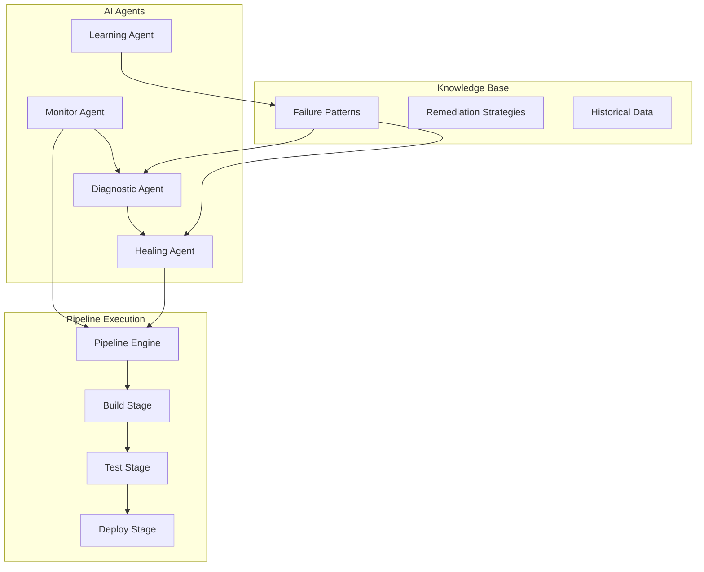

# Chapter 16: Agentic DevOps for Mainframe

## Overview

This chapter explores the implementation of Agentic DevOps practices for mainframe modernization, featuring self-healing CI/CD pipelines, autonomous operations, and intelligent deployment strategies powered by AI agents and Azure AI Platform.

## Table of Contents

- [16.1 Self-Healing CI/CD Pipelines](#161-self-healing-cicd-pipelines)
- [16.2 Autonomous Pipeline Optimization](#162-autonomous-pipeline-optimization)
- [16.3 Intelligent Deployment Strategies](#163-intelligent-deployment-strategies)
- [16.4 SRE Agent Implementation](#164-sre-agent-implementation)
- [16.5 GitHub Actions Integration](#165-github-actions-integration)
- [16.6 Monitoring and Continuous Learning](#166-monitoring-and-continuous-learning)

## 16.1 Self-Healing CI/CD Pipelines

### 16.1.1 Architecture Overview

Self-healing pipelines leverage AI agents to detect, diagnose, and automatically remediate failures without human intervention.



### 16.1.2 Predictive Failure Detection

```python
# agents/pipeline_monitor_agent.py
import asyncio
from typing import Dict, List, Any, Optional
from datetime import datetime, timedelta
import numpy as np
from sklearn.ensemble import RandomForestClassifier
import pandas as pd

class PipelineMonitorAgent:
    """AI-powered pipeline monitoring agent with predictive capabilities"""
    
    def __init__(self, config: Dict[str, Any]):
        self.config = config
        self.ml_model = self._initialize_ml_model()
        self.threshold_configs = self._load_thresholds()
        self.alert_manager = AlertManager()
        
    async def monitor_pipeline(self, pipeline_id: str):
        """Continuously monitor pipeline execution"""
        while True:
            try:
                # Collect real-time metrics
                metrics = await self._collect_metrics(pipeline_id)
                
                # Predict failure probability
                failure_probability = await self._predict_failure(metrics)
                
                if failure_probability > self.config['failure_threshold']:
                    # Proactive intervention
                    await self._trigger_preventive_action(pipeline_id, metrics)
                
                # Check for anomalies
                anomalies = await self._detect_anomalies(metrics)
                if anomalies:
                    await self._handle_anomalies(pipeline_id, anomalies)
                    
                await asyncio.sleep(self.config['monitor_interval'])
                
            except Exception as e:
                self.logger.error(f"Monitoring error: {e}")
    
    async def _collect_metrics(self, pipeline_id: str) -> Dict[str, Any]:
        """Collect comprehensive pipeline metrics"""
        return {
            'cpu_usage': await self._get_cpu_usage(pipeline_id),
            'memory_usage': await self._get_memory_usage(pipeline_id),
            'network_latency': await self._get_network_latency(pipeline_id),
            'build_duration': await self._get_build_duration(pipeline_id),
            'test_pass_rate': await self._get_test_metrics(pipeline_id),
            'dependency_health': await self._check_dependencies(pipeline_id),
            'queue_depth': await self._get_queue_depth(pipeline_id),
            'error_rate': await self._get_error_rate(pipeline_id),
            'timestamp': datetime.utcnow()
        }
    
    async def _predict_failure(self, metrics: Dict[str, Any]) -> float:
        """Predict pipeline failure probability using ML model"""
        # Prepare features
        features = self._extract_features(metrics)
        
        # Get prediction
        failure_prob = self.ml_model.predict_proba(features)[0][1]
        
        # Log prediction
        await self._log_prediction(metrics, failure_prob)
        
        return failure_prob
    
    def _extract_features(self, metrics: Dict[str, Any]) -> np.ndarray:
        """Extract ML features from metrics"""
        return np.array([
            metrics['cpu_usage'],
            metrics['memory_usage'],
            metrics['network_latency'],
            metrics['build_duration'],
            metrics['test_pass_rate'],
            metrics['dependency_health'],
            metrics['queue_depth'],
            metrics['error_rate']
        ]).reshape(1, -1)
    
    async def _detect_anomalies(self, metrics: Dict[str, Any]) -> List[Dict[str, Any]]:
        """Detect anomalies in pipeline metrics"""
        anomalies = []
        
        # CPU anomaly detection
        if metrics['cpu_usage'] > self.threshold_configs['cpu_threshold']:
            anomalies.append({
                'type': 'cpu_spike',
                'severity': 'high',
                'value': metrics['cpu_usage'],
                'threshold': self.threshold_configs['cpu_threshold']
            })
        
        # Memory leak detection
        if self._detect_memory_leak(metrics):
            anomalies.append({
                'type': 'memory_leak',
                'severity': 'critical',
                'trend': 'increasing'
            })
        
        # Performance degradation
        if self._detect_performance_degradation(metrics):
            anomalies.append({
                'type': 'performance_degradation',
                'severity': 'medium',
                'impact': 'build_time_increase'
            })
        
        return anomalies
    
    def _detect_memory_leak(self, metrics: Dict[str, Any]) -> bool:
        """Detect potential memory leaks"""
        # Implement memory leak detection logic
        # Check for consistent memory increase over time
        return False  # Placeholder
    
    def _detect_performance_degradation(self, metrics: Dict[str, Any]) -> bool:
        """Detect performance degradation patterns"""
        # Compare current performance with historical baseline
        return False  # Placeholder
```

### 16.1.3 Automatic Remediation

```python
# agents/healing_agent.py
class HealingAgent:
    """Automatic remediation agent for pipeline failures"""
    
    def __init__(self):
        self.remediation_strategies = self._load_remediation_strategies()
        self.execution_history = []
        
    async def heal_pipeline(self, pipeline_id: str, failure: Dict[str, Any]):
        """Automatically remediate pipeline failure"""
        self.logger.info(f"Healing pipeline {pipeline_id} for failure: {failure['type']}")
        
        # Select remediation strategy
        strategy = await self._select_strategy(failure)
        
        if not strategy:
            self.logger.warning(f"No remediation strategy found for {failure['type']}")
            return await self._escalate_to_human(pipeline_id, failure)
        
        # Execute remediation
        success = await self._execute_remediation(pipeline_id, failure, strategy)
        
        # Record outcome
        await self._record_outcome(pipeline_id, failure, strategy, success)
        
        # Learn from result
        await self._update_strategy_effectiveness(strategy, success)
        
        return success
    
    async def _select_strategy(self, failure: Dict[str, Any]) -> Optional[Dict[str, Any]]:
        """Select best remediation strategy based on failure type"""
        failure_type = failure['type']
        
        # Get applicable strategies
        strategies = self.remediation_strategies.get(failure_type, [])
        
        if not strategies:
            return None
        
        # Rank strategies by success rate
        ranked_strategies = sorted(
            strategies,
            key=lambda s: s.get('success_rate', 0.5),
            reverse=True
        )
        
        return ranked_strategies[0]
    
    async def _execute_remediation(self, pipeline_id: str, failure: Dict[str, Any], 
                                  strategy: Dict[str, Any]) -> bool:
        """Execute remediation strategy"""
        strategy_type = strategy['type']
        
        if strategy_type == 'restart_service':
            return await self._restart_service(pipeline_id, strategy['params'])
        elif strategy_type == 'clear_cache':
            return await self._clear_cache(pipeline_id)
        elif strategy_type == 'scale_resources':
            return await self._scale_resources(pipeline_id, strategy['params'])
        elif strategy_type == 'rollback':
            return await self._rollback_deployment(pipeline_id)
        elif strategy_type == 'retry_with_backoff':
            return await self._retry_with_backoff(pipeline_id, strategy['params'])
        elif strategy_type == 'switch_dependency':
            return await self._switch_dependency(pipeline_id, strategy['params'])
        else:
            self.logger.error(f"Unknown strategy type: {strategy_type}")
            return False
    
    async def _restart_service(self, pipeline_id: str, params: Dict[str, Any]) -> bool:
        """Restart a failed service"""
        service_name = params['service_name']
        
        try:
            # Stop service
            await self._execute_command(f"kubectl delete pod -l app={service_name}")
            
            # Wait for restart
            await asyncio.sleep(params.get('wait_time', 30))
            
            # Verify service is healthy
            return await self._verify_service_health(service_name)
            
        except Exception as e:
            self.logger.error(f"Failed to restart service: {e}")
            return False
    
    async def _scale_resources(self, pipeline_id: str, params: Dict[str, Any]) -> bool:
        """Scale resources to handle load"""
        try:
            # Determine scaling factor
            current_replicas = await self._get_current_replicas(params['deployment'])
            new_replicas = min(
                current_replicas * params['scale_factor'],
                params.get('max_replicas', 10)
            )
            
            # Apply scaling
            await self._execute_command(
                f"kubectl scale deployment {params['deployment']} "
                f"--replicas={int(new_replicas)}"
            )
            
            # Wait for scaling to complete
            await asyncio.sleep(60)
            
            return True
            
        except Exception as e:
            self.logger.error(f"Failed to scale resources: {e}")
            return False
    
    async def _rollback_deployment(self, pipeline_id: str) -> bool:
        """Rollback to previous stable version"""
        try:
            # Get last stable version
            last_stable = await self._get_last_stable_version(pipeline_id)
            
            if not last_stable:
                self.logger.warning("No stable version found for rollback")
                return False
            
            # Execute rollback
            await self._execute_command(
                f"kubectl rollout undo deployment/{pipeline_id} "
                f"--to-revision={last_stable['revision']}"
            )
            
            # Wait for rollback to complete
            await self._wait_for_rollout(pipeline_id)
            
            # Verify deployment health
            return await self._verify_deployment_health(pipeline_id)
            
        except Exception as e:
            self.logger.error(f"Rollback failed: {e}")
            return False
    
    def _load_remediation_strategies(self) -> Dict[str, List[Dict[str, Any]]]:
        """Load remediation strategies from configuration"""
        return {
            'build_failure': [
                {
                    'type': 'clear_cache',
                    'success_rate': 0.85,
                    'avg_time': 120
                },
                {
                    'type': 'restart_service',
                    'params': {'service_name': 'build-agent'},
                    'success_rate': 0.75,
                    'avg_time': 180
                }
            ],
            'test_failure': [
                {
                    'type': 'retry_with_backoff',
                    'params': {'max_retries': 3, 'backoff_factor': 2},
                    'success_rate': 0.90,
                    'avg_time': 300
                }
            ],
            'deployment_failure': [
                {
                    'type': 'rollback',
                    'success_rate': 0.95,
                    'avg_time': 240
                },
                {
                    'type': 'scale_resources',
                    'params': {'scale_factor': 1.5, 'max_replicas': 10},
                    'success_rate': 0.80,
                    'avg_time': 180
                }
            ],
            'resource_exhaustion': [
                {
                    'type': 'scale_resources',
                    'params': {'scale_factor': 2.0, 'max_replicas': 20},
                    'success_rate': 0.88,
                    'avg_time': 150
                }
            ]
        }
```

### 16.1.4 Learning from Incidents

```python
# agents/learning_agent.py
class LearningAgent:
    """Learn from incidents to improve future remediation"""
    
    def __init__(self):
        self.incident_database = IncidentDatabase()
        self.pattern_analyzer = PatternAnalyzer()
        self.knowledge_base = KnowledgeBase()
        
    async def learn_from_incident(self, incident: Dict[str, Any]):
        """Learn from a pipeline incident"""
        # Store incident
        incident_id = await self.incident_database.store(incident)
        
        # Analyze patterns
        patterns = await self.pattern_analyzer.analyze(incident)
        
        # Update knowledge base
        for pattern in patterns:
            await self.knowledge_base.update_pattern(pattern)
        
        # Generate new remediation strategies
        new_strategies = await self._generate_strategies(incident, patterns)
        
        # Validate and store strategies
        for strategy in new_strategies:
            if await self._validate_strategy(strategy):
                await self.knowledge_base.add_strategy(strategy)
        
        # Update ML models
        await self._update_ml_models(incident)
    
    async def _generate_strategies(self, incident: Dict[str, Any], 
                                  patterns: List[Dict[str, Any]]) -> List[Dict[str, Any]]:
        """Generate new remediation strategies based on patterns"""
        strategies = []
        
        for pattern in patterns:
            if pattern['type'] == 'recurring_failure':
                # Create preventive strategy
                strategy = {
                    'trigger': pattern['trigger'],
                    'action': self._determine_preventive_action(pattern),
                    'confidence': pattern['confidence']
                }
                strategies.append(strategy)
                
            elif pattern['type'] == 'cascade_failure':
                # Create circuit breaker strategy
                strategy = {
                    'trigger': pattern['root_cause'],
                    'action': 'circuit_breaker',
                    'params': {
                        'threshold': pattern['failure_count'],
                        'timeout': 300
                    }
                }
                strategies.append(strategy)
        
        return strategies
    
    async def _update_ml_models(self, incident: Dict[str, Any]):
        """Update ML models with new incident data"""
        # Extract features from incident
        features = self._extract_incident_features(incident)
        
        # Update failure prediction model
        await self.ml_trainer.update_model(
            'failure_prediction',
            features,
            incident['outcome']
        )
        
        # Update anomaly detection model
        if incident.get('anomaly_detected'):
            await self.ml_trainer.update_model(
                'anomaly_detection',
                features,
                incident['anomaly_type']
            )
```

## 16.2 Autonomous Pipeline Optimization

### 16.2.1 AI-Driven Bottleneck Detection

```python
# agents/optimization_agent.py
class PipelineOptimizationAgent:
    """Autonomous pipeline optimization using AI"""
    
    def __init__(self):
        self.performance_analyzer = PerformanceAnalyzer()
        self.bottleneck_detector = BottleneckDetector()
        self.optimizer = PipelineOptimizer()
        
    async def optimize_pipeline(self, pipeline_id: str):
        """Continuously optimize pipeline performance"""
        while True:
            try:
                # Collect performance metrics
                metrics = await self.performance_analyzer.collect_metrics(pipeline_id)
                
                # Detect bottlenecks
                bottlenecks = await self.bottleneck_detector.detect(metrics)
                
                if bottlenecks:
                    # Generate optimization plan
                    plan = await self.optimizer.create_plan(bottlenecks)
                    
                    # Apply optimizations
                    results = await self._apply_optimizations(pipeline_id, plan)
                    
                    # Measure impact
                    impact = await self._measure_impact(pipeline_id, results)
                    
                    # Learn from results
                    await self._update_optimization_model(plan, impact)
                
                await asyncio.sleep(self.config['optimization_interval'])
                
            except Exception as e:
                self.logger.error(f"Optimization error: {e}")
    
    async def _apply_optimizations(self, pipeline_id: str, 
                                  plan: Dict[str, Any]) -> Dict[str, Any]:
        """Apply optimization plan to pipeline"""
        results = {}
        
        for optimization in plan['optimizations']:
            opt_type = optimization['type']
            
            if opt_type == 'parallelize_stages':
                result = await self._parallelize_stages(
                    pipeline_id,
                    optimization['stages']
                )
            elif opt_type == 'cache_dependencies':
                result = await self._optimize_caching(
                    pipeline_id,
                    optimization['dependencies']
                )
            elif opt_type == 'optimize_test_suite':
                result = await self._optimize_tests(
                    pipeline_id,
                    optimization['test_config']
                )
            elif opt_type == 'resource_allocation':
                result = await self._optimize_resources(
                    pipeline_id,
                    optimization['resource_config']
                )
            
            results[opt_type] = result
        
        return results
    
    async def _parallelize_stages(self, pipeline_id: str, 
                                 stages: List[str]) -> Dict[str, Any]:
        """Parallelize independent pipeline stages"""
        # Analyze stage dependencies
        dependencies = await self._analyze_stage_dependencies(pipeline_id, stages)
        
        # Create parallel execution groups
        parallel_groups = self._create_parallel_groups(stages, dependencies)
        
        # Update pipeline configuration
        new_config = {
            'stages': parallel_groups,
            'execution_mode': 'parallel'
        }
        
        await self._update_pipeline_config(pipeline_id, new_config)
        
        return {
            'parallelized_stages': len(parallel_groups),
            'expected_speedup': self._calculate_speedup(parallel_groups)
        }

class BottleneckDetector:
    """Detect performance bottlenecks in pipelines"""
    
    async def detect(self, metrics: Dict[str, Any]) -> List[Dict[str, Any]]:
        """Detect bottlenecks from metrics"""
        bottlenecks = []
        
        # Stage duration analysis
        stage_bottlenecks = await self._analyze_stage_durations(metrics)
        bottlenecks.extend(stage_bottlenecks)
        
        # Resource utilization analysis
        resource_bottlenecks = await self._analyze_resource_usage(metrics)
        bottlenecks.extend(resource_bottlenecks)
        
        # Network I/O analysis
        network_bottlenecks = await self._analyze_network_io(metrics)
        bottlenecks.extend(network_bottlenecks)
        
        # Test execution analysis
        test_bottlenecks = await self._analyze_test_execution(metrics)
        bottlenecks.extend(test_bottlenecks)
        
        return self._prioritize_bottlenecks(bottlenecks)
    
    async def _analyze_stage_durations(self, metrics: Dict[str, Any]) -> List[Dict[str, Any]]:
        """Analyze pipeline stage durations"""
        bottlenecks = []
        
        stage_durations = metrics.get('stage_durations', {})
        total_duration = sum(stage_durations.values())
        
        for stage, duration in stage_durations.items():
            # Check if stage takes disproportionate time
            if duration / total_duration > 0.3:  # More than 30% of total time
                bottlenecks.append({
                    'type': 'slow_stage',
                    'stage': stage,
                    'duration': duration,
                    'percentage': (duration / total_duration) * 100,
                    'severity': 'high' if duration / total_duration > 0.5 else 'medium'
                })
        
        return bottlenecks
```

### 16.2.2 Dynamic Resource Allocation

```python
# agents/resource_manager.py
class DynamicResourceManager:
    """Manage dynamic resource allocation for pipelines"""
    
    def __init__(self):
        self.resource_predictor = ResourcePredictor()
        self.allocation_optimizer = AllocationOptimizer()
        self.cost_analyzer = CostAnalyzer()
        
    async def allocate_resources(self, pipeline_id: str, workload: Dict[str, Any]):
        """Dynamically allocate resources based on workload"""
        # Predict resource requirements
        requirements = await self.resource_predictor.predict(workload)
        
        # Optimize allocation considering cost
        allocation = await self.allocation_optimizer.optimize(
            requirements,
            constraints={
                'max_cost': self.config['max_cost_per_run'],
                'max_nodes': self.config['max_nodes']
            }
        )
        
        # Apply allocation
        await self._apply_allocation(pipeline_id, allocation)
        
        # Monitor and adjust
        asyncio.create_task(self._monitor_and_adjust(pipeline_id, allocation))
        
        return allocation
    
    async def _apply_allocation(self, pipeline_id: str, allocation: Dict[str, Any]):
        """Apply resource allocation to pipeline"""
        # Update Kubernetes resources
        for component, resources in allocation.items():
            await self._update_k8s_resources(
                component,
                cpu=resources['cpu'],
                memory=resources['memory'],
                replicas=resources.get('replicas', 1)
            )
    
    async def _monitor_and_adjust(self, pipeline_id: str, initial_allocation: Dict[str, Any]):
        """Monitor resource usage and adjust as needed"""
        while await self._is_pipeline_running(pipeline_id):
            # Get current usage
            usage = await self._get_resource_usage(pipeline_id)
            
            # Check if adjustment needed
            if self._needs_adjustment(usage, initial_allocation):
                # Calculate new allocation
                new_allocation = await self._calculate_adjustment(usage, initial_allocation)
                
                # Apply adjustment
                await self._apply_allocation(pipeline_id, new_allocation)
                
                # Update allocation reference
                initial_allocation = new_allocation
            
            await asyncio.sleep(30)  # Check every 30 seconds

class ResourcePredictor:
    """Predict resource requirements using ML"""
    
    def __init__(self):
        self.model = self._load_prediction_model()
        
    async def predict(self, workload: Dict[str, Any]) -> Dict[str, Any]:
        """Predict resource requirements for workload"""
        features = self._extract_features(workload)
        
        # Predict CPU requirements
        cpu_pred = self.model['cpu'].predict(features)[0]
        
        # Predict memory requirements
        memory_pred = self.model['memory'].predict(features)[0]
        
        # Predict optimal replica count
        replica_pred = self.model['replicas'].predict(features)[0]
        
        return {
            'build_agent': {
                'cpu': cpu_pred * 0.4,
                'memory': memory_pred * 0.3,
                'replicas': max(1, int(replica_pred * 0.5))
            },
            'test_runner': {
                'cpu': cpu_pred * 0.4,
                'memory': memory_pred * 0.5,
                'replicas': max(2, int(replica_pred))
            },
            'deployment_agent': {
                'cpu': cpu_pred * 0.2,
                'memory': memory_pred * 0.2,
                'replicas': 1
            }
        }
```

### 16.2.3 Continuous Performance Tuning

```python
# agents/performance_tuner.py
class ContinuousPerformanceTuner:
    """Continuously tune pipeline performance"""
    
    def __init__(self):
        self.experiment_runner = ExperimentRunner()
        self.performance_tracker = PerformanceTracker()
        self.config_optimizer = ConfigurationOptimizer()
        
    async def tune_pipeline(self, pipeline_id: str):
        """Continuously tune pipeline configuration"""
        baseline = await self._establish_baseline(pipeline_id)
        
        while True:
            # Generate experiment
            experiment = await self._generate_experiment(pipeline_id, baseline)
            
            # Run experiment
            results = await self.experiment_runner.run(experiment)
            
            # Analyze results
            if results['improvement'] > self.config['improvement_threshold']:
                # Apply configuration
                await self._apply_configuration(pipeline_id, experiment['config'])
                
                # Update baseline
                baseline = results
                
                # Log improvement
                await self._log_improvement(pipeline_id, results)
            
            # Learn from experiment
            await self._update_optimization_model(experiment, results)
            
            await asyncio.sleep(self.config['tuning_interval'])
    
    async def _generate_experiment(self, pipeline_id: str, 
                                  baseline: Dict[str, Any]) -> Dict[str, Any]:
        """Generate performance experiment"""
        # Get current configuration
        current_config = await self._get_pipeline_config(pipeline_id)
        
        # Generate variations
        variations = self.config_optimizer.generate_variations(
            current_config,
            optimization_goals=['speed', 'reliability', 'cost']
        )
        
        # Select most promising variation
        selected = self._select_variation(variations, baseline)
        
        return {
            'pipeline_id': pipeline_id,
            'config': selected,
            'baseline': baseline,
            'timestamp': datetime.utcnow()
        }
    
    def _select_variation(self, variations: List[Dict[str, Any]], 
                         baseline: Dict[str, Any]) -> Dict[str, Any]:
        """Select most promising configuration variation"""
        # Use multi-armed bandit algorithm
        scores = []
        
        for variation in variations:
            # Calculate expected improvement
            expected_improvement = self._calculate_expected_improvement(
                variation,
                baseline
            )
            
            # Add exploration bonus
            exploration_bonus = self._calculate_exploration_bonus(variation)
            
            scores.append(expected_improvement + exploration_bonus)
        
        # Select variation with highest score
        best_idx = np.argmax(scores)
        return variations[best_idx]
```

## 16.3 Intelligent Deployment Strategies

### 16.3.1 Risk-Based Deployment Decisions

```python
# agents/deployment_strategist.py
class IntelligentDeploymentStrategist:
    """AI-powered deployment strategy selection"""
    
    def __init__(self):
        self.risk_assessor = RiskAssessor()
        self.strategy_selector = StrategySelector()
        self.deployment_executor = DeploymentExecutor()
        
    async def plan_deployment(self, artifact: Dict[str, Any], 
                            environment: str) -> Dict[str, Any]:
        """Plan deployment based on risk assessment"""
        # Assess deployment risk
        risk_assessment = await self.risk_assessor.assess(artifact, environment)
        
        # Select deployment strategy
        strategy = await self.strategy_selector.select(
            risk_assessment,
            environment,
            artifact
        )
        
        # Create deployment plan
        plan = {
            'artifact': artifact,
            'environment': environment,
            'strategy': strategy,
            'risk_level': risk_assessment['overall_risk'],
            'mitigations': risk_assessment['mitigations'],
            'rollback_plan': self._create_rollback_plan(strategy),
            'monitoring_config': self._create_monitoring_config(risk_assessment)
        }
        
        return plan
    
    async def execute_deployment(self, plan: Dict[str, Any]) -> Dict[str, Any]:
        """Execute deployment plan with intelligent monitoring"""
        deployment_id = str(uuid.uuid4())
        
        # Start deployment
        self.logger.info(f"Starting deployment {deployment_id} with strategy: {plan['strategy']['type']}")
        
        # Execute based on strategy
        if plan['strategy']['type'] == 'canary':
            result = await self._execute_canary_deployment(deployment_id, plan)
        elif plan['strategy']['type'] == 'blue_green':
            result = await self._execute_blue_green_deployment(deployment_id, plan)
        elif plan['strategy']['type'] == 'rolling':
            result = await self._execute_rolling_deployment(deployment_id, plan)
        elif plan['strategy']['type'] == 'direct':
            result = await self._execute_direct_deployment(deployment_id, plan)
        else:
            raise ValueError(f"Unknown deployment strategy: {plan['strategy']['type']}")
        
        return result

class RiskAssessor:
    """Assess deployment risks using AI"""
    
    def __init__(self):
        self.risk_model = self._load_risk_model()
        self.historical_analyzer = HistoricalAnalyzer()
        
    async def assess(self, artifact: Dict[str, Any], environment: str) -> Dict[str, Any]:
        """Comprehensive risk assessment"""
        risks = {
            'code_complexity': await self._assess_code_complexity(artifact),
            'dependency_risk': await self._assess_dependencies(artifact),
            'environment_risk': await self._assess_environment(environment),
            'timing_risk': await self._assess_timing(),
            'historical_risk': await self._assess_historical(artifact, environment),
            'security_risk': await self._assess_security(artifact)
        }
        
        # Calculate overall risk
        overall_risk = self._calculate_overall_risk(risks)
        
        # Generate mitigations
        mitigations = await self._generate_mitigations(risks)
        
        return {
            'risks': risks,
            'overall_risk': overall_risk,
            'risk_score': self._calculate_risk_score(risks),
            'mitigations': mitigations,
            'confidence': self._calculate_confidence(risks)
        }
    
    async def _assess_code_complexity(self, artifact: Dict[str, Any]) -> Dict[str, Any]:
        """Assess code complexity risk"""
        # Analyze code changes
        changes = artifact.get('code_changes', {})
        
        complexity_metrics = {
            'lines_changed': changes.get('total_lines', 0),
            'files_changed': len(changes.get('files', [])),
            'cyclomatic_complexity': changes.get('avg_complexity', 0),
            'test_coverage': artifact.get('test_coverage', 0)
        }
        
        # Calculate complexity risk
        risk_level = 'low'
        if complexity_metrics['lines_changed'] > 1000:
            risk_level = 'high'
        elif complexity_metrics['lines_changed'] > 500:
            risk_level = 'medium'
        
        return {
            'level': risk_level,
            'metrics': complexity_metrics,
            'factors': self._identify_complexity_factors(complexity_metrics)
        }
```

### 16.3.2 Automated Canary Analysis

```python
# agents/canary_analyzer.py
class AutomatedCanaryAnalyzer:
    """Automated canary deployment analysis"""
    
    def __init__(self):
        self.metric_collector = MetricCollector()
        self.statistical_analyzer = StatisticalAnalyzer()
        self.ml_analyzer = MLCanaryAnalyzer()
        
    async def analyze_canary(self, deployment_id: str, 
                           canary_config: Dict[str, Any]) -> Dict[str, Any]:
        """Analyze canary deployment health"""
        analysis_results = {
            'deployment_id': deployment_id,
            'start_time': datetime.utcnow(),
            'decisions': []
        }
        
        # Progressive analysis phases
        for phase in canary_config['phases']:
            self.logger.info(f"Analyzing canary phase: {phase['name']}")
            
            # Collect metrics
            metrics = await self._collect_phase_metrics(
                deployment_id,
                phase['duration']
            )
            
            # Analyze metrics
            analysis = await self._analyze_metrics(
                metrics,
                phase['success_criteria']
            )
            
            # Make decision
            decision = await self._make_decision(analysis, phase)
            analysis_results['decisions'].append(decision)
            
            if decision['action'] == 'rollback':
                await self._initiate_rollback(deployment_id)
                break
            elif decision['action'] == 'proceed':
                await self._proceed_to_next_phase(deployment_id, phase)
            else:  # pause
                await self._pause_deployment(deployment_id)
                break
        
        return analysis_results
    
    async def _collect_phase_metrics(self, deployment_id: str, 
                                   duration: int) -> Dict[str, Any]:
        """Collect metrics during canary phase"""
        metrics = {
            'latency': [],
            'error_rate': [],
            'throughput': [],
            'cpu_usage': [],
            'memory_usage': [],
            'custom_metrics': {}
        }
        
        end_time = datetime.utcnow() + timedelta(seconds=duration)
        
        while datetime.utcnow() < end_time:
            # Collect real-time metrics
            current_metrics = await self.metric_collector.collect(deployment_id)
            
            # Append to arrays
            for key in ['latency', 'error_rate', 'throughput', 'cpu_usage', 'memory_usage']:
                if key in current_metrics:
                    metrics[key].append(current_metrics[key])
            
            # Collect custom metrics
            for custom_key, value in current_metrics.get('custom', {}).items():
                if custom_key not in metrics['custom_metrics']:
                    metrics['custom_metrics'][custom_key] = []
                metrics['custom_metrics'][custom_key].append(value)
            
            await asyncio.sleep(10)  # Collect every 10 seconds
        
        return metrics
    
    async def _analyze_metrics(self, metrics: Dict[str, Any], 
                             criteria: Dict[str, Any]) -> Dict[str, Any]:
        """Analyze collected metrics against criteria"""
        analysis = {
            'statistical_tests': {},
            'ml_predictions': {},
            'threshold_violations': [],
            'anomalies': []
        }
        
        # Statistical analysis
        for metric_name, values in metrics.items():
            if metric_name == 'custom_metrics':
                continue
                
            if values:
                # Compare with baseline
                stat_result = await self.statistical_analyzer.compare_with_baseline(
                    metric_name,
                    values,
                    criteria.get('baseline_window', '1h')
                )
                analysis['statistical_tests'][metric_name] = stat_result
                
                # Check thresholds
                if metric_name in criteria.get('thresholds', {}):
                    threshold = criteria['thresholds'][metric_name]
                    avg_value = np.mean(values)
                    
                    if avg_value > threshold:
                        analysis['threshold_violations'].append({
                            'metric': metric_name,
                            'value': avg_value,
                            'threshold': threshold,
                            'severity': 'high' if avg_value > threshold * 1.5 else 'medium'
                        })
        
        # ML-based analysis
        ml_result = await self.ml_analyzer.predict_deployment_success(metrics)
        analysis['ml_predictions'] = ml_result
        
        # Anomaly detection
        anomalies = await self._detect_anomalies(metrics)
        analysis['anomalies'] = anomalies
        
        return analysis
    
    async def _make_decision(self, analysis: Dict[str, Any], 
                           phase: Dict[str, Any]) -> Dict[str, Any]:
        """Make deployment decision based on analysis"""
        decision = {
            'phase': phase['name'],
            'timestamp': datetime.utcnow(),
            'analysis_summary': self._summarize_analysis(analysis)
        }
        
        # Check for critical failures
        if self._has_critical_failures(analysis):
            decision['action'] = 'rollback'
            decision['reason'] = 'Critical failures detected'
            decision['confidence'] = 0.95
            return decision
        
        # Calculate health score
        health_score = self._calculate_health_score(analysis)
        
        if health_score >= phase.get('promotion_threshold', 0.85):
            decision['action'] = 'proceed'
            decision['reason'] = 'All criteria met'
            decision['confidence'] = health_score
        elif health_score >= phase.get('pause_threshold', 0.70):
            decision['action'] = 'pause'
            decision['reason'] = 'Further investigation needed'
            decision['confidence'] = health_score
        else:
            decision['action'] = 'rollback'
            decision['reason'] = 'Health score below threshold'
            decision['confidence'] = 1 - health_score
        
        return decision
```

### 16.3.3 Smart Rollback Mechanisms

```python
# agents/rollback_manager.py
class SmartRollbackManager:
    """Intelligent rollback management"""
    
    def __init__(self):
        self.state_tracker = DeploymentStateTracker()
        self.impact_analyzer = ImpactAnalyzer()
        self.rollback_executor = RollbackExecutor()
        
    async def plan_rollback(self, deployment_id: str, 
                          reason: Dict[str, Any]) -> Dict[str, Any]:
        """Plan intelligent rollback strategy"""
        # Get current deployment state
        current_state = await self.state_tracker.get_state(deployment_id)
        
        # Analyze impact of rollback
        impact_analysis = await self.impact_analyzer.analyze(
            current_state,
            reason
        )
        
        # Determine rollback strategy
        strategy = self._determine_strategy(current_state, impact_analysis)
        
        # Create rollback plan
        plan = {
            'deployment_id': deployment_id,
            'strategy': strategy,
            'impact': impact_analysis,
            'steps': self._create_rollback_steps(strategy, current_state),
            'estimated_duration': self._estimate_duration(strategy),
            'risk_level': impact_analysis['risk_level']
        }
        
        return plan
    
    async def execute_rollback(self, plan: Dict[str, Any]) -> Dict[str, Any]:
        """Execute smart rollback"""
        rollback_id = str(uuid.uuid4())
        
        self.logger.info(f"Starting rollback {rollback_id} for deployment {plan['deployment_id']}")
        
        results = {
            'rollback_id': rollback_id,
            'start_time': datetime.utcnow(),
            'steps_completed': [],
            'issues': []
        }
        
        try:
            for step in plan['steps']:
                # Execute rollback step
                step_result = await self._execute_step(step)
                results['steps_completed'].append(step_result)
                
                # Verify step success
                if not step_result['success']:
                    # Try alternative approach
                    alternative_result = await self._try_alternative(step)
                    if not alternative_result['success']:
                        results['issues'].append({
                            'step': step['name'],
                            'error': alternative_result['error'],
                            'severity': 'high'
                        })
                        
                        # Decide whether to continue
                        if step.get('critical', True):
                            raise Exception(f"Critical rollback step failed: {step['name']}")
                
                # Monitor impact during rollback
                await self._monitor_rollback_impact(rollback_id)
            
            # Verify rollback success
            verification = await self._verify_rollback(plan['deployment_id'])
            results['verification'] = verification
            results['success'] = verification['success']
            
        except Exception as e:
            self.logger.error(f"Rollback failed: {e}")
            results['success'] = False
            results['error'] = str(e)
            
            # Initiate emergency procedures
            await self._initiate_emergency_procedures(plan['deployment_id'])
        
        results['end_time'] = datetime.utcnow()
        return results
    
    def _determine_strategy(self, state: Dict[str, Any], 
                          impact: Dict[str, Any]) -> Dict[str, Any]:
        """Determine optimal rollback strategy"""
        if state['deployment_type'] == 'canary':
            if state['canary_percentage'] <= 10:
                return {'type': 'immediate', 'method': 'traffic_shift'}
            else:
                return {'type': 'gradual', 'method': 'progressive_shift'}
                
        elif state['deployment_type'] == 'blue_green':
            return {'type': 'immediate', 'method': 'environment_swap'}
            
        elif state['deployment_type'] == 'rolling':
            if impact['affected_instances'] < 0.3:
                return {'type': 'targeted', 'method': 'instance_rollback'}
            else:
                return {'type': 'full', 'method': 'version_rollback'}
        
        return {'type': 'full', 'method': 'version_rollback'}
```

## 16.4 SRE Agent Implementation

### Site Reliability Engineering Agent

```python
# agents/sre_agent.py
class SREAgent:
    """Autonomous Site Reliability Engineering agent"""
    
    def __init__(self):
        self.slo_manager = SLOManager()
        self.incident_manager = IncidentManager()
        self.capacity_planner = CapacityPlanner()
        self.chaos_engineer = ChaosEngineer()
        
    async def maintain_reliability(self, service_id: str):
        """Maintain service reliability autonomously"""
        while True:
            try:
                # Monitor SLOs
                slo_status = await self.slo_manager.check_slos(service_id)
                
                if slo_status['at_risk']:
                    # Take preventive action
                    await self._prevent_slo_breach(service_id, slo_status)
                
                # Check for incidents
                incidents = await self.incident_manager.detect_incidents(service_id)
                
                for incident in incidents:
                    # Handle incident
                    await self._handle_incident(service_id, incident)
                
                # Capacity planning
                capacity_needs = await self.capacity_planner.analyze(service_id)
                
                if capacity_needs['action_required']:
                    await self._adjust_capacity(service_id, capacity_needs)
                
                # Chaos engineering (if enabled)
                if self.config.get('chaos_enabled'):
                    await self.chaos_engineer.run_experiment(service_id)
                
                await asyncio.sleep(60)  # Check every minute
                
            except Exception as e:
                self.logger.error(f"SRE agent error: {e}")
    
    async def _prevent_slo_breach(self, service_id: str, slo_status: Dict[str, Any]):
        """Prevent SLO breach proactively"""
        for slo in slo_status['at_risk_slos']:
            if slo['type'] == 'availability':
                # Scale up for availability
                await self._scale_for_availability(service_id)
                
            elif slo['type'] == 'latency':
                # Optimize for latency
                await self._optimize_latency(service_id)
                
            elif slo['type'] == 'error_rate':
                # Reduce error rate
                await self._reduce_errors(service_id)
    
    async def _handle_incident(self, service_id: str, incident: Dict[str, Any]):
        """Handle incident with automated response"""
        # Create incident record
        incident_id = await self.incident_manager.create_incident(incident)
        
        # Determine response strategy
        response_plan = await self._create_response_plan(incident)
        
        # Execute response
        for action in response_plan['actions']:
            result = await self._execute_action(action)
            
            # Update incident
            await self.incident_manager.update_incident(
                incident_id,
                {'action_taken': action, 'result': result}
            )
        
        # Monitor resolution
        await self._monitor_resolution(incident_id)

class SLOManager:
    """Manage Service Level Objectives"""
    
    def __init__(self):
        self.slo_definitions = self._load_slo_definitions()
        self.error_budget_tracker = ErrorBudgetTracker()
        
    async def check_slos(self, service_id: str) -> Dict[str, Any]:
        """Check SLO compliance"""
        slos = self.slo_definitions.get(service_id, [])
        results = {
            'service_id': service_id,
            'timestamp': datetime.utcnow(),
            'slos': [],
            'at_risk': False,
            'at_risk_slos': []
        }
        
        for slo in slos:
            # Calculate SLI
            sli_value = await self._calculate_sli(service_id, slo)
            
            # Check against target
            compliance = sli_value >= slo['target']
            
            # Calculate error budget
            error_budget = await self.error_budget_tracker.calculate(
                service_id,
                slo,
                sli_value
            )
            
            slo_result = {
                'name': slo['name'],
                'type': slo['type'],
                'sli_value': sli_value,
                'target': slo['target'],
                'compliant': compliance,
                'error_budget_remaining': error_budget['remaining_percentage']
            }
            
            results['slos'].append(slo_result)
            
            # Check if at risk
            if error_budget['remaining_percentage'] < 20:  # Less than 20% budget
                results['at_risk'] = True
                results['at_risk_slos'].append(slo_result)
        
        return results
```

## 16.5 GitHub Actions Integration

### Self-Healing GitHub Actions Workflow

```yaml
# .github/workflows/self-healing-mainframe-pipeline.yml
name: Self-Healing Mainframe CI/CD Pipeline

on:
  push:
    branches: [main, develop]
  pull_request:
    branches: [main]
  workflow_dispatch:

env:
  MCP_SERVER: ${{ secrets.MCP_SERVER_URL }}
  AZURE_AI_ENDPOINT: ${{ secrets.AZURE_AI_ENDPOINT }}
  GITHUB_TOKEN: ${{ secrets.GITHUB_TOKEN }}

jobs:
  initialize-agents:
    runs-on: ubuntu-latest
    outputs:
      session_id: ${{ steps.init.outputs.session_id }}
    steps:
    - name: Initialize AI Agents
      id: init
      uses: mainframe-modernization/agent-initializer@v1
      with:
        mcp-server: ${{ env.MCP_SERVER }}
        agents: |
          - monitor-agent
          - healing-agent
          - optimization-agent
          - deployment-agent
        
    - name: Start Monitoring
      uses: mainframe-modernization/start-monitoring@v1
      with:
        session_id: ${{ steps.init.outputs.session_id }}
        enable_predictive: true
        enable_healing: true

  code-analysis:
    needs: initialize-agents
    runs-on: ubuntu-latest
    steps:
    - uses: actions/checkout@v3
    
    - name: AI-Powered Code Analysis
      id: analysis
      uses: mainframe-modernization/ai-code-analysis@v1
      with:
        session_id: ${{ needs.initialize-agents.outputs.session_id }}
        languages: |
          - COBOL
          - Natural
          - PL/I
        analysis_depth: deep
        
    - name: Security Scan with GitHub Advanced Security
      uses: github/codeql-action/analyze@v2
      with:
        languages: ${{ steps.analysis.outputs.detected_languages }}
        
    - name: Complexity Assessment
      uses: mainframe-modernization/complexity-check@v1
      with:
        threshold: high
        fail_on_very_high: true

  intelligent-build:
    needs: code-analysis
    runs-on: ubuntu-latest
    strategy:
      matrix:
        component: ${{ fromJson(needs.code-analysis.outputs.components) }}
    steps:
    - name: Optimized Build
      uses: mainframe-modernization/intelligent-build@v1
      with:
        component: ${{ matrix.component }}
        optimization_level: maximum
        cache_strategy: aggressive
        
    - name: Self-Healing on Failure
      if: failure()
      uses: mainframe-modernization/heal-build@v1
      with:
        session_id: ${{ needs.initialize-agents.outputs.session_id }}
        auto_retry: true
        max_attempts: 3

  ai-testing:
    needs: intelligent-build
    runs-on: ubuntu-latest
    steps:
    - name: Generate AI Tests
      id: test-gen
      uses: mainframe-modernization/ai-test-generator@v1
      with:
        coverage_target: 90
        test_types: |
          - unit
          - integration
          - regression
          
    - name: Run Test Suite
      uses: mainframe-modernization/run-tests@v1
      with:
        parallel_execution: true
        fail_fast: false
        
    - name: AI Test Analysis
      if: always()
      uses: mainframe-modernization/test-analysis@v1
      with:
        identify_flaky_tests: true
        suggest_improvements: true

  intelligent-deployment:
    needs: ai-testing
    runs-on: ubuntu-latest
    if: github.ref == 'refs/heads/main'
    steps:
    - name: Risk Assessment
      id: risk
      uses: mainframe-modernization/deployment-risk-assessment@v1
      with:
        session_id: ${{ needs.initialize-agents.outputs.session_id }}
        environment: production
        
    - name: Select Deployment Strategy
      id: strategy
      uses: mainframe-modernization/strategy-selector@v1
      with:
        risk_level: ${{ steps.risk.outputs.risk_level }}
        slo_requirements: |
          availability: 99.95
          latency_p95: 200ms
          error_rate: 0.1
          
    - name: Execute Deployment
      uses: mainframe-modernization/intelligent-deploy@v1
      with:
        strategy: ${{ steps.strategy.outputs.selected_strategy }}
        enable_canary_analysis: true
        auto_rollback: true
        monitoring_duration: 30m

  post-deployment:
    needs: intelligent-deployment
    runs-on: ubuntu-latest
    if: always()
    steps:
    - name: Learning Phase
      uses: mainframe-modernization/pipeline-learning@v1
      with:
        session_id: ${{ needs.initialize-agents.outputs.session_id }}
        update_models: true
        share_learnings: true
        
    - name: Generate Insights Report
      uses: mainframe-modernization/insights-generator@v1
      with:
        include_recommendations: true
        include_cost_analysis: true
```

### GitHub Copilot Integration

```yaml
# .github/copilot/mainframe-modernization.yml
version: 1
name: Mainframe Modernization Patterns

patterns:
  - name: COBOL to Java
    description: Transform COBOL patterns to Java
    examples:
      - pattern: |
          PERFORM VARYING I FROM 1 BY 1 UNTIL I > N
            // COBOL loop body
          END-PERFORM
        suggestion: |
          for (int i = 1; i <= n; i++) {
              // Java loop body
          }
          
  - name: Natural to Spring
    description: Transform Natural patterns to Spring Boot
    examples:
      - pattern: |
          READ EMPLOYEES WITH NAME = #NAME
        suggestion: |
          @Query("SELECT e FROM Employee e WHERE e.name = :name")
          List<Employee> findByName(@Param("name") String name);

  - name: Error Handling
    description: Mainframe error handling to modern patterns
    examples:
      - pattern: |
          IF SQLCODE NOT = 0
            PERFORM ERROR-ROUTINE
          END-IF
        suggestion: |
          try {
              // Database operation
          } catch (DataAccessException e) {
              handleDatabaseError(e);
          }

contexts:
  - name: mainframe-modernization
    description: Context for mainframe code transformation
    includes:
      - "**/*.cbl"
      - "**/*.nat"
      - "**/*.pli"
    settings:
      preferred_framework: spring-boot
      testing_framework: junit5
      build_tool: maven
```

## 16.6 Monitoring and Continuous Learning

### Comprehensive Monitoring Dashboard

```python
# monitoring/dashboard_config.py
class AgenticDevOpsDashboard:
    """Configuration for Agentic DevOps monitoring dashboard"""
    
    def __init__(self):
        self.prometheus_config = self._create_prometheus_config()
        self.grafana_dashboards = self._create_dashboards()
        
    def _create_dashboards(self) -> Dict[str, Any]:
        """Create Grafana dashboard configurations"""
        return {
            'agent_performance': {
                'title': 'AI Agent Performance',
                'panels': [
                    {
                        'title': 'Agent Health Status',
                        'type': 'stat',
                        'targets': [{
                            'expr': 'up{job="mcp_agents"}'
                        }]
                    },
                    {
                        'title': 'Agent Task Success Rate',
                        'type': 'graph',
                        'targets': [{
                            'expr': 'rate(agent_tasks_success[5m]) / rate(agent_tasks_total[5m])'
                        }]
                    },
                    {
                        'title': 'Healing Actions',
                        'type': 'graph',
                        'targets': [{
                            'expr': 'sum(rate(healing_actions_total[5m])) by (action_type)'
                        }]
                    },
                    {
                        'title': 'Pipeline Optimization Impact',
                        'type': 'graph',
                        'targets': [{
                            'expr': 'pipeline_duration_seconds{optimized="true"} / pipeline_duration_seconds{optimized="false"}'
                        }]
                    }
                ]
            },
            'pipeline_health': {
                'title': 'Self-Healing Pipeline Health',
                'panels': [
                    {
                        'title': 'Pipeline Success Rate',
                        'type': 'gauge',
                        'targets': [{
                            'expr': 'rate(pipeline_success_total[1h]) / rate(pipeline_total[1h]) * 100'
                        }]
                    },
                    {
                        'title': 'Auto-Healed Failures',
                        'type': 'counter',
                        'targets': [{
                            'expr': 'sum(healing_successful_total)'
                        }]
                    },
                    {
                        'title': 'Predictive Alerts',
                        'type': 'table',
                        'targets': [{
                            'expr': 'ALERTS{alertname=~"Pipeline.*"}'
                        }]
                    }
                ]
            },
            'deployment_intelligence': {
                'title': 'Intelligent Deployment Metrics',
                'panels': [
                    {
                        'title': 'Deployment Strategies Used',
                        'type': 'piechart',
                        'targets': [{
                            'expr': 'sum(deployment_total) by (strategy)'
                        }]
                    },
                    {
                        'title': 'Canary Success Rate',
                        'type': 'stat',
                        'targets': [{
                            'expr': 'rate(canary_promotion_total[7d]) / rate(canary_total[7d]) * 100'
                        }]
                    },
                    {
                        'title': 'Rollback Frequency',
                        'type': 'graph',
                        'targets': [{
                            'expr': 'sum(rate(rollback_total[1h])) by (reason)'
                        }]
                    }
                ]
            },
            'learning_metrics': {
                'title': 'Continuous Learning Metrics',
                'panels': [
                    {
                        'title': 'Model Accuracy',
                        'type': 'graph',
                        'targets': [{
                            'expr': 'ml_model_accuracy{model=~"failure_prediction|anomaly_detection"}'
                        }]
                    },
                    {
                        'title': 'Knowledge Base Growth',
                        'type': 'counter',
                        'targets': [{
                            'expr': 'knowledge_base_entries_total'
                        }]
                    },
                    {
                        'title': 'Strategy Effectiveness',
                        'type': 'heatmap',
                        'targets': [{
                            'expr': 'remediation_strategy_success_rate'
                        }]
                    }
                ]
            }
        }
```

### Continuous Learning System

```python
# learning/continuous_learner.py
class ContinuousLearningSystem:
    """System for continuous learning and improvement"""
    
    def __init__(self):
        self.model_manager = ModelManager()
        self.knowledge_extractor = KnowledgeExtractor()
        self.pattern_miner = PatternMiner()
        
    async def learn_from_operations(self):
        """Continuously learn from operational data"""
        while True:
            try:
                # Collect recent operational data
                data = await self._collect_operational_data()
                
                # Extract patterns
                patterns = await self.pattern_miner.mine_patterns(data)
                
                # Update models
                for pattern in patterns:
                    await self._update_relevant_models(pattern)
                
                # Extract new knowledge
                knowledge = await self.knowledge_extractor.extract(data, patterns)
                
                # Update knowledge base
                await self._update_knowledge_base(knowledge)
                
                # Generate recommendations
                recommendations = await self._generate_recommendations(patterns, knowledge)
                
                # Share learnings
                await self._share_learnings(recommendations)
                
                await asyncio.sleep(3600)  # Learn every hour
                
            except Exception as e:
                self.logger.error(f"Learning error: {e}")
    
    async def _update_relevant_models(self, pattern: Dict[str, Any]):
        """Update ML models based on discovered patterns"""
        if pattern['type'] == 'failure_pattern':
            # Update failure prediction model
            await self.model_manager.update_model(
                'failure_prediction',
                pattern['features'],
                pattern['outcome']
            )
            
        elif pattern['type'] == 'performance_pattern':
            # Update optimization model
            await self.model_manager.update_model(
                'performance_optimization',
                pattern['configuration'],
                pattern['performance_metrics']
            )
            
        elif pattern['type'] == 'remediation_pattern':
            # Update healing model
            await self.model_manager.update_model(
                'auto_healing',
                pattern['failure_context'],
                pattern['successful_remediation']
            )
```

## Summary

This chapter has provided a comprehensive guide to implementing Agentic DevOps for mainframe modernization. Key topics covered include:

1. **Self-Healing Pipelines**: Predictive failure detection and automatic remediation
2. **Autonomous Optimization**: AI-driven bottleneck detection and performance tuning
3. **Intelligent Deployment**: Risk-based strategies and automated canary analysis
4. **SRE Agent Implementation**: Autonomous reliability management
5. **GitHub Integration**: Self-healing workflows and Copilot patterns
6. **Continuous Learning**: Systems that improve over time

The Agentic DevOps approach enables organizations to achieve unprecedented levels of automation, reliability, and efficiency in their mainframe modernization journey.

## Next Steps

- [Workshop: Building Self-Healing Pipelines](../../workshop/self-healing-pipelines/README.md)
- [Case Studies: Agentic DevOps Success Stories](../case-studies/agentic-devops/README.md)
- [Advanced Topics: Multi-Cloud Agentic DevOps](../advanced/multi-cloud-agents/README.md) 