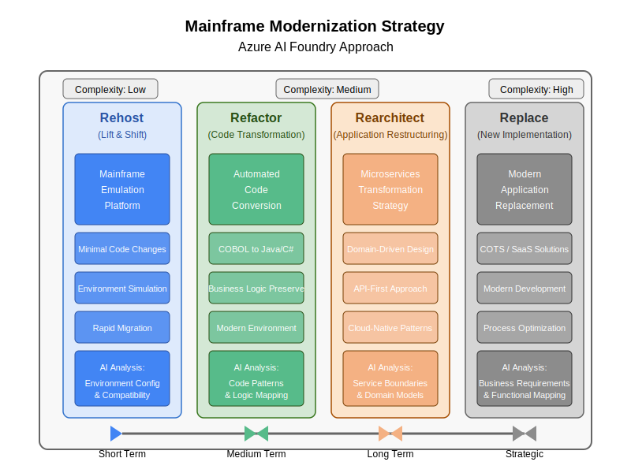

# Mainframe Modernization Strategy

This document outlines our approach to modernizing mainframe applications using Azure AI Foundry. The strategy is based on four key patterns:

## Modernization Patterns

1. **Rehost (Lift & Shift)**
   - Quick migration with minimal code changes
   - Mainframe emulation platform
   - Environment simulation
   - AI Analysis helps with environment configuration and compatibility assessment

2. **Refactor (Code Transformation)**
   - Automated code conversion (COBOL to Java/C#)
   - Preserves business logic
   - Modern environment adoption
   - AI Analysis focuses on code patterns and logic mapping

3. **Rearchitect (Application Restructuring)**
   - Microservices transformation
   - Domain-driven design
   - API-first approach
   - Cloud-native patterns
   - AI Analysis assists with service boundaries and domain model identification

4. **Replace (New Implementation)**
   - Modern application replacement
   - COTS/SaaS solutions
   - Modern development practices
   - Process optimization
   - AI Analysis helps with business requirements and functional mapping

## Choosing the Right Approach

The decision of which approach to use depends on several factors:

- Business criticality of the application
- Complexity of the codebase
- Timeline and budget constraints
- Long-term strategic goals
- Technical debt considerations

Our strategy diagram illustrates these approaches along with complexity levels and timeframes:

  

## Implementation Timeline

- **Short Term**: Focus on Rehost to quickly move applications to a more maintainable platform
- **Medium Term**: Implement Refactor for applications that need modernization but must maintain core business logic
- **Long Term**: Apply Rearchitect to strategically important applications that need to leverage cloud-native capabilities
- **Strategic**: Consider Replace for applications that no longer serve business needs effectively

## AI-Assisted Modernization

Azure AI Foundry provides specialized assistance for each modernization pattern:

- Automated code analysis and conversion
- Business rule extraction
- Dependency mapping
- Architectural pattern recommendations
- Test case generation
- Documentation assistance 