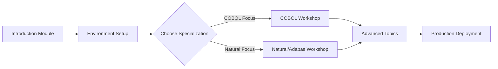

# 🎓 Mainframe Modernization Workshop Series

Welcome to the comprehensive Mainframe Modernization Workshop Series! This hands-on workshop collection guides you through the complete journey of modernizing mainframe applications using AI agents, Azure AI Platform, and modern DevOps practices.

<div align="center">

[](https://github.com/mainframe-modernization/workshops)
[](../LICENSE)
[](https://azure.microsoft.com/ai)
[](https://github.com/features/actions)

</div>

## 📚 Table of Contents

- [Overview](#-overview)
- [Prerequisites](#-prerequisites)
- [Workshop Modules](#-workshop-modules)
- [Getting Started](#-getting-started)
- [Workshop Structure](#-workshop-structure)
- [Learning Path](#-learning-path)
- [Support & Resources](#-support--resources)
- [Contributing](#-contributing)

## 🌟 Overview

This workshop series provides practical, hands-on experience in modernizing mainframe applications across different platforms and languages. You'll learn to leverage AI agents, implement self-healing pipelines, and deploy production-ready modernized applications.

### 🎯 What You'll Learn

- **AI-Powered Analysis**: Use AI agents to analyze and understand legacy mainframe code
- **Automated Transformation**: Transform COBOL, Natural, and other mainframe languages to modern frameworks
- **Data Migration**: Handle complex data structures including MU/PE fields in Adabas
- **CI/CD Implementation**: Build self-healing pipelines with GitHub Actions
- **Production Deployment**: Deploy modernized applications with monitoring and observability

### 🏆 Target Audience

- Mainframe developers transitioning to modern platforms
- DevOps engineers working on legacy modernization
- Cloud architects designing modernization solutions
- Technical leads managing modernization projects
- Anyone interested in AI-driven code transformation

## 📋 Prerequisites

Before starting the workshops, ensure you have:

### Required Knowledge
- Basic understanding of mainframe concepts (COBOL, Natural, JCL)
- Familiarity with modern programming languages (Java, Python)
- Basic knowledge of cloud concepts and containerization
- Understanding of CI/CD principles

### Technical Requirements
- **Azure Subscription** with AI services enabled
- **GitHub Account** with Actions enabled
- **Docker Desktop** installed and running
- **Python 3.8+** with pip
- **Java 17+** (for Java transformation workshops)
- **VS Code** or similar IDE with appropriate extensions
- **Git** for version control
- Minimum 8GB RAM and 20GB free disk space

### 🚀 Quick Start
See our [Quick Start Guide](QUICK_START.md) to set up your environment in minutes!

## 📖 Workshop Modules

### Module A: COBOL Modernization Journey
**Duration**: 2 days | **Level**: Intermediate | **[Start Workshop →](appendix-a-cobol-modernization/README.md)**

Transform a complete banking system from COBOL to modern Java with Spring Boot.

**Key Topics**:
- COBOL program analysis using AI agents
- Business logic extraction and documentation
- Automated code transformation
- Test generation and validation
- CI/CD pipeline implementation

**Hands-on Labs**:
1. Setting up agent framework
2. Analyzing COBOL programs
3. Extracting business rules
4. Transforming to Java
5. Deploying with monitoring

---

### Module B: Natural/Adabas Migration
**Duration**: 2 days | **Level**: Advanced | **[Start Workshop →](appendix-b-natural-adabas-migration/README.md)**

Modernize Natural/Adabas insurance applications with special focus on complex data structures.

**Key Topics**:
- Natural program analysis
- DDM to relational schema conversion
- MU/PE field handling strategies
- Data migration execution
- Performance optimization

**Hands-on Labs**:
1. Natural code analysis
2. Schema design and normalization
3. Data migration planning
4. Spring Boot transformation
5. Integration testing

---

### Module C: Introduction to Mainframe Modernization
**Duration**: 4 hours | **Level**: Beginner | **[Start Module →](intro-mainframe-modernization.md)**

Foundation module covering mainframe modernization concepts and strategies.

**Key Topics**:
- Mainframe modernization overview
- AI and agent-based approaches
- Assessment methodologies
- Tool selection
- Project planning

## 🚀 Getting Started

### 1. Environment Setup
```bash
# Clone the workshop repository
git clone https://github.com/mainframe-modernization/workshops.git
cd workshops

# Install dependencies
pip install -r requirements.txt

# Verify Docker is running
docker --version
docker ps

# Set up environment variables
cp .env.example .env
# Edit .env with your Azure and GitHub credentials
```

### 2. Choose Your Path

#### 🎯 Beginner Path
1. Start with [Introduction to Mainframe Modernization](intro-mainframe-modernization.md)
2. Review the [Workshop Checklist](workshop-checklist.md)
3. Proceed to [COBOL Modernization Workshop](appendix-a-cobol-modernization/README.md)

#### 🚀 Experienced Path
1. Review [Quick Start Guide](QUICK_START.md)
2. Jump directly to your area of interest:
   - [COBOL Workshop](appendix-a-cobol-modernization/README.md) for COBOL modernization
   - [Natural/Adabas Workshop](appendix-b-natural-adabas-migration/README.md) for Natural migration

### 3. Access Workshop Materials

All workshop materials are available in this repository:
- **Presentations**: Located in each module's `slides/` directory
- **Lab Guides**: Step-by-step instructions in module READMEs
- **Sample Code**: Example implementations in `samples/` directories
- **Solutions**: Reference solutions in `solutions/` directories

## 🏗️ Workshop Structure

Each workshop module follows a consistent structure:

```
module-name/
├── README.md           # Module overview and instructions
├── labs/              # Hands-on lab exercises
│   ├── lab1/         # Individual lab materials
│   └── lab2/
├── samples/           # Sample code and data
├── solutions/         # Reference solutions
├── slides/           # Presentation materials
└── resources/        # Additional resources
```

### Lab Format

Each lab includes:
- **Objectives**: Clear learning goals
- **Prerequisites**: Required setup or knowledge
- **Instructions**: Step-by-step guidance
- **Exercises**: Hands-on practice
- **Solutions**: Reference implementations
- **Troubleshooting**: Common issues and fixes

## 📈 Learning Path

### Recommended Progression



### Time Investment

| Module | Duration | Hands-on | Theory |
|--------|----------|----------|---------|
| Introduction | 4 hours | 1 hour | 3 hours |
| COBOL Workshop | 16 hours | 12 hours | 4 hours |
| Natural Workshop | 16 hours | 12 hours | 4 hours |
| **Total** | **36 hours** | **25 hours** | **11 hours** |

## 🛠️ Support & Resources

### Getting Help

- **Troubleshooting Guide**: [TROUBLESHOOTING.md](TROUBLESHOOTING.md)
- **Frequently Asked Questions**: [FAQ.md](FAQ.md)
- **Community Forum**: [community.mainframe-modernization.org](https://community.mainframe-modernization.org)
- **Slack Channel**: [#mainframe-workshops](https://mainframe-modern.slack.com)

### Additional Resources

- **Documentation Hub**: [docs.mainframe-modernization.org](https://docs.mainframe-modernization.org)
- **Video Tutorials**: [YouTube Channel](https://youtube.com/mainframe-modernization)
- **Blog**: [blog.mainframe-modernization.org](https://blog.mainframe-modernization.org)
- **GitHub Discussions**: [Join the conversation](https://github.com/mainframe-modernization/discussions)

### Office Hours

- **Weekly Q&A**: Thursdays 2:00 PM UTC
- **Monthly Deep Dive**: First Tuesday of each month
- **Workshop Reviews**: By appointment

## 🤝 Contributing

We welcome contributions to improve the workshops!

### How to Contribute

1. Fork the repository
2. Create a feature branch (`git checkout -b feature/improvement`)
3. Make your changes
4. Submit a pull request

### Contribution Areas

- 📝 Documentation improvements
- 🐛 Bug fixes in sample code
- 🎯 New lab exercises
- 🌐 Translations
- 💡 Workshop enhancements

See our [Contributing Guide](../CONTRIBUTING.md) for detailed guidelines.

## 📜 License

This workshop series is licensed under the MIT License. See [LICENSE](../LICENSE) for details.

## 🙏 Acknowledgments

Special thanks to:
- Azure AI Platform team for technical support
- GitHub for platform and Actions
- Community contributors and testers
- Workshop participants for valuable feedback

---

<div align="center">

**Ready to start your modernization journey?**

[🚀 **Start with Quick Start Guide** →](QUICK_START.md)

[📚 **Browse Workshop Modules** ↑](#-workshop-modules)

</div> 