# 🚀 The Mainframe Modernization Journey: A Story of Transformation

Welcome to an exciting journey where legacy meets innovation, where decades-old systems embrace artificial intelligence, and where your mainframe applications transform into cloud-native solutions.

```mermaid
graph LR
    A[📟 Legacy Mainframe] -->|AI-Powered Journey| B[☁️ Modern Cloud]
    
    style A fill:#f9d71c,stroke:#333,stroke-width:2px
    style B fill:#27ae60,stroke:#333,stroke-width:2px
```

<div align="center">



</div>

## 📖 Your Story Begins Here

Imagine you're the technical lead at a Fortune 500 company. Your organization runs critical business operations on mainframes - processing millions of transactions daily. The challenge? An aging workforce, rising costs, and the need to innovate faster than ever.

This is where your modernization journey begins...

## 🗺️ The Journey Map

<div align="center">


</div>

## 🎯 Choose Your Adventure Path

Based on your background and goals, select your personalized journey:

### Path 1: The COBOL Developer's Quest 🏃
**For:** Experienced COBOL developers ready to modernize their skills  
**Duration:** 2.5 days total  
**Destination:** Transform COBOL to Java with AI assistance

[🚀 **Begin COBOL Quest**](paths/COBOL_DEVELOPER_PATH.md)

### Path 2: The Natural/Adabas Explorer's Trail 🗺️
**For:** Natural developers navigating to modern databases  
**Duration:** 2.5 days total  
**Destination:** Migrate Natural/Adabas to Spring Boot + PostgreSQL

[🌟 **Start Natural Trail**](paths/NATURAL_DEVELOPER_PATH.md)

### Path 3: The DevOps Pioneer's Route 🔧
**For:** DevOps engineers building modernization pipelines  
**Duration:** 3 days total  
**Destination:** Implement AI-powered CI/CD for mainframe apps

[⚙️ **Launch DevOps Route**](paths/DEVOPS_ENGINEER_PATH.md)

### Path 4: The Architect's Vision 🏛️
**For:** Solution architects designing modernization strategies  
**Duration:** 2 days total  
**Destination:** Design hybrid cloud architectures with AI agents

[📐 **Explore Architect Path**](paths/ARCHITECT_PATH.md)

## 📚 Chapter Overview: Your Learning Modules

### 🌅 Chapter 1: The Awakening (Introduction)
**Duration:** 4 hours | **[Start Chapter →](intro-mainframe-modernization.md)**

<details>
<summary>🔍 What You'll Discover</summary>

You begin your journey by understanding the landscape:

- **The Legacy Challenge**: Why 71% of Fortune 500 banks still rely on mainframes ([Source: IBM](https://www.ibm.com/z/resources/facts-and-figures))
- **The AI Revolution**: How artificial intelligence changes everything
- **The Path Forward**: Modern strategies that actually work

**Key Concepts Explained:**
- What is a mainframe and why they still matter
- How AI agents understand and transform code
- Cloud-native vs mainframe architectures

**Business Impact:**
- 💰 60% reduction in operational costs
- ⚡ 10x faster feature deployment
- 👥 Access to 100x larger talent pool

</details>

### 🤖 Chapter 2: Meeting Your AI Companions (Agent Architecture)
**Duration:** 3 hours | **Prerequisites:** Chapter 1

<details>
<summary>🔍 Understanding AI Agents</summary>

Meet your AI team members who will assist in the transformation:

```mermaid
graph TB
    subgraph "Your AI Team"
        A[🧠 Analysis Agent<br/>Understands legacy code]
        B[🔄 Transformation Agent<br/>Converts to modern code]
        C[🧪 Testing Agent<br/>Ensures quality]
        D[🚀 Deployment Agent<br/>Handles releases]
    end
    
    A --> B
    B --> C
    C --> D
    
    style A fill:#e74c3c,stroke:#333,stroke-width:2px
    style B fill:#3498db,stroke:#333,stroke-width:2px
    style C fill:#f39c12,stroke:#333,stroke-width:2px
    style D fill:#27ae60,stroke:#333,stroke-width:2px
```

<div align="center">



</div>

**What is an AI Agent?**
Think of AI agents as specialized team members, each expert in their domain:
- They communicate using Model Context Protocol (MCP)
- They maintain memory and learn from interactions
- They work together to solve complex problems

**Real-World Example:**
```python
# Meet the Analysis Agent
analysis_agent = Agent(
    name="COBOL Analyzer",
    expertise=["COBOL syntax", "Business logic extraction", "Pattern recognition"],
    goal="Understand and document legacy code"
)

# The agent analyzes your COBOL program
result = analysis_agent.analyze("""
    IDENTIFICATION DIVISION.
    PROGRAM-ID. CALCULATE-PREMIUM.
    
    PROCEDURE DIVISION.
        MULTIPLY BASE-RATE BY RISK-FACTOR GIVING PREMIUM.
""")

# Output: Extracted business rule
# "Premium calculation: premium = base_rate * risk_factor"
```

</details>

### 💻 Chapter 3: The COBOL Transformation Saga
**Duration:** 16 hours (2 days) | **Prerequisites:** Chapters 1-2

<details>
<summary>🔍 Your COBOL Modernization Journey</summary>

Transform a complete banking system from COBOL to modern Java:

**Day 1: Discovery and Analysis (8 hours)**

<div align="center">

<svg width="800" height="400" xmlns="http://www.w3.org/2000/svg">
  <!-- Background -->
  <rect width="800" height="400" fill="#f0f0f0"/>
  
  <!-- Title -->
  <text x="400" y="30" text-anchor="middle" font-size="24" font-weight="bold" fill="#2c3e50">COBOL Transformation Process</text>
  
  <!-- Stage 1: Legacy COBOL -->
  <rect x="50" y="80" width="150" height="250" rx="10" fill="#e74c3c" stroke="#c0392b" stroke-width="2"/>
  <text x="125" y="110" text-anchor="middle" font-size="16" font-weight="bold" fill="white">Legacy COBOL</text>
  <text x="125" y="140" text-anchor="middle" font-size="12" fill="white">• Batch Processing</text>
  <text x="125" y="160" text-anchor="middle" font-size="12" fill="white">• VSAM Files</text>
  <text x="125" y="180" text-anchor="middle" font-size="12" fill="white">• JCL Scripts</text>
  <text x="125" y="200" text-anchor="middle" font-size="12" fill="white">• CICS Transactions</text>
  
  <!-- Arrow 1 -->
  <path d="M 200 205 L 250 205" stroke="#34495e" stroke-width="3" fill="none" marker-end="url(#arrowhead)"/>
  <text x="225" y="195" text-anchor="middle" font-size="12" fill="#34495e">AI Analysis</text>
  
  <!-- Stage 2: Understanding -->
  <rect x="250" y="80" width="150" height="250" rx="10" fill="#3498db" stroke="#2980b9" stroke-width="2"/>
  <text x="325" y="110" text-anchor="middle" font-size="16" font-weight="bold" fill="white">Understanding</text>
  <text x="325" y="140" text-anchor="middle" font-size="12" fill="white">• Extract Logic</text>
  <text x="325" y="160" text-anchor="middle" font-size="12" fill="white">• Map Dependencies</text>
  <text x="325" y="180" text-anchor="middle" font-size="12" fill="white">• Identify Patterns</text>
  <text x="325" y="200" text-anchor="middle" font-size="12" fill="white">• Document Rules</text>
  
  <!-- Arrow 2 -->
  <path d="M 400 205 L 450 205" stroke="#34495e" stroke-width="3" fill="none" marker-end="url(#arrowhead)"/>
  <text x="425" y="195" text-anchor="middle" font-size="12" fill="#34495e">Transform</text>
  
  <!-- Stage 3: Modern Code -->
  <rect x="450" y="80" width="150" height="250" rx="10" fill="#27ae60" stroke="#229954" stroke-width="2"/>
  <text x="525" y="110" text-anchor="middle" font-size="16" font-weight="bold" fill="white">Modern Java</text>
  <text x="525" y="140" text-anchor="middle" font-size="12" fill="white">• Spring Boot</text>
  <text x="525" y="160" text-anchor="middle" font-size="12" fill="white">• REST APIs</text>
  <text x="525" y="180" text-anchor="middle" font-size="12" fill="white">• PostgreSQL</text>
  <text x="525" y="200" text-anchor="middle" font-size="12" fill="white">• Kubernetes</text>
  
  <!-- Arrow 3 -->
  <path d="M 600 205 L 650 205" stroke="#34495e" stroke-width="3" fill="none" marker-end="url(#arrowhead)"/>
  <text x="625" y="195" text-anchor="middle" font-size="12" fill="#34495e">Deploy</text>
  
  <!-- Stage 4: Cloud -->
  <rect x="650" y="80" width="120" height="250" rx="10" fill="#9b59b6" stroke="#8e44ad" stroke-width="2"/>
  <text x="710" y="110" text-anchor="middle" font-size="16" font-weight="bold" fill="white">Cloud Native</text>
  <text x="710" y="140" text-anchor="middle" font-size="12" fill="white">• Auto-scaling</text>
  <text x="710" y="160" text-anchor="middle" font-size="12" fill="white">• CI/CD</text>
  <text x="710" y="180" text-anchor="middle" font-size="12" fill="white">• Monitoring</text>
  <text x="710" y="200" text-anchor="middle" font-size="12" fill="white">• High Availability</text>
  
  <!-- Timeline -->
  <line x1="50" y1="360" x2="770" y2="360" stroke="#34495e" stroke-width="2"/>
  <text x="125" y="380" text-anchor="middle" font-size="12" fill="#34495e">Day 0</text>
  <text x="325" y="380" text-anchor="middle" font-size="12" fill="#34495e">Day 1</text>
  <text x="525" y="380" text-anchor="middle" font-size="12" fill="#34495e">Day 2</text>
  <text x="710" y="380" text-anchor="middle" font-size="12" fill="#34495e">Day 3+</text>
  
  <!-- Arrow marker -->
  <defs>
    <marker id="arrowhead" markerWidth="10" markerHeight="7" refX="10" refY="3.5" orient="auto">
      <polygon points="0 0, 10 3.5, 0 7" fill="#34495e"/>
    </marker>
  </defs>
</svg>

</div>

**Lab Exercises:**

**Lab 1: Setting Up Your AI Workshop** (2 hours)
- Configure Azure AI services
- Initialize agent framework
- Test COBOL parser
- **Hands-on:** Parse your first COBOL program

**Lab 2: Code Analysis Deep Dive** (3 hours)
- Analyze program structure
- Extract business rules
- Map data flows
- **Hands-on:** Document a payment processing module

**Lab 3: AI-Powered Transformation** (3 hours)
- Configure transformation rules
- Generate Java code
- Review and refine output
- **Hands-on:** Transform account management COBOL to Spring Boot

**Day 2: Testing and Deployment (8 hours)**

**Lab 4: Intelligent Testing** (3 hours)
- Generate test cases with AI
- Compare outputs
- Performance testing
- **Hands-on:** Create comprehensive test suite

**Lab 5: Production Deployment** (3 hours)
- Container creation
- CI/CD pipeline setup
- Monitoring configuration
- **Hands-on:** Deploy to Azure Kubernetes Service

**Lab 6: Real-World Project** (2 hours)
- Complete end-to-end transformation
- Handle edge cases
- Optimize performance
- **Hands-on:** Transform a batch processing system

**Success Metrics:**
- ✅ 95% test coverage achieved
- ✅ 0.1s average response time (vs 2s on mainframe)
- ✅ 99.99% availability maintained
- ✅ 70% cost reduction realized

</details>

### 🗄️ Chapter 4: The Natural/Adabas Migration Epic
**Duration:** 16 hours (2 days) | **Prerequisites:** Chapters 1-2

<details>
<summary>🔍 Your Data Migration Adventure</summary>

Navigate the complex world of Natural/Adabas migration:

**The Challenge:**
```natural
* Customer record with multiple phone numbers (MU field)
DEFINE DATA
1 CUSTOMER
  2 CUST-ID (N8)
  2 CUST-NAME (A30)
  2 PHONE-NUMBERS (A15/1:5)  /* Multiple occurrences
END-DEFINE
```

**The Solution:**
```java
@Entity
public class Customer {
    @Id
    private Long customerId;
    private String customerName;
    
    @OneToMany(cascade = CascadeType.ALL)
    private List<PhoneNumber> phoneNumbers;
}
```

**Migration Process:**


**Lab Schedule:**

**Day 1: Schema Transformation (8 hours)**
- Lab 1: DDM Analysis and Understanding (2 hours)
- Lab 2: Handling MU/PE Fields (3 hours)
- Lab 3: Schema Optimization (3 hours)

**Day 2: Application Migration (8 hours)**
- Lab 4: Natural to Java Transformation (3 hours)
- Lab 5: Data Migration Execution (3 hours)
- Lab 6: Integration Testing (2 hours)

</details>

### 🔧 Chapter 5: The DevOps Transformation
**Duration:** 8 hours | **Prerequisites:** Any technical workshop

<details>
<summary>🔍 Building Self-Healing Pipelines</summary>

Create intelligent CI/CD pipelines that adapt and heal:

**The Vision:**

<div align="center">

<svg width="800" height="500" xmlns="http://www.w3.org/2000/svg">
  <!-- Background -->
  <rect width="800" height="500" fill="#f8f9fa"/>
  
  <!-- Title -->
  <text x="400" y="30" text-anchor="middle" font-size="24" font-weight="bold" fill="#2c3e50">Self-Healing CI/CD Pipeline</text>
  
  <!-- Developer -->
  <circle cx="100" cy="250" r="40" fill="#3498db" stroke="#2980b9" stroke-width="2"/>
  <text x="100" y="255" text-anchor="middle" font-size="14" fill="white">Dev</text>
  <text x="100" y="310" text-anchor="middle" font-size="12" fill="#2c3e50">Push Code</text>
  
  <!-- Git Repository -->
  <rect x="180" y="220" width="100" height="60" rx="5" fill="#f39c12" stroke="#e67e22" stroke-width="2"/>
  <text x="230" y="250" text-anchor="middle" font-size="14" fill="white">GitHub</text>
  
  <!-- AI Agent -->
  <rect x="320" y="150" width="160" height="200" rx="10" fill="#9b59b6" stroke="#8e44ad" stroke-width="2"/>
  <text x="400" y="180" text-anchor="middle" font-size="16" font-weight="bold" fill="white">AI Agent</text>
  <text x="400" y="210" text-anchor="middle" font-size="12" fill="white">• Analyze Changes</text>
  <text x="400" y="230" text-anchor="middle" font-size="12" fill="white">• Risk Assessment</text>
  <text x="400" y="250" text-anchor="middle" font-size="12" fill="white">• Test Generation</text>
  <text x="400" y="270" text-anchor="middle" font-size="12" fill="white">• Auto-Healing</text>
  
  <!-- Pipeline Stages -->
  <rect x="520" y="80" width="80" height="50" rx="5" fill="#e74c3c" stroke="#c0392b" stroke-width="2"/>
  <text x="560" y="110" text-anchor="middle" font-size="12" fill="white">Build</text>
  
  <rect x="520" y="150" width="80" height="50" rx="5" fill="#e67e22" stroke="#d35400" stroke-width="2"/>
  <text x="560" y="180" text-anchor="middle" font-size="12" fill="white">Test</text>
  
  <rect x="520" y="220" width="80" height="50" rx="5" fill="#27ae60" stroke="#229954" stroke-width="2"/>
  <text x="560" y="250" text-anchor="middle" font-size="12" fill="white">Deploy</text>
  
  <rect x="520" y="290" width="80" height="50" rx="5" fill="#3498db" stroke="#2980b9" stroke-width="2"/>
  <text x="560" y="320" text-anchor="middle" font-size="12" fill="white">Monitor</text>
  
  <!-- Production -->
  <rect x="650" y="210" width="100" height="80" rx="10" fill="#2ecc71" stroke="#27ae60" stroke-width="2"/>
  <text x="700" y="240" text-anchor="middle" font-size="14" font-weight="bold" fill="white">Production</text>
  <text x="700" y="260" text-anchor="middle" font-size="12" fill="white">Auto-Scaled</text>
  <text x="700" y="280" text-anchor="middle" font-size="12" fill="white">Self-Healing</text>
  
  <!-- Arrows -->
  <path d="M 140 250 L 180 250" stroke="#34495e" stroke-width="2" fill="none" marker-end="url(#arrow)"/>
  <path d="M 280 250 L 320 250" stroke="#34495e" stroke-width="2" fill="none" marker-end="url(#arrow)"/>
  <path d="M 480 250 L 520 250" stroke="#34495e" stroke-width="2" fill="none" marker-end="url(#arrow)"/>
  <path d="M 600 250 L 650 250" stroke="#34495e" stroke-width="2" fill="none" marker-end="url(#arrow)"/>
  
  <!-- Feedback Loop -->
  <path d="M 700 290 Q 700 400, 400 400 Q 100 400, 100 290" 
        stroke="#e74c3c" stroke-width="2" fill="none" stroke-dasharray="5,5"/>
  <text x="400" y="420" text-anchor="middle" font-size="12" fill="#e74c3c">Continuous Learning Loop</text>
  
  <!-- Self-Healing Indicator -->
  <circle cx="400" cy="450" r="30" fill="#f39c12" stroke="#e67e22" stroke-width="2"/>
  <text x="400" y="455" text-anchor="middle" font-size="12" fill="white">Healing</text>
  
  <!-- Arrow marker -->
  <defs>
    <marker id="arrow" markerWidth="10" markerHeight="7" refX="10" refY="3.5" orient="auto" fill="#34495e">
      <polygon points="0 0, 10 3.5, 0 7"/>
    </marker>
  </defs>
</svg>

</div>

**What Makes It Self-Healing?**

```yaml
# Self-Healing Pipeline Configuration
name: Intelligent CI/CD Pipeline

on:
  push:
    branches: [main]
  
jobs:
  ai-analysis:
    runs-on: ubuntu-latest
    steps:
      - name: AI Risk Assessment
        uses: mainframe-modern/ai-analyzer@v1
        with:
          analyze-impact: true
          generate-tests: true
          
  self-healing-deploy:
    needs: ai-analysis
    steps:
      - name: Deploy with Auto-Remediation
        uses: mainframe-modern/smart-deploy@v1
        with:
          auto-rollback: true
          self-heal: true
          performance-threshold: 100ms
```

**Lab Exercises:**
- Lab 1: Pipeline Foundation (2 hours)
- Lab 2: AI Integration (2 hours)
- Lab 3: Self-Healing Logic (2 hours)
- Lab 4: Production Monitoring (2 hours)

</details>

## 🎓 Learning Outcomes & Business Impact

### By completing this journey, you will:

<div align="center">


</div>

### 📊 Proven Business Impact

According to industry research:

- **McKinsey & Company**: Organizations that modernize mainframes see 40-60% reduction in IT costs ([Source](https://www.mckinsey.com/capabilities/mckinsey-digital/our-insights/mainframe-modernization-yields-speed-savings-and-agility))

- **Gartner**: By 2025, 50% of mainframe workloads will be modernized to cloud ([Source](https://www.gartner.com/en/documents/4002938))

- **IBM**: Modern mainframe applications deploy 10x faster than traditional methods ([Source](https://www.ibm.com/z/modernization))

- **Deloitte**: AI-assisted modernization reduces project time by 70% ([Source](https://www2.deloitte.com/us/en/insights/focus/tech-trends/2023/mainframe-modernization-cloud.html))

## 🚦 Your Next Steps

### 1. **Immediate Action** (Today)
- [ ] Complete [environment setup](QUICK_START.md)
- [ ] Join the [Slack community](https://mainframe-modern.slack.com)
- [ ] Review the [workshop checklist](workshop-checklist.md)

### 2. **This Week**
- [ ] Complete [Introduction module](intro-mainframe-modernization.md)
- [ ] Choose your learning path
- [ ] Schedule dedicated learning time

### 3. **Within 30 Days**
- [ ] Complete your chosen workshop
- [ ] Apply learnings to a pilot project
- [ ] Share your success story

## 🎭 The Story Continues...

Your modernization journey doesn't end with the workshop. Join our community of thousands who are transforming the future of enterprise computing.

<div align="center">

**🌟 Every Expert Was Once a Beginner 🌟**

Your transformation starts with a single step. Take it today.

[🚀 **Begin Your Journey**](QUICK_START.md) | [📚 **Explore Workshops**](README.md) | [💬 **Join Community**](https://mainframe-modern.slack.com)

</div>

---

*"The best time to modernize was 10 years ago. The second best time is now."*  
— Mainframe Modernization Wisdom 