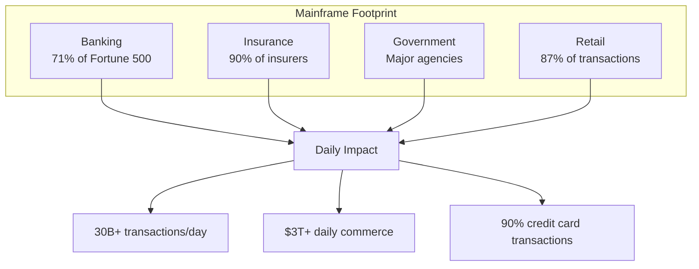
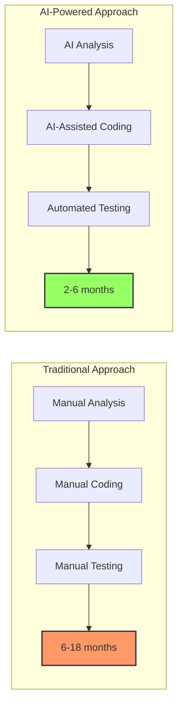
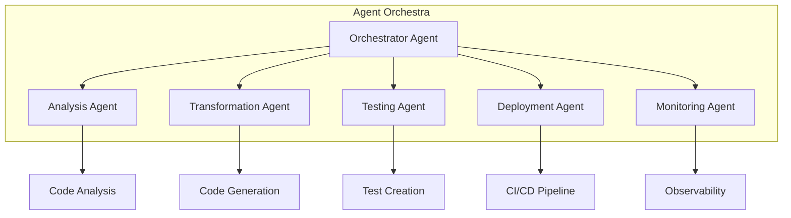
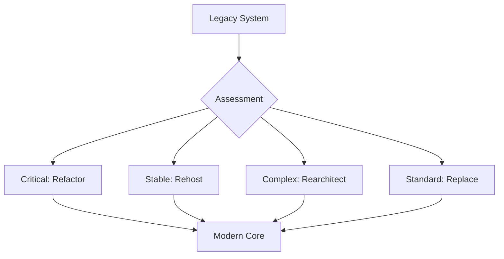
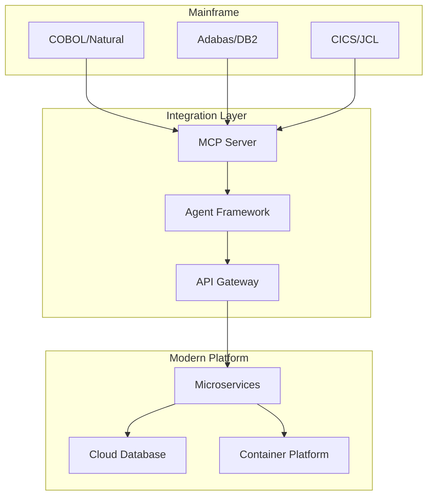

# 🎯 Introduction to Mainframe Modernization

Welcome to the foundational module of the Mainframe Modernization Workshop Series. This introduction provides essential context and knowledge before diving into hands-on exercises.

## 📋 Table of Contents

- [Module Overview](#-module-overview)
- [Understanding Mainframe Modernization](#-understanding-mainframe-modernization)
- [AI-Driven Transformation](#-ai-driven-transformation)
- [Agent-Based Architecture](#-agent-based-architecture)
- [Modernization Strategies](#-modernization-strategies)
- [Technology Stack](#-technology-stack)
- [Success Stories](#-success-stories)
- [Next Steps](#-next-steps)

## 📖 Module Overview

**Duration**: 4 hours | **Level**: Beginner | **Type**: Foundation

### Learning Objectives

By the end of this module, you will:
- ✅ Understand mainframe modernization approaches and patterns
- ✅ Learn how AI agents accelerate transformation
- ✅ Explore different modernization strategies
- ✅ Identify the right approach for your organization
- ✅ Understand the technology stack and tools
- ✅ Be prepared for hands-on workshops

### Module Structure

1. **Hour 1**: Mainframe Landscape and Challenges
2. **Hour 2**: AI and Agent-Based Approaches
3. **Hour 3**: Modernization Strategies and Patterns
4. **Hour 4**: Tools, Technologies, and Planning

## 🖥️ Understanding Mainframe Modernization

### The Mainframe Legacy

Mainframes continue to power critical business operations:



### Why Modernize?

#### Business Drivers
- **Cost Reduction**: Lower operational and licensing costs
- **Agility**: Faster time-to-market for new features
- **Innovation**: Enable modern technologies and APIs
- **Talent**: Access to broader developer pool
- **Integration**: Better connectivity with modern systems

#### Technical Drivers
- **Scalability**: Cloud-native elasticity
- **Performance**: Modern hardware optimization
- **Maintainability**: Contemporary development practices
- **Security**: Modern security frameworks
- **Observability**: Advanced monitoring and analytics

### Common Challenges

| Challenge | Traditional Approach | Modern Solution |
|-----------|---------------------|-----------------|
| Skills Gap | Hire scarce COBOL developers | AI-assisted transformation |
| Risk | Big-bang migration | Incremental modernization |
| Complexity | Manual analysis | Automated discovery |
| Testing | Limited test coverage | AI-generated test suites |
| Documentation | Outdated or missing | Auto-generated docs |

## 🤖 AI-Driven Transformation

### How AI Changes the Game

AI fundamentally transforms the modernization process:



### AI Capabilities in Modernization

#### 1. Code Understanding
```python
# AI analyzes COBOL and extracts business logic
analysis_result = ai_agent.analyze_cobol("""
    IDENTIFICATION DIVISION.
    PROGRAM-ID. CALCULATE-INTEREST.
    
    PROCEDURE DIVISION.
        COMPUTE WS-INTEREST = WS-PRINCIPAL * WS-RATE / 100.
""")

# Output: Identified interest calculation formula
# Business Rule: interest = principal * rate / 100
```

#### 2. Pattern Recognition
- Identifies common mainframe patterns
- Maps to modern equivalents
- Suggests optimal transformations
- Learns from successful migrations

#### 3. Risk Assessment
- Analyzes code complexity
- Identifies dependencies
- Predicts transformation challenges
- Recommends mitigation strategies

## 🏗️ Agent-Based Architecture

### Multi-Agent System Design

Our modernization approach uses specialized agents:



### Agent Specializations

| Agent Type | Responsibilities | Key Capabilities |
|------------|-----------------|------------------|
| **Analysis Agent** | Code understanding | AST parsing, pattern detection, complexity metrics |
| **Business Logic Agent** | Rule extraction | Business rule mining, documentation generation |
| **Transformation Agent** | Code generation | Language translation, framework mapping |
| **Testing Agent** | Quality assurance | Test generation, regression testing |
| **Migration Agent** | Data movement | Schema conversion, data validation |
| **Monitoring Agent** | Operations | Performance tracking, anomaly detection |

### Agent Communication

Agents communicate using the Model Context Protocol (MCP):

```json
{
  "protocol": "mcp/1.0",
  "from": "analysis-agent",
  "to": "transformation-agent",
  "message": {
    "type": "analysis-complete",
    "data": {
      "program": "CALC-INTEREST",
      "complexity": "medium",
      "patterns": ["calculation", "batch-processing"],
      "recommendations": ["use-bigdecimal", "implement-validation"]
    }
  }
}
```

## 📊 Modernization Strategies

### Strategy Comparison

| Strategy | Description | When to Use | Risk Level |
|----------|-------------|-------------|------------|
| **Rehost** | "Lift and shift" to cloud | Quick wins, low risk tolerance | Low |
| **Replatform** | Minor modifications for cloud | Some optimization needed | Medium |
| **Refactor** | Code restructuring | Technical debt reduction | Medium |
| **Rearchitect** | Significant changes | Major improvements needed | High |
| **Rebuild** | Complete rewrite | Legacy beyond repair | High |
| **Replace** | Buy commercial solution | Standard functionality | Medium |

### Hybrid Approach

Most successful modernizations use a hybrid strategy:



### Decision Framework

Use this framework to choose your strategy:

1. **Business Criticality**
   - High → Refactor/Rearchitect
   - Medium → Replatform
   - Low → Rehost/Replace

2. **Technical Complexity**
   - High → Incremental refactoring
   - Medium → Automated transformation
   - Low → Direct migration

3. **Risk Tolerance**
   - Low → Rehost first, modernize later
   - Medium → Selective modernization
   - High → Full transformation

## 💻 Technology Stack

### Core Technologies

#### Azure AI Platform
```yaml
Azure OpenAI Service:
  - GPT-4 for code understanding
  - Code generation capabilities
  - Natural language processing

Azure Machine Learning:
  - Custom model training
  - Pattern recognition
  - Anomaly detection

Azure Cognitive Services:
  - Document Intelligence
  - Language Understanding
  - Translator
```

#### Development Tools
```yaml
Languages:
  - Python (Agent Framework)
  - Java/Spring Boot (Target Platform)
  - TypeScript (Modern UI)
  
Frameworks:
  - FastAPI (MCP Server)
  - LangChain (AI Orchestration)
  - Spring Boot (Microservices)
  
Infrastructure:
  - Docker/Kubernetes
  - GitHub Actions
  - Azure DevOps
```

### Integration Architecture



## 🌟 Success Stories

### Case Study 1: Global Bank

**Challenge**: 10M+ lines of COBOL, 5000+ programs

**Solution**:
- AI-powered analysis identified 500 core programs
- Automated 80% of transformation
- Hybrid approach for critical systems

**Results**:
- 60% cost reduction
- 90% faster deployments
- 99.99% availability maintained

### Case Study 2: Insurance Leader

**Challenge**: Natural/Adabas system with complex MU/PE fields

**Solution**:
- Agent-based schema conversion
- Incremental data migration
- Parallel run validation

**Results**:
- Zero data loss
- 3x performance improvement
- 75% reduction in batch windows

### Key Success Factors

1. **Executive Sponsorship**: C-level commitment
2. **Incremental Approach**: Small wins build confidence
3. **Automation First**: AI/agents handle repetitive tasks
4. **Continuous Learning**: Agents improve over time
5. **Strong Governance**: Clear processes and checkpoints

## 🎯 Workshop Preparation

### Pre-Workshop Checklist

- [ ] Review prerequisites in [QUICK_START.md](QUICK_START.md)
- [ ] Set up development environment
- [ ] Complete Azure account setup
- [ ] Install required tools
- [ ] Join Slack community
- [ ] Review workshop schedule

### Skills Assessment

Rate your current knowledge (1-5):

| Area | Self-Rating | Target |
|------|-------------|--------|
| Mainframe concepts | ___ | 3+ |
| Cloud fundamentals | ___ | 3+ |
| Python basics | ___ | 2+ |
| Docker/containers | ___ | 2+ |
| CI/CD concepts | ___ | 2+ |

### Learning Resources

**Recommended Reading**:
- [Mainframe Modernization Patterns](https://azure.microsoft.com/resources/mainframe-modernization/)
- [AI in Software Development](https://github.com/features/copilot)
- [Cloud Migration Strategies](https://docs.microsoft.com/azure/cloud-adoption-framework/)

**Video Resources**:
- [Introduction to Agent-Based Systems](https://youtube.com/watch?v=agent-intro)
- [Mainframe to Cloud Journey](https://youtube.com/watch?v=mainframe-cloud)
- [AI-Powered Development](https://youtube.com/watch?v=ai-dev)

## 📚 Next Steps

### Choose Your Path

Based on your background and goals:

#### Path 1: COBOL Developer
1. Complete this introduction
2. Proceed to [COBOL Modernization Workshop](appendix-a-cobol-modernization/README.md)
3. Focus on Java transformation exercises
4. Practice with real-world examples

#### Path 2: Natural/Adabas Developer
1. Complete this introduction
2. Review database concepts
3. Start [Natural/Adabas Workshop](appendix-b-natural-adabas-migration/README.md)
4. Emphasis on data migration

#### Path 3: DevOps Engineer
1. Complete this introduction
2. Focus on CI/CD sections
3. Both workshops with pipeline emphasis
4. Advanced automation topics

### Action Items

1. **Today**: Complete environment setup
2. **This Week**: Finish introduction module
3. **Next Week**: Start hands-on workshop
4. **Month 1**: Complete first workshop
5. **Month 2**: Apply to real project

## 🎓 Module Completion

### Knowledge Check

Before proceeding, ensure you can:
- [ ] Explain three modernization strategies
- [ ] Describe how AI agents accelerate transformation
- [ ] Identify appropriate strategy for different scenarios
- [ ] List key components of the technology stack
- [ ] Understand the workshop structure

### Certificate

Upon completion, generate your certificate:
```bash
python generate_certificate.py --module intro --name "Your Name"
```

---

<div align="center">

**🎉 Congratulations on completing the introduction!**

Ready to dive deeper? Choose your next adventure:

[🚀 **Start COBOL Workshop**](appendix-a-cobol-modernization/README.md) | [💾 **Start Natural Workshop**](appendix-b-natural-adabas-migration/README.md) | [📋 **Review Checklist**](workshop-checklist.md)

</div> 