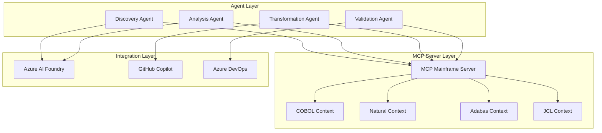

# 🤖 Agent Architecture and Model Context Protocol (MCP) Integration for Mainframe Modernization

## 1. Introduction to MCP for Mainframe

### 1.1 What is Model Context Protocol?

Model Context Protocol (MCP) is an open protocol that enables AI agents to have domain-specific context and interact with external systems through a standardized interface. For mainframe modernization, MCP provides:

- **Domain-Specific Context**: Understanding of COBOL, Natural, PL/I, and mainframe-specific patterns
- **Tool Integration**: Seamless connection to mainframe analysis tools and emulators
- **Memory Management**: Persistent context across modernization sessions
- **Multi-Agent Coordination**: Standardized communication between specialized agents

### 1.2 MCP Architecture for Mainframe



## 2. MCP Server Implementation

### 2.1 Base MCP Server for Mainframe

```python
# mcp_mainframe_server.py
from mcp.server import Server, Request, Response
from mcp.types import Tool, Resource, Context
from typing import Dict, List, Optional
import asyncio

class MainframeMCPServer(Server):
    """MCP Server specialized for mainframe modernization"""
    
    def __init__(self, name: str = "mainframe-mcp-server"):
        super().__init__(name)
        self.contexts = self._initialize_contexts()
        self.tools = self._register_tools()
        self.resources = self._register_resources()
        
    def _initialize_contexts(self) -> Dict[str, Context]:
        """Initialize language-specific contexts"""
        return {
            "cobol": COBOLContext(),
            "natural": NaturalContext(),
            "adabas": AdabasContext(),
            "pl1": PL1Context(),
            "jcl": JCLContext(),
            "assembler": AssemblerContext()
        }
    
    def _register_tools(self) -> List[Tool]:
        """Register mainframe-specific tools"""
        return [
            Tool(
                name="analyze_program",
                description="Analyze mainframe program structure and complexity",
                input_schema={
                    "type": "object",
                    "properties": {
                        "code": {"type": "string"},
                        "language": {"type": "string", "enum": ["cobol", "natural", "pl1"]},
                        "analysis_type": {
                            "type": "array",
                            "items": {
                                "type": "string",
                                "enum": ["complexity", "dependencies", "patterns", "security"]
                            }
                        }
                    },
                    "required": ["code", "language"]
                }
            ),
            Tool(
                name="extract_business_logic",
                description="Extract business rules from mainframe code",
                input_schema={
                    "type": "object",
                    "properties": {
                        "code": {"type": "string"},
                        "language": {"type": "string"},
                        "include_comments": {"type": "boolean", "default": True}
                    },
                    "required": ["code", "language"]
                }
            ),
            Tool(
                name="suggest_modernization_strategy",
                description="Recommend modernization approach based on analysis",
                input_schema={
                    "type": "object",
                    "properties": {
                        "analysis_results": {"type": "object"},
                        "target_platform": {"type": "string"},
                        "constraints": {"type": "array", "items": {"type": "string"}}
                    },
                    "required": ["analysis_results"]
                }
            )
        ]
    
    async def handle_tool_request(self, request: Request) -> Response:
        """Handle tool execution requests"""
        tool_name = request.params.get("name")
        arguments = request.params.get("arguments", {})
        
        if tool_name == "analyze_program":
            return await self._analyze_program(arguments)
        elif tool_name == "extract_business_logic":
            return await self._extract_business_logic(arguments)
        elif tool_name == "suggest_modernization_strategy":
            return await self._suggest_strategy(arguments)
        
        return Response(error=f"Unknown tool: {tool_name}")
    
    async def _analyze_program(self, args: dict) -> Response:
        """Analyze mainframe program with context"""
        code = args["code"]
        language = args["language"]
        analysis_types = args.get("analysis_type", ["complexity"])
        
        # Get language-specific context
        context = self.contexts.get(language)
        if not context:
            return Response(error=f"Unsupported language: {language}")
        
        # Perform analysis with context
        results = {}
        for analysis_type in analysis_types:
            analyzer = context.get_analyzer(analysis_type)
            results[analysis_type] = await analyzer.analyze(code)
        
        return Response(result=results)
```

### 2.2 Language-Specific Contexts

```python
# contexts/cobol_context.py
class COBOLContext(Context):
    """COBOL-specific context for MCP"""
    
    def __init__(self):
        super().__init__("cobol")
        self.patterns = self._load_cobol_patterns()
        self.keywords = self._load_cobol_keywords()
        self.analyzers = {
            "complexity": COBOLComplexityAnalyzer(),
            "dependencies": COBOLDependencyAnalyzer(),
            "patterns": COBOLPatternAnalyzer(),
            "security": COBOLSecurityAnalyzer()
        }
    
    def _load_cobol_patterns(self):
        """Load COBOL-specific patterns"""
        return {
            "computational": [
                r"COMP-[1-3]",
                r"COMPUTATIONAL-[1-3]",
                r"BINARY",
                r"PACKED-DECIMAL"
            ],
            "file_operations": [
                r"OPEN\s+(INPUT|OUTPUT|I-O|EXTEND)",
                r"READ\s+\w+",
                r"WRITE\s+\w+",
                r"CLOSE\s+\w+"
            ],
            "database_calls": [
                r"EXEC\s+SQL",
                r"EXEC\s+CICS",
                r"CALL\s+['\"]ADABAS['\"]",
                r"CALL\s+['\"]IDMS['\"]"
            ],
            "goto_patterns": [
                r"GO\s+TO\s+\w+",
                r"ALTER\s+\w+\s+TO\s+PROCEED\s+TO\s+\w+",
                r"PERFORM\s+\w+\s+THRU\s+\w+"
            ]
        }
    
    def get_analyzer(self, analysis_type: str):
        """Get specific analyzer for COBOL"""
        return self.analyzers.get(analysis_type)
    
    def provide_modernization_hints(self, code_analysis: dict) -> dict:
        """Provide COBOL-specific modernization hints"""
        hints = {
            "recommended_target": "Java",
            "patterns_to_refactor": [],
            "modernization_complexity": "medium"
        }
        
        # Check for problematic patterns
        if code_analysis.get("goto_count", 0) > 10:
            hints["patterns_to_refactor"].append({
                "pattern": "GOTO statements",
                "recommendation": "Refactor to structured programming",
                "complexity": "high"
            })
        
        if code_analysis.get("file_operations", []):
            hints["patterns_to_refactor"].append({
                "pattern": "File I/O",
                "recommendation": "Convert to modern file handling or database",
                "complexity": "medium"
            })
        
        return hints
```

### 2.3 Natural and Adabas Context

```python
# contexts/natural_adabas_context.py
class NaturalAdabasContext(Context):
    """Natural/Adabas-specific context for MCP"""
    
    def __init__(self):
        super().__init__("natural_adabas")
        self.ddm_analyzer = AdabasDDMAnalyzer()
        self.natural_patterns = self._load_natural_patterns()
        
    def _load_natural_patterns(self):
        """Load Natural-specific patterns"""
        return {
            "database_access": [
                r"READ\s+\w+\s+WITH",
                r"FIND\s+\w+\s+WITH",
                r"GET\s+\w+\s+\*ISN",
                r"STORE\s+\w+",
                r"UPDATE\s+\w+",
                r"DELETE\s+\w+"
            ],
            "maps": [
                r"INPUT\s+USING\s+MAP\s+['\"]?\w+['\"]?",
                r"WRITE\s+USING\s+MAP\s+['\"]?\w+['\"]?"
            ],
            "subprograms": [
                r"CALLNAT\s+['\"]?\w+['\"]?",
                r"PERFORM\s+\w+",
                r"FETCH\s+['\"]?\w+['\"]?"
            ]
        }
    
    def analyze_ddm(self, ddm_content: str) -> dict:
        """Analyze Adabas Data Definition Module"""
        return self.ddm_analyzer.analyze(ddm_content)
    
    def suggest_data_model_transformation(self, ddm_analysis: dict) -> dict:
        """Suggest modern data model based on DDM"""
        suggestions = {
            "target_database": "PostgreSQL",
            "orm_framework": "JPA/Hibernate",
            "transformation_steps": []
        }
        
        # Analyze DDM structure and suggest transformations
        for field in ddm_analysis.get("fields", []):
            if field["type"] == "MU":  # Multiple value field
                suggestions["transformation_steps"].append({
                    "field": field["name"],
                    "current_type": "Multiple Value",
                    "suggested_approach": "Separate table with foreign key",
                    "example_sql": f"CREATE TABLE {field['name'].lower()}s (...)"
                })
            elif field["type"] == "PE":  # Periodic group
                suggestions["transformation_steps"].append({
                    "field": field["name"],
                    "current_type": "Periodic Group",
                    "suggested_approach": "JSON column or separate table",
                    "considerations": ["Data volume", "Query patterns"]
                })
        
        return suggestions
```

## 3. Specialized Agents Implementation

### 3.1 Discovery Agent with MCP

```python
# agents/discovery_agent.py
class DiscoveryAgent:
    """Agent for discovering and cataloging mainframe assets"""
    
    def __init__(self, mcp_client, github_client, azure_client):
        self.mcp = mcp_client
        self.github = github_client
        self.azure = azure_client
        self.discovered_assets = {
            "programs": {},
            "copybooks": {},
            "jcl": {},
            "ddms": {},
            "maps": {},
            "subprograms": {}
        }
    
    async def discover_repository(self, repo_path: str) -> dict:
        """Discover all mainframe assets in repository"""
        discovery_report = {
            "timestamp": datetime.utcnow().isoformat(),
            "repository": repo_path,
            "summary": {},
            "detailed_analysis": {}
        }
        
        # Phase 1: File discovery
        files = await self.github.get_repository_files(repo_path)
        
        # Phase 2: Classification with MCP context
        for file in files:
            file_type = self._classify_file(file)
            if file_type:
                content = await self.github.get_file_content(file.path)
                
                # Use MCP for language-specific analysis
                analysis = await self.mcp.call_tool(
                    "analyze_program",
                    {
                        "code": content,
                        "language": file_type,
                        "analysis_type": ["complexity", "dependencies", "patterns"]
                    }
                )
                
                self.discovered_assets[file_type][file.path] = {
                    "content": content,
                    "analysis": analysis.result,
                    "metadata": {
                        "size": len(content),
                        "last_modified": file.last_modified,
                        "detected_patterns": analysis.result.get("patterns", {})
                    }
                }
        
        # Phase 3: Dependency mapping
        dependency_graph = await self._build_dependency_graph()
        
        # Phase 4: Generate discovery report
        discovery_report["summary"] = self._generate_summary()
        discovery_report["dependency_graph"] = dependency_graph
        discovery_report["modernization_candidates"] = await self._identify_modernization_candidates()
        
        return discovery_report
    
    def _classify_file(self, file) -> Optional[str]:
        """Classify file by extension and content"""
        extension_map = {
            ".cbl": "cobol",
            ".cob": "cobol",
            ".nat": "natural",
            ".nsp": "natural",
            ".jcl": "jcl",
            ".proc": "jcl",
            ".cpy": "copybooks",
            ".ddm": "ddms"
        }
        
        ext = file.name.lower().split('.')[-1]
        return extension_map.get(f".{ext}")
    
    async def _build_dependency_graph(self) -> dict:
        """Build comprehensive dependency graph"""
        graph = {
            "nodes": [],
            "edges": []
        }
        
        # Build nodes
        for asset_type, assets in self.discovered_assets.items():
            for path, data in assets.items():
                graph["nodes"].append({
                    "id": path,
                    "type": asset_type,
                    "complexity": data["analysis"].get("complexity", {}).get("score", 0)
                })
        
        # Build edges based on dependencies
        for asset_type, assets in self.discovered_assets.items():
            for path, data in assets.items():
                dependencies = data["analysis"].get("dependencies", {})
                for dep_type, dep_list in dependencies.items():
                    for dep in dep_list:
                        graph["edges"].append({
                            "source": path,
                            "target": dep,
                            "type": dep_type
                        })
        
        return graph
```

### 3.2 Analysis Agent with Advanced Capabilities

```python
# agents/analysis_agent.py
class AnalysisAgent:
    """Advanced analysis agent for mainframe code"""
    
    def __init__(self, mcp_client, ai_foundry_client):
        self.mcp = mcp_client
        self.ai_foundry = ai_foundry_client
        self.analysis_cache = {}
        
    async def perform_deep_analysis(self, asset: dict) -> dict:
        """Perform deep analysis on mainframe asset"""
        code = asset["content"]
        language = asset["type"]
        
        # Multi-layered analysis
        analysis_results = {
            "structural_analysis": await self._analyze_structure(code, language),
            "business_logic_extraction": await self._extract_business_logic(code, language),
            "quality_metrics": await self._calculate_quality_metrics(code, language),
            "security_assessment": await self._assess_security(code, language),
            "modernization_readiness": await self._assess_modernization_readiness(code, language)
        }
        
        return analysis_results
    
    async def _analyze_structure(self, code: str, language: str) -> dict:
        """Analyze code structure"""
        # Use MCP for language-specific structural analysis
        structure = await self.mcp.call_tool(
            "analyze_program",
            {
                "code": code,
                "language": language,
                "analysis_type": ["structure"]
            }
        )
        
        # Enhance with AI Foundry insights
        ai_insights = await self.ai_foundry.analyze_code_structure(
            code=code,
            language=language,
            focus_areas=["modularity", "coupling", "cohesion"]
        )
        
        return {
            "mcp_analysis": structure.result,
            "ai_insights": ai_insights,
            "combined_score": self._calculate_structure_score(structure.result, ai_insights)
        }
```

This is the first document focusing on Agent Architecture and MCP Integration. Would you like me to continue with the next documents covering:

2. Agentic DevOps Implementation
3. Workshop: COBOL Modernization Journey
4. Workshop: Natural and Adabas Modernization
5. CI/CD Modernization Journey
6. Implementation Examples and Code