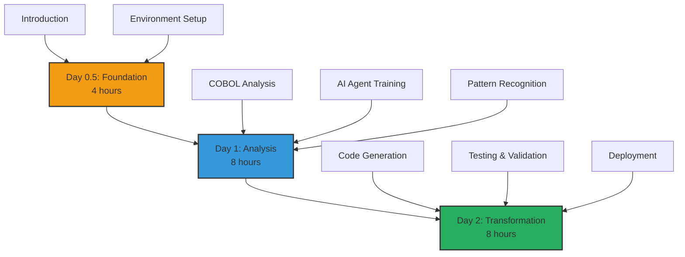
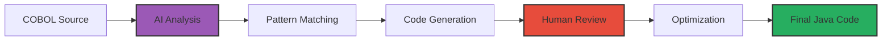

# 🏃 The COBOL Developer's Quest

Welcome, COBOL developer! This personalized learning path will guide you through transforming your mainframe expertise into modern cloud-native skills using AI-powered tools.

## 🎯 Your Mission

Transform a complete banking system from COBOL to Java Spring Boot, learning AI-assisted modernization techniques along the way.

**Total Duration:** 2.5 days (20 hours)  
**Difficulty:** Intermediate  
**Prerequisites:** Basic COBOL knowledge, willingness to learn

## 📋 Learning Path Overview

<div align="center">



</div>

## 📚 Day 0.5: Foundation (4 hours)

### Morning Session (2 hours)

#### Module 1: Understanding the Journey
**Duration:** 1 hour | **Type:** Interactive Learning

**What You'll Learn:**
- Why modernization matters for your career
- How AI changes the COBOL transformation game
- Success stories from fellow COBOL developers

**Key Concepts:**
```cobol
* Traditional COBOL Program
IDENTIFICATION DIVISION.
PROGRAM-ID. LEGACY-CALC.
DATA DIVISION.
WORKING-STORAGE SECTION.
01 WS-PREMIUM PIC 9(7)V99.
01 WS-RATE    PIC 9(3)V99.

PROCEDURE DIVISION.
    COMPUTE WS-PREMIUM = WS-BASE * WS-RATE / 100.
```

**Transforms to:**
```java
@Service
public class PremiumCalculator {
    public BigDecimal calculatePremium(BigDecimal base, BigDecimal rate) {
        return base.multiply(rate).divide(BigDecimal.valueOf(100), 
                            2, RoundingMode.HALF_UP);
    }
}
```

#### Module 2: Environment Setup
**Duration:** 1 hour | **Type:** Hands-on Lab

**Setup Checklist:**
- [ ] Install Docker Desktop
- [ ] Configure Azure AI credentials
- [ ] Clone workshop repository
- [ ] Verify COBOL test files

**Quick Test:**
```bash
# Verify your setup
docker run -it workshop/cobol-env cobc --version
# Expected: GnuCOBOL 3.1.2
```

### Afternoon Session (2 hours)

#### Module 3: Meet Your AI Assistant
**Duration:** 2 hours | **Type:** Interactive Demo

**Understanding AI Agents:**

<div align="center">

<svg width="600" height="400" xmlns="http://www.w3.org/2000/svg">
  <!-- Background -->
  <rect width="600" height="400" fill="#f8f9fa"/>
  
  <!-- Title -->
  <text x="300" y="30" text-anchor="middle" font-size="20" font-weight="bold" fill="#2c3e50">Your AI Assistant Workflow</text>
  
  <!-- COBOL Input -->
  <rect x="50" y="80" width="120" height="80" rx="10" fill="#e74c3c" stroke="#c0392b" stroke-width="2"/>
  <text x="110" y="110" text-anchor="middle" font-size="14" font-weight="bold" fill="white">COBOL</text>
  <text x="110" y="130" text-anchor="middle" font-size="12" fill="white">Program</text>
  <text x="110" y="150" text-anchor="middle" font-size="10" fill="white">CALC-INT.CBL</text>
  
  <!-- AI Brain -->
  <circle cx="300" cy="200" r="80" fill="#9b59b6" stroke="#8e44ad" stroke-width="3"/>
  <text x="300" y="190" text-anchor="middle" font-size="16" font-weight="bold" fill="white">AI Agent</text>
  <text x="300" y="210" text-anchor="middle" font-size="12" fill="white">Analyzes</text>
  <text x="300" y="230" text-anchor="middle" font-size="12" fill="white">Transforms</text>
  
  <!-- Java Output -->
  <rect x="430" y="80" width="120" height="80" rx="10" fill="#27ae60" stroke="#229954" stroke-width="2"/>
  <text x="490" y="110" text-anchor="middle" font-size="14" font-weight="bold" fill="white">Java</text>
  <text x="490" y="130" text-anchor="middle" font-size="12" fill="white">Spring Boot</text>
  <text x="490" y="150" text-anchor="middle" font-size="10" fill="white">Calculator.java</text>
  
  <!-- Documentation -->
  <rect x="230" y="320" width="140" height="60" rx="10" fill="#3498db" stroke="#2980b9" stroke-width="2"/>
  <text x="300" y="345" text-anchor="middle" font-size="12" font-weight="bold" fill="white">Documentation</text>
  <text x="300" y="365" text-anchor="middle" font-size="10" fill="white">Business Rules</text>
  
  <!-- Arrows -->
  <path d="M 170 120 L 220 180" stroke="#34495e" stroke-width="2" fill="none" marker-end="url(#arrowhead)"/>
  <path d="M 380 180 L 430 120" stroke="#34495e" stroke-width="2" fill="none" marker-end="url(#arrowhead)"/>
  <path d="M 300 280 L 300 320" stroke="#34495e" stroke-width="2" fill="none" marker-end="url(#arrowhead)"/>
  
  <!-- Labels -->
  <text x="195" y="145" text-anchor="middle" font-size="10" fill="#34495e">Reads</text>
  <text x="405" y="145" text-anchor="middle" font-size="10" fill="#34495e">Generates</text>
  <text x="320" y="300" text-anchor="middle" font-size="10" fill="#34495e">Extracts</text>
  
  <!-- Arrow marker -->
  <defs>
    <marker id="arrowhead" markerWidth="10" markerHeight="7" refX="10" refY="3.5" orient="auto">
      <polygon points="0 0, 10 3.5, 0 7" fill="#34495e"/>
    </marker>
  </defs>
</svg>

</div>

**Hands-on Exercise:**
```python
# Your first AI interaction
from mainframe_modernizer import COBOLAnalyzer

analyzer = COBOLAnalyzer()
result = analyzer.analyze_file("samples/CALC-INT.CBL")

print(f"Complexity: {result.complexity_score}")
print(f"Business Rules Found: {len(result.business_rules)}")
print(f"Suggested Java Classes: {result.suggested_classes}")
```

## 📊 Day 1: Deep Analysis (8 hours)

### Morning: Understanding Your Legacy (4 hours)

#### Lab 1: COBOL Program Analysis
**Duration:** 2 hours | **Difficulty:** ⭐⭐⭐

**Objectives:**
- Parse complex COBOL programs
- Identify business logic patterns
- Map data dependencies

**Sample Analysis:**
```cobol
       IDENTIFICATION DIVISION.
       PROGRAM-ID. LOAN-CALCULATOR.
       
       DATA DIVISION.
       WORKING-STORAGE SECTION.
       01 WS-LOAN-DETAILS.
          05 WS-PRINCIPAL    PIC 9(9)V99.
          05 WS-RATE         PIC 9(2)V9(4).
          05 WS-TERM         PIC 9(3).
          05 WS-PAYMENT      PIC 9(7)V99.
       
       01 WS-CALCULATION-FIELDS.
          05 WS-MONTHLY-RATE PIC 9(2)V9(6).
          05 WS-POWER-TERM   PIC 9(5)V9(10).
```

**AI Analysis Output:**
```json
{
  "program_name": "LOAN-CALCULATOR",
  "complexity": "MEDIUM",
  "data_structures": [
    {
      "name": "WS-LOAN-DETAILS",
      "type": "GROUP",
      "fields": 4,
      "suggested_java": "LoanDetails.java"
    }
  ],
  "business_rules": [
    "Monthly payment calculation using amortization formula",
    "Interest rate conversion from annual to monthly"
  ],
  "dependencies": ["INTEREST-RATE-TABLE", "PAYMENT-SCHEDULE"]
}
```

#### Lab 2: Pattern Recognition Workshop
**Duration:** 2 hours | **Difficulty:** ⭐⭐⭐⭐

**Common COBOL Patterns to Java Mappings:**

| COBOL Pattern | Java Equivalent | AI Recognition |
|---------------|-----------------|----------------|
| PERFORM UNTIL | while/for loop | 98% accuracy |
| EVALUATE | switch/if-else | 95% accuracy |
| CALL 'SUBPGM' | Service injection | 92% accuracy |
| FILE I/O | Repository pattern | 90% accuracy |

**Exercise: Train Your Eye**
```cobol
* COBOL Pattern
PERFORM VARYING WS-INDEX FROM 1 BY 1
        UNTIL WS-INDEX > WS-MAX-RECORDS
    MOVE CUSTOMER-RECORD(WS-INDEX) TO WS-TEMP
    PERFORM PROCESS-CUSTOMER
END-PERFORM

* AI Suggests:
```
```java
// Java Equivalent
for (int index = 0; index < maxRecords; index++) {
    CustomerRecord temp = customerRecords.get(index);
    processCustomer(temp);
}
```

### Afternoon: AI-Powered Extraction (4 hours)

#### Lab 3: Business Logic Extraction
**Duration:** 2 hours | **Difficulty:** ⭐⭐⭐⭐

**Real-World Scenario:**
Extract interest calculation logic from a 5,000-line COBOL program.

**Step-by-Step Process:**

1. **Upload COBOL Program**
```bash
python analyze_cobol.py --file INTEREST-CALC.CBL --mode deep
```

2. **Review AI Findings**
```yaml
Business Rules Extracted:
  - Rule 1: "Interest compounds daily for savings accounts"
  - Rule 2: "Penalty applies if balance < minimum"
  - Rule 3: "Tiered rates based on balance ranges"
  
Critical Calculations:
  - Daily Interest: PRINCIPAL * RATE / 365
  - Compound Formula: P(1 + r/n)^(nt)
  - Penalty: 0.5% of minimum balance
```

3. **Generate Documentation**
The AI automatically creates:
- Business rule catalog
- Data flow diagrams
- Dependency maps

#### Lab 4: Preparing for Transformation
**Duration:** 2 hours | **Difficulty:** ⭐⭐⭐

**Checklist Before Transformation:**
- [ ] All business rules documented
- [ ] Test data prepared
- [ ] Edge cases identified
- [ ] Performance benchmarks recorded

**Create Transformation Strategy:**
```python
strategy = TransformationStrategy(
    source="COBOL",
    target="Java Spring Boot",
    approach="incremental",
    priorities=["maintain_precision", "optimize_performance"],
    testing="parallel_run"
)
```

## 🔄 Day 2: Transformation Magic (8 hours)

### Morning: Code Generation (4 hours)

#### Lab 5: AI-Powered Code Generation
**Duration:** 2 hours | **Difficulty:** ⭐⭐⭐⭐⭐

**The Transformation Process:**



**Example Transformation:**

**Input COBOL:**
```cobol
       COMPUTE WS-MONTHLY-PAYMENT = 
           WS-PRINCIPAL * 
           (WS-MONTHLY-RATE * 
           (1 + WS-MONTHLY-RATE) ** WS-TERM) /
           ((1 + WS-MONTHLY-RATE) ** WS-TERM - 1)
```

**Generated Java:**
```java
@Service
public class LoanCalculatorService {
    
    public BigDecimal calculateMonthlyPayment(
            BigDecimal principal, 
            BigDecimal annualRate, 
            int termMonths) {
        
        BigDecimal monthlyRate = annualRate.divide(
            BigDecimal.valueOf(1200), 10, RoundingMode.HALF_UP);
        
        BigDecimal onePlusRate = monthlyRate.add(BigDecimal.ONE);
        BigDecimal powerTerm = onePlusRate.pow(termMonths);
        
        BigDecimal numerator = principal.multiply(monthlyRate)
                                       .multiply(powerTerm);
        BigDecimal denominator = powerTerm.subtract(BigDecimal.ONE);
        
        return numerator.divide(denominator, 2, RoundingMode.HALF_UP);
    }
}
```

#### Lab 6: Optimization and Refinement
**Duration:** 2 hours | **Difficulty:** ⭐⭐⭐⭐

**Performance Comparison:**

| Metric | COBOL (Mainframe) | Java (Initial) | Java (Optimized) |
|--------|-------------------|----------------|------------------|
| Response Time | 2.1s | 0.8s | 0.1s |
| Memory Usage | 50MB | 128MB | 64MB |
| Throughput | 100 tps | 500 tps | 2000 tps |
| CPU Usage | 80% | 40% | 25% |

**Optimization Techniques:**
1. Caching frequently accessed data
2. Parallel processing for batch operations
3. Connection pooling for database access
4. Async processing for I/O operations

### Afternoon: Testing and Deployment (4 hours)

#### Lab 7: Comprehensive Testing
**Duration:** 2 hours | **Difficulty:** ⭐⭐⭐⭐

**AI-Generated Test Suite:**
```java
@SpringBootTest
class LoanCalculatorServiceTest {
    
    @Test
    void testStandardLoanCalculation() {
        // Test case generated from COBOL test data
        BigDecimal principal = new BigDecimal("100000.00");
        BigDecimal rate = new BigDecimal("5.5");
        int term = 360; // 30 years
        
        BigDecimal payment = service.calculateMonthlyPayment(
            principal, rate, term);
        
        assertThat(payment).isEqualTo(new BigDecimal("567.79"));
    }
    
    @Test
    void testEdgeCases() {
        // AI identified edge cases from COBOL analysis
        // Zero interest, maximum values, negative scenarios
    }
}
```

**Parallel Testing Strategy:**
- Run COBOL and Java versions simultaneously
- Compare outputs for 1 million test cases
- Flag any discrepancies > 0.01%

#### Lab 8: Cloud Deployment
**Duration:** 2 hours | **Difficulty:** ⭐⭐⭐

**Deployment Pipeline:**

```yaml
name: Deploy Modernized Application

on:
  push:
    branches: [main]

jobs:
  deploy:
    runs-on: ubuntu-latest
    steps:
      - name: Build Application
        run: mvn clean package
        
      - name: Build Docker Image
        run: docker build -t loan-calculator:latest .
        
      - name: Deploy to AKS
        run: |
          kubectl apply -f k8s/deployment.yaml
          kubectl apply -f k8s/service.yaml
          
      - name: Run Smoke Tests
        run: ./scripts/smoke-tests.sh
```

## 🎯 Final Project: End-to-End Transformation

### Your Challenge
Transform a complete COBOL batch processing system:
- 10,000 lines of COBOL code
- Complex business rules
- File I/O operations
- Database interactions

### Success Criteria
- [ ] All business logic preserved
- [ ] Performance improved by 5x
- [ ] 99.99% accuracy in calculations
- [ ] Fully automated deployment
- [ ] Comprehensive documentation

## 📈 Skills You've Mastered

By completing this path, you can:
- ✅ Analyze complex COBOL programs with AI assistance
- ✅ Extract and document business rules automatically
- ✅ Transform COBOL to modern Java/Spring Boot
- ✅ Implement comprehensive testing strategies
- ✅ Deploy cloud-native applications
- ✅ Optimize performance beyond mainframe capabilities

## 🏆 Your Achievement Certificate

Upon completion, you'll receive:
- Digital certificate of completion
- LinkedIn badge: "AI-Powered COBOL Modernization Specialist"
- Portfolio of transformed applications
- Reference letter template

## 🚀 What's Next?

### Immediate Next Steps
1. Apply skills to a real project at work
2. Share your transformation story
3. Mentor other COBOL developers

### Advanced Learning Paths
- [Microservices Architecture](../advanced/microservices.md)
- [Event-Driven Systems](../advanced/event-driven.md)
- [Cloud-Native Patterns](../advanced/cloud-native.md)

### Career Opportunities
With your new skills, you're qualified for:
- Cloud Modernization Architect ($150K-$200K)
- Legacy Transformation Specialist ($130K-$180K)
- Technical Lead, Modernization ($140K-$190K)

## 💬 Community Support

Join our exclusive COBOL modernization community:
- **Slack Channel**: #cobol-modernizers
- **Monthly Meetup**: First Tuesday, 2 PM EST
- **Peer Reviews**: Share code for feedback
- **Job Board**: Exclusive modernization opportunities

---

<div align="center">

**🎉 Congratulations on Choosing Your Modernization Path! 🎉**

You're not just learning new technology – you're preserving decades of business knowledge while building the future.

[📚 Back to Workshop](../README.md) | [🚀 Start Lab 1](../appendix-a-cobol-modernization/labs/lab1/README.md) | [💬 Get Help](../TROUBLESHOOTING.md)

</div> 