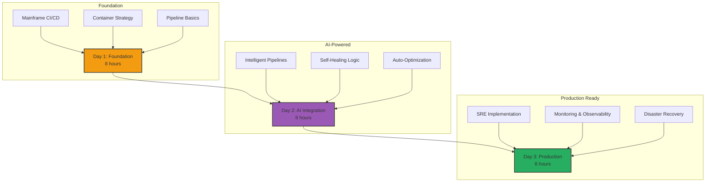

# 🔧 The DevOps Pioneer's Route

Welcome, DevOps engineer! This path transforms you into a mainframe modernization pipeline expert, building intelligent CI/CD systems that bridge legacy and cloud-native worlds.

## 🎯 Your Mission

Build self-healing, AI-powered CI/CD pipelines that automatically modernize, test, and deploy mainframe applications to the cloud with zero downtime.

**Total Duration:** 3 days (24 hours)  
**Difficulty:** Advanced  
**Prerequisites:** CI/CD experience, containerization knowledge, basic scripting

## 📋 Learning Path Overview

<div align="center">



</div>

## 🌟 The DevOps Challenge

### Your Unique Position

As a DevOps engineer in mainframe modernization, you'll:
- Bridge 50-year-old systems with cutting-edge cloud tech
- Implement AI that understands both COBOL and Kubernetes
- Build pipelines that never sleep and self-heal
- Achieve 99.99% uptime during transformation

<div align="center">

<svg width="800" height="500" xmlns="http://www.w3.org/2000/svg">
  <!-- Background -->
  <rect width="800" height="500" fill="#f5f7fa"/>
  
  <!-- Title -->
  <text x="400" y="30" text-anchor="middle" font-size="24" font-weight="bold" fill="#2c3e50">Intelligent Mainframe CI/CD Pipeline</text>
  
  <!-- Mainframe Source -->
  <rect x="50" y="100" width="120" height="300" rx="10" fill="#34495e" stroke="#2c3e50" stroke-width="2"/>
  <text x="110" y="130" text-anchor="middle" font-size="14" font-weight="bold" fill="white">Mainframe</text>
  <text x="110" y="150" text-anchor="middle" font-size="10" fill="white">• COBOL</text>
  <text x="110" y="165" text-anchor="middle" font-size="10" fill="white">• Natural</text>
  <text x="110" y="180" text-anchor="middle" font-size="10" fill="white">• JCL</text>
  <text x="110" y="195" text-anchor="middle" font-size="10" fill="white">• CICS</text>
  
  <!-- Git Integration -->
  <rect x="200" y="200" width="100" height="100" rx="10" fill="#f39c12" stroke="#e67e22" stroke-width="2"/>
  <text x="250" y="230" text-anchor="middle" font-size="14" font-weight="bold" fill="white">Git</text>
  <text x="250" y="250" text-anchor="middle" font-size="10" fill="white">Version</text>
  <text x="250" y="265" text-anchor="middle" font-size="10" fill="white">Control</text>
  
  <!-- AI Brain -->
  <circle cx="400" cy="250" r="80" fill="#9b59b6" stroke="#8e44ad" stroke-width="3"/>
  <text x="400" y="240" text-anchor="middle" font-size="16" font-weight="bold" fill="white">AI Engine</text>
  <text x="400" y="260" text-anchor="middle" font-size="10" fill="white">• Analyze</text>
  <text x="400" y="275" text-anchor="middle" font-size="10" fill="white">• Optimize</text>
  <text x="400" y="290" text-anchor="middle" font-size="10" fill="white">• Self-Heal</text>
  
  <!-- Pipeline Stages -->
  <g transform="translate(500, 100)">
    <rect x="0" y="0" width="80" height="40" rx="5" fill="#e74c3c" stroke="#c0392b" stroke-width="2"/>
    <text x="40" y="25" text-anchor="middle" font-size="12" fill="white">Build</text>
    
    <rect x="0" y="60" width="80" height="40" rx="5" fill="#e67e22" stroke="#d35400" stroke-width="2"/>
    <text x="40" y="85" text-anchor="middle" font-size="12" fill="white">Test</text>
    
    <rect x="0" y="120" width="80" height="40" rx="5" fill="#f39c12" stroke="#e67e22" stroke-width="2"/>
    <text x="40" y="145" text-anchor="middle" font-size="12" fill="white">Security</text>
    
    <rect x="0" y="180" width="80" height="40" rx="5" fill="#27ae60" stroke="#229954" stroke-width="2"/>
    <text x="40" y="205" text-anchor="middle" font-size="12" fill="white">Deploy</text>
    
    <rect x="0" y="240" width="80" height="40" rx="5" fill="#3498db" stroke="#2980b9" stroke-width="2"/>
    <text x="40" y="265" text-anchor="middle" font-size="12" fill="white">Monitor</text>
  </g>
  
  <!-- Cloud Target -->
  <rect x="630" y="100" width="120" height="300" rx="10" fill="#2ecc71" stroke="#27ae60" stroke-width="2"/>
  <text x="690" y="130" text-anchor="middle" font-size="14" font-weight="bold" fill="white">Cloud</text>
  <text x="690" y="150" text-anchor="middle" font-size="10" fill="white">• Kubernetes</text>
  <text x="690" y="165" text-anchor="middle" font-size="10" fill="white">• Microservices</text>
  <text x="690" y="180" text-anchor="middle" font-size="10" fill="white">• Auto-scale</text>
  <text x="690" y="195" text-anchor="middle" font-size="10" fill="white">• Self-heal</text>
  
  <!-- Connections -->
  <path d="M 170 250 L 200 250" stroke="#34495e" stroke-width="2" fill="none" marker-end="url(#arrowhead)"/>
  <path d="M 300 250 L 320 250" stroke="#34495e" stroke-width="2" fill="none" marker-end="url(#arrowhead)"/>
  <path d="M 480 250 L 500 250" stroke="#34495e" stroke-width="2" fill="none" marker-end="url(#arrowhead)"/>
  <path d="M 580 250 L 630 250" stroke="#34495e" stroke-width="2" fill="none" marker-end="url(#arrowhead)"/>
  
  <!-- Feedback Loop -->
  <path d="M 690 400 Q 400 450 110 400" stroke="#e74c3c" stroke-width="2" fill="none" stroke-dasharray="5,5" marker-end="url(#arrowhead)"/>
  <text x="400" y="440" text-anchor="middle" font-size="12" fill="#e74c3c">Continuous Feedback & Learning</text>
  
  <!-- Arrow marker -->
  <defs>
    <marker id="arrowhead" markerWidth="10" markerHeight="7" refX="10" refY="3.5" orient="auto">
      <polygon points="0 0, 10 3.5, 0 7" fill="#34495e"/>
    </marker>
  </defs>
</svg>

</div>

## 📚 Day 1: Foundation - Mainframe CI/CD (8 hours)

### Morning: Understanding Mainframe DevOps (4 hours)

#### Module 1: Mainframe Source Control
**Duration:** 2 hours | **Type:** Hands-on Setup

**Challenge:** Mainframes don't use Git natively!

**Solution Architecture:**
```yaml
# Mainframe Git Bridge Configuration
mainframe_bridge:
  type: "bidirectional-sync"
  source:
    type: "PDS"  # Partitioned Dataset
    library: "PROD.COBOL.SOURCE"
    encoding: "EBCDIC"
  target:
    type: "git"
    repo: "https://github.com/company/mainframe-code"
    branch: "main"
    encoding: "UTF-8"
  sync:
    frequency: "on-change"
    conflict_resolution: "mainframe-wins"
```

**Implementation Steps:**
1. Install Git bridge on mainframe LPAR
2. Configure dataset monitoring
3. Set up encoding conversion
4. Implement conflict resolution

**Your First Pipeline:**
```yaml
name: Mainframe Source Sync
on:
  schedule:
    - cron: '*/15 * * * *'  # Every 15 minutes
  
jobs:
  sync-mainframe:
    runs-on: self-hosted  # Mainframe-connected runner
    steps:
      - name: Extract from PDS
        run: |
          zowe files download ds "PROD.COBOL.SOURCE" \
            --binary false \
            --encoding IBM-1047
            
      - name: Convert and Commit
        run: |
          iconv -f IBM-1047 -t UTF-8 *.cbl
          git add .
          git commit -m "Sync from mainframe: $(date)"
          git push
```

#### Module 2: Containerizing Mainframe Workloads
**Duration:** 2 hours | **Type:** Advanced Lab

**The Container Strategy:**

```dockerfile
# Multi-stage Dockerfile for COBOL application
FROM ubuntu:20.04 AS cobol-builder

# Install GnuCOBOL
RUN apt-get update && apt-get install -y \
    gnucobol \
    libcob-dev \
    build-essential

# Copy COBOL source
COPY src/*.cbl /app/src/

# Compile COBOL to executable
WORKDIR /app
RUN cobc -x -o app src/main.cbl

# Runtime stage
FROM ubuntu:20.04-slim

# Install runtime dependencies
RUN apt-get update && apt-get install -y \
    libcob4 \
    && rm -rf /var/lib/apt/lists/*

# Copy compiled application
COPY --from=cobol-builder /app/app /usr/local/bin/

# Add health check
HEALTHCHECK --interval=30s --timeout=3s \
    CMD /usr/local/bin/app --health || exit 1

ENTRYPOINT ["/usr/local/bin/app"]
```

**Kubernetes Deployment:**
```yaml
apiVersion: apps/v1
kind: Deployment
metadata:
  name: cobol-microservice
  labels:
    app: legacy-modernized
spec:
  replicas: 3
  selector:
    matchLabels:
      app: cobol-service
  template:
    metadata:
      labels:
        app: cobol-service
    spec:
      containers:
      - name: cobol-app
        image: company/cobol-service:latest
        resources:
          requests:
            memory: "256Mi"
            cpu: "500m"
          limits:
            memory: "512Mi"
            cpu: "1000m"
        livenessProbe:
          httpGet:
            path: /health
            port: 8080
          initialDelaySeconds: 30
          periodSeconds: 10
```

### Afternoon: Building Your First Pipeline (4 hours)

#### Module 3: GitHub Actions for Mainframe
**Duration:** 2 hours | **Type:** Hands-on Implementation

**Complete Pipeline Example:**
```yaml
name: Mainframe Modernization Pipeline

on:
  push:
    branches: [main]
  pull_request:
    branches: [main]

env:
  MAINFRAME_HOST: ${{ secrets.MAINFRAME_HOST }}
  MAINFRAME_USER: ${{ secrets.MAINFRAME_USER }}
  AZURE_CREDENTIALS: ${{ secrets.AZURE_CREDENTIALS }}

jobs:
  analyze:
    name: AI Code Analysis
    runs-on: ubuntu-latest
    outputs:
      risk-score: ${{ steps.analyze.outputs.risk }}
      complexity: ${{ steps.analyze.outputs.complexity }}
    steps:
      - uses: actions/checkout@v3
      
      - name: Setup Python
        uses: actions/setup-python@v4
        with:
          python-version: '3.10'
          
      - name: Install AI Analyzer
        run: |
          pip install mainframe-ai-analyzer
          
      - name: Analyze COBOL Code
        id: analyze
        run: |
          python -m mainframe_analyzer \
            --source ./cobol \
            --output analysis-report.json
          echo "risk=$(jq .risk_score analysis-report.json)" >> $GITHUB_OUTPUT
          echo "complexity=$(jq .complexity analysis-report.json)" >> $GITHUB_OUTPUT
          
      - name: Upload Analysis Report
        uses: actions/upload-artifact@v3
        with:
          name: analysis-report
          path: analysis-report.json

  transform:
    name: AI-Powered Transformation
    needs: analyze
    if: needs.analyze.outputs.risk-score < 7
    runs-on: ubuntu-latest
    steps:
      - uses: actions/checkout@v3
      
      - name: Setup Java
        uses: actions/setup-java@v3
        with:
          java-version: '17'
          distribution: 'temurin'
          
      - name: Transform COBOL to Java
        run: |
          docker run --rm \
            -v $PWD:/workspace \
            mainframe/cobol-transformer:latest \
            --input /workspace/cobol \
            --output /workspace/java \
            --framework spring-boot
            
      - name: Build Java Application
        run: |
          cd java
          mvn clean package
          
      - name: Run Unit Tests
        run: |
          cd java
          mvn test
          
      - name: Upload Artifacts
        uses: actions/upload-artifact@v3
        with:
          name: java-application
          path: java/target/*.jar

  security-scan:
    name: Security Analysis
    needs: transform
    runs-on: ubuntu-latest
    steps:
      - uses: actions/checkout@v3
      
      - name: Run SAST Scan
        uses: github/super-linter@v4
        env:
          DEFAULT_BRANCH: main
          GITHUB_TOKEN: ${{ secrets.GITHUB_TOKEN }}
          
      - name: Dependency Check
        run: |
          docker run --rm \
            -v $PWD:/src \
            owasp/dependency-check \
            --scan /src \
            --format "ALL" \
            --project "Mainframe-App"
            
      - name: Container Scan
        uses: aquasecurity/trivy-action@master
        with:
          image-ref: 'company/cobol-service:latest'
          format: 'sarif'
          output: 'trivy-results.sarif'

  deploy-staging:
    name: Deploy to Staging
    needs: [transform, security-scan]
    runs-on: ubuntu-latest
    environment: staging
    steps:
      - name: Azure Login
        uses: azure/login@v1
        with:
          creds: ${{ secrets.AZURE_CREDENTIALS }}
          
      - name: Deploy to AKS
        run: |
          az aks get-credentials \
            --resource-group mainframe-rg \
            --name mainframe-aks
            
          kubectl apply -f k8s/staging/
          kubectl rollout status deployment/cobol-service -n staging
          
      - name: Run Smoke Tests
        run: |
          ./scripts/smoke-tests.sh staging
```

#### Module 4: Monitoring and Observability
**Duration:** 2 hours | **Type:** Implementation Lab

**Comprehensive Monitoring Stack:**

```yaml
# Prometheus Configuration
apiVersion: v1
kind: ConfigMap
metadata:
  name: prometheus-config
data:
  prometheus.yml: |
    global:
      scrape_interval: 15s
    scrape_configs:
      - job_name: 'mainframe-metrics'
        static_configs:
          - targets: ['mainframe-exporter:9100']
      - job_name: 'cobol-services'
        kubernetes_sd_configs:
          - role: pod
            namespaces:
              names: ['production', 'staging']
        relabel_configs:
          - source_labels: [__meta_kubernetes_pod_label_app]
            regex: cobol-.*
            action: keep
```

**Grafana Dashboard for Mainframe Metrics:**
```json
{
  "dashboard": {
    "title": "Mainframe Modernization Metrics",
    "panels": [
      {
        "title": "MIPS Consumption",
        "targets": [
          {
            "expr": "mainframe_mips_usage{job='mainframe-metrics'}"
          }
        ]
      },
      {
        "title": "Batch Job Success Rate",
        "targets": [
          {
            "expr": "rate(batch_job_success_total[5m]) / rate(batch_job_total[5m])"
          }
        ]
      },
      {
        "title": "API Response Time",
        "targets": [
          {
            "expr": "histogram_quantile(0.95, api_response_time_bucket)"
          }
        ]
      }
    ]
  }
}
```

## 🤖 Day 2: AI-Powered Pipeline Intelligence (8 hours)

### Morning: Building Intelligence (4 hours)

#### Module 5: Self-Healing Pipelines
**Duration:** 2 hours | **Type:** Advanced Implementation

**AI-Driven Pipeline Logic:**

```python
# self_healing_pipeline.py
import asyncio
from typing import Dict, List, Optional
import openai
from prometheus_client import Counter, Histogram
import logging

class SelfHealingPipeline:
    def __init__(self, config: Dict):
        self.config = config
        self.failure_counter = Counter('pipeline_failures', 'Pipeline failure count')
        self.healing_histogram = Histogram('healing_duration', 'Healing duration')
        self.ai_client = openai.Client(api_key=config['openai_key'])
        
    async def execute_stage(self, stage: str, context: Dict) -> Dict:
        """Execute pipeline stage with self-healing capabilities"""
        max_retries = 3
        retry_count = 0
        
        while retry_count < max_retries:
            try:
                result = await self._run_stage(stage, context)
                return result
            except Exception as e:
                retry_count += 1
                self.failure_counter.inc()
                
                # AI-powered root cause analysis
                healing_strategy = await self._analyze_failure(e, stage, context)
                
                if healing_strategy:
                    logging.info(f"Applying healing strategy: {healing_strategy['action']}")
                    await self._apply_healing(healing_strategy)
                else:
                    raise e
                    
        raise Exception(f"Stage {stage} failed after {max_retries} attempts")
    
    async def _analyze_failure(self, error: Exception, stage: str, context: Dict) -> Optional[Dict]:
        """Use AI to analyze failure and suggest remediation"""
        prompt = f"""
        Pipeline stage '{stage}' failed with error: {str(error)}
        
        Context:
        - Previous successful runs: {context.get('success_count', 0)}
        - Environment: {context.get('environment', 'unknown')}
        - Recent changes: {context.get('recent_changes', [])}
        
        Analyze the failure and suggest a remediation strategy.
        Response format:
        {{
            "root_cause": "identified root cause",
            "action": "specific remediation action",
            "commands": ["command1", "command2"],
            "confidence": 0.0-1.0
        }}
        """
        
        response = await self.ai_client.chat.completions.create(
            model="gpt-4",
            messages=[{"role": "system", "content": prompt}],
            temperature=0.3
        )
        
        strategy = json.loads(response.choices[0].message.content)
        
        if strategy['confidence'] > 0.7:
            return strategy
        return None
    
    async def _apply_healing(self, strategy: Dict):
        """Apply the healing strategy"""
        with self.healing_histogram.time():
            for command in strategy['commands']:
                await asyncio.create_subprocess_shell(command)
                await asyncio.sleep(1)  # Brief pause between commands

# GitHub Action Integration
if __name__ == "__main__":
    pipeline = SelfHealingPipeline({
        'openai_key': os.environ['OPENAI_API_KEY']
    })
    
    # Execute with self-healing
    result = asyncio.run(pipeline.execute_stage(
        stage=sys.argv[1],
        context=json.loads(sys.argv[2])
    ))
    
    print(json.dumps(result))
```

**Self-Healing Scenarios:**

| Failure Type | AI Detection | Automated Remediation |
|--------------|--------------|----------------------|
| Memory Limit | Container OOM | Increase resource limits |
| Network Timeout | Connection refused | Retry with backoff |
| Dependency Missing | Module not found | Install missing package |
| Test Flakiness | Intermittent failure | Rerun with isolation |
| Resource Lock | Deadlock detected | Release and retry |

#### Module 6: Intelligent Test Generation
**Duration:** 2 hours | **Type:** AI Implementation

**AI Test Generator:**
```python
class AITestGenerator:
    def __init__(self):
        self.test_templates = {
            'unit': self._generate_unit_test,
            'integration': self._generate_integration_test,
            'performance': self._generate_performance_test
        }
    
    async def generate_tests_for_cobol(self, cobol_code: str, java_code: str) -> List[str]:
        """Generate comprehensive test suite from COBOL analysis"""
        
        # Extract business rules from COBOL
        rules = await self._extract_business_rules(cobol_code)
        
        # Generate test cases for each rule
        test_cases = []
        for rule in rules:
            test = await self._generate_test_case(rule, java_code)
            test_cases.append(test)
            
        return test_cases
    
    async def _generate_test_case(self, rule: Dict, java_code: str) -> str:
        """Generate specific test case for business rule"""
        
        prompt = f"""
        Generate a JUnit test for this business rule:
        Rule: {rule['description']}
        Input constraints: {rule['constraints']}
        Expected behavior: {rule['expected_behavior']}
        
        Java code to test:
        {java_code}
        
        Generate comprehensive test including:
        1. Happy path
        2. Edge cases
        3. Error conditions
        4. Performance assertions
        """
        
        response = await self.ai_client.generate(prompt)
        return response
```

### Afternoon: Advanced Automation (4 hours)

#### Module 7: Predictive Pipeline Optimization
**Duration:** 2 hours | **Type:** Machine Learning Integration

**ML-Powered Pipeline Optimizer:**

```python
from sklearn.ensemble import RandomForestRegressor
import pandas as pd
import numpy as np

class PipelineOptimizer:
    def __init__(self):
        self.model = RandomForestRegressor(n_estimators=100)
        self.performance_history = []
        
    def predict_optimal_configuration(self, workload_characteristics: Dict) -> Dict:
        """Predict optimal pipeline configuration based on workload"""
        
        features = self._extract_features(workload_characteristics)
        
        # Predict optimal settings
        predictions = {
            'parallel_jobs': int(self.model.predict([[features['code_complexity'], 
                                                     features['test_count']]])[0]),
            'memory_allocation': int(self.model.predict([[features['data_size'], 
                                                         features['complexity']]])[0]),
            'timeout_seconds': int(self.model.predict([[features['historical_duration'], 
                                                       features['complexity']]])[0])
        }
        
        return predictions
    
    def optimize_github_workflow(self, workflow_yaml: str, predictions: Dict) -> str:
        """Apply ML predictions to GitHub workflow"""
        
        import yaml
        workflow = yaml.safe_load(workflow_yaml)
        
        # Apply optimizations
        for job in workflow['jobs'].values():
            job['timeout-minutes'] = predictions['timeout_seconds'] // 60
            if 'strategy' in job:
                job['strategy']['max-parallel'] = predictions['parallel_jobs']
                
        return yaml.dump(workflow)
```

**Adaptive Pipeline Configuration:**
```yaml
name: Adaptive Mainframe Pipeline

on:
  push:
    branches: [main]

jobs:
  optimize:
    runs-on: ubuntu-latest
    outputs:
      config: ${{ steps.optimize.outputs.config }}
    steps:
      - name: Analyze Workload
        id: analyze
        run: |
          python analyze_workload.py \
            --source ${{ github.sha }} \
            --history 30d
            
      - name: Generate Optimal Config
        id: optimize
        run: |
          config=$(python optimize_pipeline.py \
            --workload analysis.json \
            --constraints resources.yaml)
          echo "config=$config" >> $GITHUB_OUTPUT
          
  dynamic-build:
    needs: optimize
    strategy:
      matrix: ${{ fromJson(needs.optimize.outputs.config).matrix }}
      max-parallel: ${{ fromJson(needs.optimize.outputs.config).parallel }}
    runs-on: ${{ matrix.runner }}
    timeout-minutes: ${{ fromJson(needs.optimize.outputs.config).timeout }}
    steps:
      - name: Adaptive Build
        run: |
          echo "Running with optimized configuration"
          # Build steps here
```

#### Module 8: Chaos Engineering for Mainframe
**Duration:** 2 hours | **Type:** Resilience Testing

**Chaos Experiments:**
```yaml
apiVersion: chaos-mesh.org/v1alpha1
kind: PodChaos
metadata:
  name: mainframe-service-chaos
spec:
  action: pod-kill
  mode: random-max-percent
  value: "30"
  duration: "60s"
  selector:
    namespaces:
      - production
    labelSelectors:
      app: mainframe-service
  scheduler:
    cron: "@hourly"
---
apiVersion: chaos-mesh.org/v1alpha1
kind: NetworkChaos
metadata:
  name: mainframe-network-chaos
spec:
  action: delay
  mode: all
  selector:
    namespaces:
      - production
    labelSelectors:
      app: mainframe-service
  delay:
    latency: "500ms"
    jitter: "100ms"
  duration: "5m"
```

## 🚀 Day 3: Production Excellence (8 hours)

### Morning: SRE Implementation (4 hours)

#### Module 9: SRE for Mainframe Systems
**Duration:** 2 hours | **Type:** Production Practices

**SLO Definition and Monitoring:**
```yaml
# slo-config.yaml
apiVersion: sloth.slok.dev/v1
kind: PrometheusServiceLevel
metadata:
  name: mainframe-modernization-slo
spec:
  service: "mainframe-api"
  labels:
    team: "platform"
    tier: "critical"
  slos:
    - name: "availability"
      objective: 99.9
      description: "99.9% of requests should be successful"
      sli:
        events:
          error_query: |
            sum(rate(http_requests_total{job="mainframe-api",code=~"5.."}[5m]))
          total_query: |
            sum(rate(http_requests_total{job="mainframe-api"}[5m]))
      alerting:
        name: MainframeAPIAvailability
        page_alert:
          labels:
            severity: critical
            
    - name: "latency"
      objective: 95
      description: "95% of requests under 200ms"
      sli:
        events:
          error_query: |
            sum(rate(http_request_duration_seconds_bucket{job="mainframe-api",le="0.2"}[5m]))
          total_query: |
            sum(rate(http_request_duration_seconds_count{job="mainframe-api"}[5m]))
```

**Error Budget Policy:**
```python
class ErrorBudgetManager:
    def __init__(self, slo_target: float = 0.999):
        self.slo_target = slo_target
        self.budget = 1 - slo_target
        
    def calculate_remaining_budget(self, time_window_hours: int) -> Dict:
        """Calculate remaining error budget"""
        
        # Query metrics
        total_requests = self._query_metric(
            'sum(increase(http_requests_total[{}h]))'.format(time_window_hours)
        )
        
        failed_requests = self._query_metric(
            'sum(increase(http_requests_total{code=~"5.."}[{}h]))'.format(time_window_hours)
        )
        
        # Calculate budget
        actual_availability = (total_requests - failed_requests) / total_requests
        budget_consumed = (self.slo_target - actual_availability) / self.budget
        
        return {
            'budget_remaining_percent': max(0, (1 - budget_consumed) * 100),
            'can_deploy': budget_consumed < 0.8,
            'requires_approval': 0.5 < budget_consumed < 0.8,
            'deployment_frozen': budget_consumed >= 0.8
        }
    
    def enforce_deployment_policy(self, budget_status: Dict) -> bool:
        """Enforce deployment policy based on error budget"""
        
        if budget_status['deployment_frozen']:
            raise Exception("Deployments frozen: Error budget exhausted")
            
        if budget_status['requires_approval']:
            # Require manual approval
            return self._request_approval()
            
        return True
```

#### Module 10: Incident Response Automation
**Duration:** 2 hours | **Type:** Automation Implementation

**AI-Powered Incident Response:**
```python
class IncidentResponseBot:
    def __init__(self):
        self.runbook_library = self._load_runbooks()
        self.incident_history = []
        
    async def handle_alert(self, alert: Dict) -> Dict:
        """Automatically respond to incidents"""
        
        # Classify incident
        incident_type = await self._classify_incident(alert)
        
        # Find matching runbook
        runbook = self._find_runbook(incident_type)
        
        if runbook:
            # Execute automated remediation
            result = await self._execute_runbook(runbook, alert)
            
            # Learn from outcome
            self._update_knowledge_base(incident_type, result)
            
            return result
        else:
            # Escalate to humans
            return await self._escalate_to_oncall(alert)
    
    async def _execute_runbook(self, runbook: Dict, context: Dict) -> Dict:
        """Execute automated runbook"""
        
        steps_executed = []
        
        for step in runbook['steps']:
            if await self._should_execute_step(step, context):
                result = await self._run_step(step, context)
                steps_executed.append({
                    'step': step['name'],
                    'result': result,
                    'timestamp': datetime.now()
                })
                
                if not result['success']:
                    break
                    
        return {
            'runbook': runbook['name'],
            'steps_executed': steps_executed,
            'resolved': all(s['result']['success'] for s in steps_executed)
        }
```

### Afternoon: Advanced Monitoring (4 hours)

#### Module 11: Distributed Tracing
**Duration:** 2 hours | **Type:** Observability Implementation

**OpenTelemetry Integration:**
```java
// Mainframe Service Instrumentation
@RestController
@RequestMapping("/api/v1/mainframe")
public class MainframeController {
    
    private final Tracer tracer;
    private final MainframeService mainframeService;
    
    @Autowired
    public MainframeController(Tracer tracer, MainframeService mainframeService) {
        this.tracer = tracer;
        this.mainframeService = mainframeService;
    }
    
    @GetMapping("/batch/{jobId}")
    public ResponseEntity<BatchJobResult> getBatchJobStatus(@PathVariable String jobId) {
        Span span = tracer.spanBuilder("mainframe.batch.status")
            .setAttribute("job.id", jobId)
            .setAttribute("mainframe.region", getRegion())
            .startSpan();
            
        try (Scope scope = span.makeCurrent()) {
            // Add custom attributes
            span.setAttribute("mainframe.subsystem", "JES2");
            span.addEvent("Querying job status");
            
            BatchJobResult result = mainframeService.getJobStatus(jobId);
            
            span.setAttribute("job.status", result.getStatus());
            span.setAttribute("job.return_code", result.getReturnCode());
            
            return ResponseEntity.ok(result);
        } catch (Exception e) {
            span.recordException(e);
            span.setStatus(StatusCode.ERROR, e.getMessage());
            throw e;
        } finally {
            span.end();
        }
    }
}
```

**Trace Analysis Pipeline:**
```yaml
# Jaeger deployment for mainframe traces
apiVersion: apps/v1
kind: Deployment
metadata:
  name: jaeger-mainframe
spec:
  replicas: 1
  selector:
    matchLabels:
      app: jaeger
  template:
    metadata:
      labels:
        app: jaeger
    spec:
      containers:
      - name: jaeger
        image: jaegertracing/all-in-one:latest
        env:
        - name: SPAN_STORAGE_TYPE
          value: elasticsearch
        - name: ES_SERVER_URLS
          value: http://elasticsearch:9200
        - name: COLLECTOR_ZIPKIN_HOST_PORT
          value: ":9411"
        ports:
        - containerPort: 16686  # UI
        - containerPort: 14268  # Collector
```

#### Module 12: Production Readiness
**Duration:** 2 hours | **Type:** Final Project

**Complete Production Pipeline:**
```yaml
name: Production Mainframe Deployment

on:
  push:
    tags:
      - 'v*'

jobs:
  pre-deployment-checks:
    runs-on: ubuntu-latest
    outputs:
      approved: ${{ steps.checks.outputs.approved }}
    steps:
      - name: Check Error Budget
        id: budget
        run: |
          budget=$(python check_error_budget.py --slo 99.9 --window 30d)
          echo "remaining=$budget" >> $GITHUB_OUTPUT
          
      - name: Security Scan
        run: |
          trivy image --severity HIGH,CRITICAL \
            --exit-code 1 \
            company/mainframe-service:${{ github.ref_name }}
            
      - name: Load Test
        run: |
          k6 run --vus 100 --duration 10m load-test.js
          
      - name: Approval Gate
        id: checks
        run: |
          if [[ ${{ steps.budget.outputs.remaining }} -gt 20 ]]; then
            echo "approved=true" >> $GITHUB_OUTPUT
          else
            echo "approved=false" >> $GITHUB_OUTPUT
          fi

  canary-deployment:
    needs: pre-deployment-checks
    if: needs.pre-deployment-checks.outputs.approved == 'true'
    runs-on: ubuntu-latest
    steps:
      - name: Deploy Canary
        run: |
          kubectl set image deployment/mainframe-service \
            mainframe-service=company/mainframe-service:${{ github.ref_name }} \
            -n production
            
          kubectl patch deployment mainframe-service \
            -p '{"spec":{"strategy":{"rollingUpdate":{"maxSurge":"10%","maxUnavailable":"0"}}}}' \
            -n production
            
      - name: Monitor Canary
        run: |
          python monitor_canary.py \
            --duration 30m \
            --success-rate 99.5 \
            --latency-p99 200ms
            
  full-deployment:
    needs: canary-deployment
    runs-on: ubuntu-latest
    steps:
      - name: Progressive Rollout
        run: |
          for percent in 25 50 75 100; do
            kubectl patch deployment mainframe-service \
              -p "{\"spec\":{\"replicas\":$((percent * 10 / 100))}}" \
              -n production
              
            sleep 300  # 5 minutes between increases
            
            # Check metrics
            python check_deployment_health.py \
              --deployment mainframe-service \
              --namespace production
          done
          
      - name: Update Documentation
        run: |
          python generate_release_notes.py \
            --version ${{ github.ref_name }} \
            --changelog CHANGELOG.md
            
      - name: Notify Teams
        run: |
          python notify_deployment.py \
            --channel "#mainframe-ops" \
            --version ${{ github.ref_name }} \
            --status "success"
```

## 🎯 Final Project: Enterprise-Grade Pipeline

### Your Challenge
Build a complete self-healing, AI-powered pipeline that:
- Handles 1000+ deployments per day
- Maintains 99.99% success rate
- Self-heals from 90% of failures
- Provides sub-second rollback
- Scales automatically based on load

### Success Criteria
- [ ] Zero-downtime deployments
- [ ] Automated rollback on SLO breach
- [ ] Self-healing from common failures
- [ ] Complete observability stack
- [ ] Chaos engineering validation

## 📈 Skills You've Mastered

By completing this path, you can:
- ✅ Build mainframe-aware CI/CD pipelines
- ✅ Implement AI-powered self-healing
- ✅ Create comprehensive monitoring solutions
- ✅ Design SRE practices for legacy systems
- ✅ Automate incident response
- ✅ Scale pipelines for enterprise workloads

## 🏆 Your Achievement Certificate

Upon completion, you'll receive:
- Digital certificate: "Mainframe DevOps Architect"
- Portfolio of pipeline implementations
- SRE best practices documentation
- Community recognition badge

## 🚀 What's Next?

### Career Advancement
Your new skills qualify you for:
- DevOps Architect ($150K-$220K)
- SRE Lead ($140K-$200K)
- Platform Engineering Manager ($160K-$230K)

### Advanced Topics
- [GitOps for Mainframe](../advanced/gitops-mainframe.md)
- [Service Mesh Integration](../advanced/service-mesh.md)
- [Multi-Cloud Pipelines](../advanced/multi-cloud.md)

## 💬 Community Support

Join the DevOps modernization community:
- **Slack Channel**: #mainframe-devops
- **Weekly Demo**: Fridays 2 PM EST
- **Pipeline Library**: Share your automations
- **SRE Book Club**: Monthly discussions

---

<div align="center">

**🔧 You're Building the Future of Mainframe Operations! 🔧**

Your expertise bridges decades of reliability with modern automation, making you essential to enterprise transformation.

[📚 Back to Workshop](../README.md) | [🚀 Start Module 1](../labs/devops/module1/README.md) | [💬 Get Help](../TROUBLESHOOTING.md)

</div> 