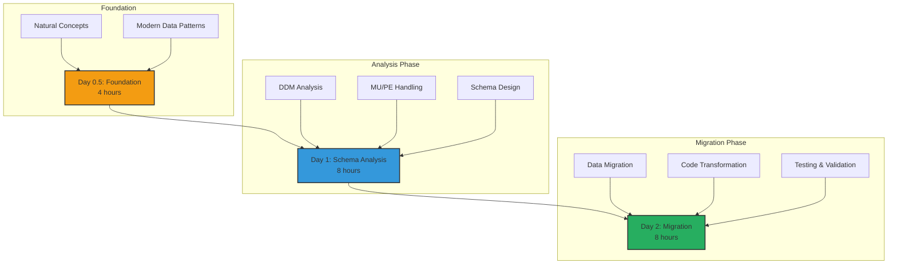
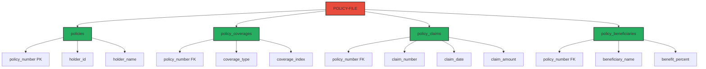
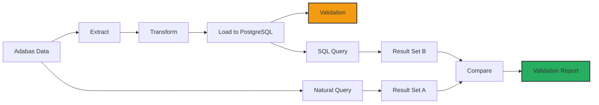

# 🗺️ The Natural/Adabas Explorer's Trail

Welcome, Natural developer! This specialized path guides you through the complex journey of migrating Natural/Adabas applications to modern cloud architectures while preserving your valuable business logic.

## 🎯 Your Mission

Successfully migrate a complete insurance system from Natural/Adabas to Spring Boot with PostgreSQL, mastering AI-assisted data transformation along the way.

**Total Duration:** 2.5 days (20 hours)  
**Difficulty:** Advanced  
**Prerequisites:** Natural/Adabas experience, SQL basics

## 📋 Learning Path Overview

<div align="center">



</div>

## 🌟 The Natural/Adabas Challenge

### Understanding Your Unique Situation

Natural/Adabas systems present special challenges:
- **Multiple Value (MU) fields**: Arrays within records
- **Periodic Groups (PE)**: Repeating structures
- **Superdescriptors**: Complex search keys
- **Non-relational design**: Network database model

<div align="center">

<svg width="700" height="400" xmlns="http://www.w3.org/2000/svg">
  <!-- Background -->
  <rect width="700" height="400" fill="#f0f4f8"/>
  
  <!-- Title -->
  <text x="350" y="30" text-anchor="middle" font-size="22" font-weight="bold" fill="#2c3e50">Natural/Adabas to Modern Stack</text>
  
  <!-- Adabas Side -->
  <rect x="50" y="80" width="200" height="280" rx="10" fill="#e74c3c" stroke="#c0392b" stroke-width="2"/>
  <text x="150" y="110" text-anchor="middle" font-size="16" font-weight="bold" fill="white">Adabas Database</text>
  
  <!-- MU/PE Example -->
  <rect x="70" y="130" width="160" height="100" fill="#c0392b" rx="5"/>
  <text x="150" y="150" text-anchor="middle" font-size="12" fill="white">Customer Record</text>
  <text x="80" y="170" font-size="10" fill="white">ID: 12345</text>
  <text x="80" y="185" font-size="10" fill="white">Name: John Doe</text>
  <text x="80" y="200" font-size="10" fill="white">Phones[1-5]: MU</text>
  <text x="80" y="215" font-size="10" fill="white">Addresses[1-3]: PE</text>
  
  <!-- Natural Programs -->
  <rect x="70" y="250" width="160" height="90" fill="#c0392b" rx="5"/>
  <text x="150" y="270" text-anchor="middle" font-size="12" fill="white">Natural Programs</text>
  <text x="80" y="290" font-size="10" fill="white">• CUSTMAIN</text>
  <text x="80" y="305" font-size="10" fill="white">• CUSTUPDT</text>
  <text x="80" y="320" font-size="10" fill="white">• CUSTREPT</text>
  
  <!-- Transformation Arrow -->
  <path d="M 250 220 L 350 220" stroke="#34495e" stroke-width="3" fill="none" marker-end="url(#arrowhead)"/>
  <text x="300" y="210" text-anchor="middle" font-size="12" fill="#34495e">AI-Powered</text>
  <text x="300" y="240" text-anchor="middle" font-size="12" fill="#34495e">Transformation</text>
  
  <!-- Modern Side -->
  <rect x="450" y="80" width="200" height="280" rx="10" fill="#27ae60" stroke="#229954" stroke-width="2"/>
  <text x="550" y="110" text-anchor="middle" font-size="16" font-weight="bold" fill="white">PostgreSQL + Spring</text>
  
  <!-- Normalized Tables -->
  <rect x="470" y="130" width="160" height="50" fill="#229954" rx="5"/>
  <text x="550" y="150" text-anchor="middle" font-size="12" fill="white">customers</text>
  <text x="480" y="170" font-size="10" fill="white">id | name | created_at</text>
  
  <rect x="470" y="190" width="160" height="50" fill="#229954" rx="5"/>
  <text x="550" y="210" text-anchor="middle" font-size="12" fill="white">customer_phones</text>
  <text x="480" y="230" font-size="10" fill="white">customer_id | phone | type</text>
  
  <rect x="470" y="250" width="160" height="50" fill="#229954" rx="5"/>
  <text x="550" y="270" text-anchor="middle" font-size="12" fill="white">customer_addresses</text>
  <text x="480" y="290" font-size="10" fill="white">customer_id | address | city</text>
  
  <!-- Spring Services -->
  <rect x="470" y="310" width="160" height="40" fill="#229954" rx="5"/>
  <text x="550" y="335" text-anchor="middle" font-size="12" fill="white">Spring Boot Services</text>
  
  <!-- Arrow marker -->
  <defs>
    <marker id="arrowhead" markerWidth="10" markerHeight="7" refX="10" refY="3.5" orient="auto">
      <polygon points="0 0, 10 3.5, 0 7" fill="#34495e"/>
    </marker>
  </defs>
</svg>

</div>

## 📚 Day 0.5: Foundation (4 hours)

### Morning: Natural/Adabas Deep Dive (2 hours)

#### Module 1: Understanding Your Legacy
**Duration:** 1 hour | **Type:** Interactive Review

**Key Concepts to Master:**

```natural
* Natural DDM (Data Definition Module)
DEFINE DATA LOCAL
1 CUSTOMER VIEW OF CUSTOMER-FILE
  2 CUSTOMER-ID        (N8)
  2 CUSTOMER-NAME      (A30)
  2 PHONE-NUMBERS      (A15/1:5)    /* MU field
  2 ADDRESS-GROUP      (1:3)        /* PE group
    3 STREET           (A30)
    3 CITY             (A20)
    3 ZIP-CODE         (A10)
END-DEFINE
```

**Modern Equivalent Structure:**
```sql
-- Main table
CREATE TABLE customers (
    id BIGINT PRIMARY KEY,
    name VARCHAR(30),
    created_at TIMESTAMP DEFAULT CURRENT_TIMESTAMP
);

-- MU field becomes separate table
CREATE TABLE customer_phones (
    id SERIAL PRIMARY KEY,
    customer_id BIGINT REFERENCES customers(id),
    phone_number VARCHAR(15),
    phone_index INTEGER,
    UNIQUE(customer_id, phone_index)
);

-- PE group becomes separate table
CREATE TABLE customer_addresses (
    id SERIAL PRIMARY KEY,
    customer_id BIGINT REFERENCES customers(id),
    street VARCHAR(30),
    city VARCHAR(20),
    zip_code VARCHAR(10),
    address_index INTEGER,
    UNIQUE(customer_id, address_index)
);
```

#### Module 2: Modern Data Architecture
**Duration:** 1 hour | **Type:** Conceptual Learning

**From Adabas to PostgreSQL:**

| Adabas Concept | PostgreSQL Equivalent | Migration Strategy |
|----------------|----------------------|-------------------|
| MU Fields | One-to-Many Tables | Normalize with FK |
| PE Groups | Related Tables | Extract to entities |
| Superdescriptors | Composite Indexes | Multi-column index |
| ISN | Primary Key | UUID or BIGSERIAL |
| Descriptors | Indexes | B-tree indexes |

### Afternoon: AI-Powered Analysis Tools (2 hours)

#### Module 3: AI Migration Assistant
**Duration:** 2 hours | **Type:** Hands-on Introduction

**Meet Your AI Migration Partner:**

```python
from adabas_migrator import AdabasAnalyzer, SchemaDesigner

# Initialize AI analyzer
analyzer = AdabasAnalyzer()
ddm = analyzer.parse_ddm("CUSTOMER.DDM")

# AI analyzes structure
analysis = analyzer.analyze_structure(ddm)
print(f"MU Fields Found: {analysis.mu_fields}")
print(f"PE Groups Found: {analysis.pe_groups}")
print(f"Suggested Tables: {analysis.suggested_tables}")

# Generate optimal schema
designer = SchemaDesigner()
schema = designer.create_schema(analysis)
print(schema.to_sql())
```

**AI Capabilities:**
- Automatic MU/PE detection
- Optimal normalization suggestions
- Performance-based indexing
- Data type mapping
- Constraint generation

## 📊 Day 1: Deep Schema Analysis (8 hours)

### Morning: DDM Analysis Workshop (4 hours)

#### Lab 1: Parsing Complex DDMs
**Duration:** 2 hours | **Difficulty:** ⭐⭐⭐⭐

**Real-World Challenge:**
Analyze an insurance policy DDM with nested structures.

```natural
DEFINE DATA LOCAL
1 POLICY VIEW OF POLICY-FILE
  2 POLICY-NUMBER      (A15)
  2 POLICY-HOLDER
    3 HOLDER-ID        (N8)
    3 HOLDER-NAME      (A40)
  2 COVERAGE-TYPES     (A10/1:10)     /* MU: Multiple coverages
  2 CLAIMS             (1:99)          /* PE: Claim history
    3 CLAIM-NUMBER     (A12)
    3 CLAIM-DATE       (D)
    3 CLAIM-AMOUNT     (P9.2)
    3 CLAIM-STATUS     (A1)
  2 BENEFICIARIES      (1:5)           /* PE: Multiple beneficiaries
    3 BENEFICIARY-NAME (A40)
    3 BENEFIT-PERCENT  (P3.2)
    3 RELATIONSHIP     (A20)
END-DEFINE
```

**AI Analysis Results:**



#### Lab 2: Handling Complex MU/PE Scenarios
**Duration:** 2 hours | **Difficulty:** ⭐⭐⭐⭐⭐

**Challenge: Nested MU within PE**

```natural
* Complex structure: Orders with multiple items, each with multiple discounts
1 ORDER-RECORD
  2 ORDER-ID           (N10)
  2 ORDER-ITEMS        (1:50)          /* PE: Up to 50 items
    3 ITEM-CODE        (A20)
    3 QUANTITY         (N5)
    3 UNIT-PRICE       (P7.2)
    3 DISCOUNTS        (P3.2/1:5)      /* MU within PE!
```

**AI Solution:**

```sql
-- Three-level normalization
CREATE TABLE orders (
    order_id BIGINT PRIMARY KEY
);

CREATE TABLE order_items (
    id SERIAL PRIMARY KEY,
    order_id BIGINT REFERENCES orders(order_id),
    item_code VARCHAR(20),
    quantity INTEGER,
    unit_price DECIMAL(7,2),
    item_index INTEGER
);

CREATE TABLE order_item_discounts (
    id SERIAL PRIMARY KEY,
    order_item_id INTEGER REFERENCES order_items(id),
    discount_percent DECIMAL(3,2),
    discount_index INTEGER
);

-- Optimized view for queries
CREATE VIEW order_details AS
SELECT 
    o.order_id,
    oi.item_code,
    oi.quantity,
    oi.unit_price,
    COALESCE(SUM(oid.discount_percent), 0) as total_discount
FROM orders o
JOIN order_items oi ON o.order_id = oi.order_id
LEFT JOIN order_item_discounts oid ON oi.id = oid.order_item_id
GROUP BY o.order_id, oi.item_code, oi.quantity, oi.unit_price;
```

### Afternoon: Schema Optimization (4 hours)

#### Lab 3: Performance-Driven Design
**Duration:** 2 hours | **Difficulty:** ⭐⭐⭐⭐

**Optimization Strategies:**

1. **Index Strategy**
```sql
-- Superdescriptor replacement
CREATE INDEX idx_customer_search 
ON customers(last_name, first_name, city);

-- MU field optimization
CREATE INDEX idx_phone_lookup 
ON customer_phones(phone_number) 
WHERE phone_index = 1; -- Primary phone
```

2. **Partitioning for Large PE Groups**
```sql
-- Partition claims by year
CREATE TABLE policy_claims (
    claim_id SERIAL,
    policy_number VARCHAR(15),
    claim_date DATE,
    claim_amount DECIMAL(11,2)
) PARTITION BY RANGE (claim_date);

CREATE TABLE policy_claims_2023 
PARTITION OF policy_claims
FOR VALUES FROM ('2023-01-01') TO ('2024-01-01');
```

#### Lab 4: Data Type Mapping Excellence
**Duration:** 2 hours | **Difficulty:** ⭐⭐⭐

**Adabas to PostgreSQL Type Mapping:**

| Adabas Type | PostgreSQL Type | Considerations |
|-------------|-----------------|----------------|
| A (Alpha) | VARCHAR/TEXT | Check max length |
| N (Numeric) | BIGINT/NUMERIC | Precision matters |
| P (Packed) | DECIMAL | Exact precision |
| D (Date) | DATE | Format conversion |
| T (Time) | TIME | Timezone handling |
| F (Float) | DOUBLE PRECISION | Precision loss |
| L (Logical) | BOOLEAN | True/False mapping |

**Special Handling:**
```python
# AI-powered type conversion
def convert_packed_decimal(adabas_field):
    """Convert Adabas packed decimal to PostgreSQL DECIMAL"""
    precision = adabas_field.total_digits
    scale = adabas_field.decimal_places
    
    return f"DECIMAL({precision},{scale})"

# Date format handling
def convert_natural_date(natural_date):
    """Convert Natural date format to PostgreSQL"""
    # Natural: YYYYMMDD
    # PostgreSQL: YYYY-MM-DD
    return f"{natural_date[:4]}-{natural_date[4:6]}-{natural_date[6:8]}"
```

## 🔄 Day 2: Migration Execution (8 hours)

### Morning: Data Migration (4 hours)

#### Lab 5: Extraction and Transformation
**Duration:** 2 hours | **Difficulty:** ⭐⭐⭐⭐⭐

**Step 1: Extract from Adabas**
```python
# AI-powered extraction
from adabas_migrator import AdabasExtractor

extractor = AdabasExtractor(connection_string)
data = extractor.extract_with_mu_pe(
    file="CUSTOMER-FILE",
    handle_mu="normalize",
    handle_pe="separate_tables"
)

# Preview transformation
print(f"Records extracted: {len(data.main_records)}")
print(f"MU expansions: {len(data.mu_records)}")
print(f"PE expansions: {len(data.pe_records)}")
```

**Step 2: Transform Complex Structures**
```python
# Handle MU field transformation
def transform_mu_phones(customer_record):
    """Transform MU phone numbers to relational format"""
    phones = []
    for idx, phone in enumerate(customer_record.phone_numbers):
        if phone:  # Skip empty MU occurrences
            phones.append({
                'customer_id': customer_record.id,
                'phone_number': phone,
                'phone_index': idx + 1,
                'phone_type': detect_phone_type(phone)
            })
    return phones

# Handle PE group transformation
def transform_pe_addresses(customer_record):
    """Transform PE address groups"""
    addresses = []
    for idx, addr_group in enumerate(customer_record.address_groups):
        if addr_group.street:  # Skip empty PE occurrences
            addresses.append({
                'customer_id': customer_record.id,
                'street': addr_group.street,
                'city': addr_group.city,
                'zip_code': addr_group.zip_code,
                'address_index': idx + 1,
                'address_type': 'HOME' if idx == 0 else 'OTHER'
            })
    return addresses
```

#### Lab 6: Loading and Validation
**Duration:** 2 hours | **Difficulty:** ⭐⭐⭐⭐

**Parallel Validation Strategy:**



**Validation Queries:**
```sql
-- Validate MU field counts
WITH adabas_counts AS (
    SELECT customer_id, COUNT(*) as phone_count
    FROM adabas_export.customer_phones
    GROUP BY customer_id
),
postgres_counts AS (
    SELECT customer_id, COUNT(*) as phone_count
    FROM customer_phones
    GROUP BY customer_id
)
SELECT 
    a.customer_id,
    a.phone_count as adabas_phones,
    p.phone_count as postgres_phones,
    CASE 
        WHEN a.phone_count = p.phone_count THEN 'MATCH'
        ELSE 'MISMATCH'
    END as status
FROM adabas_counts a
JOIN postgres_counts p ON a.customer_id = p.customer_id
WHERE a.phone_count != p.phone_count;
```

### Afternoon: Application Migration (4 hours)

#### Lab 7: Natural to Spring Boot Transformation
**Duration:** 2 hours | **Difficulty:** ⭐⭐⭐⭐

**Natural Program Example:**
```natural
DEFINE DATA
LOCAL
1 #CUSTOMER-ID (N8)
1 #PHONE-INDEX (I2)
1 CUSTOMER VIEW OF CUSTOMER-FILE
  2 CUSTOMER-ID
  2 CUSTOMER-NAME
  2 PHONE-NUMBERS (A15/1:5)
END-DEFINE
*
READ CUSTOMER BY CUSTOMER-ID = #CUSTOMER-ID
  FOR #PHONE-INDEX = 1 TO 5
    IF PHONE-NUMBERS(#PHONE-INDEX) NE ' '
      WRITE 'Phone' #PHONE-INDEX ':' PHONE-NUMBERS(#PHONE-INDEX)
    END-IF
  END-FOR
END-READ
END
```

**AI-Generated Spring Boot Service:**
```java
@Service
@Transactional
public class CustomerService {
    
    @Autowired
    private CustomerRepository customerRepository;
    
    @Autowired
    private CustomerPhoneRepository phoneRepository;
    
    public CustomerDetailsDTO getCustomerWithPhones(Long customerId) {
        Customer customer = customerRepository.findById(customerId)
            .orElseThrow(() -> new CustomerNotFoundException(customerId));
        
        List<CustomerPhone> phones = phoneRepository
            .findByCustomerIdOrderByPhoneIndex(customerId);
        
        return CustomerDetailsDTO.builder()
            .customerId(customer.getId())
            .customerName(customer.getName())
            .phoneNumbers(phones.stream()
                .map(CustomerPhone::getPhoneNumber)
                .collect(Collectors.toList()))
            .build();
    }
    
    @Cacheable("customerPhones")
    public List<String> getCustomerPhones(Long customerId) {
        return phoneRepository.findByCustomerId(customerId)
            .stream()
            .map(CustomerPhone::getPhoneNumber)
            .filter(StringUtils::isNotBlank)
            .collect(Collectors.toList());
    }
}
```

#### Lab 8: Integration Testing
**Duration:** 2 hours | **Difficulty:** ⭐⭐⭐⭐

**Comprehensive Test Suite:**
```java
@SpringBootTest
@AutoConfigureMockMvc
class CustomerMigrationTest {
    
    @Test
    void testMUFieldHandling() {
        // Test multiple phone numbers
        Customer customer = createTestCustomer();
        List<String> phones = Arrays.asList(
            "555-0101", "555-0102", "555-0103"
        );
        
        customerService.addPhones(customer.getId(), phones);
        
        List<String> retrieved = customerService
            .getCustomerPhones(customer.getId());
        
        assertThat(retrieved).hasSize(3);
        assertThat(retrieved).containsExactlyElementsOf(phones);
    }
    
    @Test
    void testPEGroupHandling() {
        // Test periodic group (addresses)
        Customer customer = createTestCustomer();
        List<Address> addresses = Arrays.asList(
            new Address("123 Main St", "New York", "10001"),
            new Address("456 Oak Ave", "Boston", "02101")
        );
        
        customerService.addAddresses(customer.getId(), addresses);
        
        List<Address> retrieved = customerService
            .getCustomerAddresses(customer.getId());
        
        assertThat(retrieved).hasSize(2);
        assertThat(retrieved.get(0).getCity()).isEqualTo("New York");
    }
    
    @Test
    @DataSet("test-data/complex-customer.xml")
    void testComplexDataMigration() {
        // Test with production-like data
        MigrationResult result = migrationService
            .migrateCustomerData("CUST12345");
        
        assertThat(result.isSuccessful()).isTrue();
        assertThat(result.getRecordsMigrated()).isEqualTo(1);
        assertThat(result.getMuFieldsExpanded()).isEqualTo(5);
        assertThat(result.getPeGroupsExpanded()).isEqualTo(3);
    }
}
```

## 🎯 Final Project: Complete System Migration

### Your Challenge
Migrate a complete insurance claims system:
- 50+ DDMs with complex relationships
- 10 million records with MU/PE fields
- 200+ Natural programs
- Real-time and batch processing

### Success Metrics
- [ ] 100% data integrity maintained
- [ ] Query performance improved by 10x
- [ ] Zero data loss during migration
- [ ] All business logic preserved
- [ ] Automated testing coverage > 90%

## 📈 Skills You've Mastered

By completing this path, you can:
- ✅ Analyze complex Adabas DDM structures
- ✅ Design optimal relational schemas from MU/PE fields
- ✅ Execute large-scale data migrations
- ✅ Transform Natural programs to Spring Boot
- ✅ Implement comprehensive validation strategies
- ✅ Optimize performance for complex queries

## 🏆 Your Achievement Certificate

Upon completion, you'll receive:
- Digital certificate: "Natural/Adabas Migration Specialist"
- Portfolio of migration projects
- Performance optimization case studies
- LinkedIn recommendation template

## 🚀 What's Next?

### Career Advancement
Your new skills qualify you for:
- Data Migration Architect ($140K-$190K)
- Natural Modernization Lead ($130K-$180K)
- Database Transformation Specialist ($120K-$170K)

### Advanced Topics
- [NoSQL Migration Strategies](../advanced/nosql-migration.md)
- [Real-time Data Synchronization](../advanced/real-time-sync.md)
- [Hybrid Database Architectures](../advanced/hybrid-databases.md)

## 💬 Community Support

Join the Natural/Adabas migration community:
- **Slack Channel**: #natural-adabas-migration
- **Monthly Webinar**: Third Thursday, 3 PM EST
- **Migration Patterns Library**: Share and learn
- **Expert Office Hours**: Weekly Q&A sessions

---

<div align="center">

**🌟 You're Transforming Decades of Business Logic! 🌟**

Your expertise in Natural/Adabas combined with modern cloud skills makes you invaluable in the modernization journey.

[📚 Back to Workshop](../README.md) | [🚀 Start Lab 1](../appendix-b-natural-adabas-migration/labs/lab1/README.md) | [💬 Get Help](../TROUBLESHOOTING.md)

</div> 